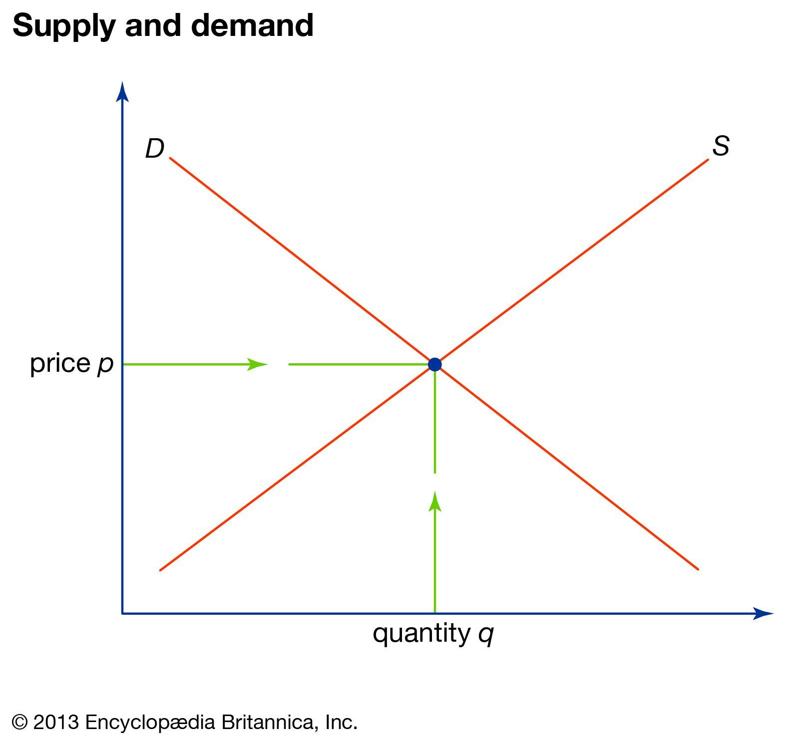

## Table of Contents

## What is supply and demand?

Supply and demand is a basic idea in economics that helps explain how prices are set in a market. It says that the price of something will go up if there are more people who want to buy it than there are items available. On the other hand, if there are more items available than people who want to buy them, the price will go down. This balance between how much of something is available (supply) and how much people want it (demand) is what decides the price.

For example, imagine there's a new toy that everyone wants. If the store only has a few of these toys, the price might be high because lots of kids want it but there aren't enough toys to go around. But if the store gets a big shipment of the toy, and suddenly there are more toys than kids who want them, the store might lower the price to sell them all. This shows how supply and demand work together to set prices in the market.

## How do supply and demand affect prices?

Supply and demand affect prices by finding a balance between how much of something is available and how much people want it. If more people want to buy something than there is available, the price goes up. This happens because sellers can charge more when lots of people are trying to buy the same thing. For example, if there's a new video game that everyone wants to play, but there aren't enough copies in stores, the price of the game might go up because people are willing to pay more to get it.

On the other hand, if there's more of something available than people who want to buy it, the price goes down. Sellers will lower the price to try and sell all of their items. For instance, if a store has too many winter coats left over after the season ends, they might put them on sale to get rid of them. This shows how having too much supply can lead to lower prices as sellers compete to attract buyers.

In summary, supply and demand work together to set prices. When demand is high and supply is low, prices go up. When supply is high and demand is low, prices go down. This balance is always shifting as people's wants and the amount of goods available change over time.

## What is a demand curve and how is it represented?

A demand curve is a graph that shows how much of something people want to buy at different prices. It's like a line on a chart where the price is on one side and the amount people want to buy is on the other. The demand curve usually slopes downwards, which means that when the price is lower, people want to buy more of the thing. When the price goes up, people want to buy less.

This downward slope happens because when something costs less, more people can afford it or they might feel like it's a better deal, so they buy more. For example, if apples are cheap, you might buy a lot of them. But if the price of apples goes up a lot, you might decide to buy fewer apples or switch to another fruit that's cheaper. The demand curve helps businesses and economists understand how changes in price affect how much people will buy.

## What is a supply curve and how does it differ from a demand curve?

A supply curve is a graph that shows how much of something producers are willing to sell at different prices. It's like a line on a chart where the price is on one side and the amount producers want to sell is on the other. The supply curve usually slopes upwards, which means that when the price is higher, producers want to sell more of the thing. When the price goes down, they want to sell less. This happens because when something costs more, it's more profitable for producers to make and sell more of it. For example, if the price of apples goes up, farmers might decide to grow more apples because they can make more money.

The main difference between a supply curve and a demand curve is the direction they slope and what they represent. A demand curve slopes downwards because people want to buy more when the price is lower. On the other hand, a supply curve slopes upwards because producers want to sell more when the price is higher. While the demand curve shows how much people want to buy at different prices, the supply curve shows how much producers are willing to sell at those prices. Together, these curves help us understand how prices are set in a market, where the point they meet is called the equilibrium price, where the amount people want to buy equals the amount producers want to sell.

## How do shifts in demand and supply curves impact the market equilibrium?

When the demand curve shifts, it means that people's desire to buy something has changed, even if the price stays the same. If more people suddenly want a product, the demand curve moves to the right, showing that at every price, people now want to buy more. This can happen because of things like a new trend or an increase in income. When this happens, the market equilibrium, which is the point where the amount people want to buy equals the amount producers want to sell, also shifts. The new equilibrium will have a higher price and a higher quantity of the product being sold. On the other hand, if fewer people want the product, the demand curve moves to the left, and the equilibrium shifts to a lower price and a lower quantity.

Shifts in the supply curve happen when the amount producers are willing to sell changes, even if the price stays the same. If something makes it easier or cheaper for producers to make a product, like a new technology or lower costs for materials, the supply curve moves to the right. This means that at every price, producers are now willing to sell more. As a result, the market equilibrium shifts to a lower price and a higher quantity. If it becomes harder or more expensive to produce the product, the supply curve moves to the left, and the equilibrium shifts to a higher price and a lower quantity. These shifts in supply and demand curves show how changes in the market can affect both the price and the amount of a product that's bought and sold.

## What factors can cause a shift in the demand curve?

A shift in the demand curve happens when something changes how much people want to buy a product, even if the price stays the same. One big reason for this is changes in people's income. If people start making more money, they might want to buy more things, so the demand curve moves to the right. But if people's income goes down, they might not be able to buy as much, and the demand curve moves to the left. Another reason is changes in tastes and preferences. If a new trend makes a product popular, more people will want to buy it, shifting the demand curve to the right. If people lose interest in a product, the demand curve will shift to the left.

Other factors that can shift the demand curve include changes in the prices of related goods. If the price of a substitute, like a different brand of cereal, goes up, people might switch to the original product, increasing its demand. If the price of a complement, like coffee and cream, goes down, people might buy more of both, increasing the demand for the original product. Population changes can also affect demand. If more people move into an area, there will be more demand for things like housing and food. Finally, expectations about future prices can shift demand. If people think the price of a product will go up soon, they might buy more now, shifting the demand curve to the right.

## What factors can cause a shift in the supply curve?

A shift in the supply curve happens when something changes how much of a product producers want to sell, even if the price stays the same. One big reason for this is changes in the cost of making the product. If the cost of materials or labor goes down, it's cheaper for producers to make the product, so they'll want to sell more of it. This shifts the supply curve to the right. But if the cost of making the product goes up, like if there's a shortage of materials, producers might not want to sell as much, and the supply curve shifts to the left.

Another reason for a shift in the supply curve is changes in technology. If new technology makes it easier or faster to produce something, more can be made at a lower cost, so the supply curve moves to the right. But if technology becomes outdated or there are disruptions, like a factory breaking down, it can be harder to produce the product, and the supply curve shifts to the left. Also, changes in the number of producers can affect supply. If more companies start making the product, the supply curve moves to the right. If some companies stop making it, the supply curve moves to the left.

## How does elasticity affect the relationship between supply and demand?

Elasticity is a way to measure how much the amount people want to buy or the amount producers want to sell changes when the price changes. If something is elastic, it means that a small change in price can make a big difference in how much people want to buy or how much producers want to sell. For example, if the price of a certain brand of soda goes up a little bit, and people stop buying it and switch to another brand instead, that soda is elastic. On the other hand, if something is inelastic, it means that changes in price don't affect how much people want to buy or how much producers want to sell very much. Things like medicine or gasoline are often inelastic because people need them and will buy them even if the price goes up.

Elasticity affects the relationship between supply and demand by changing how sensitive the market is to price changes. If a product is elastic on the demand side, a small increase in price can lead to a big drop in demand, which might make producers lower the price to sell more. If a product is elastic on the supply side, a small increase in price can lead producers to want to sell a lot more of it. But if a product is inelastic, changes in price won't affect demand or supply as much. This means that even if the price goes up, people will still buy the same amount, and producers will still be willing to sell the same amount. Understanding elasticity helps businesses and economists predict how changes in price will affect the market and helps them make better decisions about pricing and production.

## Can you explain the concept of market equilibrium and how it is achieved?

Market equilibrium is when the amount of something people want to buy is the same as the amount that producers want to sell. It's like a balance point where everyone is happy with the price. When the market is in equilibrium, the price stays steady because there's no reason for it to change. If you think of it like a seesaw, when it's balanced, it doesn't move up or down. In the same way, at market equilibrium, the price doesn't go up or down because the supply and demand are equal.

Market equilibrium is achieved through the interaction of supply and demand. If the price is too high, there will be more of the product available than people want to buy, so sellers will lower the price to sell their goods. If the price is too low, there will be more people wanting to buy the product than there is available, so sellers can raise the price. This back-and-forth continues until the price reaches a point where the amount people want to buy exactly matches the amount producers want to sell. At this point, the market is in equilibrium, and the price stays stable unless something changes the supply or demand.

## What are the effects of government interventions like price ceilings and floors on supply and demand?

When the government sets a price ceiling, it means they put a limit on how high the price of something can go. They do this to keep things affordable for people, like with rent or the price of medicine. But if the price ceiling is set below the market equilibrium, where supply and demand naturally balance, it can cause problems. At this lower price, more people want to buy the product than there is available, which creates a shortage. Producers might not want to sell as much because they're not making as much money, and this can lead to long lines or empty shelves. So, while price ceilings are meant to help consumers, they can sometimes make it harder for them to get what they need.

On the other hand, a price floor is when the government sets a minimum price for something, usually to help producers. A common example is the minimum wage, which sets a lowest price for labor. If the price floor is set above the market equilibrium, it can create a surplus. At this higher price, producers want to sell more than people want to buy, so there's too much of the product. This can lead to unsold goods piling up, like extra crops that farmers can't sell. While price floors are meant to help producers by ensuring they get a certain price, they can sometimes lead to waste and higher costs for consumers.

## How do externalities influence supply and demand dynamics?

Externalities are things that affect other people but aren't included in the price of a product. They can be good or bad. For example, if a factory pollutes the air, that's a bad externality because it harms people who live nearby, but the factory doesn't pay for that harm. On the other hand, if a beekeeper's bees help pollinate a neighbor's crops, that's a good externality because it helps the neighbor, but the beekeeper doesn't get paid for it. These externalities can change how much people want to buy or how much producers want to sell, even if the price stays the same.

When there are negative externalities, like pollution, people might want to buy less of the product because they know it's causing harm. This can shift the demand curve to the left, leading to a lower price and less being sold. On the supply side, producers might want to sell more because they don't have to pay for the harm they're causing, which can shift the supply curve to the right, leading to a lower price and more being sold. With positive externalities, like the bees helping with pollination, people might want to buy more of the product because it's doing good things, shifting the demand curve to the right. But producers might not want to sell as much because they're not getting paid for the good they're doing, which can shift the supply curve to the left. These shifts can change the market equilibrium, affecting both the price and the amount of the product that's bought and sold.

## What advanced economic models incorporate supply and demand beyond basic theory?

One advanced economic model that goes beyond the basic theory of supply and demand is the general equilibrium model. This model looks at how different markets in an economy are connected. It shows how changes in one market, like a rise in the price of oil, can affect other markets, like the cost of transportation and the price of goods that need to be transported. In a general equilibrium model, economists can see how all these different parts of the economy work together and find a balance where supply equals demand in every market at the same time. This helps them understand big economic questions, like how a tax change in one area can affect the whole economy.

Another advanced model is the dynamic stochastic general equilibrium (DSGE) model. This model adds time and uncertainty to the basic supply and demand theory. It looks at how the economy changes over time and how unexpected events, like a sudden increase in demand for a product, can affect the market. In a DSGE model, economists can study how people and businesses make decisions when they don't know what will happen in the future. This helps them predict how the economy might react to things like a new policy or a financial crisis. By including time and uncertainty, the DSGE model gives a more detailed picture of how supply and demand work in the real world.

## What is Price Theory in Economics?

Price theory is a cornerstone of economic theory, elucidating how prices emerge from the interactions of supply and demand within a market economy. It provides the analytical framework to understand how prices function to allocate resources efficiently, impacting consumer behavior and guiding producer strategies.

At its heart, price theory relies on the interaction of supply and demand. The Law of Demand states that, all other factors being equal, as the price of a good decreases, the quantity demanded will typically increase, and vice versa. Conversely, the Law of Supply suggests that as the price of a good increases, producers are willing to supply more of it to the market. The interplay of these forces leads to an equilibrium price at which the quantity supplied matches the quantity demanded.

Mathematically, market equilibrium can be expressed through the equations:

$$
Q_d = a - bP \]  

$$
Q_s = c + dP \]  

where $Q_d$ is the quantity demanded, $Q_s$ is the quantity supplied, $P$ is the price, and $a$, $b$, $c$, and $d$ represent constants specific to the market in question. Equilibrium is achieved when $Q_d = Q_s$, allowing us to solve for the equilibrium price, $P^*$:

$$
a - bP^* = c + dP^*
$$

The equilibrium price, known as $P^*$, and the equilibrium quantity, known as $Q^*$, are central to the efficient functioning of markets. Price fluctuations around this equilibrium point can occur due to changes in external factors such as consumer tastes, income levels, and the prices of related goods.

Price theory bridges microeconomics and macroeconomics by examining both individual market behaviors and aggregate economic indicators. In microeconomics, it analyzes how individual consumers and firms make decisions based on resource limitations and preferences, aiding in understanding the allocation of scarce resources. From a macroeconomic perspective, price theory helps explain how multiple markets interact to form an economy-wide equilibrium.

The insights derived from price theory directly influence economic decision-making at all levels. Consumers rely on price signals to make informed purchasing choices, optimizing their utility according to budget constraints. Producers use price information to strategize production levels, input sourcing, and market entry or [exit](/wiki/exit-strategy) decisions.

Understanding price theory equips market participants and policymakers with the necessary tools to navigate the complexities of economic environments, facilitating more effective decision-making and contributing to overall market efficiency.

## What is Market Equilibrium and How Can We Understand It?

Market equilibrium is a fundamental concept in economics that signifies a state where the quantity of goods supplied in a market is equal to the quantity demanded, thereby establishing a stable price point. This equilibrium is crucial for ensuring efficient resource allocation and maintaining market stability. At this juncture, every participant in the market is satisfied: consumers are purchasing all the goods they desire at the prevailing price, and producers are selling their entire output. 

Mathematically, market equilibrium can be expressed using the supply and demand functions. If $Q_d(p)$ represents the quantity demanded at price $p$ and $Q_s(p)$ the quantity supplied, then equilibrium occurs at a price $p^*$ such that:

$$
Q_d(p^*) = Q_s(p^*)
$$

This condition ensures that there is no surplus or shortage in the market.

Equilibrium is not static; it can shift due to various factors, leading to changes in both supply and demand curves. For instance, a shift in consumer preferences, possibly driven by changes in tastes or income levels, can alter the quantity demanded at every price level, leading to a new equilibrium. If a new technology reduces the cost of production, the supply curve might shift to the right, resulting in lower equilibrium prices and higher quantities.

External shocks, such as geopolitical events or natural disasters, can also significantly impact market equilibrium by altering both supply and demand conditions. For instance, a supply shock, such as a disruption in oil production, can decrease the supply, shifting the supply curve leftward, which typically results in higher prices and lower quantities at equilibrium.

Understanding these dynamics is critical because they underscore the market's ability to self-correct and adjust to changes over time. Policymakers, traders, and investors must recognize these factors to anticipate potential shifts in market conditions and develop strategies that mitigate risks associated with such changes. Successful navigation of these shifts can lead to optimized resource allocation and sustained market stability.

## References & Further Reading

[1]: Pindyck, R. S., & Rubinfeld, D. L. (2017). ["Microeconomics"](https://archive.org/details/microeconomics0007pind) (9th ed.). Pearson.

[2]: Varian, H. R. (2014). ["Intermediate Microeconomics: A Modern Approach"](https://wwnorton.com/books/9781324034292) (9th ed.). W. W. Norton & Company.

[3]: Harris, L. (2003). ["Trading and Exchanges: Market Microstructure for Practitioners"](https://academic.oup.com/book/52292) Oxford University Press.

[4]: Hasbrouck, J. (2007). ["Empirical Market Microstructure: The Institutions, Economics, and Econometrics of Securities Trading"](https://academic.oup.com/book/52241) Oxford University Press.

[5]: Aldridge, I. (2013). ["High-Frequency Trading: A Practical Guide to Algorithmic Strategies and Trading Systems"](https://www.ahmetbeyefendi.com/wp-content/uploads/2020/07/High-Frequency-Trading-Irene-Aldridge.pdf) (2nd ed.). Wiley.