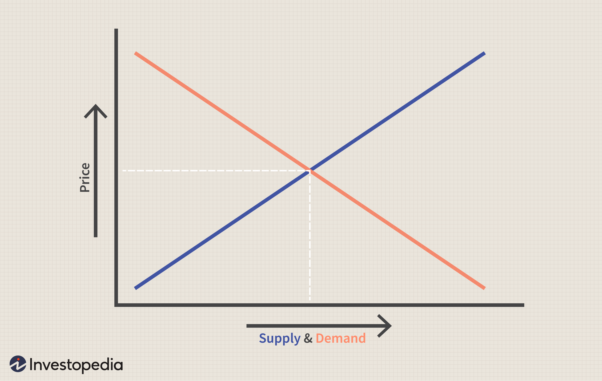

The concepts of price theory, market equilibrium, and algorithmic trading are fundamental to understanding modern economics and financial markets. Price theory serves as the backbone of economic thought, dissecting how prices are determined within a market economy through the forces of supply and demand. It sheds light on the behavior of consumers and producers, playing a crucial role in resource allocation across various economic levels. This theory forms the basis of microeconomic and macroeconomic analysis, influencing decisions that impact everyday life and strategic business planning.

Market equilibrium represents a state where the quantity of goods supplied matches the quantity demanded, leading to stable price points. Achieving equilibrium is crucial for the efficient allocation of resources and is considered a pivotal component of market stability. External factors, such as shifts in consumer preferences, technological innovations, or unexpected shocks, can disrupt this balance, indicating the dynamic nature of economic systems.

Algorithmic trading, on the other hand, transforms the trading process by utilizing computer algorithms, leading to enhanced efficiency and price discovery. This methodology has gained prominence for its ability to execute trades at speeds and volumes beyond human capability, thereby influencing market equilibrium. While algorithmic trading provides benefits such as increased liquidity and improved market efficiency, it also has the potential to introduce challenges, including heightened volatility and market disruptions.

Understanding these dynamics is crucial in today’s fast-paced financial environment, where traders, investors, and policymakers must navigate complex market behaviors. Each of these elements—price theory, market equilibrium, and algorithmic trading—interacts with the others, forming the intricate web of modern financial systems. By analyzing how these concepts interconnect, one can gain a deeper insight into the strategies that drive trading and investment decisions, as well as the economic policies that shape market outcomes.

## Table of Contents

## Price Theory in Economics

Price theory is a cornerstone of economic theory, elucidating how prices emerge from the interactions of supply and demand within a market economy. It provides the analytical framework to understand how prices function to allocate resources efficiently, impacting consumer behavior and guiding producer strategies.

At its heart, price theory relies on the interaction of supply and demand. The Law of Demand states that, all other factors being equal, as the price of a good decreases, the quantity demanded will typically increase, and vice versa. Conversely, the Law of Supply suggests that as the price of a good increases, producers are willing to supply more of it to the market. The interplay of these forces leads to an equilibrium price at which the quantity supplied matches the quantity demanded.

Mathematically, market equilibrium can be expressed through the equations:

$$
Q_d = a - bP \]  

$$
Q_s = c + dP \]  

where $Q_d$ is the quantity demanded, $Q_s$ is the quantity supplied, $P$ is the price, and $a$, $b$, $c$, and $d$ represent constants specific to the market in question. Equilibrium is achieved when $Q_d = Q_s$, allowing us to solve for the equilibrium price, $P^*$:

$$
a - bP^* = c + dP^*
$$

The equilibrium price, known as $P^*$, and the equilibrium quantity, known as $Q^*$, are central to the efficient functioning of markets. Price fluctuations around this equilibrium point can occur due to changes in external factors such as consumer tastes, income levels, and the prices of related goods.

Price theory bridges microeconomics and macroeconomics by examining both individual market behaviors and aggregate economic indicators. In microeconomics, it analyzes how individual consumers and firms make decisions based on resource limitations and preferences, aiding in understanding the allocation of scarce resources. From a macroeconomic perspective, price theory helps explain how multiple markets interact to form an economy-wide equilibrium.

The insights derived from price theory directly influence economic decision-making at all levels. Consumers rely on price signals to make informed purchasing choices, optimizing their utility according to budget constraints. Producers use price information to strategize production levels, input sourcing, and market entry or [exit](/wiki/exit-strategy) decisions.

Understanding price theory equips market participants and policymakers with the necessary tools to navigate the complexities of economic environments, facilitating more effective decision-making and contributing to overall market efficiency.

## Understanding Market Equilibrium

Market equilibrium is a fundamental concept in economics that signifies a state where the quantity of goods supplied in a market is equal to the quantity demanded, thereby establishing a stable price point. This equilibrium is crucial for ensuring efficient resource allocation and maintaining market stability. At this juncture, every participant in the market is satisfied: consumers are purchasing all the goods they desire at the prevailing price, and producers are selling their entire output. 

Mathematically, market equilibrium can be expressed using the supply and demand functions. If $Q_d(p)$ represents the quantity demanded at price $p$ and $Q_s(p)$ the quantity supplied, then equilibrium occurs at a price $p^*$ such that:

$$
Q_d(p^*) = Q_s(p^*)
$$

This condition ensures that there is no surplus or shortage in the market.

Equilibrium is not static; it can shift due to various factors, leading to changes in both supply and demand curves. For instance, a shift in consumer preferences, possibly driven by changes in tastes or income levels, can alter the quantity demanded at every price level, leading to a new equilibrium. If a new technology reduces the cost of production, the supply curve might shift to the right, resulting in lower equilibrium prices and higher quantities.

External shocks, such as geopolitical events or natural disasters, can also significantly impact market equilibrium by altering both supply and demand conditions. For instance, a supply shock, such as a disruption in oil production, can decrease the supply, shifting the supply curve leftward, which typically results in higher prices and lower quantities at equilibrium.

Understanding these dynamics is critical because they underscore the market's ability to self-correct and adjust to changes over time. Policymakers, traders, and investors must recognize these factors to anticipate potential shifts in market conditions and develop strategies that mitigate risks associated with such changes. Successful navigation of these shifts can lead to optimized resource allocation and sustained market stability.

## The Impact of Algorithmic Trading on Market Equilibrium

Algorithmic trading utilizes sophisticated computer algorithms to automate and expedite trading strategies. These algorithms are designed to analyze a multitude of market data, execute trades based on pre-set parameters, and react to market conditions faster than any human trader could. This automation enhances market efficiency by improving price discovery and expanding market [liquidity](/wiki/liquidity-risk-premium).

One of the primary impacts of [algorithmic trading](/wiki/algorithmic-trading) on market equilibrium is through its role in liquidity provision. Algorithms are capable of executing a large number of trades with minimal price impact, thereby increasing the depth of the market. This is beneficial in stabilizing prices as it allows for faster absorption of large orders without causing significant price fluctuations. 

Algorithmic trading's influence on price discovery is also noteworthy. The algorithms continuously scan for price discrepancies across different markets and execute trades to exploit these inefficiencies. As these trades contribute to correcting these discrepancies, they play a crucial role in aligning asset prices closer to their true value, thus enhancing the effectiveness of price discovery mechanisms. 

However, the automated and high-speed nature of algorithmic trading can contribute to increased market [volatility](/wiki/volatility-trading-strategies). The presence of numerous algorithms operating simultaneously can lead to situations where they interact in unpredictable ways. This can result in phenomena like 'flash crashes', where prices plummet rapidly before quickly recovering, as was notably observed during the 2010 Flash Crash. Such incidents raise questions about the robustness of market equilibrium in the presence of algorithmic trading. 

Furthermore, the influence of algorithms extends to the equilibrium quantity, which is the amount of goods or securities traded when supply equals demand. Algorithms enhance the market's ability to reach this state by dynamically adjusting bid and ask quotes, thus fostering an environment where equilibrium is more quickly achieved and maintained.

To summarize, algorithmic trading significantly impacts market equilibrium by enhancing liquidity and aiding in price discovery while also introducing challenges such as increased volatility. Understanding and managing these dynamics is crucial for maintaining stable and efficient financial markets in the context of increasing automation.

## Case Studies in Algorithmic Trading and Market Equilibrium

Algorithmic trading has profoundly impacted market equilibrium, illustrated through various case studies that reveal its dual potential to improve market functions and inadvertently cause disruptions. By examining these real-world examples, we gain insight into how algorithmic strategies can affect liquidity, price discovery, and market stability.

### Enhanced Liquidity and Price Discovery

One notable case is that of a major [hedge fund](/wiki/hedge-fund-trading-strategies) that employed high-frequency trading ([HFT](/wiki/high-frequency-trading-strategies)) algorithms. By executing trades at lightning speed, the algorithm improved market liquidity by engaging in frequent bids and offers, thereby narrowing bid-ask spreads. This increased liquidity facilitated enhanced price discovery, as prices more accurately reflected the underlying values of assets. As a result, investors experienced more stable and efficient markets.

The positive effect of this algorithm was evident in the increased trading volumes and reduced transaction costs observed during its operation. By continuously scanning for [arbitrage](/wiki/arbitrage) opportunities across different markets, the algorithm ensured that prices remained consistent with projected equilibrium values.

### Market Disruptions: The Flash Crash

While algorithms can enhance market functioning, they also have the potential to destabilize it, as demonstrated by the infamous Flash Crash of May 6, 2010. During this event, algorithmic trading contributed to a sudden and severe market drop, wiping out nearly $1 trillion in market value within minutes before a swift recovery. The incident was attributed to the interactions between different trading algorithms, amplifying price discrepancies and leading to liquidity evaporation.

Investigations revealed that a large sell order, executed through an algorithm, interacted with existing algorithms that were programmed to withdraw liquidity rapidly in volatile conditions. This cascade effect exemplifies how algorithms, though designed to optimize trading efficiency, can inadvertently disrupt market equilibrium when not controlled by robust safeguards.

### Learning from Case Studies

These case studies highlight both the promise and peril of algorithmic trading. Successful implementations demonstrate that algorithms can significantly aid in achieving more accurate price discovery and increasing market liquidity. Conversely, events like the Flash Crash serve as cautionary tales of technological overreach and the need for stringent risk management frameworks.

To mitigate such risks, regulatory bodies have emphasized the importance of circuit breakers and other fail-safes to maintain market stability. Traders and financial institutions are increasingly adopting stress testing and [backtesting](/wiki/backtesting) protocols to ensure their algorithms function optimally across different market scenarios.

In conclusion, real-world experiences with algorithmic trading underscore its transformative potential and the critical need for strategic oversight to harness its benefits while minimizing associated risks. By studying these examples, market participants can better understand the complexities and dynamics introduced by algorithmic trading, equipping them to navigate and thrive in modern financial markets.

## Special Considerations in Price Equilibrium and Algorithmic Trading

Factors such as regulatory constraints, market psychology, and technological disruptions significantly impact price equilibrium and algorithmic trading.

Regulatory constraints play a crucial role in defining the boundaries within which market participants operate. Governments and financial authorities impose regulations to ensure market stability, protect investors, and prevent fraudulent activities. These regulations can include limitations on trading frequencies, transaction taxes, minimum capital requirements, and disclosure mandates. Compliance with these regulations requires algorithmic traders to craft adaptive strategies that align with legal requirements while maintaining competitiveness. For instance, regulations such as the Markets in Financial Instruments Directive II (MiFID II) in the European Union impose specific reporting and transparency standards that algorithmic traders must navigate.

Market psychology, comprising trader sentiment and collective behavior, affects price trends and equilibrium. Psychological factors can amplify market movements, especially when algorithms exacerbate human biases such as herding behavior or panic selling. Algorithms that succeed in modeling and predicting psychological market impacts can better anticipate price movements and adjust strategies accordingly. This requires the incorporation of sentiment analysis tools that process data from news, social media, and other information sources. Incorporating psychological factors into trading algorithms helps in minimizing risks during volatile periods.

Technological disruptions, caused by advancements in computing, data transmission, and analysis techniques, reshape the landscape of algorithmic trading. Events like network outages, software malfunctions, or cyberattacks can disrupt trading activities and impact market stability. As algorithms become more sophisticated, the reliance on technology increases, underscoring the need for robust risk management frameworks. Traders must implement stress testing and backtesting procedures to evaluate how their algorithms perform under various scenarios, ensuring resilience against potential disruptions.

Navigating these complexities requires comprehensive risk management frameworks that incorporate adaptive strategies. Risk management is essential for maintaining market stability and achieving effective trading outcomes. This often involves diversification strategies, hedging techniques, and continuous monitoring of positions. Stress testing involves simulating extreme market scenarios to assess the robustness of algorithmic strategies, while backtesting evaluates historical data to refine trading algorithms.

Understanding these considerations is crucial for all market participants, including traders, investors, and regulators, aiming to maintain a stable and efficient market environment. With adaptive strategies, risk management, and a solid grasp of market complexities, participants can mitigate risks and harness the benefits of technological advancements in trading.

## Conclusion

The interaction between price theory, market equilibrium, and algorithmic trading is crucial for understanding the dynamics of modern financial markets. Price theory provides a framework for how prices are determined through the forces of supply and demand, establishing a baseline for evaluating economic activities. Market equilibrium is achieved when supply equals demand, resulting in a stable price that facilitates optimal resource allocation.

Algorithmic trading, which involves the use of complex algorithms to automate trading processes, significantly influences these dynamics. It offers opportunities to enhance market efficiency by speeding up trade executions and improving price discovery. However, the rapid pace of algorithmic trading can also introduce challenges, such as heightened market volatility and the potential for market disruptions, exemplified by events like flash crashes. The dual impact of algorithmic trading presents both opportunities for profit and risks for instability in price levels and resource distribution.

Comprehending the interplay among these elements allows market participants to make informed decisions. For instance, traders can better strategize by understanding how algorithmic trading might affect market equilibrium, while policymakers can develop regulations that mitigate risks associated with high-frequency trading. Investors and financial analysts who grasp these concepts can leverage them to assess market conditions, forecast price movements, and optimize trading strategies in an environment characterized by technological advancements. Overall, a deep understanding of these fundamental components is essential for thriving in today's fast-paced and complex financial markets.

## References & Further Reading

[1]: Pindyck, R. S., & Rubinfeld, D. L. (2017). ["Microeconomics"](https://archive.org/details/microeconomics0007pind) (9th ed.). Pearson.

[2]: Varian, H. R. (2014). ["Intermediate Microeconomics: A Modern Approach"](https://wwnorton.com/books/9781324034292) (9th ed.). W. W. Norton & Company.

[3]: Harris, L. (2003). ["Trading and Exchanges: Market Microstructure for Practitioners"](https://academic.oup.com/book/52292) Oxford University Press.

[4]: Hasbrouck, J. (2007). ["Empirical Market Microstructure: The Institutions, Economics, and Econometrics of Securities Trading"](https://academic.oup.com/book/52241) Oxford University Press.

[5]: Aldridge, I. (2013). ["High-Frequency Trading: A Practical Guide to Algorithmic Strategies and Trading Systems"](https://www.ahmetbeyefendi.com/wp-content/uploads/2020/07/High-Frequency-Trading-Irene-Aldridge.pdf) (2nd ed.). Wiley.