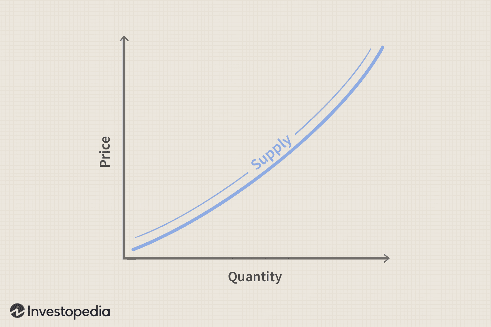

Understanding the principles of supply and demand is fundamental to grasping how markets operate. In economics, the supply curve represents the relationship between the price of a good and the quantity of the good that suppliers are willing to produce and sell. This concept is critical in market analysis as it helps predict how changes in price can affect the quantity of goods available. Typically, the supply curve is positively sloped, indicating that as prices increase, suppliers are willing to produce and sell more of a good.

In the constantly evolving landscape of trading, particularly algorithmic trading (algo trading), the concepts of supply and demand form the backbone of many trading strategies. Algo trading relies on computer algorithms to execute trades based on predetermined criteria. By quantifying supply and demand dynamics, these algorithms can optimize trade efficiency and accuracy, capitalizing on even minute market fluctuations.



This article explores how the supply and demand model, specifically the supply curve, is integrated into algo trading strategies. Through detailed examination, we aim to unveil the ways in which these economic principles are harnessed within a technology-driven trading environment. The integration of such economic models into algorithmic paradigms not only enhances the predictive capabilities of trading systems but also propels them towards more sophisticated and adaptive approaches, essential in today's fast-paced markets.

## Table of Contents

## Understanding Supply and Demand Economics

Supply and demand economics serves as a foundational framework in economic theory, essential for determining the price and quantity of goods and services in a market. The demand curve represents the relationship between the price of a product and the quantity that consumers are willing and able to purchase, assuming all other factors remain constant. Typically downward-sloping, this curve reflects the inverse relationship between price and quantity demanded: as price decreases, the quantity demanded increases, and vice versa.

Conversely, the supply curve depicts the relationship between the price of a product and the quantity that producers are willing and able to sell. Generally upward-sloping, this curve illustrates the direct relationship between price and quantity supplied: as price rises, the quantity supplied also increases, reflecting producers' willingness to capitalize on higher prices for greater profitability.

The interplay between these curves leads to market equilibrium, a state where the quantity demanded by consumers equals the quantity supplied by producers. This equilibrium is visually represented by the intersection of the demand and supply curves on a graph, establishing both the market price and quantity traded. Mathematically, equilibrium can be expressed as:

$$
Q_d = Q_s
$$

where $Q_d$ is the quantity demanded and $Q_s$ is the quantity supplied.

These fundamental curves underpin more complex economic models, playing a pivotal role in market analysis and policy formulation. Their significance extends into financial markets, where they inform strategies for predicting price fluctuations and understanding market dynamics. The ability to anticipate shifts in supply and demand can provide strategic advantages in contexts such as stock trading, where market conditions and price movements are constantly evolving.

## Decoding the Supply Curve

The supply curve is a fundamental concept in economics, representing the relationship between the price of a good and the quantity that producers are willing to supply. Typically, this curve has a positive slope, indicating that as prices increase, suppliers are willing to produce and sell more. This behavior stems from the potential for enhanced profitability at higher prices, incentivizing producers to increase output to maximize returns.

Several factors influence the position and shape of the supply curve:

1. **Production Costs**: Changes in production costs directly affect the supply curve. A decrease in production costs, perhaps due to cheaper raw materials or labor, shifts the supply curve to the right, as suppliers can afford to produce more at each price level. Conversely, increased costs shift the curve to the left.

2. **Technological Advancements**: Innovations and technological improvements enhance production efficiency, enabling suppliers to produce more at a lower cost. This often causes a rightward shift in the supply curve, indicating an increase in supply.

3. **Market Competition**: The number of suppliers in the market also impacts the supply curve. Increased competition typically results in more supply, shifting the curve rightward, while a decrease in competition can have the opposite effect.

A rightward shift in the supply curve generally signifies an increase in supply, often resulting from factors like improved production efficiency or reductions in production costs. For example, if a new technology allows for faster production with less waste, companies can produce more goods at the same cost, shifting the curve to the right.

Understanding these dynamics is crucial for traders who seek to anticipate how market supply and prices might be influenced by external factors. By analyzing shifts in the supply curve, traders can gain insights into potential price changes, which is vital for making informed trading decisions.

In [algorithmic trading](/wiki/algorithmic-trading), these insights allow for the development of robust models capable of predicting market movements. Algorithms can incorporate variables such as production cost indices, technological development rates, and competition metrics to simulate potential shifts in supply curves. This leads to improved accuracy in forecasting price trends and optimizing trading strategies. As such, having a clear grasp of the supply curve's dynamics equips algorithmic traders with a strategic advantage in navigating complex financial markets.

## The Role of Algorithmic Trading

Algorithmic trading is a method of executing trades utilizing computer algorithms, designed to trade based on predefined sets of rules and criteria. These algorithms are capable of handling vast amounts of data and complex calculations at speeds that surpass the capabilities of human traders. The rapidity and efficiency inherent to algorithmic trading offer distinct advantages in the financial markets, where price changes occur in fractions of a second.

By integrating foundational economic principles, such as supply and demand, into these trading algorithms, traders can enhance their ability to forecast market trends and anticipate price movements. This integration enables algorithms to assess the likely direction of asset prices by understanding the supply curve's implications on market conditions. The supply curve, which represents the relationship between price levels and the quantity of goods that producers are willing to supply, can provide insights into market pressure points, facilitating more informed trading decisions.

Moreover, algorithmic trading excels at exploiting minute price discrepancies by executing trades rapidly and with precision. This capability is particularly beneficial in high-frequency trading scenarios, where the ability to react instantly to market changes can result in substantial profits. Algorithms can execute multiple trades across various markets or asset classes, effectively managing risk by diversifying trades.

Given the voluminous data processed in algo trading, mastering economic indicators such as the supply curve offers significant advantages in algorithmic modeling. By incorporating these indicators, traders can design algorithms that are not only reactive but also predictive. For instance, by utilizing historical data and [machine learning](/wiki/machine-learning) techniques, algorithms can be trained to identify patterns that predict supply curve shifts, thereby enabling traders to preemptively adjust their strategies.

In practice, a simple Python implementation for monitoring price movements and making algorithmic decisions might involve using libraries such as `pandas` for data manipulation and `numpy` for numerical calculations. By accessing real-time data feeds and employing machine learning models, these algorithms continuously refine their predictions, adapting to new market information.

In summary, the role of algorithmic trading is pivotal in modern finance, where speed, precision, and data-driven decision-making are crucial. By leveraging economic principles and the power of algorithmic computation, traders are better equipped to navigate the complexities of financial markets.

## Incorporating the Supply Curve into Algo Trading Strategies

Incorporating the supply curve into algorithmic trading strategies serves as a pivotal method for optimizing both order placement and timing of entry and [exit](/wiki/exit-strategy) in the market. Algorithms can be meticulously designed to identify shifts in supply, enabling traders to adjust strategies with precision based on these movements. By monitoring the changes in supply, the algorithms can predict future price changes, allowing traders to execute more informed decisions.

The integration of real-time data analytics and machine learning significantly enhances the accuracy of supply curve predictions. Machine learning models can process vast datasets to learn patterns and predict how different factors might influence the supply curve. This enables traders to anticipate market movements more accurately. For example, machine learning algorithms might be employed to analyze historical market data and identify patterns that precede supply shifts. These predictive models would allow traders to position themselves advantageously in the market.

Here is a simple Python code example using machine learning to predict supply movement:

```python
from sklearn.model_selection import train_test_split
from sklearn.linear_model import LinearRegression
import pandas as pd

# Hypothetical dataset with features affecting supply and historical supply values
data = pd.read_csv('market_data.csv')

# Splitting data into training and test sets
X_train, X_test, y_train, y_test = train_test_split(data.drop('supply', axis=1), data['supply'], test_size=0.2, random_state=42)

# Initializing and training the model
model = LinearRegression()
model.fit(X_train, y_train)

# Predicting supply values
predictions = model.predict(X_test)
```

By integrating Artificial Intelligence (AI), algorithmic traders gain the capacity to better manage market [volatility](/wiki/volatility-trading-strategies) and capitalize on the dynamics between supply and demand. Advanced AI models can autonomously adapt to changing market conditions without human intervention, reflecting a sophisticated understanding of the supply curve.

Case studies have highlighted scenarios where incorporating a supply curve approach into trading algorithms has led to significant trading success. For instance, a trading firm may have utilized an AI-driven model that dynamically adjusted its strategy based on real-time supply data feeds, resulting in optimized trade execution and improved profitability during periods of market volatility. These models allowed the firm to react instantaneously to changes, providing a competitive edge.

Engaging with the supply curve in trading strategies exemplifies the profound impact of economic theory integrated with advanced computational techniques, enhancing decision-making processes and enabling more strategic trading outcomes.

## Challenges and Considerations

While algorithmic trading offers numerous advantages, several challenges and considerations must be navigated to ensure its effective and ethical implementation.

The first major challenge is ensuring data integrity and the accuracy of supply curve modeling. Inaccurate data can lead to flawed models that fail to predict market behavior correctly, resulting in potential financial losses. To minimize this risk, traders must employ robust data validation processes and utilize high-quality, reliable data sources. Additionally, machine learning and advanced analytics can be employed to detect anomalies and rectify data discrepancies, ensuring the modeling of the supply curve remains precise. Here's a simple example of anomaly detection using Python's `scikit-learn`:

```python
from sklearn.ensemble import IsolationForest

# Example data
data = [[12], [15], [14], [10], [150], [14], [13], [11]]

# Initialize Isolation Forest
isolation_forest = IsolationForest(contamination='auto')
outliers = isolation_forest.fit_predict(data)

print("Detected outliers:", [x for x, outlier in zip(data, outliers) if outlier == -1])
```

Rapid changes in market conditions present another significant challenge. Algorithms must be continuously tested and frequently updated to adapt to these shifts. This requires a dynamic development environment where updates are efficiently implemented based on real-time data analysis and [backtesting](/wiki/backtesting). This iterative process ensures the algorithms remain sensitive to evolving market dynamics and enhances their predictive capabilities.

Ethical and regulatory scrutiny also play critical roles in the landscape of algorithmic trading. The high speed and [volume](/wiki/volume-trading-strategy) of trades executed raise concerns about market manipulation and fairness. Regulatory bodies have developed guidelines and rules to ensure that trading practices remain transparent and non-exploitative. Algorithmic traders need to be aware of these regulations to ensure compliance and avoid penalties. For instance, the MiFID II regulation in the European Union addresses issues related to execution transparency and market integrity.

Furthermore, technological failures and cyber threats remain a persistent risk. Trading platforms must be fortified with state-of-the-art cybersecurity measures to protect against data breaches and cyberattacks. Implementing multi-layered security protocols, such as encryption, firewalls, and regular security audits, can significantly reduce these risks.

Overall, successfully navigating these challenges involves a careful balance of technological innovation, responsible data management, and adherence to regulatory frameworks. Traders who address these challenges effectively are more likely to harness the full potential of algorithmic trading while maintaining market integrity.

## Conclusion

Combining the laws of supply and demand with algorithmic trading opens up new possibilities for deep market insight and optimized trading. Algorithmic trading systems, leveraging economic principles, particularly the supply curve, provide traders with the ability to analyze and react to market conditions with heightened precision. Understanding the nuances of the supply curve can provide a strategic edge in developing sophisticated trading algorithms. The positive slope of the supply curve, influenced by factors such as production costs and market competition, can be integrated into algorithmic models to anticipate market shifts. This enables traders to refine their order placements, optimizing entry and exit strategies.

The continuous evolution of both technology and market dynamics raises the complexity and capabilities of algorithmic trading systems. The increasing availability of real-time data and advancements in machine learning not only refine the predictive accuracy of these algorithms but also enhance their adaptability to rapid market changes. Python and other programming languages facilitate the integration of machine learning techniques that dynamically adjust algorithmic parameters based on current supply and demand factors.

Professionals who effectively integrate economic theory with technological prowess are likely to lead in the competitive trading landscape. As algorithmic platforms become more sophisticated, traders who can translate economic insights into actionable trading strategies will maintain a competitive advantage. Machine learning models that can process vast data sets and identify patterns related to supply and demand dynamics will become invaluable tools.

This article has outlined how crucial economic concepts can inform and enhance modern trading strategies. By integrating traditional economic theories with advanced technological tools, traders develop systems that not only respond to current market conditions but anticipate future trends. This fusion of economics and technology promises to shape the future of trading, opening doors to innovative and potentially more profitable trading paradigms.

## References & Further Reading

[1]: Bergstra, J., Bardenet, R., Bengio, Y., & Kégl, B. (2011). ["Algorithms for Hyper-Parameter Optimization."](https://papers.nips.cc/paper/4443-algorithms-for-hyper-parameter-optimization) Advances in Neural Information Processing Systems 24.

[2]: ["Advances in Financial Machine Learning"](https://www.amazon.com/Advances-Financial-Machine-Learning-Marcos/dp/1119482089) by Marcos Lopez de Prado

[3]: ["Evidence-Based Technical Analysis: Applying the Scientific Method and Statistical Inference to Trading Signals"](https://www.amazon.com/Evidence-Based-Technical-Analysis-Scientific-Statistical/dp/0470008741) by David Aronson

[4]: ["Machine Learning for Algorithmic Trading"](https://github.com/stefan-jansen/machine-learning-for-trading) by Stefan Jansen

[5]: ["Quantitative Trading: How to Build Your Own Algorithmic Trading Business"](https://www.amazon.com/Quantitative-Trading-Build-Algorithmic-Business/dp/1119800064) by Ernest P. Chan