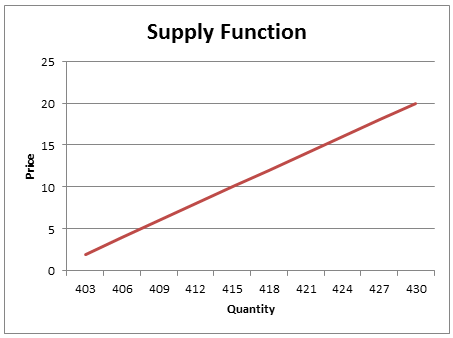

## Table of Contents

## What is a supply curve?

A supply curve is a graph that shows how much of a product producers are willing to sell at different prices. It usually slopes upward, meaning that as the price of the product goes up, producers are willing to supply more of it. This happens because higher prices make it more profitable for producers to increase their production.

The supply curve is important because it helps us understand how the market works. When the price of a product is high, more producers will want to sell it, which increases the total supply. On the other hand, if the price is low, producers might not find it worth their while to produce as much, so the supply will be lower. This relationship between price and quantity supplied is what the supply curve shows us.

## How does a supply curve illustrate the relationship between price and quantity supplied?

A supply curve is a line on a graph that shows how much of a product people want to sell at different prices. It goes up and to the right, which means that when the price is higher, more people are willing to sell their product. This happens because when the price goes up, sellers can make more money, so they want to sell more.

For example, if you are selling apples and the price goes up, you might decide to pick more apples from your trees to sell. This is because you can earn more money for each apple. The supply curve shows this by going up as the price goes up, showing that at higher prices, more apples (or any product) will be supplied to the market.

## What are the basic assumptions behind a supply curve?

The supply curve is based on a few simple ideas. One big idea is that producers want to make more money. When the price of a product goes up, they can earn more for each item they sell. So, they are willing to produce and sell more of the product. This is why the supply curve goes up as the price goes up.

Another idea is that there are no big changes happening quickly. This means that things like the cost to make the product, the technology used, and the number of sellers stay the same. If these things change a lot, the supply curve might look different. But if they stay steady, we can use the supply curve to see how much producers will supply at different prices.

## Can you explain the difference between a short-run and a long-run supply curve?

A short-run supply curve shows how much of a product producers are willing to sell at different prices when they can't easily change things like the size of their factory or the number of workers they have. In the short run, producers can only adjust how much they produce by using their current resources more or less. For example, a farmer might decide to plant more crops in the fields they already have, but they can't quickly buy more land. So, the short-run supply curve might not respond as much to price changes because producers are limited in how much they can change their production.

On the other hand, a long-run supply curve looks at what happens when producers have enough time to make big changes, like building a new factory or hiring more workers. In the long run, producers can fully adjust to price changes because they have the time to change their resources. This means that the long-run supply curve can show a bigger response to price changes. For instance, if the price of apples goes up and stays high, a farmer might decide to buy more land to plant more apple trees, leading to a much larger increase in supply over time.

## How does the law of supply relate to the supply curve?

The law of supply says that when the price of something goes up, people who make it will want to make and sell more of it. This happens because they can make more money if the price is higher. The supply curve shows this idea on a graph. It goes up and to the right, which means that as the price goes up, the amount of stuff that people want to sell also goes up. So, the supply curve is a way to see the law of supply in action.

The supply curve is important because it helps us understand how much of a product will be available at different prices. When the price is low, the supply curve shows that not many people will want to sell their product because they won't make much money. But when the price is high, the supply curve shows that more people will want to sell their product because they can make more money. This relationship between price and the amount of stuff people want to sell is what the law of supply is all about, and the supply curve makes it easy to see.

## What factors can cause a shift in the supply curve?

A shift in the supply curve happens when something changes how much of a product people want to sell, no matter what the price is. One big reason for a shift is a change in the cost of making the product. If it costs less to make, like if the price of materials goes down or new technology makes it cheaper, then sellers will want to make and sell more. This makes the supply curve move to the right, showing more supply at every price. But if it costs more to make, like if workers want higher pay or materials get more expensive, then sellers might make and sell less, and the supply curve moves to the left.

Another reason for a shift in the supply curve is a change in the number of sellers. If more people start selling the product, like if new companies enter the market, then there will be more of the product available. This moves the supply curve to the right. But if some sellers leave the market, maybe because they go out of business, then there will be less of the product, and the supply curve moves to the left. Also, things like taxes, subsidies, and expectations about future prices can change how much people want to sell, causing the supply curve to shift.

## How do changes in production costs affect the supply curve?

When it costs less to make a product, like if the price of materials goes down or new technology makes it easier to produce, sellers are happy to make and sell more of it. This is because they can make more money even if they sell each item for the same price. So, the supply curve moves to the right. This means that at every price, there is more of the product available. It's like when it's cheaper to bake cookies, a baker will want to bake and sell more cookies because they can make more money.

On the other hand, if it costs more to make the product, like if the price of materials goes up or workers want higher pay, sellers might not want to make as much. This is because it's harder to make money when the costs are higher. So, the supply curve moves to the left. This means that at every price, there is less of the product available. It's like when it's more expensive to bake cookies, a baker will want to bake and sell fewer cookies because it's harder to make a profit.

## What is the impact of technological advancements on the supply curve?

Technological advancements can make it easier and cheaper to produce things. When new technology comes along, it can help producers make more of a product without spending as much money. For example, if a new machine makes it faster to grow and harvest crops, farmers can produce more food at a lower cost. This means they are willing to supply more of their product at every price. So, the supply curve shifts to the right, showing that there is more supply available at any given price.

On the other hand, if the new technology is very expensive and not many producers can afford it, it might not change the supply curve right away. Only the producers who can buy the new technology will be able to produce more, while others might keep doing things the old way. But over time, as more producers start using the new technology, the overall supply will increase, and the supply curve will shift to the right. This shows how technological advancements can lead to more supply in the long run, making products more available and often cheaper for everyone.

## How can government policies influence the supply curve?

Government policies can change how much of a product people want to sell. If the government gives money to producers, like a subsidy, it makes it cheaper for them to make things. This means they can make more money even if they sell at the same price. So, they will want to produce and sell more. This makes the supply curve move to the right, showing more supply at every price. It's like when the government helps farmers by giving them money to grow crops, they can grow and sell more food.

On the other hand, if the government makes new rules or taxes that make it more expensive to produce things, like a tax on each item sold, producers might not want to make as much. This is because they make less money after paying the tax. So, they will produce and sell less, and the supply curve moves to the left, showing less supply at every price. It's like when the government puts a tax on cigarettes, it costs more to make them, so fewer cigarettes are made and sold.

## Can you discuss the concept of elasticity in relation to the supply curve?

Elasticity of supply tells us how much the amount of a product people want to sell changes when the price changes. If the supply is elastic, it means that even a small change in price can make a big difference in how much people want to sell. For example, if the price of apples goes up just a little bit, farmers might decide to pick and sell a lot more apples because it's worth their while. On the other hand, if the supply is inelastic, it means that the amount people want to sell doesn't change much even if the price changes a lot. This can happen when it's hard to quickly produce more of something, like if it takes a long time to grow more apples.

The shape of the supply curve can show us how elastic the supply is. If the supply curve is flat, it means the supply is elastic because a small change in price leads to a big change in the quantity supplied. If the supply curve is steep, it means the supply is inelastic because even a big change in price doesn't change the quantity supplied much. Understanding elasticity helps us know how the market might react to price changes. For example, if the government wants to raise taxes on a product with an inelastic supply, they might not see a big drop in how much is sold, but if the supply is elastic, even a small tax could lead to a big drop in supply.

## How do supply curves differ across different market structures like perfect competition, monopoly, and oligopoly?

In a market with perfect competition, there are lots of small sellers, and they all sell the same thing. The supply curve for each seller in perfect competition is the same as their marginal cost curve, which shows the cost of making one more item. Because there are so many sellers, the market supply curve is just the sum of all their individual supply curves. This means that in perfect competition, the market supply curve is usually a straight, upward-sloping line, showing that as the price goes up, more and more sellers are willing to produce and sell more.

In a monopoly, there's only one seller, and they can control the price. Because of this, a monopoly doesn't have a traditional supply curve like in perfect competition. Instead, the monopolist decides how much to produce based on what will make them the most profit. They look at the demand curve to see how much people will buy at different prices and then choose the best amount to produce. So, while there's no single supply curve for a monopoly, their production decisions still affect how much of the product is available in the market.

In an oligopoly, there are a few big sellers, and they often keep an eye on what the others are doing. The supply curve in an oligopoly can be tricky because the sellers might change their production based on what their competitors do. Sometimes, they might even work together to control the supply and keep prices high. Because of this, the supply curve in an oligopoly can be hard to predict and might not be a simple, upward-sloping line like in perfect competition. Instead, it can change based on the strategies and interactions of the few big sellers in the market.

## What are some advanced economic models that incorporate supply curves, and how do they differ from the basic model?

In advanced economic models, supply curves can be part of bigger systems that look at more things than just the relationship between price and how much people want to sell. One example is the general equilibrium model, which tries to understand how all parts of the economy work together. In this model, supply curves for different products are connected through things like how much people want to buy, how much money they have, and how much other products cost. This is different from the basic supply curve model because it doesn't just look at one product by itself. Instead, it sees how changes in one part of the economy can affect supply and demand in other parts.

Another advanced model is the dynamic stochastic general equilibrium (DSGE) model, which adds time and uncertainty to the picture. In this model, supply curves can change over time based on things like new technology or changes in how much it costs to make things. It also looks at how people expect prices to change in the future, which can affect how much they want to produce and sell now. This is more complicated than the basic supply curve model because it tries to predict how the economy might change in the future, not just what's happening right now. Both of these models give a fuller picture of how supply works in the real world, but they are also harder to understand and use than the simple supply curve.

## What is the key to understanding supply and demand economics?

Supply and demand economics serves as a foundational framework in economic theory, essential for determining the price and quantity of goods and services in a market. The demand curve represents the relationship between the price of a product and the quantity that consumers are willing and able to purchase, assuming all other factors remain constant. Typically downward-sloping, this curve reflects the inverse relationship between price and quantity demanded: as price decreases, the quantity demanded increases, and vice versa.

Conversely, the supply curve depicts the relationship between the price of a product and the quantity that producers are willing and able to sell. Generally upward-sloping, this curve illustrates the direct relationship between price and quantity supplied: as price rises, the quantity supplied also increases, reflecting producers' willingness to capitalize on higher prices for greater profitability.

The interplay between these curves leads to market equilibrium, a state where the quantity demanded by consumers equals the quantity supplied by producers. This equilibrium is visually represented by the intersection of the demand and supply curves on a graph, establishing both the market price and quantity traded. Mathematically, equilibrium can be expressed as:

$$
Q_d = Q_s
$$

where $Q_d$ is the quantity demanded and $Q_s$ is the quantity supplied.

These fundamental curves underpin more complex economic models, playing a pivotal role in market analysis and policy formulation. Their significance extends into financial markets, where they inform strategies for predicting price fluctuations and understanding market dynamics. The ability to anticipate shifts in supply and demand can provide strategic advantages in contexts such as stock trading, where market conditions and price movements are constantly evolving.

## References & Further Reading

[1]: Bergstra, J., Bardenet, R., Bengio, Y., & Kégl, B. (2011). ["Algorithms for Hyper-Parameter Optimization."](https://papers.nips.cc/paper/4443-algorithms-for-hyper-parameter-optimization) Advances in Neural Information Processing Systems 24.

[2]: ["Advances in Financial Machine Learning"](https://www.amazon.com/Advances-Financial-Machine-Learning-Marcos/dp/1119482089) by Marcos Lopez de Prado

[3]: ["Evidence-Based Technical Analysis: Applying the Scientific Method and Statistical Inference to Trading Signals"](https://www.amazon.com/Evidence-Based-Technical-Analysis-Scientific-Statistical/dp/0470008741) by David Aronson

[4]: ["Machine Learning for Algorithmic Trading"](https://github.com/stefan-jansen/machine-learning-for-trading) by Stefan Jansen

[5]: ["Quantitative Trading: How to Build Your Own Algorithmic Trading Business"](https://www.amazon.com/Quantitative-Trading-Build-Algorithmic-Business/dp/1119800064) by Ernest P. Chan