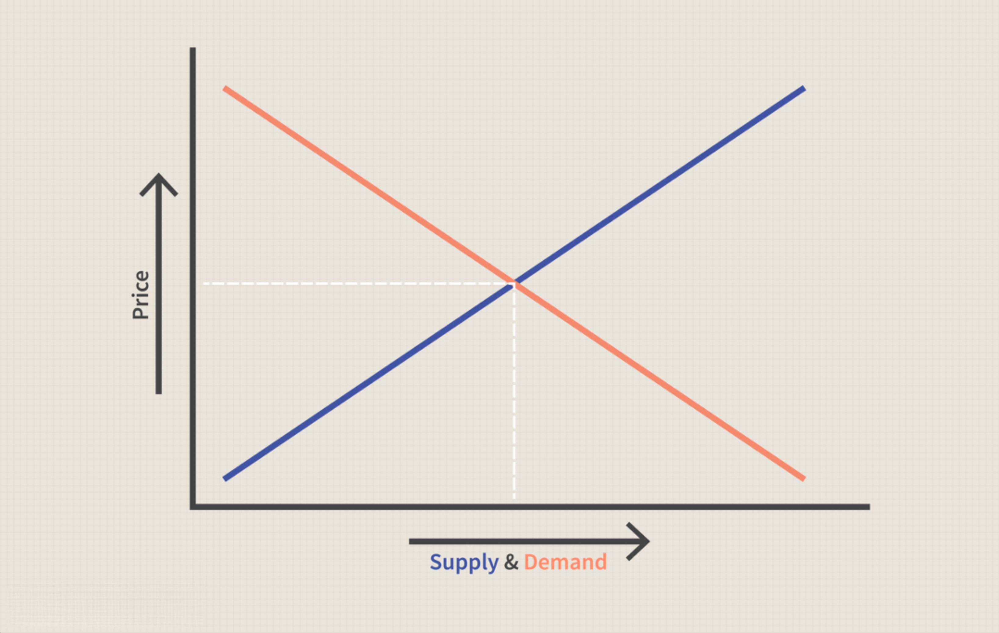

In the evolving landscape of financial markets, algorithmic trading has emerged as a powerful tool for investors looking to optimize their trading strategies. This practice leverages computer programs to make trading decisions at speeds and frequencies that far surpass human capabilities. As markets grow increasingly complex, understanding supply and demand economics becomes crucial for the development of these sophisticated trading algorithms.

Supply and demand economics, which underpins much of financial theory, examines how the availability of financial assets and the desire of these assets interact to influence market prices. Traders and investors who grasp these concepts can better anticipate market movements, making algorithmic trading a strategic application of economic principles. By integrating supply-demand insights into trading algorithms, investors gain the potential to enhance their decision-making processes and improve market adaptability.



This article explores the intersection of supply-demand economics and algorithmic trading, providing insights into how these principles are utilized in financial markets today. We'll review the basics of supply-demand economics and discuss how algorithmic strategies can leverage these principles to gain a market advantage. Furthermore, we'll examine future trends, innovations, and the potential implications for both fields. As technology continues to advance, the synergy between algorithmic trading and economic theory promises to drive significant developments in trading strategies and market analysis.

## Table of Contents

## Understanding Supply and Demand Economics

Supply and demand are foundational principles in economics, governing the equilibrium and fluctuations of asset markets. These concepts articulate the relationship between the quantity of a product that the market can offer, the supply, and the amount that consumers are willing and able to purchase, the demand.

In financial markets, supply pertains to the quantity of an asset available for trading. This entails aspects such as the [volume](/wiki/volume-trading-strategy) of stocks, commodities, or currencies in circulation and available for transactions at any given time. Demand, on the other hand, reflects the market's appetite for an asset, driven by factors such as investor sentiment, economic indicators, and geopolitical events.

Price movements are often directly correlated with changes in supply and demand dynamics. When demand exceeds supply, prices generally rise, a phenomenon termed as a 'bull market'. Conversely, when supply outstrips demand, prices tend to fall, leading to a 'bear market'. This relationship can be formalized in economics through the equilibrium model, where the equilibrium price $P_e$ is reached when quantity demanded $Q_d$ equals quantity supplied $Q_s$:

$$
Q_d(P_e) = Q_s(P_e)
$$

A nuanced grasp of supply and demand dynamics enables traders to anticipate market movements and identify trading opportunities. For instance, a sudden increase in demand for a specific asset, perhaps due to favorable economic news or changes in policy, can signal a potential rise in its market price, providing an opportunity for strategic purchase.

Several elements influence supply and demand forces, often making their analysis complex and multi-faceted. Historical trends provide a basis for understanding typical price behaviors and can show cyclical patterns based on past data. Analyzing historical data sets allows traders to build predictive models using techniques such as time-series analysis. An example in Python using historical stock data might look like this:

```python
import pandas as pd
import matplotlib.pyplot as plt

# Load sample stock data
data = pd.read_csv('stock_data.csv')  # Assume this CSV file contains columns 'Date', 'Close Price'
data['Date'] = pd.to_datetime(data['Date'])

# Plot historical price trends
plt.figure(figsize=(10, 5))
plt.plot(data['Date'], data['Close Price'], label='Close Price')
plt.xlabel('Date')
plt.ylabel('Price')
plt.title('Historical Stock Price Trend')
plt.legend()
plt.show()
```

Current market conditions, including interest rates, inflation, and employment rates, directly influence supply-demand economics. Traders often monitor these indicators to assess the macroeconomic landscape that guides asset pricing. Additionally, external factors such as technological advancements, political stability, and natural disasters significantly impact market dynamics by altering production costs and consumer confidence.

Understanding supply and demand involves recognizing these intricate interdependencies, offering crucial insights for strategic trading and investment decisions in financial markets. This requires constant scrutiny of the ever-shifting economic environment and the agile adaptation of strategies to harness the inherent opportunities.

## Algorithmic Trading: An Overview

Algorithmic trading, commonly referred to as algo trading, involves utilizing computer programs to execute trades in financial markets based on predefined criteria. These algorithms operate by analyzing vast amounts of data at speeds unattainable by human traders, offering significant advantages in terms of efficiency and timing. The speed and precision with which these algorithms function allow traders to capitalize on even the smallest price discrepancies, which is crucial in today’s fast-paced markets.

Algo trading strategies can vary from straightforward approaches to highly sophisticated systems. Simple strategies might include executing trades based on specific technical indicators like moving averages or relative strength index (RSI), whereas complex strategies could involve statistical [arbitrage](/wiki/arbitrage), [machine learning](/wiki/machine-learning) models, or high-frequency trading. These sophisticated approaches often incorporate a myriad of market indicators and economic principles, seeking to enhance predictive accuracy and trading performance.

The cardinal objective of [algorithmic trading](/wiki/algorithmic-trading) is to optimize profit while meticulously managing risk. This is achieved through systematic and rapid decision-making processes. The algorithms are designed to continually evaluate market data, determining the optimal times for entering or exiting trades. This allows traders to maintain a disciplined approach, devoid of emotional bias, which often plagues human judgment in financial markets.

Constant refinement and adaptation to shifting market dynamics are imperative for the success of algorithmic trading strategies. As market conditions evolve, so too must the algorithms, which need to be regularly updated and recalibrated. This ongoing process ensures that the trading strategies remain relevant and effective, aligning with the latest market trends and anomalies.

Incorporating cutting-edge technology and economic theory into these algorithms requires expertise across multiple disciplines, including finance, computer science, and [statistics](/wiki/bayesian-statistics). The confluence of these fields facilitates the development of robust algorithms capable of thriving in volatile market environments. Consequently, algorithmic traders often work in tandem with data scientists and economic analysts to continuously enhance the algorithms' predictive capabilities and adaptability.

## Integrating Supply-Demand Economics in Algo Trading Strategies

Integrating supply-demand economics into trading algorithms involves an intricate process of predicting future price movements by analyzing supply-demand imbalances. At its core, this integration leverages the fundamental economic principles of supply and demand to create predictive models that improve trading efficacy and efficiency.

Algorithms designed for this purpose often begin with analyzing order flows, which represent the buying and selling activities in the market. These flows can signal shifts in the balance of supply and demand. For instance, a substantial increase in buy orders relative to sell orders may indicate rising demand, potentially pushing prices upward. An algorithm can be coded to recognize such patterns, triggering trades when specific thresholds are met.

Price levels and market [volatility](/wiki/volatility-trading-strategies) are additional factors considered in the algorithms. Support and resistance levels, for example, are crucial in understanding where supply and demand imbalances may pause or reverse. A price approaching a known resistance level might indicate an excess of supply, suggesting a potential price drop. Conversely, approaching support could signal high demand.

Machine learning techniques are often employed within these algorithms to enhance their adaptability and predictive power. By using historical market data, machine learning models can identify complex patterns and relationships between supply-demand variables that may not be immediately apparent. These models can then adapt in real time as new data becomes available, improving their predictions' accuracy and reliability.

Here is a simple example of how machine learning might be applied using Python:

```python
import pandas as pd
from sklearn.model_selection import train_test_split
from sklearn.ensemble import RandomForestRegressor

# Load historical market data
data = pd.read_csv('historical_market_data.csv')

# Define features and target
features = data[['order_flow', 'price_level', 'volatility']]
target = data['future_price_movement']

# Split data into training and testing sets
X_train, X_test, y_train, y_test = train_test_split(features, target, test_size=0.2, random_state=42)

# Train a Random Forest model
model = RandomForestRegressor(n_estimators=100, random_state=42)
model.fit(X_train, y_train)

# Predict future price movements
predictions = model.predict(X_test)
```

The implementation of these strategies necessitates rigorous [backtesting](/wiki/backtesting). Backtesting is conducted by applying algorithms to historical data to assess how well they would have performed. This process is crucial to ensuring the models' reliability and accuracy across different market scenarios, thus helping traders refine their strategies before real-world application.

Accuracy in prediction models and reliance on historical data imply that trends not previously experienced in the market might still catch these systems off guard. Therefore, continuous updating and recalibrating of the models is essential as new data and economic insights emerge. By meticulously integrating economics with technological advancement, traders can craft more effective and timely trading strategies.

## Challenges and Risks in Algorithmic Trading

Algorithmic trading, while offering numerous advantages in speed and efficiency, presents a series of challenges and risks that traders must navigate. One primary concern is data inaccuracies, which can undermine algorithmic strategies by providing incorrect inputs. With substantial market data streaming in real-time, ensuring data integrity is critical. However, errors can occur during data collection and processing, potentially skewing algorithmic decisions and leading to substantial financial losses.

Another significant risk comes from model overfitting, where algorithms are excessively tailored to historical data, capturing noise rather than the underlying market patterns. Overfitting results in models performing well on past data but failing to adapt to new, unseen data. This can result in poor decision-making in live trading environments. To mitigate this, traders use techniques like cross-validation and regularization during the model development process.

Unexpected market behavior also poses a risk to algorithmic traders. Markets can behave unpredictably due to sudden economic announcements, geopolitical events, or unforeseen market shifts, which may not be accounted for in pre-existing algorithmic models. Such events can result in rapid price movements and increased volatility, challenging the robustness and responsiveness of trading algorithms.

High-frequency trading ([HFT](/wiki/high-frequency-trading-strategies)), a subset of algorithmic trading, faces additional scrutiny. Characterized by the execution of a large number of orders at extremely high speeds, HFT can significantly impact market stability and integrity. Critics argue that HFT could exacerbate market volatility and contribute to flash crashes, where rapid trades lead to sudden market drops.

Regulatory considerations further complicate algorithmic trading. The regulatory landscape is continually evolving, with authorities implementing rules to enhance transparency and reduce systemic risks associated with high-speed trading activities. Compliance with these regulations requires algorithmic traders to maintain detailed records of their trading activities and ensure their algorithms adhere to established market conduct standards. This compliance often involves the integration of audit trails and reporting systems within trading platforms.

To manage these challenges and risks effectively, successful algorithmic trading necessitates robust risk management frameworks and continuous monitoring. Adaptive risk management involves using stop-loss orders, position sizing strategies, and real-time risk analytics to mitigate potential losses. Continuous monitoring ensures that algorithms function as intended and can swiftly respond to unexpected market changes or internal system errors.

In summary, while algorithmic trading offers distinct market advantages, it also presents challenges requiring strategic management. Addressing data inaccuracies, preventing model overfitting, preparing for unexpected market dynamics, navigating regulatory frameworks, and implementing comprehensive risk management practices are fundamental to successful algorithmic trading.

## Future Trends in Algorithmic Trading and Supply-Demand Economics

As technology continues to advance at a rapid pace, the future of algorithmic trading and its integration with supply-demand economics is poised for significant evolution. The incorporation of [artificial intelligence](/wiki/ai-artificial-intelligence) (AI) and machine learning (ML) technologies is central to this transformation, offering enhanced abilities to model and predict complex supply-demand dynamics in financial markets. AI algorithms can process and analyze vast datasets to identify subtle patterns and correlations that human traders might overlook. Machine learning models, particularly those employing [deep learning](/wiki/deep-learning) techniques, are increasingly capable of adapting to new data, refining their predictive accuracy over time.

The burgeoning field of big data analytics provides another layer of sophistication to algorithmic trading strategies. With the exponential growth of data generated from various market sources, innovations in data collection, storage, and analysis are paramount. Advanced analytics can extract valuable insights concerning trader behaviors and market trends, which can be utilized to optimize trading algorithms. For instance, sentiment analysis of social media platforms and news articles using natural language processing (NLP) can offer predictive signals about market sentiments, thus influencing demand predictions.

Enhanced computing power is another pivotal [factor](/wiki/factor-investing) enabling more complex simulations and real-time processing of trading algorithms. High-performance computing (HPC) environments allow for the execution of intricate algorithms that simulate various market scenarios, test hypotheses, and optimize trading strategies much faster than before. This computational capacity is crucial when implementing real-time trading strategies that must react immediately to market fluctuations.

The future landscape of algorithmic trading is also characterized by collaborative efforts among economists, data scientists, and financial traders. This interdisciplinary approach fosters innovation and ensures that trading strategies are grounded in robust economic theory while being enhanced by cutting-edge data science techniques. Collaborative frameworks facilitate the exchange of insights and expertise, leading to the development of more effective and sustainable trading models.

In conclusion, the future of algorithmic trading, intertwined with supply-demand economics, promises more sophisticated, efficient, and adaptive strategies. As AI and machine learning models become more advanced, and big data analytics provide deeper market insights, the trading landscape will continue to evolve. Enhanced computational power and interdisciplinary collaboration will be key drivers shaping the future of this dynamic field, potentially resulting in more accurate market predictions and optimized trading strategies.

## Conclusion

The integration of supply-demand economics into algorithmic trading presents a powerful opportunity for the enhancement of market strategies. By leveraging economic principles at scale, algorithmic trading facilitates automated decision-making, enabling traders to gain a competitive advantage in increasingly complex markets. Algorithms can effectively process vast datasets, identifying patterns and imbalances within supply-demand dynamics that would be challenging for manual analysis.

Despite the benefits, the intricacy of financial markets necessitates a meticulous approach to the development of trading models and risk management. Market volatility, unforeseen events, and data inaccuracies can compromise algorithmic effectiveness if not properly managed. Ensuring reliability involves rigorous backtesting and adapting models to accommodate various market conditions. Additionally, traders must consider the risk of model overfitting and the potential consequences of high-frequency trading practices on market stability.

As the landscape of algorithmic trading evolves, it is crucial to stay updated on emerging technologies and regulatory developments. Advances in artificial intelligence, machine learning, and big data analytics promise to refine algorithms further, enhancing their capacity to predict and exploit supply-demand shifts. Moreover, regulatory changes often dictate compliance standards, influencing how algorithms are developed and applied in practice.

The successful application of these integrated concepts demands a balanced confluence of economic understanding, technical prowess, and strategic insight. Traders and investors must possess the ability to interpret economic indicators and integrate technological tools to maintain a sustainable edge in the financial market. As this field progresses, collaboration among economists, data scientists, and traders will likely spur the next wave of algorithmic trading innovations, reinforcing its role as a cornerstone of modern finance.

## References & Further Reading

[1]: Bergstra, J., Bardenet, R., Bengio, Y., & Kégl, B. (2011). ["Algorithms for Hyper-Parameter Optimization."](https://papers.nips.cc/paper/4443-algorithms-for-hyper-parameter-optimization) Advances in Neural Information Processing Systems 24.

[2]: ["Advances in Financial Machine Learning"](https://www.amazon.com/Advances-Financial-Machine-Learning-Marcos/dp/1119482089) by Marcos Lopez de Prado

[3]: ["Evidence-Based Technical Analysis: Applying the Scientific Method and Statistical Inference to Trading Signals"](https://www.amazon.com/Evidence-Based-Technical-Analysis-Scientific-Statistical/dp/0470008741) by David Aronson

[4]: ["Machine Learning for Algorithmic Trading"](https://github.com/PacktPublishing/Machine-Learning-for-Algorithmic-Trading-Second-Edition) by Stefan Jansen

[5]: ["Quantitative Trading: How to Build Your Own Algorithmic Trading Business"](https://www.amazon.com/Quantitative-Trading-Build-Algorithmic-Business/dp/0470284889) by Ernest P. Chan