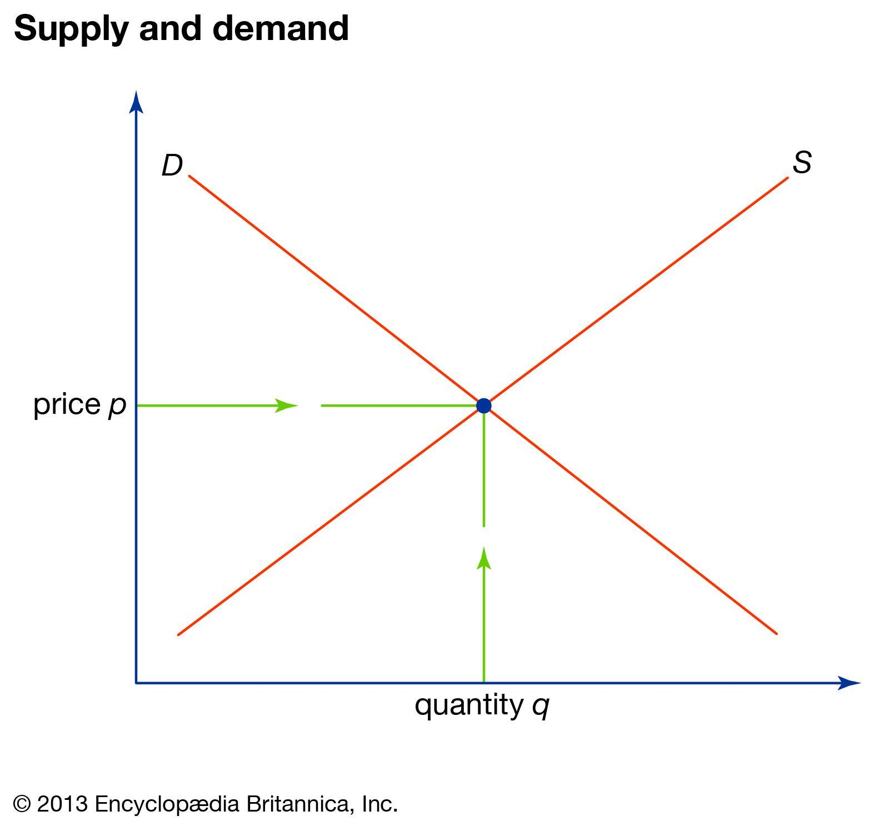

## Table of Contents

## What is supply and demand in economics?

Supply and demand is a basic idea in economics that explains how the price and amount of goods or services are decided in a market. It's like a seesaw where the supply, or how much of something is available, is on one side, and the demand, or how much people want it, is on the other side. When there's a lot of something and not many people want it, the price goes down. But if there's not much of it and a lot of people want it, the price goes up.

This balance between supply and demand helps set prices in a way that makes sense for both buyers and sellers. If a store has too many apples and not enough people are buying them, the store might lower the price to sell them faster. On the other hand, if everyone suddenly wants to buy apples and there aren't many, the store might raise the price because they know people are willing to pay more. This back-and-forth keeps the market moving and helps decide how resources are used.

## How do supply and demand curves work?

Supply and demand curves are like graphs that show how much of something people want to buy and how much sellers want to sell at different prices. The demand curve slopes downward, which means that when the price is lower, more people want to buy the product. It's like when apples are cheaper, more people will buy them. On the other hand, the supply curve slopes upward, showing that when the price is higher, sellers are willing to offer more of the product. If the price of apples goes up, farmers might bring more apples to the market.

Where the supply and demand curves cross each other is called the equilibrium point. This is where the amount people want to buy matches the amount sellers want to sell, and it's the price where the market is balanced. If the price is higher than this point, there will be more apples than people want to buy, so sellers might lower the price to sell them. If the price is lower than the equilibrium, more people will want to buy apples than there are available, so sellers might raise the price. This movement helps the market find the right price where everyone is happy.

## What factors can shift the demand curve?

Several things can make the demand curve move to the left or right. One big thing is people's income. If people have more money, they might want to buy more stuff, so the demand curve moves to the right. But if they have less money, they might buy less, and the curve moves to the left. Another thing is the price of other goods. If the price of something people can use instead goes up, they might buy more of the original thing, moving the demand curve to the right. If the price of the other good goes down, they might switch, moving the demand curve to the left.

Tastes and preferences also play a big role. If a product becomes really popular, like a new toy or a trendy food, more people will want it, and the demand curve will shift to the right. On the other hand, if people start to like something less, maybe because of a bad experience or a change in fashion, the demand will go down, and the curve will shift to the left. Finally, the number of buyers can change the demand curve. If more people start wanting to buy the product, maybe because more people move into an area, the demand curve will move to the right. If fewer people want it, the curve will move to the left.

## What factors can shift the supply curve?

The supply curve can move because of different things. One big thing is the cost of making the product. If it costs more to make something, like if the price of materials goes up, sellers might not want to sell as much unless they can charge more. So, the supply curve moves to the left. But if it costs less to make the product, maybe because a new way of making it is cheaper, sellers will want to sell more at the same price, and the supply curve moves to the right.

Another thing that can change the supply curve is technology. If new technology makes it easier or faster to make something, more can be made without it costing more, so the supply curve moves to the right. But if something goes wrong with the technology, like a machine breaks down, it might be harder to make the product, and the supply curve moves to the left. Also, the number of sellers can change the supply curve. If more people start selling the product, maybe because it's easy to get into the business, the supply curve moves to the right. If fewer people sell it, maybe because it's hard to make money, the supply curve moves to the left.

## How does the equilibrium price and quantity get determined?

The equilibrium price and quantity are found where the supply and demand curves meet on a graph. This meeting point is called the equilibrium. It's like a balance where the amount of a product people want to buy is exactly the same as the amount sellers want to sell. If the price is higher than the equilibrium, there will be more of the product than people want to buy, so sellers will have to lower the price to sell it all. If the price is lower than the equilibrium, more people will want to buy the product than there is available, so sellers can raise the price and still sell everything.

Changes in the market can move the equilibrium point. If something makes people want more of a product, like if it becomes really popular, the demand curve will shift to the right, and the equilibrium price and quantity will go up. If something makes it easier or cheaper to make the product, like new technology, the supply curve will shift to the right, and the equilibrium price will go down, but the equilibrium quantity will go up. These shifts help the market find a new balance where the amount people want to buy matches the amount sellers want to sell at a new price.

## What is the effect of a price ceiling on supply and demand?

A price ceiling is a rule that says the price of something can't go above a certain amount. When the government puts a price ceiling below the equilibrium price, it means the price is lower than where supply and demand would naturally meet. This can make more people want to buy the product because it's cheaper, so demand goes up. But at the same time, sellers might not want to sell as much because they can't charge as much money. This can lead to a shortage, where there's not enough of the product for everyone who wants it.

For example, if the government sets a price ceiling on rent, more people might want to rent apartments because the price is lower. But landlords might not want to rent out as many apartments because they're not making as much money. This can lead to a situation where there are more people looking for apartments than there are apartments available. To deal with this, the government might need to find other ways to make sure everyone can find a place to live, like building more apartments or helping people find homes in different ways.

## What is the effect of a price floor on supply and demand?

A price floor is a rule that says the price of something can't go below a certain amount. When the government sets a price floor above the equilibrium price, it means the price is higher than where supply and demand would naturally meet. This can make fewer people want to buy the product because it's more expensive, so demand goes down. But at the same time, sellers might want to sell more because they can charge more money. This can lead to a surplus, where there's more of the product than people want to buy.

For example, if the government sets a price floor on the price of milk, fewer people might want to buy milk because it's more expensive. But farmers might want to sell more milk because they can make more money. This can lead to a situation where there's more milk than people want to buy. To deal with this, the government might need to find other ways to use the extra milk, like giving it to schools or food banks, or they might need to pay farmers not to produce as much milk.

## How do elasticities of supply and demand affect market outcomes?

Elasticities of supply and demand tell us how much the amount people want to buy or sell changes when the price changes. If demand is elastic, it means that when the price goes up a little, people will buy a lot less of the product. If it's inelastic, people will keep buying about the same amount even if the price goes up. On the other hand, if supply is elastic, sellers will offer a lot more of the product when the price goes up a little. If it's inelastic, they won't offer much more even if the price goes up a lot.

These elasticities can change how the market works. For example, if demand is very elastic and the price goes up, the amount people buy will drop a lot, which can make the total money sellers make go down. But if demand is inelastic, the total money sellers make might go up even if they sell a little less because they're charging more for each item. The same thing happens with supply. If supply is elastic and the price goes up, a lot more of the product will be offered, which can help keep the price from going up too much. But if supply is inelastic, even a small increase in demand can make the price go up a lot because there's not much more of the product available.

## What are the differences between short-run and long-run adjustments in supply and demand?

In the short run, the amount of a product that sellers can offer doesn't change much because they can't quickly make more or less of it. For example, a farmer can't grow more corn overnight. So, if the price goes up, the supply might not change right away, but the amount people want to buy can change quickly. This can lead to short-term shortages or surpluses. If the price is too high, there might be more of the product than people want to buy, and if it's too low, there might not be enough for everyone who wants it.

In the long run, sellers can change how much they offer more easily. They can build new factories, hire more workers, or find new ways to make things cheaper. This means the supply can change a lot over time. For example, if people start wanting more electric cars, car companies can start making more of them over time. The demand can also change in the long run because people's tastes and incomes can change slowly. This means the market can find a new balance where the amount people want to buy matches the amount sellers want to sell at a new price.

## How do externalities influence supply and demand?

Externalities are effects on people who are not directly involved in buying or selling a product. They can make the supply and demand curves move. If a product has a positive externality, like when people plant more trees and it helps clean the air, more people might want to buy it. This moves the demand curve to the right. But if a product has a negative externality, like pollution from a factory, people might want to buy less of it, moving the demand curve to the left. Also, if making a product causes a negative externality, like pollution, the government might make sellers pay for it, which can make them want to sell less, moving the supply curve to the left.

In the long run, externalities can change how the market works a lot. If a product has a big negative externality, like cigarettes causing health problems, the government might put a tax on it to make people buy less. This tax can move the supply curve to the left because it costs more to sell the product. On the other hand, if a product has a big positive externality, like education making society better, the government might give money to people to buy more of it. This can move the demand curve to the right because more people can afford it. These changes help the market find a new balance where the good and bad effects of the product are taken into account.

## What role do expectations play in influencing supply and demand?

Expectations about the future can change how much people want to buy or sell right now. If people think the price of something will go up soon, they might want to buy it now before it gets more expensive. This can make the demand go up today. On the other hand, if people think the price will go down, they might wait to buy it later when it's cheaper, which can make the demand go down today. For example, if people expect gas prices to go up next month, they might fill up their tanks now, making the demand for gas go up.

Expectations can also affect what sellers do. If sellers think they can sell their product for more money in the future, they might hold onto it now and sell it later. This can make the supply go down today. But if they think the price will go down, they might want to sell it now before it's worth less. For example, if farmers think the price of wheat will be higher next year, they might store some of their wheat now instead of selling it all, which can make the supply of wheat go down today. These changes in expectations can move the supply and demand curves and help the market find a new balance.

## How can supply and demand analysis be applied to predict market trends?

Supply and demand analysis can help us guess what might happen in the market by looking at how much people want to buy and how much sellers want to sell at different prices. If we see that people are starting to want more of something, like electric cars, we can predict that the demand curve will move to the right. This means more people will be buying electric cars, and if the supply doesn't change, the price might go up. On the other hand, if we see that it's getting easier and cheaper to make electric cars, the supply curve might move to the right. This could mean more electric cars are available, and if the demand doesn't change, the price might go down.

By keeping an eye on things that can change supply and demand, like new technology, people's incomes, or government rules, we can make better guesses about where the market is headed. For example, if a new law makes it more expensive to make a product, the supply curve might move to the left, leading to higher prices if demand stays the same. Or if a new trend makes a product really popular, the demand curve might move to the right, pushing prices up if the supply doesn't keep up. By understanding these shifts, businesses and people can make smarter choices about what to buy, sell, or invest in.

## What is Understanding Supply and Demand Economics?

Supply and demand are foundational principles in economics, governing the equilibrium and fluctuations of asset markets. These concepts articulate the relationship between the quantity of a product that the market can offer, the supply, and the amount that consumers are willing and able to purchase, the demand.

In financial markets, supply pertains to the quantity of an asset available for trading. This entails aspects such as the [volume](/wiki/volume-trading-strategy) of stocks, commodities, or currencies in circulation and available for transactions at any given time. Demand, on the other hand, reflects the market's appetite for an asset, driven by factors such as investor sentiment, economic indicators, and geopolitical events.

Price movements are often directly correlated with changes in supply and demand dynamics. When demand exceeds supply, prices generally rise, a phenomenon termed as a 'bull market'. Conversely, when supply outstrips demand, prices tend to fall, leading to a 'bear market'. This relationship can be formalized in economics through the equilibrium model, where the equilibrium price $P_e$ is reached when quantity demanded $Q_d$ equals quantity supplied $Q_s$:

$$
Q_d(P_e) = Q_s(P_e)
$$

A nuanced grasp of supply and demand dynamics enables traders to anticipate market movements and identify trading opportunities. For instance, a sudden increase in demand for a specific asset, perhaps due to favorable economic news or changes in policy, can signal a potential rise in its market price, providing an opportunity for strategic purchase.

Several elements influence supply and demand forces, often making their analysis complex and multi-faceted. Historical trends provide a basis for understanding typical price behaviors and can show cyclical patterns based on past data. Analyzing historical data sets allows traders to build predictive models using techniques such as time-series analysis. An example in Python using historical stock data might look like this:

```python
import pandas as pd
import matplotlib.pyplot as plt

# Load sample stock data
data = pd.read_csv('stock_data.csv')  # Assume this CSV file contains columns 'Date', 'Close Price'
data['Date'] = pd.to_datetime(data['Date'])

# Plot historical price trends
plt.figure(figsize=(10, 5))
plt.plot(data['Date'], data['Close Price'], label='Close Price')
plt.xlabel('Date')
plt.ylabel('Price')
plt.title('Historical Stock Price Trend')
plt.legend()
plt.show()
```

Current market conditions, including interest rates, inflation, and employment rates, directly influence supply-demand economics. Traders often monitor these indicators to assess the macroeconomic landscape that guides asset pricing. Additionally, external factors such as technological advancements, political stability, and natural disasters significantly impact market dynamics by altering production costs and consumer confidence.

Understanding supply and demand involves recognizing these intricate interdependencies, offering crucial insights for strategic trading and investment decisions in financial markets. This requires constant scrutiny of the ever-shifting economic environment and the agile adaptation of strategies to harness the inherent opportunities.

## References & Further Reading

[1]: Bergstra, J., Bardenet, R., Bengio, Y., & Kégl, B. (2011). ["Algorithms for Hyper-Parameter Optimization."](https://papers.nips.cc/paper/4443-algorithms-for-hyper-parameter-optimization) Advances in Neural Information Processing Systems 24.

[2]: ["Advances in Financial Machine Learning"](https://www.amazon.com/Advances-Financial-Machine-Learning-Marcos/dp/1119482089) by Marcos Lopez de Prado

[3]: ["Evidence-Based Technical Analysis: Applying the Scientific Method and Statistical Inference to Trading Signals"](https://www.amazon.com/Evidence-Based-Technical-Analysis-Scientific-Statistical/dp/0470008741) by David Aronson

[4]: ["Machine Learning for Algorithmic Trading"](https://github.com/PacktPublishing/Machine-Learning-for-Algorithmic-Trading-Second-Edition) by Stefan Jansen

[5]: ["Quantitative Trading: How to Build Your Own Algorithmic Trading Business"](https://www.amazon.com/Quantitative-Trading-Build-Algorithmic-Business/dp/0470284889) by Ernest P. Chan