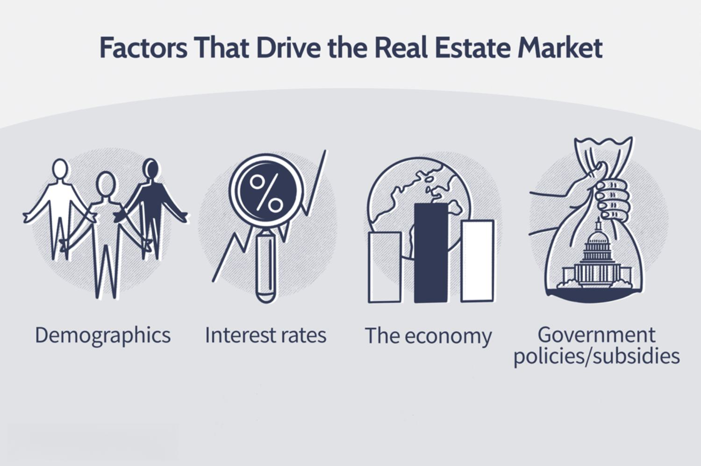

The real estate market is characterized by its complex and ever-changing nature, driven by an array of economic, social, and political factors. This dynamic environment is predominantly shaped by the principles of supply and demand. On the supply side, factors such as land availability, construction costs, and government regulations heavily influence the number of properties available in the market. Conversely, demand is often dictated by population growth, economic conditions, and interest rates, among other elements. The intricate interplay between these supply and demand forces determines property prices, which can fluctuate significantly with changing macroeconomic trends.

Algorithmic trading, common in financial markets, is a process that utilizes complex algorithms to make trading decisions at speeds and accuracies beyond human capabilities. It has revolutionized stock markets and other financial sectors by automating trading decisions based on a multitude of data inputs, enhancing both the efficiency and speed of transactions.



This article examines the intersection of real estate market dynamics and algorithmic trading strategies. By exploring this intersection, we aim to shed light on how emerging technologies are poised to transform real estate investment. Understanding these advancements is essential for investors, policymakers, and all stakeholders to leverage new opportunities and manage potential risks effectively. Through automated data analysis and predictive modeling, algorithmic trading holds promise for more informed decision-making and early identification of lucrative investment opportunities in the real estate market.

## Table of Contents

## Understanding Supply and Demand in the Real Estate Market

Understanding supply and demand within the real estate market is pivotal to grasping the mechanisms that drive property values and investment opportunities. Various factors influence the supply of real estate, including land availability, construction costs, and regulations.

**Supply Factors**:

1. **Land Availability**: The physical availability of land directly limits the potential for new developments. Geographic constraints, such as mountains or water bodies, can restrict expansion, impacting supply levels. Urban areas often face limited land availability, thereby driving up property prices due to scarcity.

2. **Construction Costs**: These encompass materials, labor, and overhead expenses. Fluctuations in construction costs, driven by factors such as raw material price changes or labor shortages, can affect the supply of new developments. An increase in construction costs often leads to a decline in new projects, reducing supply.

3. **Regulations**: Zoning laws, building codes, and environmental regulations can either facilitate or hinder development. Stricter regulations may limit new construction, impacting the supply side of the market.

**Demand Factors**:

1. **Population Growth**: An increasing population generally elevates demand for housing as more individuals require accommodation. This growth can stem from both natural population increases and migration patterns.

2. **Economic Conditions**: Robust economic health often increases people's purchasing power, thereby enhancing demand for property. Conversely, economic downturns can lead to reduced demand as consumers become more financially cautious.

3. **Interest Rates**: Lower interest rates typically reduce the cost of borrowing, making mortgages more affordable and increasing demand for real estate. Conversely, higher interest rates can dampen demand as financing costs rise.

**Supply and Demand Relationship & Property Prices**:

The interplay between supply and demand directly influences property prices. When demand surpasses supply, prices generally rise. Conversely, when supply exceeds demand, prices tend to fall. This dynamic is expressed through the law of supply and demand, where price adjustments occur to reach a market equilibrium.

**Macroeconomic Trends Impact**:

Broader economic trends can significantly impact real estate markets. For instance, inflation can erode purchasing power, affecting demand, while recession-induced unemployment can decrease demand as fewer individuals can afford home purchases. Additionally, wage growth and demographic shifts, such as aging populations, can alter demand patterns.

**Challenges in Predicting Dynamics**:

Forecasting supply and demand in real estate is inherently complex due to these numerous, often interrelated factors. External shocks, such as natural disasters or unexpected economic policy changes, can further complicate predictions. Predictive models must account for both micro and macroeconomic indicators, which requires advanced analytical tools and comprehensive data sets to accurately project market movements.

In summary, understanding the factors influencing supply and demand in the real estate sector is critical for investors and policymakers aiming to navigate this fluctuating market. By comprehending these dynamics, stakeholders can make more informed decisions and anticipate future market trends.

## Algorithmic Trading in Financial Markets

Algorithmic trading, often referred to as algo trading, involves using computer algorithms to automate trading decisions and execute orders in financial markets. These algorithms follow a set of predefined rules and leverage historical data analysis, market indicators, and complex mathematical models to determine the optimal buying or selling of securities.

The transformation brought about by [algorithmic trading](/wiki/algorithmic-trading) in stock markets and other financial sectors is significant. In traditional trading, decisions were heavily reliant on human judgment and manual processes, often leading to delays. In contrast, algorithmic trading automates these processes, dramatically increasing the speed and frequency of trades. This automation allows traders to capitalize on price fluctuations that occur within microseconds, a feat impractical for human traders. As a result, algorithmic trading now accounts for a substantial portion of total trading [volume](/wiki/volume-trading-strategy)—estimated to be over 60% in U.S. equity markets.

One prominent example of successful application is high-frequency trading ([HFT](/wiki/high-frequency-trading-strategies)), a subset of algorithmic trading characterized by high-speed trade executions and low latency market access. HFT firms utilize algorithms to exploit millisecond or microsecond price discrepancies, generating substantial profits. Notable firms like Renaissance Technologies and Citadel have pioneered these techniques, yielding exceptional returns over the years.

Implementing algorithmic trading demands significant technological infrastructure and robust data processing capabilities. At the core, it requires high-speed computers, reliable network connections to exchanges, and access to real-time and historical market data. Algorithms often integrate [machine learning](/wiki/machine-learning) models or statistical techniques such as mean reversion, [momentum](/wiki/momentum) strategies, or [arbitrage](/wiki/arbitrage) for predictive analytics. An example Python snippet utilizing basic mean reversion might look like this:

```python
import numpy as np
import pandas as pd

# Sample historical price data
prices = pd.Series([100, 102, 105, 107, 106, 103, 101, 100])

# Calculate moving average
window_size = 3
moving_avg = prices.rolling(window=window_size).mean()

# Generate buy/sell signals based on mean reversion
signals = np.where(prices < moving_avg, "Buy", "Sell")

print(signals)
```

The benefits of employing algorithmic trading are manifold. Primarily, it offers unparalleled efficiency and speed in executing and processing large volumes of trades. Algorithms can swiftly identify market trends, price inefficiencies, and arbitrage opportunities that would be missed manually. Moreover, they remove human emotions from trading decisions, leading to more disciplined and objective market interactions. This computational power not only enhances profit potential but also aids in risk management by enabling precise control over trade executions and positioning.

In summary, algorithmic trading has evolved as a cornerstone of modern financial markets, offering a blend of technological prowess and strategic sophistication that continues to redefine the landscape of trading.

## Applying Algo Trading Concepts to Real Estate

Algorithmic trading, a method that utilizes computer algorithms to automate trading decisions, has largely transformed financial markets. Its potential application to real estate markets offers intriguing possibilities and challenges. While the implementation of algo trading in real estate is still nascent compared to traditional markets, it promises efficiencies and insights into market movements previously unattainable.

### Challenges and Opportunities

Applying algo trading to real estate presents both obstacles and opportunities. Real estate, unlike stocks or currencies, is a less liquid and more localized market with significant transaction costs and regulatory concerns. Challenges include the complexity of real estate transactions, the variability of property data quality, and longer transaction cycles compared to stock trades. Additionally, the real estate market is influenced by numerous exogenous factors like economic conditions, government policies, and demographic changes, which are often difficult to quantify accurately in models.

Despite these challenges, the opportunities also abound. Algo trading could lead to the early identification of trends and disparities between market expectations and actual performance. This can help investors make informed decisions. Automated systems can efficiently handle large datasets that encompass multiple layers of the real estate market, allowing for more granular and comprehensive market analysis.

### Necessary Data Inputs

For successful implementation, algorithmic trading in real estate requires several crucial data inputs. These include:

1. **Transaction History**: Detailed records of past real estate transactions are essential for identifying patterns and predicting future market movements.

2. **Property Valuations**: Continuous updates on property prices and valuations provide a baseline for algorithmic analysis. Machine learning models, for example, can predict property values using historical data and various features such as location, size, and amenities.

3. **Macroeconomic Indicators**: Factors like interest rates, employment rates, and GDP growth are substantial drivers of real estate demand and supply, thus critical for modeling.

### Potential Strategies

Several strategies can be crafted focusing on supply and demand dynamics. One approach is:

- **Predictive Modeling**: Using historical and real-time data, algorithms can predict demand shifts and price fluctuations. These could rely on machine learning models trained on datasets comprising economic indicators, transaction history, and demographic trends.

```python
import pandas as pd
from sklearn.model_selection import train_test_split
from sklearn.ensemble import RandomForestRegressor

# Sample code for real estate price prediction
# Assume df is a pandas DataFrame with relevant data

# Splitting data into features and target
X = df[['location', 'size', 'amenities', 'economic_indicators']]
y = df['property_price']

# Splitting into train and test datasets
X_train, X_test, y_train, y_test = train_test_split(X, y, test_size=0.2, random_state=42)

# Model instantiation
model = RandomForestRegressor(n_estimators=100, random_state=42)

# Training the model
model.fit(X_train, y_train)

# Making predictions
predictions = model.predict(X_test)
```

### Case Studies and Emerging Examples

Algorithmic trading in real estate is still emerging, but certain asset managers are experimenting with predictive algorithms to evaluate market conditions and inform investment decisions. Companies are also using algorithms to assess valuation discrepancies in REITs (Real Estate Investment Trusts) and spot investment opportunities based on market inefficiencies.

In conclusion, while there are notable hurdles in applying algo trading concepts to the real estate sector, the potential benefits interms of improved efficiency, quicker decision-making, and enhanced market insights offer a promising frontier for real estate investors. Further technological advancements and data integration efforts will likely widen the scope and effectiveness of these applications.

## Advantages of Using Algo Trading in Real Estate Investing

Algorithmic trading in real estate investing offers several distinct advantages, primarily driven by the enhanced speed and accuracy of decision-making processes. Algorithms can process vast amounts of data much faster than human capability, enabling investors to make informed decisions quickly. This speed not only improves reaction times to market changes but also allows for exploiting opportunities that may be fleeting in nature.

An early identification of investment opportunities is a significant benefit of implementing algorithmic trading systems. Algorithms can analyze trends and patterns across various data sets such as property valuations, transaction histories, and macroeconomic indicators to uncover potential investments that may not be immediately apparent through traditional methods. By using machine learning and predictive analytics, these systems can anticipate shifts in the market, giving investors a competitive edge.

Another advantage is the reduction of emotional biases in investment decisions. Human investors are often influenced by cognitive biases which can lead to sub-optimal investment choices. Algorithms, on the other hand, operate based on data and predefined rules, eliminating emotional interference. This objectivity ensures that investments are made purely on logical analysis and statistical evidence, potentially leading to consistently better returns.

The scalability and adaptability of algorithmic trading systems also make them advantageous for real estate investing. Once developed, these systems can be scaled to accommodate a larger volume of transactions and can adapt to various market conditions with relative ease. Changes in market dynamics can be swiftly integrated into the system, allowing for continual optimization of trading strategies.

Lastly, the integration of algorithmic trading fosters innovation in real estate market analysis and investment strategies. The ability to process complex datasets and identify patterns contributes to the development of new analytical techniques and models. As the technology evolves, it encourages continuous improvement and innovation, driving the creation of sophisticated tools for market analysis and investment decision-making.

The transformative potential of algorithms in real estate investing highlights the ongoing need for technological innovation, urging investors and industry stakeholders to embrace these advancements to enhance their market positioning and investment outcomes.

## Challenges and Considerations

Implementing algorithmic trading in the real estate market presents several challenges and considerations that merit careful attention. One of the primary technical challenges involves the accessibility and processing of real estate data. Unlike the stock market, where data is highly structured and readily available, real estate data is often fragmented, heterogeneous, and unstructured. This includes property transaction records, valuations, and macroeconomic indicators. The integration of various data sources requires sophisticated data processing and storage systems capable of handling large volumes of diverse information. Advanced data cleaning, normalization techniques, and machine learning algorithms are essential to derive actionable insights from this complex data landscape.

Regulatory considerations and compliance issues are significant hurdles in applying algorithmic trading to real estate. The real estate industry is heavily regulated, with rules varying across jurisdictions. These regulations affect data privacy, property transactions, and market operations. Ensuring compliance with local laws is crucial to avoid legal repercussions. Moreover, algorithmic systems must be designed to adhere to ethical standards and regulations mandated by financial authorities, which introduces additional layers of complexity in implementation.

Risk management is another vital aspect of algorithmic trading in real estate. Algorithms can make rapid trading decisions that may lead to unintended consequences, especially in dynamic markets. Risk management strategies must be integrated into algorithmic models to prevent significant losses. This involves stress testing algorithms under various market conditions and implementing failsafe mechanisms to halt trading in volatile or illiquid markets.

Ethical considerations and the potential impact on housing markets and affordability cannot be overlooked. Algorithmic trading in real estate could contribute to market [volatility](/wiki/volatility-trading-strategies) and exacerbate housing affordability issues. Large-scale algorithmic trading might prioritize profit over societal well-being, potentially influencing market prices and accessibility. Thus, stakeholders should consider ethical guidelines to ensure that algorithmic trading does not adversely affect housing equity and market stability.

Finally, there is a profound need for continued research and development in this field. The integration of algorithmic trading in real estate is still in its nascent stages, requiring ongoing innovation to surmount the challenges outlined above. Collaboration between technologists, real estate professionals, and regulatory bodies will be key in advancing this area. Research should focus on developing robust, ethical, and transparent algorithms that can adapt to ever-changing market conditions while safeguarding against potential misuse or negative consequences on the broader housing market.

## Conclusion

The integration of algorithmic trading in real estate represents a significant advancement in how property investments are approached. While traditionally, real estate transactions have been driven by intuitive decision-making and market expertise, algorithmic trading introduces the use of sophisticated mathematical models and data analysis. This shift enables more rapid decision-making, removes emotional biases, and allows for better management of diverse investment portfolios. By applying algorithmic trading techniques, investors can leverage vast arrays of data to identify trends and opportunities that may not be apparent through conventional analysis.

Looking toward the future, the application of algorithmic trading in real estate has the potential to reshape the sector entirely. As data quality and availability continue to improve, algorithms can become more precise in their predictions, strategic allocations, and risk assessments. The ongoing development and fine-tuning of these algorithms will likely unlock new possibilities for profit and efficiency in real estate markets, promoting smarter investment strategies.

There is a compelling need for further exploration and innovation in this field. Researchers and technologists are encouraged to collaborate and refine the methodologies that underpin algorithmic trading models. Such efforts could lead to an expanded application of these technologies, ultimately deepening our understanding of real estate market dynamics.

Industry stakeholders, including developers, investors, and policymakers, should embrace the technological advancements presented by algorithmic trading. By leveraging technology, they can stay ahead of market trends, optimize investment outcomes, and contribute to a more dynamic and insightful real estate sector. The transformative power of algorithms, when wisely applied, holds the potential to revolutionize real estate investing, fostering an environment where data-driven decisions propel growth and sustainability.

## References & Further Reading

[1]: Smith, V. K. (1979). ["The Supply of Urban Housing."](https://www.semanticscholar.org/paper/The-Supply-of-Urban-Housing-Smith/2a96a7e7b6817dd0361cf6eedf065c9b4faeea7d) Journal of Economic Literature, 17(2), 419-444.

[2]: Wheaton, W. C., & Torto, R. G. (1994). ["Office rent indices and their behavior over time."](https://www.sciencedirect.com/science/article/pii/S0094119084710084) Journal of Urban Economics, 35(2), 121-139.

[3]: Case, K. E., & Shiller, R. J. (1989). ["The Efficiency of the Market for Single-Family Homes."](https://www.jstor.org/stable/1804778) The American Economic Review, 79(1), 125-137.

[4]: Narula, U., & Wellington, J. (2005). ["Algorithmic Trading and its London Application."](https://www.jstor.org/stable/48703544) Journal of Financial Transformation, 13, 33-39.

[5]: Glaeser, E. L., & Gyourko, J. (2005). ["Urban Decline and Durable Housing."](https://www.nber.org/papers/w8598) Journal of Political Economy, 113(2), 345-375.