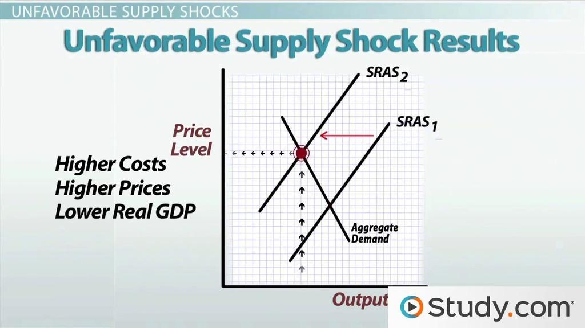

## Table of Contents

## What is a supply shock?

A supply shock is when something suddenly changes how much of a product or service is available. This can happen because of natural disasters, like a hurricane damaging oil refineries, or because of human actions, like new laws that make it harder to produce something. When the supply of a product drops quickly, it can cause prices to go up because there is less of the product to go around.

For example, if a big freeze ruins a lot of the orange crop in Florida, there will be fewer oranges available. This means that the price of orange juice might go up because stores have to compete for the smaller amount of oranges. Supply shocks can affect many parts of the economy, not just the product that had the shock. If orange juice prices go up, people might spend less money on other things, which can slow down the economy.

## What are the different types of supply shocks?

There are two main types of supply shocks: positive supply shocks and negative supply shocks. A positive supply shock happens when something suddenly makes it easier to produce more of a product or service. For example, if a new technology is invented that makes it cheaper to drill for oil, there could be a positive supply shock because more oil can be produced. This usually leads to lower prices and can help the economy grow because businesses can make things more cheaply.

A negative supply shock is the opposite. It happens when something suddenly makes it harder to produce a product or service. A good example is when a war disrupts the supply of important materials, like when a country that produces a lot of oil is in conflict and can't export as much. This can lead to higher prices because there is less of the product available. Negative supply shocks can slow down the economy because they make it more expensive for businesses to produce things, which can lead to higher prices for consumers and less spending.

## Can you give examples of positive and negative supply shocks?

A positive supply shock is when something good happens that makes it easier to produce more of something. For example, imagine a new machine is invented that can make cars much faster and cheaper. This means car factories can make more cars without spending more money. Because there are more cars available, the price of cars might go down. This is good for the economy because people can buy cars more easily, and car companies can sell more cars.

A negative supply shock is when something bad happens that makes it harder to produce things. For example, think about a big earthquake that damages a lot of factories in a country that makes a lot of electronics. The factories can't make as many phones or computers as before because they are damaged. This means there are fewer electronics available, so the price of these items might go up. This can be bad for the economy because people have to pay more for electronics, and they might not be able to buy as much as they used to.

## What are the immediate effects of a supply shock on an economy?

When a supply shock happens, it can change prices right away. If it's a negative supply shock, like a big storm that ruins crops, there will be less of that crop to sell. This means the price of the crop goes up because stores and people want to buy it, but there's not enough to go around. For example, if a hurricane damages a lot of orange trees, the price of orange juice might go up quickly because there are fewer oranges.

A positive supply shock can also affect prices, but in the opposite way. If something good happens, like a new way to make things cheaper, there will be more of that product available. This can make the price go down because there's more to sell than people want to buy. For instance, if a new technology makes it easier to drill for oil, the price of gas might go down because there's more oil to use.

These immediate changes in prices can affect how much people spend and how businesses operate. If prices go up because of a negative supply shock, people might not buy as much, and businesses might have to pay more for what they need to make their products. If prices go down because of a positive supply shock, people might buy more, and businesses might be able to make things cheaper. Either way, a supply shock can shake up the economy right away.

## How do supply shocks affect inflation and unemployment?

Supply shocks can make inflation go up or down. If it's a negative supply shock, like a big freeze that ruins crops, there will be less food to buy. This makes the price of food go up because stores and people want to buy it, but there's not enough. When prices go up a lot, we call it inflation. On the other hand, if it's a positive supply shock, like a new way to make cars cheaper, there will be more cars to buy. This can make the price of cars go down, which can help keep inflation low or even make it go down.

Supply shocks can also change how many people have jobs. When there's a negative supply shock, businesses might have to pay more for what they need to make their products. This can make them less able to hire new workers or keep the ones they have, so unemployment might go up. But if there's a positive supply shock, businesses can make things cheaper and might be able to hire more people because they're doing better. This can help lower unemployment. So, supply shocks can really shake things up in the economy, affecting both prices and jobs.

## What role do natural disasters play in causing supply shocks?

Natural disasters can cause big problems for the economy by creating supply shocks. When a hurricane, earthquake, or flood hits, it can damage factories, farms, and other places where things are made. This means there's less of the product available, like fewer cars if a car factory gets flooded, or less food if a storm ruins crops. When there's less of something, the price goes up because everyone still wants to buy it but there's not enough to go around. This is called a negative supply shock, and it can make life harder for people because they have to pay more for things they need.

Sometimes, the effects of a natural disaster can spread to other parts of the economy. For example, if a big earthquake in Japan damages factories that make parts for cars, car makers in other countries might not be able to finish their cars because they can't get the parts they need. This can slow down the whole car industry and even affect other businesses that rely on cars, like car dealerships and repair shops. So, natural disasters can cause a chain reaction that makes it harder for the economy to keep running smoothly.

## How do geopolitical events lead to supply shocks?

Geopolitical events, like wars or trade disagreements, can cause supply shocks by messing up how things are made and moved around the world. If two countries are fighting, they might stop trading with each other. This means that one country might not be able to get important things it needs, like oil or electronics. When this happens, there's less of these things available, and the price goes up. For example, if a country that makes a lot of oil goes to war and can't send oil to other countries, those countries will have to find oil somewhere else, which can be harder and more expensive.

These events can also affect many different parts of the economy. If a country can't get the things it needs because of a war or trade disagreement, businesses might have to slow down or stop making their products. This can lead to fewer jobs and make the economy weaker. For instance, if a country that makes a lot of computer chips stops sending them to another country because of a trade fight, the companies that use those chips might not be able to make as many computers or phones. This can make prices go up and make it harder for people to buy what they need.

## What impact do technological changes have on supply shocks?

Technological changes can cause positive supply shocks. When a new technology makes it easier or cheaper to make something, there can be more of that thing available. For example, if a new machine helps farmers grow more food with less work, there will be more food to sell. This can make the price of food go down because there's more of it. When prices go down, people can buy more, and this can help the economy grow because businesses can sell more of their products.

On the other hand, technological changes can also lead to negative supply shocks if they disrupt the way things are made. If a new technology makes an old way of doing things useless, it can cause problems. For instance, if a new way of making cars means that old car factories can't be used anymore, there might be fewer cars available until new factories are built. This can make the price of cars go up because there's less to buy. These changes can shake up the economy and make it harder for businesses and people to plan for the future.

## How can government policies cause or mitigate supply shocks?

Government policies can cause supply shocks by making it harder or easier for businesses to produce things. For example, if a government puts a new rule that makes it more expensive to make cars, like a new tax on car factories, there might be fewer cars made because it costs more to produce them. This can lead to a negative supply shock because there are fewer cars available, and the price might go up. On the other hand, if the government gives money to farmers to help them grow more food, there could be more food available. This can cause a positive supply shock because more food means prices might go down.

Governments can also help reduce the effects of supply shocks. If a natural disaster like a hurricane ruins a lot of crops, the government might give money to farmers to help them plant new crops quickly. This can help get more food back into stores faster and keep prices from going up too much. Also, if there's a war that stops oil from coming into the country, the government might use its own oil reserves to make sure there's enough for people to use. By doing these things, the government can help make sure that supply shocks don't hurt the economy as much.

## What are the long-term economic consequences of supply shocks?

Supply shocks can have big effects on the economy that last a long time. When there's a negative supply shock, like a big storm that ruins a lot of crops, prices go up because there's less food to buy. This can make people spend less money on other things because they have to spend more on food. Businesses might also have to pay more for what they need to make their products, which can make them slow down or even close. If this happens, people might lose their jobs, and it can take a long time for the economy to get back to normal. Even after the shock is over, the higher prices and fewer jobs can stick around, making life harder for everyone.

On the other hand, a positive supply shock, like a new way to make things cheaper, can help the economy grow in the long run. If businesses can make things more cheaply, they might be able to sell more and hire more people. This can lead to more jobs and lower prices, which can make people happier and more willing to spend money. Over time, this can help the economy get stronger and grow. But even positive supply shocks can cause problems if they make old ways of doing things useless, like if new technology makes old factories outdated. This can lead to job losses in some areas, even as the overall economy gets better.

## How do economists model and predict supply shocks?

Economists use different ways to model and predict supply shocks. They often look at past data to see how things like natural disasters, wars, or new technologies have changed the supply of things before. By studying these past events, economists can make guesses about what might happen in the future. They use special math models that take into account things like how much of a product is available, how much people want to buy, and what might cause the supply to change suddenly. These models help economists understand how a supply shock might affect prices and the economy as a whole.

Predicting supply shocks is tricky because they can come from many different places. Economists try to keep an eye on things that might cause a supply shock, like weather patterns that could lead to a big storm, or political tensions that might turn into a war. They also watch for new technologies that could change how things are made. By staying aware of these things, economists can try to warn people and businesses about possible supply shocks before they happen. This can help everyone be ready and maybe even find ways to lessen the impact of the shock when it comes.

## What strategies can businesses implement to manage the risks of supply shocks?

Businesses can manage the risks of supply shocks by having a plan to deal with sudden changes. One way to do this is by having more than one place to get the things they need. If a business gets all its materials from one place and that place gets hit by a storm or a war, the business could be in big trouble. But if the business can get materials from different places, it can keep going even if one place has a problem. Another way is to keep some extra materials in stock, so if there's a sudden shortage, the business can still make its products.

Another strategy is to be ready to change how they do things. If a new technology comes along that makes it cheaper to make something, a business that can use that technology quickly will do better than one that can't. Also, businesses can use special insurance that helps if there's a supply shock. This insurance can pay for the extra costs if prices go up because of a shortage. By thinking ahead and having these plans in place, businesses can handle supply shocks better and keep running smoothly even when things get tough.

## What are the market dynamics in times of supply shocks?

Market dynamics are the forces that impact not only price levels but also the efficiency of market operations, particularly in times of disruptions like supply shocks. A supply shock can cause immediate disturbances in the market by shifting the supply curve either to the right or to the left, depending on whether the shock is positive or negative. Such shifts result in changes to the market equilibrium, which is represented by the intersection of supply and demand curves. 

For instance, a negative supply shock, such as a natural disaster affecting production, typically shifts the supply curve to the left. This shift leads to higher prices and lower quantity in equilibrium, as prices adjust to accommodate the reduced supply. Alternatively, a positive supply shock, such as technological advancements that increase production efficiency, will shift the supply curve to the right, resulting in lower prices and higher quantity.

Predicting these shifts and understanding their implications is crucial for investors and market participants. The ability to anticipate such changes enables them to strategize effectively, safeguarding their investments and potentially capitalizing on the resulting volatility. For example, consider the oil market during a geopolitical crisis that restricts supply pathways. The sudden spike in oil prices necessitates that investors assess their positions and potentially adjust their portfolios to mitigate risks associated with the price volatility.

Moreover, the volatility induced by supply shocks emphasizes the importance of [liquidity](/wiki/liquidity-risk-premium) in the market, as it allows for smoother transactions notwithstanding the disturbances. Increased liquidity can mitigate some of the immediate impacts by allowing the market to absorb shocks more efficiently.

Mathematical models, such as those based on differential equations, can be employed to model these dynamics. Consider a simple supply-demand balance equation:

$$
P = f(S, D)
$$

where $P$ is the price, $S$ is supply, and $D$ is demand. A sudden change in $S$ due to a supply shock can be factored into dynamic equations that help predict changes in $P$.

The rapid shifts in market dynamics during supply shocks demand that market participants not only react promptly but also comprehend the broader implications of such shocks on economic fundamentals. Recognizing patterns and deploying algorithmic tools to analyze market trends can further enhance participants' ability to weather the impacts of supply disruptions, ensuring continued market stability and profitability.

## References & Further Reading

[1]: U.S. Commodity Futures Trading Commission (CFTC) and U.S. Securities and Exchange Commission (SEC) report on the "Flash Crash": ["Findings Regarding the Market Events of May 6, 2010"](https://www.cftc.gov/sites/default/files/idc/groups/public/@economicanalysis/documents/file/oce_flashcrash0314.pdf).

[2]: ["Modern Portfolio Theory and Investment Analysis"](https://books.google.com/books/about/Modern_Portfolio_Theory_and_Investment_A.html?id=181CEAAAQBAJ) by Edwin J. Elton.

[3]: ["High-Frequency Trading: A Practical Guide to Algorithmic Strategies and Trading Systems"](https://www.amazon.com/High-Frequency-Trading-Practical-Algorithmic-Strategies/dp/1118343506) by Irene Aldridge.

[4]: ["Adaptive Markets: Financial Evolution at the Speed of Thought"](https://www.jstor.org/stable/j.ctvc7778k) by Andrew W. Lo.

[5]: Khan Academy article on supply and demand shocks: ["Supply and demand shocks in economics"](https://www.khanacademy.org/economics-finance-domain/microeconomics/supply-demand-equilibrium).