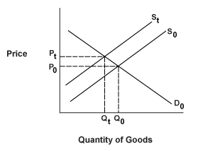

In recent years, the interaction between economic disruption, supply shocks, market dynamics, and algorithmic trading has become a focal point for economists and investors. Supply shocks, which are unexpected events affecting the supply of products or commodities, have profound impacts on economic markets. They can cause significant fluctuations in prices and create ripple effects throughout the global economy. Such shocks may stem from natural disasters, geopolitical events, or pandemics, each posing challenges to economic stability.

Algorithmic trading, which uses automated systems for executing trades, plays a crucial role in these scenarios. While it has the potential to stabilize markets by providing liquidity, it can also contribute to volatility. Algorithms can react to market changes faster than human traders, sometimes exacerbating price swings and destabilizing markets under certain conditions. This dual nature makes it essential to understand algorithmic trading's comprehensive role in managing supply shocks.



Exploring the cascading effects of supply shocks and the influence of algorithmic trading is vital for stakeholders. By gaining a deeper understanding of these concepts, investors, policy-makers, and market participants can better navigate the complex landscape of modern financial markets. Addressing these challenges is crucial for maintaining economic resilience in an increasingly interconnected world.

## Table of Contents

## Understanding Supply Shocks

A supply shock is defined as an unexpected event that causes a significant change in the supply of a product or commodity, resulting in sudden variations in price. These shocks can be classified as either negative or positive, each having distinct implications for market output and price levels.

Negative supply shocks occur when the supply of a commodity is reduced unexpectedly, leading to an escalation in prices. This scenario can arise from several factors, including natural disasters, which may damage infrastructure and disrupt supply chains, or geopolitical tensions, which can hinder the production or distribution of vital commodities like oil. For instance, the disruption of oil supplies due to geopolitical tensions in the Middle East can lead to sharp increases in oil prices globally, impacting economic activity and inflation rates.

Conversely, a positive supply shock happens when there is an unexpected increase in the supply of a commodity, often resulting in a decline in prices. Situations such as technological advancements that boost production efficiency or favorable weather conditions that lead to better-than-expected agricultural yields exemplify positive supply shocks. These scenarios can lower production costs and consumer prices, potentially stimulating economic growth.

Supply shocks, regardless of being negative or positive, present significant challenges to economic stability. Negative shocks can lead to inflationary pressures and reduced economic output, while positive shocks might cause deflationary trends. As a result, these shocks necessitate rapid adjustments in market strategies. Businesses may need to adapt their pricing, inventory, and production strategies to reduce adverse impacts. Policymakers often respond with monetary and fiscal measures to stabilize the economy.

Historical instances, such as the oil crises of the 1970s, serve as reminders of how profound the effects of supply shocks can be. During this period, the sudden decrease in oil supply led to soaring energy prices, high inflation rates, and economic stagnation, illustrating the cascading effects a supply shock can exert on global economies. These events underline the critical importance of understanding and managing supply shocks to maintain economic stability and resilience.

## Economic Disruption Caused by Supply Shocks

Supply shocks significantly impact economies by affecting inflation rates and the trajectories of economic growth. These unexpected changes in supply can lead to immediate and often substantial price [volatility](/wiki/volatility-trading-strategies), influencing both businesses and consumers. The impacts are multifaceted, as price fluctuations can alter purchasing power and disrupt industrial output.

When a supply shock occurs, the immediate concern is typically inflation. Inflation can be defined as the rate at which the general level of prices for goods and services rises, eroding purchasing power. A negative supply shock, such as a sudden decrease in oil availability, typically results in increased production costs for businesses. These increased costs are often passed on to consumers in the form of higher prices, contributing to inflationary pressures.

The consequences for economic growth can be profound. As prices rise due to constrained supply, consumers may reduce spending, which in turn decreases aggregate demand. Businesses may slow down production due to higher costs and lower consumer demand, leading to a potential slowdown in economic growth. For instance, the oil crises in the 1970s serve as a historical example. During these crises, substantial disruptions in oil supply led to staggering increases in oil prices globally, adversely affecting economies by causing both inflation and recession, a phenomenon known as stagflation.

Businesses must navigate these challenges by adjusting their pricing strategies, supply chain management, and operational efficiencies. Some may choose to absorb costs to retain market share, while others may increase prices. Consumers, facing higher prices, adjust their spending habits, which can have downstream effects on the overall economy.

Overall, the effects of supply shocks are not limited to immediate market disruptions; they also have lasting implications for economic policies and strategies. Policymakers need to respond with measures such as monetary policy adjustments to stabilize inflation and support economic growth. These responses are crucial to mitigating the adverse effects of supply shocks and ensuring economic resilience.

## Market Dynamics in Times of Supply Shocks

Market dynamics are the forces that impact not only price levels but also the efficiency of market operations, particularly in times of disruptions like supply shocks. A supply shock can cause immediate disturbances in the market by shifting the supply curve either to the right or to the left, depending on whether the shock is positive or negative. Such shifts result in changes to the market equilibrium, which is represented by the intersection of supply and demand curves. 

For instance, a negative supply shock, such as a natural disaster affecting production, typically shifts the supply curve to the left. This shift leads to higher prices and lower quantity in equilibrium, as prices adjust to accommodate the reduced supply. Alternatively, a positive supply shock, such as technological advancements that increase production efficiency, will shift the supply curve to the right, resulting in lower prices and higher quantity.

Predicting these shifts and understanding their implications is crucial for investors and market participants. The ability to anticipate such changes enables them to strategize effectively, safeguarding their investments and potentially capitalizing on the resulting volatility. For example, consider the oil market during a geopolitical crisis that restricts supply pathways. The sudden spike in oil prices necessitates that investors assess their positions and potentially adjust their portfolios to mitigate risks associated with the price volatility.

Moreover, the volatility induced by supply shocks emphasizes the importance of [liquidity](/wiki/liquidity-risk-premium) in the market, as it allows for smoother transactions notwithstanding the disturbances. Increased liquidity can mitigate some of the immediate impacts by allowing the market to absorb shocks more efficiently.

Mathematical models, such as those based on differential equations, can be employed to model these dynamics. Consider a simple supply-demand balance equation:

$$
P = f(S, D)
$$

where $P$ is the price, $S$ is supply, and $D$ is demand. A sudden change in $S$ due to a supply shock can be factored into dynamic equations that help predict changes in $P$.

The rapid shifts in market dynamics during supply shocks demand that market participants not only react promptly but also comprehend the broader implications of such shocks on economic fundamentals. Recognizing patterns and deploying algorithmic tools to analyze market trends can further enhance participants' ability to weather the impacts of supply disruptions, ensuring continued market stability and profitability.

## The Role of Algorithmic Trading

Algorithmic trading leverages computer systems to execute trading strategies at speeds and frequencies that would be difficult for human traders to achieve. At its core, [algorithmic trading](/wiki/algorithmic-trading) involves the use of algorithms to analyze market conditions, identify trading opportunities, and execute trades automatically. These algorithms are capable of processing massive datasets, employing statistical models to predict market movements and making split-second decisions based on predefined criteria. Consequently, algorithmic trading can lead to both stabilization and destabilization of financial markets, particularly during periods of supply shock-driven volatility.

The stabilizing effect of algorithmic trading is primarily seen in its ability to provide liquidity. By executing orders with [high frequency](/wiki/high-frequency-trading), algorithmic trading can narrow bid-ask spreads, thus enhancing market efficiency. The increased liquidity reduces transaction costs, facilitates smoother price discovery, and mitigates the impact of large orders on market prices. For instance, market-making algorithms continuously buy and sell securities to profit from bid-ask spreads, which can stabilize prices during normal trading conditions.

However, the rapid execution capabilities of algorithmic trading also present potential risks. During market disruptions, the same algorithms that provide liquidity under stable conditions may amplify price swings. This is particularly evident in scenarios where algorithms simultaneously trigger stop-loss orders, leading to cascading sell-offs, or where [momentum](/wiki/momentum)-based strategies lead to herding behavior. Such actions can exacerbate market volatility and result in phenomena like flash crashes—brief but significant market price drops within minutes, as evidenced by the May 6, 2010, Flash Crash.

Recent advancements in [artificial intelligence](/wiki/ai-artificial-intelligence) (AI) further complicate the role of algorithmic trading in maintaining market efficiency. AI-enhanced algorithms employ [machine learning](/wiki/machine-learning) models capable of recognizing complex patterns and adapting to new data without explicit programming. While these models offer the ability to improve prediction accuracy and to adapt to changing market conditions, they also introduce the risk of unpredictable or unintended trading strategies, as AI may identify correlations that lack economic rationale. The complexity and opacity of some AI-driven algorithms can pose significant challenges for monitoring and regulation, raising concerns about market integrity and fairness.

Python code often used in algorithmic trading exemplifies how algorithms can be implemented:

```python
import pandas as pd
import numpy as np

def moving_average_strategy(prices, short_window=40, long_window=100):
    signals = pd.DataFrame(index=prices.index)
    signals['price'] = prices
    signals['short_mavg'] = prices.rolling(window=short_window, min_periods=1, center=False).mean()
    signals['long_mavg'] = prices.rolling(window=long_window, min_periods=1, center=False).mean()
    # Generate buy/sell signals
    signals['signal'] = 0.0  
    signals['signal'][short_window:] = np.where(signals['short_mavg'][short_window:] > signals['long_mavg'][short_window:], 1.0, 0.0)   
    signals['positions'] = signals['signal'].diff()
    return signals

# Example usage with price data
# prices = pd.Series([...])
# signals = moving_average_strategy(prices)
# print(signals)
```

This basic moving average crossover strategy generates buying signals when the short-term moving average exceeds the long-term moving average and selling signals when the reverse occurs. While rudimentary, this type of algorithm highlights the foundational principles of algorithmic trading through which more sophisticated AI-driven models can be developed. Understanding these dual roles of algorithmic trading is critical for investors, regulators, and policymakers aiming to balance innovation with market stability.

## Challenges and Risks of Algorithmic Trading

Algorithmic trading, while revolutionizing financial markets by enhancing efficiency and liquidity, presents significant challenges and risks that stakeholders must navigate. A notable risk associated with algorithmic trading is the occurrence of flash crashes. These are rapid, deep, and volatile market price declines followed by a swift recovery, primarily triggered by algorithmic trading systems reacting in a manner that exacerbates market movements. For example, the Flash Crash of May 6, 2010, saw the Dow Jones Industrial Average plunge nearly 1,000 points within minutes due to automated trading systems indiscriminately executing large sell orders[1].

Another concern is market manipulation, where trading algorithms might be used to create artificial price movements or misleading market signals. Such tactics can distort genuine price discovery processes, undermining market integrity.

The advent of AI-driven strategies introduces the potential for 'algorithmic collusion.' In this case, independently operating algorithms may inadvertently align in strategy and action, leading to pricing impacts akin to collusion. While traditional price-fixing requires deliberate human intervention, algorithmic collusion can emerge without explicit coordination, complicating regulatory oversight.

Regulators and market participants are tasked with continuously adapting to these challenges. The dynamic nature of algorithmic trading requires robust monitoring and updating of regulatory frameworks to ensure fair and stable trading environments. Market surveillance technologies that incorporate AI and machine learning are increasingly necessary to detect and mitigate the risks of algorithmic trading misbehavior.

Overall, while algorithmic trading systems offer significant advantages, the associated risks demand vigilant scrutiny and proactive management. Ensuring that these automated trading systems contribute positively to market stability requires a sophisticated understanding of both their functionality and their potential pitfalls.

[1] U.S. Commodity Futures Trading Commission (CFTC) and U.S. Securities and Exchange Commission (SEC) report on the "Flash Crash": https://www.sec.gov/news/studies/2010/marketevents-report.pdf

## Future Outlook and Conclusions

As global supply chains become increasingly integrated, the likelihood of supply shocks disrupting markets grows. These disruptions can arise from various sources, be it geopolitical events, pandemics, or climate-related incidents. The interconnected nature of modern supply chains means that a shock in one region can quickly ripple through networks, affecting production and distribution in ways that are both unpredictable and severe. Such vulnerabilities necessitate robust strategies for risk management and contingency planning to safeguard economic stability.

Algorithmic trading, a crucial component in modern financial markets, will continue to evolve in response to these challenges. While it offers the potential to enhance market efficiency by rapidly adjusting to real-time data, it also poses risks by accelerating market volatility during periods of economic stress. The increasing use of artificial intelligence and machine learning adds complexity to this landscape, as these technologies can uncover intricate patterns and trends that elude traditional trading strategies. However, this sophistication brings about potential pitfalls in systems reliability and ethical considerations in decision-making processes.

To ensure market resilience, it is essential to grasp the intricate balance between economic disruption, supply shocks, and evolving trading technologies. Stakeholders must develop adaptive frameworks that incorporate predictive analytics to foresee supply disruptions and their potential impacts on market dynamics. These frameworks should leverage both quantitative and qualitative data, enhancing their predictive power by integrating insights from diverse domains such as geopolitics, technology, and environmental science.

The role of regulators is pivotal in this progression. They must establish guidelines that not only promote innovation in algorithmic trading but also safeguard against systemic risks. Crafting policies that encourage transparency and fairness in trading practices will help maintain market integrity. Furthermore, fostering collaboration between academic researchers, industry practitioners, and policymakers is key to advancing our understanding of these complex interactions.

Continued research and innovation are vital for developing strategies that mitigate the impact of supply shocks. Investing in technologies that enhance data-sharing capabilities and improve supply chain visibility is crucial. Moreover, fostering a culture of resilience within businesses, encouraging flexibility, and readiness to adapt to unforeseen events is equally important. By embracing these measures, we can build more robust systems capable of withstanding economic disruptions and ensuring the stability of global markets.

## References & Further Reading

[1]: U.S. Commodity Futures Trading Commission (CFTC) and U.S. Securities and Exchange Commission (SEC) report on the "Flash Crash": ["Findings Regarding the Market Events of May 6, 2010"](https://www.cftc.gov/sites/default/files/idc/groups/public/@economicanalysis/documents/file/oce_flashcrash0314.pdf).

[2]: ["Modern Portfolio Theory and Investment Analysis"](https://books.google.com/books/about/Modern_Portfolio_Theory_and_Investment_A.html?id=181CEAAAQBAJ) by Edwin J. Elton.

[3]: ["High-Frequency Trading: A Practical Guide to Algorithmic Strategies and Trading Systems"](https://www.amazon.com/High-Frequency-Trading-Practical-Algorithmic-Strategies/dp/1118343506) by Irene Aldridge.

[4]: ["Adaptive Markets: Financial Evolution at the Speed of Thought"](https://www.jstor.org/stable/j.ctvc7778k) by Andrew W. Lo.

[5]: Khan Academy article on supply and demand shocks: ["Supply and demand shocks in economics"](https://www.khanacademy.org/economics-finance-domain/microeconomics/supply-demand-equilibrium).