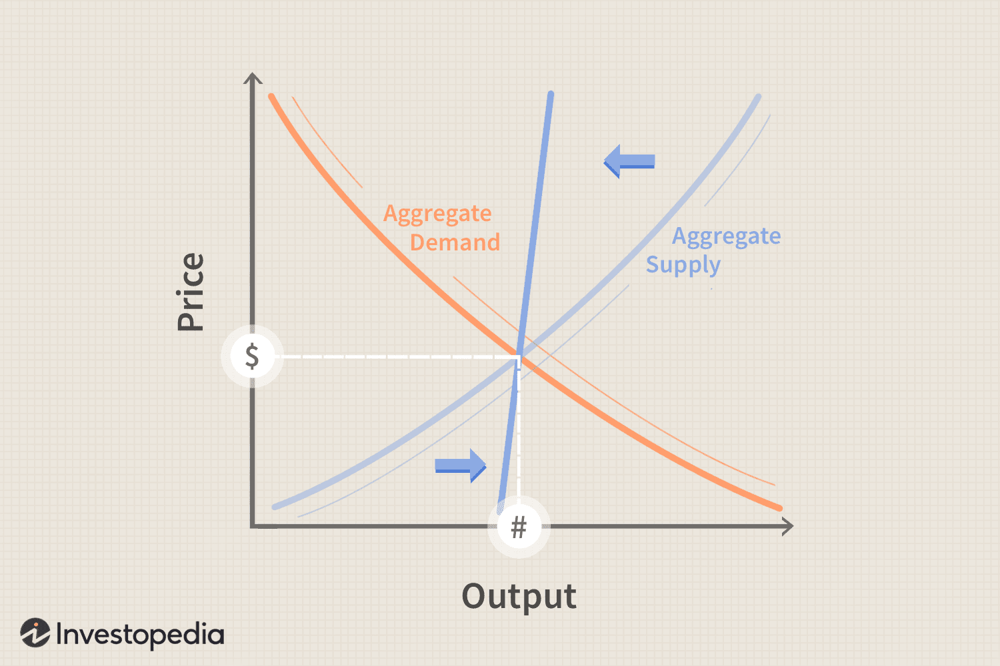

Economics is a field devoted to understanding the mechanisms that drive economic growth, characterized by various theories and approaches. Among these, supply-side and demand-side economics stand out as prominent frameworks that propose distinct strategies for achieving economic prosperity. Supply-side economics argues that reducing barriers for producers—such as lowering taxes and deregulation—encourages investment and production, leading to increased goods and services and, subsequently, economic growth. Conversely, demand-side economics emphasizes the importance of boosting consumer demand through government interventions, including public spending and monetary policies, to stimulate economic activity.

In recent years, technological advancements have significantly contributed to this field, particularly with the rise of algorithmic trading. This modern approach utilizes computer algorithms to make trading decisions based on predefined criteria, enhancing efficiency and speed in financial markets. Algorithmic trading represents a new dimension in applying economic theories, leveraging economic data to optimize trading strategies in real time.



This article aims to explore the fundamental differences and overlaps between supply-side and demand-side economics and examine their relationship with algorithmic trading. By offering a comprehensive understanding of these economic theories and their implications, readers will gain insights into their practical applications in today's financial landscape. As both supply-side and demand-side frameworks present unique advantages and challenges, this integration with technological advancements holds potential to reshape traditional economic strategies and policies.

## Table of Contents

## Understanding Supply-Side Economics

Supply-side economics is a macroeconomic theory suggesting that economic growth can be most effectively achieved by lowering barriers for producers through measures such as reducing taxes and deregulating industries. The central argument of this economic approach is that by enhancing the incentives for businesses to produce goods and services, the overall economy benefits as production increases, leading to more goods and services available in the market and, consequently, economic growth.

### Key Principles

The foundational principle of supply-side economics is the relationship between tax rates and economic output. The theory posits that lower tax rates boost economic activity by increasing the after-tax return on investment, labor, and entrepreneurship. This, in turn, incentivizes businesses and individuals to engage more in productive activities, enhancing overall economic output.

A commonly associated concept is the **Laffer Curve**, which illustrates the theoretical relationship between tax rates and tax revenue. The curve postulates that there is an optimal tax rate that maximizes government revenue, and beyond this point, higher tax rates actually lead to a decrease in revenue due to disincentivizing income-generating activities. Although the exact shape of the Laffer Curve is subject to empirical validation, it remains a key component of supply-side theory.

### Historical Applications

One of the most notable applications of supply-side economics was during the tenure of U.S. President Ronald Reagan in the 1980s, a period often referred to as 'Reaganomics.' This policy approach was characterized by significant tax cuts, deregulation, and a reduction in government spending on social programs. During this time, the highest marginal tax rate was lowered from 70% to 28%, with the expectation that the resulting economic growth would offset the loss in government revenue.

More recently, similar principles were applied during Donald Trump's administration. The Tax Cuts and Jobs Act of 2017 featured major cuts in corporate tax rates, with the stated objective of increasing domestic investment and job creation. Proponents argue that these policies contributed to a more robust economic growth period, although debates continue over the long-term impact on income distribution and fiscal sustainability.

### Criticism and Debate

Critics of supply-side economics point to potential drawbacks such as increased income inequality. By primarily benefiting wealthier individuals and corporations who are more likely to experience tax cuts, the wealth distribution gap can widen. The anticipated 'trickle-down' effect, where benefits to producers are expected to lead to broader economic gains, is often criticized for not materializing as expected. Studies have shown that the benefits of tax cuts are not always evenly distributed across different socio-economic groups.

Moreover, opponents highlight budget deficits as a significant issue. Lower tax revenues can lead to increased fiscal deficits unless matched by corresponding cuts in government spending. This can result in a higher national debt load, potentially affecting long-term economic health. The debate over the efficacy of supply-side policies remains active in economic discussions, with varying empirical results on their impact under different contexts. 

### Conclusion

In conclusion, supply-side economics provides a framework for understanding the mechanisms by which reducing producer constraints can theoretically drive economic growth. While it has been influential in shaping policy decisions, its advantages and potential drawbacks continue to be a subject of significant discourse within economic circles. Understanding this theory is essential for evaluating its role in past and future economic strategies.

## Exploring Demand-Side Economics

Demand-side economics, often linked with the principles of Keynesian economics, emphasizes the importance of boosting consumer demand as a pathway to economic growth. This economic theory suggests that active government intervention—through increased public spending and strategic monetary policies—can enhance consumers' purchasing power. By increasing consumers' disposable income, demand for goods and services is stimulated, leading to economic expansion.

Central to this approach is the belief that consumer demand drives production and economic output. According to Keynesian thought, during periods of economic downturns or recessions, consumer spending tends to fall, leading to decreased demand for goods and services. In response, governments can implement fiscal policies such as tax cuts or increased public spending on infrastructure projects, thereby injecting money into the economy. For instance, when the government funds public construction or invests in social programs, it effectively creates jobs and increases income, which can spur further consumer spending—creating a virtuous cycle of demand and growth.

Public infrastructural investments not only provide immediate employment but also build long-term economic potential by improving productivity and efficiency. Such initiatives can lead to sustained economic growth and help maintain stable economic cycles. Additionally, welfare programs play a crucial role in this approach, ensuring that even the economically disadvantaged have sufficient means to participate in the economy, thereby maintaining demand.

Critics of demand-side economics raise concerns about the potential downsides of this approach. A significant issue is the risk of government overspending, which can lead to substantial budget deficits and increased national debt. Over time, these debts may require higher taxes or reduced government spending in other areas, which could negate the initial positive effects of increased public spending. Furthermore, critics argue that excessive reliance on government intervention can distort market signals and lead to inefficient resource allocation.

In sum, while demand-side economics offers a framework for stimulating economic growth through government interventions aimed at increasing consumer demand, it must be balanced with fiscal prudence to avoid negative long-term financial repercussions.

## Comparing Supply-Side and Demand-Side Economics

Supply-side and demand-side economics offer distinct yet complementary views on achieving economic growth. At their core, these theories diverge in terms of the mechanisms they emphasize for stimulating economic activity.

Supply-side economics, also known as trickle-down economics, primarily focuses on enhancing the productive capacity of an economy. Proponents argue that reducing taxes and regulatory burdens on businesses will incentivize investment and production. The central idea is that enabling producers to operate more freely will lead to an increase in supply, job creation, and benefits that eventually trickle down to consumers. Policies inspired by supply-side economics are often characterized by tax cuts, particularly for corporations and high-income earners, deregulation, and policies aimed at encouraging innovation and investment.

In contrast, demand-side economics centers on boosting consumer demand as the primary driver of economic growth. Rooted in Keynesian economics, this approach suggests that government intervention is essential to stimulate demand, especially during periods of economic downturns. Demand-side advocates argue that increasing government expenditures, such as infrastructure projects and social programs, can elevate consumer spending. By putting more money in the hands of consumers, the demand for goods and services increases, which subsequently encourages businesses to produce more, leading to job creation and economic expansion. Fiscal and monetary policies, such as adjusting interest rates and government spending levels, are typical tools of demand-side interventions.

Both approaches have their strengths and limitations. Supply-side economics is praised for its potential to foster a business-friendly environment conducive to growth and innovation. However, critics often point out the risk of increasing income inequality and the possibility that the benefits do not sufficiently reach lower-income individuals, questioning the efficacy of the trickle-down effect.

Demand-side economics, by focusing on consumer welfare and full employment, can help stabilize economic cycles and mitigate the impacts of recessions. Nonetheless, there are concerns about the potential for increased government debt and the inefficiency of some public spending, which may not always lead to long-term sustainable growth.

Ultimately, the efficacy of these economic strategies can vary based on the economic context. During periods of recession, demand-side measures might be more effective in addressing unemployment and boosting demand, while supply-side strategies could be more advantageous during times of stagnation when the economic infrastructure needs strengthening to support long-term growth. Balancing these approaches, considering the specific economic conditions, can lead to more comprehensive and effective fiscal policies.

## The Role of Algorithmic Trading

Algorithmic trading, often referred to as algo trading, involves the use of computer algorithms to execute and manage trading activities based on predefined rules and criteria. These algorithms analyze vast amounts of financial data to execute trades at speeds and efficiencies that far exceed human capabilities. By leveraging these capabilities, [algorithmic trading](/wiki/algorithmic-trading) has brought significant transformation to financial markets.

This method of trading has introduced considerable efficiency and speed, allowing for transactions to occur within milliseconds. High-frequency trading, a subset of algorithmic trading, capitalizes on these efficiencies by executing a large number of orders at extremely high speeds to capture small price variances. This speed and precision have made high-frequency trading a dominant force in the market. According to research, algorithmic trading is estimated to account for approximately 60-75% of the overall trading [volume](/wiki/volume-trading-strategy) in the United States equity markets.

However, the rapid execution and decision-making power of algorithms also raise concerns about market [volatility](/wiki/volatility-trading-strategies) and fairness. In moments of uncertainty or market stress, these systems may exacerbate market movements, as was evident during the Flash Crash of May 6, 2010. On that day, the U.S. stock market experienced a sudden and drastic drop in value before equally fast recovery, with algorithmic trading being identified as one of the catalyzing factors.

Algorithmic trading can also be viewed as an application of economic theories in real-time, utilizing historical data and predictive models to inform its strategies. For example, an algorithm may incorporate principles of supply-side economics by adjusting its parameters to anticipate market responses to tax changes or regulatory shifts. Alternatively, an algo might apply demand-side theories by forecasting how consumer behavior impacts stock valuations.

The relationship between economic theories and algorithmic trading is essential for both policymakers and traders. By understanding how algorithms interpret and act on economic data, stakeholders can tailor their strategies to reflect contemporary market conditions. This requires not just a grasp of the algorithms themselves but also an understanding of the broader economic context in which they operate.

In conclusion, algorithmic trading revolutionizes the application of economic theories by providing a platform for real-time, data-driven decision-making. While it presents opportunities for enhanced market efficiencies and new economic insights, it also calls for careful consideration of its potential risks to market stability and equity. As such, navigating the complexities of algorithmic trading requires a balanced understanding of both technology and economics.

## Intersections and Implications

Both supply-side and demand-side factors play a crucial role in influencing algorithmic trading models, primarily through the incorporation of macroeconomic data. Supply-side economics might introduce variables like corporate tax rates, regulatory environments, and incentives for production, which can be integrated into algorithmic trading strategies. For example, a reduction in corporate taxes could be used in a model to predict increased corporate earnings, influencing stock price forecasts.

Conversely, demand-side economics can introduce factors such as consumer spending trends, government fiscal policies, and unemployment rates into algorithmic trading models. These demand-driven indicators often affect market [liquidity](/wiki/liquidity-risk-premium) and asset demand, consequentially shaping algorithmic trading decisions. The relationship between consumer demand data and price [momentum](/wiki/momentum) indicators can guide the development of trading strategies that capitalize on economic cycles.

Effective trading strategies require a nuanced understanding of how these economic theories impact financial markets under different scenarios. For instance, during expansionary fiscal policies, demand-side data might show increased consumer spending, which could correlate with bullish market conditions. In contrast, supply-side policies such as deregulation may indicate increased investment opportunities, signaling upward price movements in associated sectors.

Algorithmic trading serves as a potent tool for testing the applicability of economic theories by analyzing historical data and simulating various market scenarios. This process involves [backtesting](/wiki/backtesting) strategies against supply-side and demand-side factors to refine predictions of asset price movements and validate theoretical economic assumptions. Real-world applications are assessed, offering insights into economic theories’ efficacy and relevance.

The integration of economic theory with technological advancements in trading lays the groundwork for more robust financial strategies and policies. Python, a preferred language in algorithmic trading, provides versatile libraries such as Pandas and NumPy to handle economic datasets efficiently. For example, the following Python code snippet demonstrates the use of statistical models to analyze how macroeconomic indicators influence stock prices:

```python
import pandas as pd
import statsmodels.api as sm

# Sample data: GDP growth, consumer spending, stock prices
data = pd.DataFrame({
    'GDP_Growth': [2.5, 3.0, 2.8, 3.3],
    'Consumer_Spending': [500, 520, 510, 530],
    'Stock_Prices': [100, 105, 102, 107]
})

# Adding a constant to the model (intercept)
X = sm.add_constant(data[['GDP_Growth', 'Consumer_Spending']])
y = data['Stock_Prices']

# Fitting the regression model
model = sm.OLS(y, X).fit()

# Displaying the summary of the model
print(model.summary())
```

This code illustrates how macroeconomic indicators can be statistically analyzed to forecast stock prices, embodying an application where supply-side and demand-side factors converge in algorithmic trading strategies.

As economic theory continues to integrate with trading technology, the potential for more sophisticated financial strategies and policies increases, offering stakeholders deeper insights into market behavior and enhancing the strategic landscape of economic decision-making.

## Conclusion

Both supply-side and demand-side economics provide viable frameworks for promoting economic growth, each with its own strengths and limitations. Supply-side economics focuses on reducing barriers for producers, theorizing that tax cuts and deregulation lead to increased production and, consequently, economic expansion. Conversely, demand-side economics emphasizes enhancing consumer demand through government intervention, promoting spending as a catalyst for growth. Each approach presents distinct advantages: supply-side policies potentially encourage investment and innovation, while demand-side strategies may stabilize economic cycles and achieve full employment.

Algorithmic trading offers a novel intersection of economic theory and technology, transforming the landscape of financial markets. By leveraging complex algorithms and vast amounts of data, algorithmic trading optimizes trading efficiencies, potentially maximizing profits and minimizing risks. This intersection showcases the practical application of economic theories, exemplifying how technology can model and anticipate market trends.

A comprehensive understanding of these dynamics is crucial for stakeholders to evaluate the implications of economic policies on market behaviors. As markets become increasingly complex and technology-driven, policymakers, traders, and economists must consider how these theories impact real-time decision-making. Recognizing the nuanced interplay between economic theories and algorithmic strategies can lead to more informed and effective economic policies.

Future research and advancements in both economic theory and algorithmic trading could lead to more integrated and robust economic strategies. The ongoing evolution of technology offers the potential for enhanced predictive models and data analytics, providing further insights into economic growth mechanisms. This synergy of theory and practice suggests promising avenues for innovation, potentially redefining how economic policies are formulated and implemented in modern financial contexts.

## References & Further Reading

[1]: ["Supply-Side Economics: An Analytical Review" by Michael J. Boskin](https://www.jstor.org/stable/pdf/2663227.pdf) - Journal of Economic Literature, 1988.

[2]: ["Keynesian Economics and the Real World: The Perspective of High Frequency Macro and Financial Data"](https://academic.oup.com/book/51974) - Exploratory.io Data Talks.

[3]: ["Advances in Financial Machine Learning"](https://www.amazon.com/Advances-Financial-Machine-Learning-Marcos/dp/1119482089) by Marcos Lopez de Prado.

[4]: ["Algorithmic Trading: Winning Strategies and Their Rationale"](https://www.amazon.com/Algorithmic-Trading-Winning-Strategies-Rationale-ebook/dp/B00CY5HC0U) by Ernest P. Chan.

[5]: ["Quantitative Trading: How to Build Your Own Algorithmic Trading Business"](https://www.amazon.com/Quantitative-Trading-Build-Algorithmic-Business/dp/1119800064) by Ernest P. Chan.

[6]: ["Keynesian Macroeconomics without the LM Curve" by David Romer](https://eml.berkeley.edu/~dromer/papers/JEP_Spring00.pdf) - Journal of Economic Perspectives, 2000.

[7]: ["Trading and Exchanges: Market Microstructure for Practitioners"](https://academic.oup.com/book/52292) by Larry Harris.
