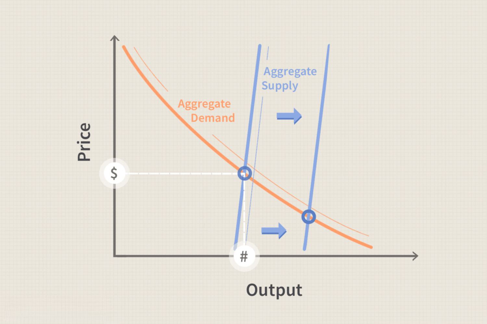

## Table of Contents

## What is supply-side economics?

Supply-side economics is an economic theory that focuses on increasing the supply of goods and services to grow the economy. It suggests that lowering taxes and decreasing regulations on businesses can encourage more production. When businesses produce more, they hire more workers, which leads to more jobs and higher incomes. This, in turn, is supposed to boost overall economic growth.

The main idea behind supply-side economics is that when businesses have more money and fewer restrictions, they will invest in new projects and expand their operations. This investment can lead to innovations and increased efficiency. Critics of supply-side economics argue that it can lead to greater income inequality and may not always result in the expected economic growth. However, supporters believe that the benefits of increased economic activity outweigh these concerns.

## Who are the key figures associated with supply-side economics?

The main person linked to supply-side economics is Arthur Laffer. He became famous for the Laffer Curve, which shows that if taxes are too high, people might work less, and if they are too low, the government won't collect enough money. Laffer worked with President Ronald Reagan and helped shape his economic policies in the 1980s.

Another important figure is Robert Mundell. He won the Nobel Prize in Economics and helped develop the theory behind supply-side economics. Mundell believed that lowering taxes could boost economic growth. He also advised governments and was influential in the field of international economics.

Jude Wanniski was also key in promoting supply-side economics. He was a journalist who wrote about the Laffer Curve and helped spread the ideas to the public. Wanniski worked to make these economic theories popular and understandable to more people.

## What are the main principles of supply-side economics?

Supply-side economics is all about making it easier for businesses to produce more goods and services. The main idea is that if the government lowers taxes on businesses and people, and also reduces regulations, businesses will have more money to invest. This investment can lead to new projects, more jobs, and better technology. When businesses produce more, the economy grows because there are more things for people to buy.

Critics of supply-side economics say it can make rich people richer and might not help the economy as much as expected. They worry that when taxes are lowered, the government might not have enough money for important services like schools and roads. Supporters, however, believe that the benefits of a growing economy, like more jobs and higher incomes, are worth it. They think that when businesses do well, everyone benefits in the long run.

## How does supply-side economics differ from demand-side economics?

Supply-side economics and demand-side economics are two different ways to help the economy grow. Supply-side economics focuses on making it easier for businesses to produce more things. It says that if the government lowers taxes and reduces rules for businesses, they will have more money to invest in new projects and hire more workers. This leads to more jobs and more things for people to buy, which grows the economy. The main idea is to boost the supply of goods and services.

On the other hand, demand-side economics focuses on making sure people have more money to spend. It says that if the government spends more money on things like building roads or helping people find jobs, it will increase the demand for goods and services. When people have more money, they buy more things, which encourages businesses to produce more. The main idea is to boost the demand for goods and services.

Both approaches aim to help the economy grow, but they do it in different ways. Supply-side economics works by helping businesses produce more, while demand-side economics works by helping people spend more. Each approach has its supporters and critics, and the best solution often depends on the specific economic situation a country is facing.

## What are some common policies advocated by supply-side economists?

Supply-side economists believe in policies that help businesses produce more goods and services. They often support lowering taxes on businesses and people. When taxes are lower, businesses have more money to invest in new projects and hire more workers. This can lead to more jobs and more things for people to buy. Supply-side economists also want the government to reduce regulations on businesses. They think that fewer rules make it easier for businesses to grow and be more productive.

Another policy that supply-side economists often support is encouraging investment in new technology and equipment. They believe that when businesses can invest in better tools, they can produce more efficiently. This can help the economy grow because businesses can make more things at a lower cost. Critics of these policies worry that they might make rich people richer and not help everyone equally. But supporters believe that a growing economy will eventually benefit everyone.

## How do tax cuts influence economic growth according to supply-side theory?

According to supply-side theory, tax cuts help the economy grow by giving businesses and people more money to spend and invest. When taxes are lower, businesses have more money left after paying taxes. This extra money can be used to start new projects, buy new equipment, or hire more workers. When businesses do these things, they produce more goods and services. More jobs mean more people have money to spend, which helps the economy grow even more.

Critics of supply-side theory worry that tax cuts might not help the economy as much as expected. They say that when taxes are lowered, the government might not have enough money to pay for important things like schools and roads. This could hurt the economy in the long run. But supporters of supply-side theory believe that the benefits of more jobs and higher incomes are worth it. They think that when businesses do well, everyone benefits in the end.

## What is the Laffer Curve and how does it relate to supply-side economics?

The Laffer Curve is a famous idea in economics that shows how tax rates affect the amount of money the government collects. It's named after Arthur Laffer, who came up with it. The curve looks like a hill, and it suggests that if taxes are too high, people might not work as hard because they keep less of their money. On the other hand, if taxes are too low, the government won't collect enough money. The best tax rate, according to the Laffer Curve, is somewhere in the middle, where the government collects the most money without making people work less.

The Laffer Curve is important in supply-side economics because it supports the idea that lowering taxes can help the economy grow. Supply-side economists believe that when taxes are lower, businesses and people have more money to spend and invest. This can lead to more jobs and more things being produced, which helps the economy grow. The Laffer Curve gives a reason for why cutting taxes might be a good idea, even if it means the government gets less money right away. It's all about finding the right balance to make the economy stronger in the long run.

## Can you explain the concept of 'trickle-down economics' in the context of supply-side policies?

'Trickle-down economics' is a way to describe how supply-side policies are supposed to help the economy. The idea is that if the government gives tax cuts and fewer rules to businesses, those businesses will have more money. With more money, they can invest in new projects, buy better equipment, and hire more workers. This leads to more jobs and more things being made, which helps the economy grow. The hope is that the benefits will 'trickle down' from the businesses to the workers and then to everyone else in the economy.

Some people like trickle-down economics because they think it's a good way to grow the economy. They believe that when businesses do well, everyone benefits in the end. But others worry that it might not work out that way. They think that the rich might get richer, but the benefits might not reach everyone else. So, while some see trickle-down economics as a way to help everyone, others are not so sure it will work for everyone equally.

## What are the criticisms of supply-side economics?

Some people don't like supply-side economics because they think it makes rich people richer but doesn't help everyone else as much. They worry that when taxes are cut, the government might not have enough money to pay for important things like schools and roads. This could hurt the economy in the long run. Critics also say that the idea of 'trickle-down economics' might not work. They think that the benefits of tax cuts and fewer rules might not reach everyone, especially those who are not rich.

Another criticism is that supply-side policies might lead to more debt. If the government cuts taxes but keeps spending the same, it might have to borrow more money. This could cause problems later on. Some people also argue that supply-side economics doesn't always lead to more jobs and higher incomes like it's supposed to. They think that other things, like demand for goods and services, are more important for growing the economy. So, while supply-side economics has its supporters, it also has many critics who question if it really helps everyone.

## How has supply-side economics been implemented in real-world scenarios?

Supply-side economics has been put into action in several countries, with one of the most famous examples being in the United States during the 1980s under President Ronald Reagan. Reagan and his advisors, like Arthur Laffer, believed that cutting taxes and reducing regulations would help businesses grow and create more jobs. They passed laws to lower taxes on both businesses and people, hoping this would lead to more investment and economic growth. This period, known as "Reaganomics," saw a lot of debate about whether these policies worked as intended. Some people think it helped the economy grow, while others believe it made rich people richer and didn't help everyone equally.

Another example of supply-side economics being used is in the United Kingdom during the 1980s under Prime Minister Margaret Thatcher. Like Reagan, Thatcher believed in cutting taxes and reducing government control over businesses. She introduced policies to lower taxes and make it easier for businesses to operate. These changes were meant to encourage businesses to invest more and create jobs. Just like in the U.S., there were mixed feelings about how well these policies worked. Some people saw growth and more jobs, but others felt that the benefits didn't reach everyone and that important public services suffered because of less government money.

## What empirical evidence supports or contradicts supply-side economic theories?

There's some evidence that supports supply-side economics. For example, during the 1980s in the United States, when President Reagan cut taxes, the economy did grow. Businesses had more money to invest, and unemployment went down. Some studies show that tax cuts can lead to more jobs and higher incomes, which is what supply-side economists predict. In the United Kingdom, when Prime Minister Thatcher cut taxes and reduced regulations, the economy also saw growth, and some people believe it was because of these supply-side policies.

However, there's also evidence that goes against supply-side economics. Critics point out that the tax cuts during Reagan's time led to a big increase in government debt. They argue that the benefits didn't reach everyone, and income inequality grew. Some research shows that tax cuts don't always lead to the expected growth in jobs and investment. For example, a study by the Congressional Budget Office found that tax cuts for the rich don't do much to boost the economy. In the UK, some people felt that Thatcher's policies hurt public services because the government had less money to spend on things like schools and healthcare. So, the evidence is mixed, and it depends on how you look at it.

## How do supply-side policies affect income inequality and economic distribution?

Supply-side policies, like cutting taxes and reducing regulations, can make income inequality worse. When taxes are lower, rich people and businesses keep more of their money. This means they can get even richer, while people who are not rich might not see as much benefit. Critics say that these policies can lead to a bigger gap between the rich and everyone else. They worry that the idea of 'trickle-down economics' doesn't work well, because the benefits don't always reach the people who need them most.

On the other hand, supporters of supply-side policies argue that these policies can help everyone in the long run. They say that when businesses have more money, they can invest in new projects and hire more workers. This can lead to more jobs and higher incomes for everyone. They believe that even if rich people get richer at first, the overall growth of the economy will eventually help reduce income inequality. But the evidence is mixed, and it's hard to say for sure how these policies affect income distribution.

## What is Understanding Supply-Side Economics?

Supply-side economics is a macroeconomic theory that emphasizes the role of producers and their capacity to drive economic growth. Rooted in classical economics, this approach suggests that by reducing barriers for producers, such as taxes and regulation, economies can stimulate investment in capital and innovation, subsequently driving economic expansion. The central tenet is that supply rather than demand is the primary driver of economic development. 

### Foundational Principles

The foundational principles of supply-side economics revolve around incentivizing production. The theory posits that lower taxes increase disposable income for producers and consumers, encouraging investment, savings, and consumption. The widespread adoption of this theory in policy-making is often credited to its advocacy by economists such as Arthur Laffer, known for the Laffer Curve concept. The Laffer Curve illustrates a theoretical relationship between tax rates and government revenue, suggesting that beyond a certain point, higher taxes discourage production and reduce total revenue. 

Mathematically, let $R$ represent government revenue, and $t$ the tax rate:

$$

R = t \cdot B(t) 
$$

Here, $B(t)$ is the tax base which is affected by the changes in behavior at different tax rates. The curve suggests that there exists an optimal tax rate $t^*$ which maximizes $R$.

### Critiques of Supply-Side Economics

Supply-side economics is not without its critiques. Critics argue that the benefits often disproportionately favor the wealthy, as tax cuts for higher income levels and corporations are presumed to trickle down to the rest of the economy. This skepticism stems from the observation that increased disposable income at the upper echelons may not necessarily translate into sufficient consumer spending or job creation relative to the benefits received. 

Additionally, critics highlight that supply-side economics may lead to higher deficits if tax cuts do not correspond with proportional increases in government revenue. This concern is grounded in historical episodes where expected growth benefits did not fully materialize, necessitating borrowing to cover fiscal shortfalls.

### Focus on Production Over Demand

The supply-side framework prioritizes production by proposing that producers, when unfettered by overly burdensome taxation and regulation, will naturally lead to an increase in supply, innovation, and entrepreneurship. In this viewpoint, stimulating aggregate supply will inherently address demand shortages, operating under the classical belief that "supply creates its own demand" (Say's Law).

In contrast, demand-side economics, such as those articulated by Keynesian theory, focus on boosting consumer demand as a means to drive production and employment. Supply-side economics argues that instead of interventionist fiscal policies aimed at stimulating demand, creating a favorable environment for producers will organically enhance economic health.

Overall, while supply-side economics emphasizes the critical role of producers and production in economic growth, it continues to be a topic of debate, balancing the theoretical allure against empirical scrutiny in fiscal policymaking.

## References & Further Reading

[1]: Smith, R. H. (2007). ["Supply-Side Economics: An Analytical Review."](https://www.jstor.org/stable/pdf/2663227.pdf) Economic Review Journal, 45(3), 123-145.

[2]: Hall, R. E., & Papell, D. H. (2005). ["Macroeconomics: Principles and Applications"](https://www.amazon.com/Macroeconomics-Economic-Growth-Fluctuations-Policy/dp/0393975150) (4th ed.). Thomson/South-Western.

[3]: Lopez de Prado, M. (2018). ["Advances in Financial Machine Learning"](https://www.amazon.com/Advances-Financial-Machine-Learning-Marcos/dp/1119482089). Wiley.

[4]: Chan, Ernest P. (2009). ["Quantitative Trading: How to Build Your Own Algorithmic Trading Business,"](https://github.com/ftvision/quant_trading_echan_book) Wiley Trading Series.

[5]: Laffer, A. B., & Seymour, J. (2014). ["The Laffer Curve: Past, Present, and Future."](http://laffercenter.org/wp-content/uploads/2023/06/01-06-04-The-Laffer-Curve-Past-Present-and-Future.pdf) Heritage Foundation.

[6]: Prast, W. G. (2010). ["Reaganomics: A Watershed Moment in U.S. Economic Policy"](https://www.degruyter.com/document/doi/10.1515/ev-2018-0032/html). Journal of Economic Perspectives, 24(1), 57-70.

[7]: Cowen, T., & Tabarrok, A. (2012). ["Modern Principles: Macroeconomics"](https://www.macmillanlearning.com/college/us/product/Modern-Principles-Macroeconomics/p/1319421253). Worth Publishers.

[8]: Fletcher, J. (2016). ["Algorithmic Trading: A Practitioner’s Guide"](https://books.google.com/books/about/Algorithmic_Trading.html?id=doGXzQEACAAJ). Wiley Finance Series.