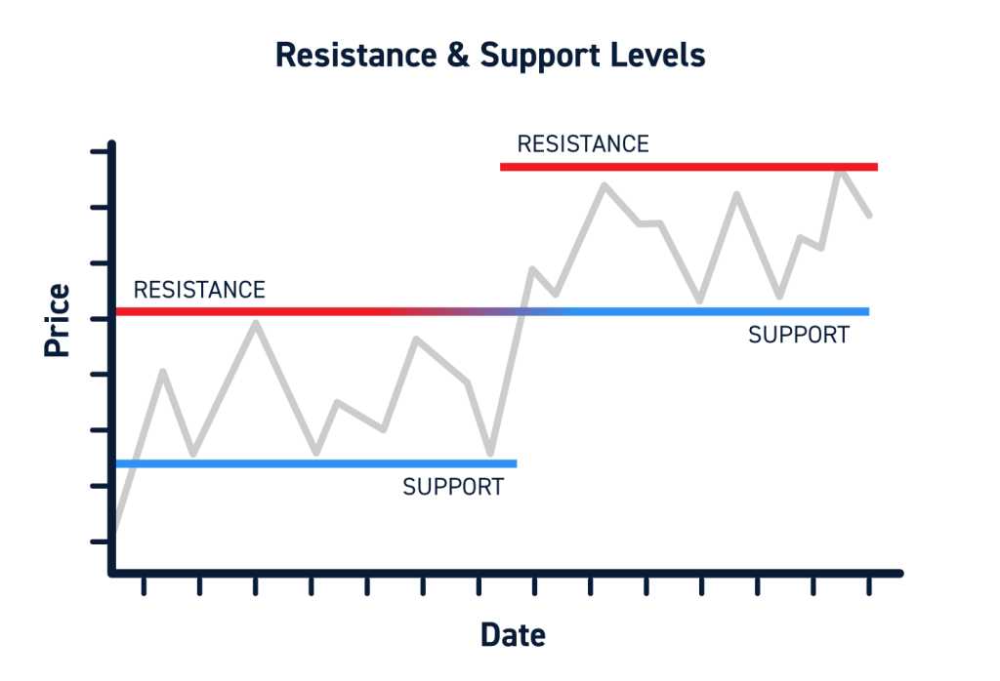

## Table of Contents

## What are support and resistance levels in financial markets?

Support and resistance levels are important concepts in financial markets that help traders and investors make decisions. Support is a price level where a falling market or stock tends to stop falling and may even start to rise again. It's like a floor that the price doesn't often go below. Traders watch these levels because they believe that if the price reaches this point, it might be a good time to buy, expecting the price to go up.

Resistance, on the other hand, is a price level where a rising market or stock tends to stop rising and may start to fall again. It acts like a ceiling that the price struggles to break through. When the price hits this level, traders might think it's a good time to sell, expecting the price to drop. Both support and resistance levels are based on past price movements and are used to predict future price behavior.

These levels are not fixed and can change over time as market conditions change. They are often identified by looking at charts and seeing where the price has bounced back or reversed in the past. Understanding support and resistance can help traders make better decisions about when to buy or sell, but it's important to remember that these levels are not guarantees, and the market can always behave unexpectedly.

## How do support and resistance levels affect trading decisions?

Support and resistance levels help traders decide when to buy or sell. When the price of a stock or market gets close to a support level, traders might think it's a good time to buy. They believe the price won't go much lower and might start going up again. This can make more people want to buy, which can push the price up. On the other hand, when the price gets close to a resistance level, traders might think it's a good time to sell. They believe the price won't go much higher and might start going down again. This can make more people want to sell, which can push the price down.

These levels can also help traders set their goals and limits. For example, if a trader buys a stock near a support level, they might set a goal to sell it when it reaches a resistance level. They might also set a limit, or "stop-loss," just below the support level to cut their losses if the price keeps falling. By using support and resistance levels, traders can make plans that help them manage risk and try to make a profit. But it's important to remember that these levels are not perfect and the market can always surprise us.

## What are the common methods to identify support and resistance levels?

One common way to find support and resistance levels is by looking at a price chart. Traders look for places where the price has stopped going down and started going up again. These are support levels. They also look for places where the price has stopped going up and started going down again. These are resistance levels. By drawing lines at these points on the chart, traders can see where these levels are. The more times the price touches these lines without breaking through, the stronger the support or resistance is thought to be.

Another method is to use moving averages. These are lines on a chart that show the average price over a certain time, like 50 days or 200 days. When the price gets close to these moving averages, it can act like a support or resistance level. If the price is going up and hits a moving average, it might start going down again. If the price is going down and hits a moving average, it might start going up again. Traders use these moving averages to help them decide when to buy or sell.

Some traders also use indicators like the Relative Strength Index (RSI) or the Fibonacci retracement levels to help find support and resistance. The RSI can show if a stock is overbought or oversold, which can signal where support or resistance might be. Fibonacci retracement levels are based on a mathematical sequence and can help predict where the price might stop and reverse. By combining these different methods, traders can get a better idea of where the important support and resistance levels are.

## Can support and resistance levels be used in all types of financial markets?

Yes, support and resistance levels can be used in all types of financial markets, including stocks, [forex](/wiki/forex-system), commodities, and cryptocurrencies. These levels help traders understand where prices might stop and turn around, no matter what they are trading. Whether it's a stock on the New York Stock Exchange, a currency pair in the forex market, or Bitcoin in the crypto market, support and resistance levels are important tools for making trading decisions.

The way to find these levels is the same in all markets. Traders look at past price movements on a chart to see where prices have bounced back or reversed before. They draw lines at these points to show where support and resistance might be. Even though the markets can be different, the idea of watching for these levels to make buying or selling choices works the same way everywhere.

## How do traders use historical price data to determine support and resistance?

Traders use historical price data to find support and resistance levels by looking at past price movements on a chart. They look for times when the price stopped going down and started going up again. These are support levels. They also look for times when the price stopped going up and started going down again. These are resistance levels. By drawing lines at these points on the chart, traders can see where these levels are. The more times the price touches these lines without breaking through, the stronger the support or resistance is thought to be.

Traders believe that if the price reaches these levels again in the future, it might behave the same way it did before. For example, if the price hits a support level, traders might think it's a good time to buy, expecting the price to go up again. If the price hits a resistance level, traders might think it's a good time to sell, expecting the price to go down again. By using historical price data to find these levels, traders can make better decisions about when to buy or sell, but they always need to remember that the market can change and these levels are not perfect predictions.

## What is the psychological basis behind support and resistance levels?

Support and resistance levels are not just about numbers on a chart. They are also about what people think and feel. When a lot of traders see the price getting close to a support level, they might think it's a good time to buy. They remember that the price stopped going down at this level before, so they expect it to happen again. This makes more people want to buy, which can push the price up. It's like a group of people all thinking the same thing at the same time.

On the other hand, when the price gets close to a resistance level, traders might think it's a good time to sell. They remember that the price stopped going up at this level before, so they expect it to happen again. This makes more people want to sell, which can push the price down. These levels are strong because they are based on what a lot of people believe will happen, and these beliefs can make the price move in certain ways.

## How can support levels turn into resistance levels and vice versa?

When the price of something breaks through a support level and goes lower, that old support level can turn into a new resistance level. This happens because people remember that the price used to stop at that level before. Now, when the price comes back up to that level, people might think it's a good time to sell again, hoping to make a profit or cut their losses. This selling can make the price go down again, turning the old support into a new resistance.

In the same way, if the price breaks through a resistance level and goes higher, that old resistance level can turn into a new support level. People remember that the price used to stop at that level before. So, when the price comes back down to that level, people might think it's a good time to buy again, hoping the price will go up. This buying can make the price go up again, turning the old resistance into a new support. These changes show how what people think and remember can affect where the price goes.

## What are the limitations and potential pitfalls of relying on support and resistance?

Using support and resistance levels to make trading decisions can be helpful, but it has its limits. One big problem is that these levels are not always exact. The price might not stop exactly at the support or resistance line that traders draw on their charts. It can go a little bit past it before turning around. This can make it hard for traders to know the best time to buy or sell. Also, these levels can change over time. What was a strong support level last month might not be as strong this month. This means traders need to keep watching the market and be ready to change their plans.

Another pitfall is that too many people using the same support and resistance levels can make them less useful. If everyone is watching the same levels and making the same trades, it can cause the price to move in unexpected ways. For example, if a lot of people are waiting to buy at a support level, the price might not go down to that level at all. Instead, it might stay higher because of all the buying interest. This can make it hard for traders to use these levels to make money. So, while support and resistance can be good tools, traders need to be careful and use other information too.

## How do advanced traders incorporate support and resistance into complex trading strategies?

Advanced traders use support and resistance levels as part of bigger trading plans. They don't just look at these levels by themselves. Instead, they use them with other tools like moving averages, trend lines, and indicators like the Relative Strength Index (RSI) or the Moving Average Convergence Divergence (MACD). By combining these tools, traders can get a better idea of where the price might go next. For example, if the price is close to a support level and the RSI shows that the stock is oversold, a trader might feel more confident about buying, thinking the price will go up soon.

These traders also use support and resistance to set up more complex trades, like range trading or [breakout](/wiki/breakout-trading) trading. In range trading, traders buy near support levels and sell near resistance levels, trying to make money from the price moving back and forth between these levels. In breakout trading, traders watch for the price to break through a support or resistance level. If the price breaks through a resistance level, traders might buy, expecting the price to keep going up. If the price breaks through a support level, traders might sell, expecting the price to keep going down. By using support and resistance in these ways, advanced traders can make more detailed plans and try to make more money from the market.

## What role do volume and other technical indicators play in confirming support and resistance?

Volume and other technical indicators help traders know if support and resistance levels are strong or not. When the price gets close to a support or resistance level, traders look at the [volume](/wiki/volume-trading-strategy). If the volume is high when the price hits these levels, it means a lot of people are buying or selling. This can make the support or resistance level stronger because more people are paying attention to it. For example, if the price hits a support level and the volume is high, it shows that many people are buying at that level, which can make the price go up again.

Other technical indicators like the Relative Strength Index (RSI) and the Moving Average Convergence Divergence (MACD) also help confirm support and resistance. The RSI can show if a stock is overbought or oversold. If the price hits a support level and the RSI shows the stock is oversold, it can make traders more sure that the price will go up. The MACD can show if the price trend is strong. If the price hits a resistance level and the MACD shows the trend is getting weaker, it might mean the price will start going down. By using volume and these indicators, traders can make better decisions about when to buy or sell based on support and resistance levels.

## How can algorithmic trading systems utilize support and resistance levels?

Algorithmic trading systems can use support and resistance levels to make trading decisions automatically. These systems look at past price data to find where support and resistance levels are. When the price gets close to these levels, the system can decide to buy or sell based on what it thinks will happen next. For example, if the price is near a support level, the system might buy, expecting the price to go up. If the price is near a resistance level, the system might sell, expecting the price to go down. By using these levels, the system can make trades without a person having to watch the market all the time.

These systems can also use other tools like volume and technical indicators to make their decisions better. For example, if the volume is high when the price hits a support level, the system might be more sure that the price will go up. It can also use indicators like the RSI to see if the stock is overbought or oversold. If the RSI shows the stock is oversold when it hits a support level, the system might feel more confident about buying. By combining support and resistance with these other tools, [algorithmic trading](/wiki/algorithmic-trading) systems can make smarter trades and try to make more money from the market.

## What are some advanced techniques for predicting the breakout of support or resistance levels?

Advanced traders use several techniques to predict when the price might break through support or resistance levels. One way is to watch the volume. If the volume is getting higher as the price gets close to a support or resistance level, it might mean a breakout is coming. High volume shows that a lot of people are buying or selling, which can push the price through the level. Traders also look at how long the price has been stuck at a level. If the price has been bouncing off a resistance level for a long time, it might be ready to break through.

Another technique is to use technical indicators like the Relative Strength Index (RSI) and the Moving Average Convergence Divergence (MACD). If the RSI shows that the stock is overbought when it's near a resistance level, it might mean the price will break down. If the MACD shows that the trend is getting stronger when the price is near a resistance level, it might mean the price will break up. By combining these indicators with support and resistance levels, traders can get a better idea of when a breakout might happen.

Some traders also use chart patterns like triangles, flags, and head and shoulders to predict breakouts. These patterns show how the price has been moving and can give clues about where it might go next. For example, if the price is making a triangle pattern and it's getting close to the top of the triangle, which is also a resistance level, traders might expect the price to break out to the upside. By watching these patterns and using them with support and resistance levels, traders can make better guesses about when the price might break through.

## References & Further Reading

For additional insights into algorithmic trading and technical analysis, consult the following key resources:

- **"Advances in Financial Machine Learning" by Marcos Lopez de Prado**: This book is a comprehensive guide that explores machine learning applications in finance. It provides readers with techniques to enhance the predictive power of financial models using advanced machine learning methods. De Prado discusses robust approaches to implementing algorithmic trading strategies that capitalize on inefficiencies in the market.

- **"Quantitative Trading" by Ernest P. Chan**: Offering practical advice, this book is a valuable resource for both budding and experienced algorithmic traders. Chan emphasizes building a solid algorithmic trading business, covering aspects such as strategy development, backtesting, and risk management. The book integrates theory with practical examples and is particularly useful for understanding the nuances of developing sound trading algorithms.

- **"Evidence-Based Technical Analysis" by David Aronson**: This book challenges traditional assumptions and methodologies in technical analysis by advocating a scientific approach to trading. Aronson emphasizes the use of statistical and evidence-based techniques to validate trading indicators and systems. By offering a critical look at technical analysis, this work guides traders in developing methodologies that are empirically grounded.

Explore the principles discussed in these works to deepen your understanding and application of trading strategies. By integrating insights from these texts, traders can enhance their analytical frameworks and develop more robust trading strategies.

