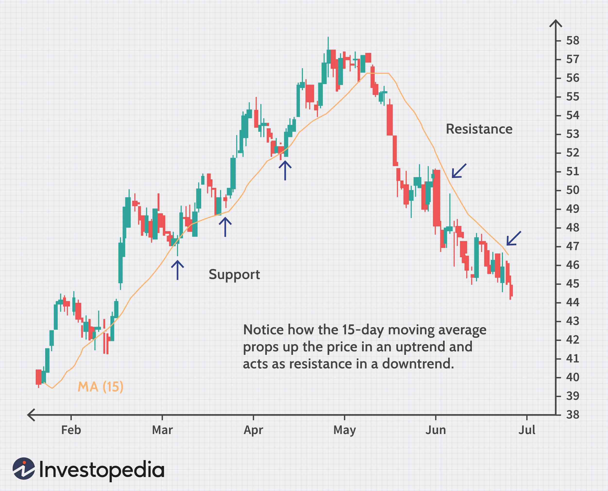

In the ever-evolving world of financial markets, technical analysis plays a crucial role in guiding traders' decisions. It is a method used to evaluate and forecast the future price movements of securities by examining past market data, primarily price and volume. Central to this technique are the concepts of support and resistance, which provide a framework for understanding market psychology and dynamics.

Support and resistance levels are critical in identifying potential turning points in the market. Support is defined as a price level where a downtrend can be expected to pause due to a concentration of buying interest. Conversely, resistance is a price point where an uptrend could pause due to a concentration of selling interest. These levels act as psychological barriers that influence the buying and selling decisions of traders.



In recent years, the application of support and resistance has gained prominence in algorithmic trading. Algorithms can automate the trading process by using predefined rules to identify these levels and execute trades based on them. This approach not only enhances trading efficiency and precision but also enables traders to capitalize on emerging opportunities without succumbing to emotional biases.

Furthermore, breakout strategies, which involve trading based on the breach of these defined levels, are integral to optimizing market participation. By identifying breakouts, traders can potentially enter or exit the market at more opportune times, significantly impacting their profitability. Through the integration of technical analysis and algorithmic methods, traders can enhance their trading methodologies, making their operations more strategic and data-driven.

This article will explore the intricate interplay between support, resistance, breakout strategies, and algorithmic trading, offering insights into how these elements can be leveraged for efficient and effective trading. The content aims to serve as a guide for both novice and experienced traders seeking to improve their understanding and application of these concepts in modern financial markets.

## Table of Contents

## Understanding Technical Analysis: Support and Resistance

Support and resistance are essential concepts within technical analysis, serving as critical tools for interpreting price charts. These levels are pivotal in decision-making processes for traders, providing insight into potential entry and exit points. 

Support is a designated price level where a downtrend encounters a pause or halt, triggered by an influx of demand. At this juncture, the price is perceived as attractive enough by buyers to prevent further decline, effectively creating a floor. Conversely, resistance is the price level at which an uptrend faces a slowdown or reversal due to overwhelming selling pressure. This indicates a ceiling in price, where supply overtakes demand, hindering further price advancement.

Understanding these levels involves recognizing that they are not only historical points on a chart but also psychological barriers. Traders often rely on these points to predict future market movements, believing that past price behavior can be indicative of future outcomes. For instance, a price repeatedly hitting a resistance level without breaking through may signal overbought conditions, while repeated tests of a support level may indicate oversupply.

Accurate identification of support and resistance levels demands a thorough analysis of historical price data and trends. Tools such as moving averages, trendlines, and horizontal lines are frequently employed to mark these levels on charts. A moving average, for example, can act as dynamic support or resistance, altering with price fluctuations.

Traders and analysts may apply these concepts using computational methods. For example, in Python, one might use libraries like Pandas and NumPy to calculate moving averages or employ modules like Matplotlib to visualize support and resistance lines. By automating the process of identifying these critical levels, traders can enhance their analysis and responsiveness to market changes, ensuring they capture the optimal moments for entry and [exit](/wiki/exit-strategy) in their trading strategies.

## The Art of Breakouts in Trading

Breakouts occur in trading when the price of a financial instrument moves outside established support or resistance levels, often signaling the beginning of a new trend. When these levels are breached, traders see potential for capturing new price movements that diverge from previous trading ranges. The strategy hinges on entering positions aligned with the direction of the [breakout](/wiki/breakout-trading), whether an upward move past resistance or a downward drop through support.

Volume is a critical [factor](/wiki/factor-investing) in confirming the validity of breakouts. A genuine breakout is often accompanied by increased trading [volume](/wiki/volume-trading-strategy), which suggests market consensus on the new price direction. High volume during a breakout reinforces the likelihood of a sustained trend continuation, because it reflects robust market interest and participation.

Trading breakouts effectively allows traders to take advantage of significant price shifts. By identifying and executing trades in response to breakouts, traders aim to capitalize on the [momentum](/wiki/momentum) generated as a result of these critical level breaches. This process often involves setting entry points just beyond the breakout levels and defining stop-loss orders to manage risk.

When implementing breakout strategies, traders can benefit from technical indicators and chart patterns such as triangles, flags, and pennants, which help identify potential breakout scenarios. Moreover, adapting [algorithmic trading](/wiki/algorithmic-trading), which executes trades based on predefined breakout criteria, allows for swift and precise capitalizing on breakout opportunities. By doing so, traders reduce manual errors and enhance decision-making efficiency.

Ultimately, understanding and trading breakouts can significantly enhance trading outcomes by leveraging market dynamics that underpin critical price level violations.

## Algorithmic Trading and Its Integration with Breakout Strategies

Algorithmic trading enhances the execution speed and precision of trades by automating the decision-making process based on pre-defined rules. When integrated with breakout strategies, algorithmic trading offers opportunities for real-time market response, thereby increasing the efficiency of trade management. By continuously monitoring markets for breakout conditions, algorithms can execute trades instantaneously when such conditions are satisfied. This capability significantly reduces emotional biases and errors typically associated with manual trading.

Python, a versatile programming language, is often used to implement such strategies. Here's a basic example of how a breakout strategy can be coded using Python:

```python
import pandas as pd
import numpy as np
import yfinance as yf  # For more datasets, visit: https://paperswithbacktest.com/datasets

# Download historical data
data = yf.download("AAPL", start="2023-01-01", end="2023-10-01")
data['20d_high'] = data['High'].rolling(window=20).max()
data['20d_low'] = data['Low'].rolling(window=20).min()

# Define breakout strategy
def breakout_strategy(data):
    signals = pd.Series(index=data.index)
    signals[data['Close'] > data['20d_high']] = 1  # Buy signal
    signals[data['Close'] < data['20d_low']] = -1  # Sell signal
    return signals

# Generate signals
signals = breakout_strategy(data)

# Execute trades
capital = 10000
position = 0

for i in range(1, len(data)):
    if signals[i] == 1 and position == 0:
        position = capital / data['Close'][i]
        print(f"Buying at {data['Close'][i]}")
    elif signals[i] == -1 and position > 0:
        capital = position * data['Close'][i]
        print(f"Selling at {data['Close'][i]}")
        position = 0

print(f"Final capital: {capital}")
```

This simple example showcases a breakout strategy based on 20-day highs and lows, where buy and sell signals are generated when the closing price breaches these levels. The strategy's logic is automated, thereby facilitating real-time trade execution as conditions are met.

By automating these processes, traders can eliminate subjective decision-making and align their trading activities with objective, data-driven criteria. This integration enables swift reaction to market movements, helping traders capitalize on potential opportunities effectively while minimizing the risks inherent in manual market monitoring.

## Developing an Effective Trading Algorithm

Creating a successful trading algorithm involves a comprehensive understanding of market conditions and the application of technical indicators. This process is dynamic and requires both analytical and technical expertise. An effective algorithm encompasses several key components and processes to ensure its efficacy and consistency in trading environments.

**Backtesting Algorithms with Historical Data**

To validate a trading algorithm's reliability and performance, extensive [backtesting](/wiki/backtesting) is a critical step. Backtesting involves applying the trading algorithm to historical market data to evaluate how it would have performed. This analysis helps in identifying the strengths and weaknesses of the algorithm, facilitating necessary adjustments before deploying it in live trading scenarios. For this process, software tools capable of processing large datasets and simulating trade executions over historical periods are essential.

**Defining Parameters for Support, Resistance, and Breakouts**

Central to the algorithm's success is the definition of clear parameters for identifying support, resistance, and breakout conditions. These parameters include specific price levels for support and resistance, and precise criteria for recognizing a breakout based on price movement and volume analysis. By setting these parameters meticulously, the algorithm can autonomously recognize potential trading opportunities and make informed decisions.

**Optimizing Entry and Exit Points**

Optimization of the algorithm involves refining entries and exits, stop-loss, and take-profit orders. The algorithm's logic should be designed to select optimal entry points where the probability of favorable outcomes is maximized. Similarly, exit strategies must be clearly defined to lock in gains and minimize losses. Stop-loss orders help mitigate risk by automatically exiting a trade if the market moves against the position, while take-profit orders secure profits at predetermined levels.

**Adapting to Changing Market Conditions**

Markets are inherently dynamic, necessitating continuous adaptation and improvement of trading algorithms. Algorithms must be updated regularly to account for evolving market trends and conditions. This involves incorporating new data, revising parameter settings, and testing new strategies. Employing adaptive algorithms, which can modify their parameters in response to real-time market changes, enhances the algorithm's robustness and flexibility.

**Example: Implementing a Simple Breakout Algorithm in Python**

Here's a simplified example of how one might implement a basic breakout strategy using Python, utilizing libraries such as Pandas for data manipulation and NumPy for numerical computations:

```python
import pandas as pd
import numpy as np

# Load historical price data
data = pd.read_csv('historical_data.csv')
data['SMA_20'] = data['Close'].rolling(window=20).mean()
data['SMA_50'] = data['Close'].rolling(window=50).mean()

# Define breakout conditions
data['Signal'] = np.where((data['Close'] > data['SMA_20']) & 
                          (data['Close'].shift(1) <= data['SMA_20'].shift(1)) &
                          (data['Volume'] > 1.5 * data['Volume'].rolling(window=50).mean()), 1, 0)

# Define exit conditions (For simplicity, exit after 5 days)
data['Position'] = data['Signal'].shift()
data['Returns'] = data['Close'].pct_change()
data['Strategy_Returns'] = data['Position'] * data['Returns']
```

In this example, a simple moving average (SMA) crossover is used to signal potential breakouts, with volume as a confirmation. Positions are initiated when the closing price breaks above the SMA, provided volume criteria are met. The strategy exits after a predetermined period (e.g., five days), though more sophisticated exit rules could be developed.

By investing time in the development, backtesting, and continuous refinement of trading algorithms, traders can create robust systems that respond efficiently to market changes and deliver consistent performance.

## Challenges and Considerations in Algo Trading

Algorithmic trading, while offering numerous advantages such as speed and precision, presents several challenges that traders need to address to maximize potential benefits. One of the foremost challenges is the requirement for technical expertise. Developing and maintaining effective algorithms necessitates not only programming skills but also a deep understanding of financial markets and trading strategies.

Market [volatility](/wiki/volatility-trading-strategies) represents another significant challenge in algorithmic trading. Financial markets can be unpredictable, with rapid price movements that may not always align with algorithmic predictions. This behavior can lead to false breakouts, where anticipated movements do not materialize, causing algorithms to enter or exit trades prematurely. To counteract this risk, algorithms must incorporate sophisticated techniques to identify reliable breakout signals and filter out false ones. This could involve using confirmation indicators such as moving averages or volume thresholds to validate breakout conditions.

Adaptive algorithms offer a solution to dealing with changing market conditions. These algorithms are capable of learning and adjusting their parameters based on recent market data, allowing them to better respond to dynamic shifts. This adaptability can mitigate risks associated with unexpected market events. The use of [machine learning](/wiki/machine-learning) techniques, such as [reinforcement learning](/wiki/reinforcement-learning) and predictive modeling, can enhance the ability of algorithms to modify their behavior in response to evolving inputs.

Remaining competitive requires traders to stay abreast of technological advancements and integrate innovative strategies. As technology evolves, new tools and techniques become available, offering potential improvements in trading algorithm performance. Traders who continuously update their systems benefit from enhanced analytical capabilities, increased efficiency, and the ability to tap into novel data sources or analytical methods.

Lastly, achieving success in algorithmic trading demands a careful balance between technical sophistication and practical market insights. While advanced algorithms and models can provide detailed market analyses, they must be informed by real-world trading experience and understanding. This synthesis of technology and market acumen enables traders to develop strategies that are not only theoretically sound but also practically effective in achieving desired trading outcomes.

## Conclusion

The integration of breakout strategies, support and resistance analysis, and algorithmic trading creates a powerful framework for traders aiming for enhanced efficiency, accuracy, and profitability. This synergistic approach allows market participants to systematically exploit price movements, identify key market levels, and execute trades with precision and speed. 

As financial markets evolve and technology advances, traders must commit to continuous learning and adapt their strategies to keep pace with these changes. Algorithmic solutions, for instance, have the capability to evolve with market dynamics through adaptive algorithms that incorporate the latest trends and data in real-time. By constantly refining these strategies, traders are better equipped to anticipate market shifts, reducing risks associated with volatility and false signals.

Incorporating advanced computing techniques provides traders with a strategic edge, enabling them to swiftly interpret and act on market data. This leads to improved decision-making processes, as algorithms can process vast amounts of information far quicker than manual human analysis. Additionally, by optimizing entry and exit points, stop-loss, and take-profit orders, traders maximize their potential returns while minimizing exposure to adverse market conditions. 

The confluence of breakout strategies, technical analysis, and algorithmic trading is pivotal in the quest for success in today's trading environments. It not only facilitates effective market participation but also empowers traders to maintain a competitive edge, ultimately driving better trading outcomes. As these elements are embraced and refined, traders position themselves to capitalize on opportunities and navigate the complexities of the financial markets with greater confidence and competence.

## References & Further Reading

For additional insights into algorithmic trading and technical analysis, consult the following key resources:

- **"Advances in Financial Machine Learning" by Marcos Lopez de Prado**: This book is a comprehensive guide that explores machine learning applications in finance. It provides readers with techniques to enhance the predictive power of financial models using advanced machine learning methods. De Prado discusses robust approaches to implementing algorithmic trading strategies that capitalize on inefficiencies in the market.

- **"Quantitative Trading" by Ernest P. Chan**: Offering practical advice, this book is a valuable resource for both budding and experienced algorithmic traders. Chan emphasizes building a solid algorithmic trading business, covering aspects such as strategy development, backtesting, and risk management. The book integrates theory with practical examples and is particularly useful for understanding the nuances of developing sound trading algorithms.

- **"Evidence-Based Technical Analysis" by David Aronson**: This book challenges traditional assumptions and methodologies in technical analysis by advocating a scientific approach to trading. Aronson emphasizes the use of statistical and evidence-based techniques to validate trading indicators and systems. By offering a critical look at technical analysis, this work guides traders in developing methodologies that are empirically grounded.

Explore the principles discussed in these works to deepen your understanding and application of trading strategies. By integrating insights from these texts, traders can enhance their analytical frameworks and develop more robust trading strategies.