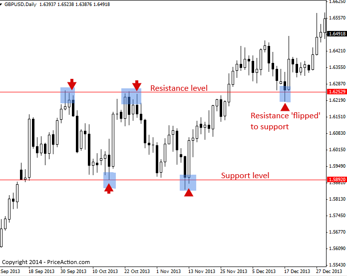

## Table of Contents

## What are support and resistance in trading?

Support and resistance are important concepts in trading that help traders understand where the price of an asset might stop falling or rising. Support is like a floor for the price. It's a level where the price tends to stop dropping and might start to go up again. This happens because many traders believe the price is a good deal at this level and start buying, which pushes the price up. Resistance, on the other hand, is like a ceiling for the price. It's a level where the price tends to stop rising and might start to go down again. This is because many traders think the price is too high at this level and start selling, which pushes the price down.

These levels are not fixed and can change over time as more people trade and the market conditions change. Traders use past price data to find these levels and make guesses about where the price might go next. By watching how the price reacts at these levels, traders can make better decisions about when to buy or sell. Understanding support and resistance can help traders make smarter trades and manage their risks better.

## How do support and resistance levels form?

Support and resistance levels form because of how people act when they trade. Imagine lots of people watching the price of something, like a stock or a currency. When the price goes down to a certain point, many people might think it's a good time to buy because it's cheap. They start buying, and this pushes the price up again. This point where many people start buying is called a support level. It's like a floor that the price doesn't usually fall through because so many people are ready to buy at that price.

On the other hand, when the price goes up to a certain point, many people might think it's too expensive and decide to sell. They start selling, and this pushes the price down again. This point where many people start selling is called a resistance level. It's like a ceiling that the price doesn't usually go through because so many people are ready to sell at that price. Over time, as more people trade and the market changes, these levels can move, but they help traders guess where the price might go next.

## Why are support and resistance important in technical analysis?

Support and resistance are key ideas in technical analysis because they help traders see where the price of something might stop going down or up. In simple terms, support is like a floor where the price stops falling because many people think it's a good time to buy. Resistance is like a ceiling where the price stops rising because many people think it's too high and start selling. By looking at these levels, traders can guess where the price might go next and make better choices about when to buy or sell.

These levels are important because they show where a lot of people agree on the price. If the price hits a support level and bounces back up, it tells traders that many people think the price is too low and are ready to buy. If the price hits a resistance level and falls back down, it shows that many people think the price is too high and are ready to sell. By watching these levels, traders can plan their moves better and manage their risks. Understanding support and resistance can make a big difference in how well traders do in the market.

## Can you explain how to identify support and resistance levels on a chart?

To find support and resistance levels on a chart, you need to look at the price history of the thing you're trading, like a stock or a currency. Start by looking at the chart and finding places where the price has stopped going down and started going up again. These are support levels. They might look like a flat line or a small bump where the price keeps bouncing back up. Also, look for places where the price has stopped going up and started going down again. These are resistance levels. They might look like a flat line or a small bump where the price keeps falling back down.

Once you've found these levels, draw lines on the chart to mark them. You can use a tool in your trading software to draw these lines. It's good to look at different time periods on the chart, like daily, weekly, or monthly, to see if the same levels show up again and again. The more times the price hits a level and bounces off it, the stronger that level is. Sometimes, the levels might not be exact lines but more like zones where the price tends to change direction. By marking these levels on your chart, you can see where the price might go next and make better trading choices.

## What is the psychological significance of support and resistance?

Support and resistance levels are important because they show us where a lot of people agree on the price. When the price hits a support level, many traders think it's a good time to buy because they believe the price won't go much lower. This belief comes from past experiences where the price has bounced back from this level before. It's like a group of people deciding that a certain price is a good deal, so they all start buying at that point. This collective action creates a kind of psychological barrier that the price finds hard to break through.

On the other hand, when the price reaches a resistance level, many traders think it's too high and start selling. They believe the price won't go much higher because it has turned around at this level before. This shared belief among traders creates another psychological barrier. It's like a group of people agreeing that a certain price is too expensive, so they all start selling at that point. These levels are not just numbers on a chart; they represent the collective mindset of the market, influencing how traders act and where they think the price will go next.

## How do traders use support and resistance to make trading decisions?

Traders use support and resistance to help them decide when to buy or sell. When the price of something, like a stock, gets close to a support level, traders might think it's a good time to buy. They see that the price has stopped falling at this level before and might go up again. So, they buy near the support level, hoping to make money when the price goes up. On the other hand, when the price gets close to a resistance level, traders might think it's a good time to sell. They see that the price has stopped rising at this level before and might go down again. So, they sell near the resistance level, hoping to avoid losing money if the price falls.

Sometimes, traders also use these levels to set their stop-loss orders. A stop-loss order is like a safety net that tells the computer to sell their stock if the price falls to a certain level. Traders might put their stop-loss just below a support level to limit how much money they could lose if the price keeps going down. If the price breaks through a support or resistance level, it can mean that the market is changing. Traders might then change their plans, maybe buying if the price breaks through resistance, or selling if it breaks through support. By watching these levels, traders can make better choices and manage their risks.

## What are the common mistakes traders make when using support and resistance?

One common mistake traders make is relying too much on support and resistance levels without considering other important things. They might see the price hit a support level and think it will always bounce back up, but sometimes the price can break through these levels if something big changes in the market. Traders need to look at other signs, like how much the price is moving or what's happening in the news, to make better guesses about what will happen next. If they only focus on support and resistance, they might miss important clues and make bad trades.

Another mistake is not updating their support and resistance levels as the market changes. These levels are not set in stone; they move as more people trade and the market situation changes. If traders keep using old levels that don't match what's happening now, they might make wrong guesses about where the price will go. It's important to keep an eye on the chart and adjust the levels when needed. By doing this, traders can make better decisions and avoid surprises that could cost them money.

## How can support and resistance levels be used in conjunction with other technical indicators?

Support and resistance levels work well when you use them with other technical indicators. One common way is to use them with moving averages. A moving average is a line on the chart that shows the average price over a certain time. If the price hits a support level and also touches a moving average, it can be a stronger sign that the price might go up again. Traders might feel more sure about buying at this point because they see two signs pointing to the same thing. On the other hand, if the price hits a resistance level and also touches a moving average, it might be a stronger sign that the price will go down again. Traders might feel more sure about selling at this point.

Another way to use support and resistance with other indicators is with the Relative Strength Index (RSI). The RSI is a number that shows if a stock is overbought or oversold. If the price hits a support level and the RSI is low, it might mean the stock is oversold and likely to go up soon. Traders might see this as a good time to buy. If the price hits a resistance level and the RSI is high, it might mean the stock is overbought and likely to go down soon. Traders might see this as a good time to sell. By looking at support and resistance along with other indicators, traders can get a fuller picture of what might happen next and make better trading choices.

## What is the concept of 'role reversal' in support and resistance?

Role reversal in support and resistance is when a support level turns into a resistance level, or a resistance level turns into a support level. Imagine the price of a stock goes up and breaks through a resistance level. Now, that old resistance level might start acting like a support level. Traders might see it as a new floor where the price won't fall below easily because they remember it used to stop the price from going up.

This happens because when the price breaks through a level, it changes how traders think about it. If a resistance level gets broken, traders might start buying when the price comes back to that level, thinking it's a good deal. This turns the old resistance into a new support. On the other hand, if a support level gets broken, traders might start selling when the price comes back to that level, thinking it's too high. This turns the old support into a new resistance. Understanding role reversal can help traders make better guesses about where the price might go next.

## How do you determine the strength of a support or resistance level?

The strength of a support or resistance level depends on how many times the price has hit that level and bounced off it. If the price touches a level many times and keeps going back up or down from it, that level is strong. It's like a lot of people agree on that price and act the same way every time it gets there. The more times this happens, the more traders will pay attention to that level and expect the price to react the same way again.

Another way to tell how strong a level is, is by looking at how much the price moves when it hits the level. If the price hits a support or resistance level and doesn't move much, it means the level is strong. It's like the price is stuck at that point because a lot of people are ready to buy or sell there. But if the price hits a level and moves a lot, it might mean the level is weak and could break soon. By watching how the price acts at these levels, traders can guess how strong they are and make better trading choices.

## Can support and resistance levels change over time, and if so, how?

Yes, support and resistance levels can change over time. They are not fixed because the market is always moving and changing. As more people trade and new information comes out, the levels where many people agree to buy or sell can shift. For example, if a company does really well and more people want to buy its stock, the old resistance level might become a new support level because the price keeps going up past it. On the other hand, if bad news comes out and people start selling a lot, the old support level might become a new resistance level because the price keeps falling below it.

Traders need to keep watching the chart to see these changes. They look at different time periods, like daily or weekly charts, to see if the same levels keep showing up or if new ones are forming. By drawing lines on the chart to mark where the price has stopped going up or down, traders can see where the new support and resistance levels are. This helps them make better guesses about where the price might go next and adjust their trading plans accordingly.

## What advanced techniques can be used to anticipate breaks in support and resistance?

One advanced technique to anticipate breaks in support and resistance is to use volume analysis. Volume is the number of shares or contracts traded in a certain time. When the price gets close to a support or resistance level, traders watch the volume. If the volume goes up a lot when the price hits a level, it might mean that many people are buying or selling, and the level could break soon. For example, if the price hits a resistance level and the volume is much higher than usual, it might mean enough people are buying to push the price through the resistance. By watching the volume, traders can get a clue about whether a level is about to break.

Another technique is to use chart patterns. Chart patterns are shapes that show up on the price chart and can tell traders about possible breaks. For example, a 'triangle' pattern might show that the price is getting ready to break out. If the price is moving in a smaller and smaller range as it gets close to a support or resistance level, it might mean a big move is coming. Traders also look at 'head and shoulders' patterns, which can signal that a break is about to happen. By learning these patterns and watching for them on the chart, traders can guess when a support or resistance level might break and plan their trades accordingly.

## What are the differences between Proactive and Reactive Support and Resistance Techniques?

In the dynamic sphere of stock market trading, adopting proactive or reactive techniques for identifying support and resistance levels can significantly impact trading outcomes. Proactive methods anticipate potential price movements, equipping traders with foresight to prepare their strategies. Among these techniques, Measured Moves, Calculated Pivots, and Trendlines stand out.

Measured Moves involve predicting the probable price movement based on previous trends, offering a projected path for price changes. This is often achieved through pattern-based approaches where traders expect the price to mirror past behaviors. For instance, if a stock price initially rose by $10 before dipping, the trader might anticipate a similar $10 rise if market conditions replicate.

Calculated Pivots involve using mathematical formulas to determine likely reversal points in the market. Calculated pivots consist of various levels (pivot point, support, and resistance) derived from the previous period's high, low, and closing prices. The pivot point (P) is usually the average of these prices:

$$
P = \frac{{\text{High} + \text{Low} + \text{Close}}}{3}
$$

From here, traders calculate subsequent support and resistance levels to inform their trading strategies.

Trendlines are another proactive technique where traders draw lines connecting a series of price points to visualize support and resistance. An upward trendline, drawn along consecutive lows, suggests bullish potential, while a downward trendline, along successive highs, indicates bearish trends.

In contrast, reactive methods focus on analyzing historical data to understand past price actions, offering insights into future resistance or support dynamics. Volume Profile and Candle Patterns are key techniques within this category.

Volume Profile examines traded [volume](/wiki/volume-trading-strategy) over a specified price level rather than time, thus revealing high-activity price levels that might serve as future support or resistance. Higher volumes at certain price levels indicate stronger interest and potential future price barriers.

Candle Patterns analyze price movement representations in candlestick charts to identify potential support and resistance levels. Patterns such as hammers or shooting stars can signal market reversals by demonstrating past price rejections or trends.

Both proactive and reactive methodologies have distinct advantages. Proactive approaches enable traders to strategize based on potential future movements, allowing for a proactive stance in anticipating market changes. Conversely, reactive strategies provide insights grounded in historical data, which can help contextualize potential support or resistance scenarios.

Choosing the right method depends on market conditions and trading objectives. A combination of both approaches can often provide a comprehensive strategy, allowing traders to anticipate and respond effectively to market dynamics.

## How can one identify support and resistance levels?

Support and resistance levels are critical concepts traders use to predict market movements and strategize their trades. These levels can be identified using various techniques, two of the most common being trend lines and pivot point calculations.

**Trend Lines:**
Trend lines represent dynamic levels of support and resistance that evolve with time. They are drawn by connecting a series of price points on a chart. For support, trend lines are typically drawn along several ascending lows, forming an upward trajectory that indicates a bullish market sentiment. Conversely, resistance trend lines are drawn by connecting a sequence of descending highs, representing a bearish outlook. As price approaches or tests these trend lines frequently, the lines' significance is heightened, suggesting strong support or resistance. However, when prices break through these levels, the trend lines may reverse roles; a breached support line can become resistance, and vice versa.

**Pivot Point Calculations:**
Pivot points are static indicators used to determine potential support and resistance levels based on the previous day's high, low, and closing prices. The basic pivot point (P) can be calculated as:

$$

P = \frac{{\text{High} + \text{Low} + \text{Close}}}{3} 
$$

Using this pivot point, additional support (S1, S2) and resistance (R1, R2) levels can be computed:

$$

R1 = (2 \times P) - \text{Low}
$$
$$

S1 = (2 \times P) - \text{High}
$$
$$

R2 = P + (\text{High} - \text{Low})
$$
$$

S2 = P - (\text{High} - \text{Low})
$$

Traders often look for price actions around these pivot points to forecast market behavior. When the price repeatedly 'tests' a pivot point, either by bouncing off or breaking through, it gains greater credibility as a significant support or resistance level.

When support and resistance levels are repeatedly tested without breaking, their validity and importance are reinforced, making them crucial markers on any trader’s chart. However, once breached, these levels often swap roles, creating new dynamics in the market structure that traders need to navigate carefully.

## What is the role of Support and Resistance in Algorithmic Trading?

Algorithmic trading relies extensively on predefined rules, which makes the accurate identification of support and resistance levels critical. These levels function as essential markers that help program automated trading strategies effectively. By recognizing support and resistance, algorithms can be designed to initiate trades when prices reach these crucial points, ensuring that responses to market conditions are both swift and precise. This ability to automate decision-making based on predetermined levels not only increases operational efficiency but also significantly reduces impulsive and emotionally driven trading decisions.

For instance, when programming an algorithm, traders might code specific instructions for how the system should behave when the price nears a critical support or resistance level. Here's a simplified example using pseudocode:

```python
def trade_strategy(current_price, support_level, resistance_level):
    if current_price < support_level:
        # Execute buy order
        execute_trade('buy')
    elif current_price > resistance_level:
        # Execute sell order
        execute_trade('sell')
    else:
        # Hold position
        pass

```

Moreover, some traders use formulas to calculate dynamic support and resistance levels. Pivot points are one such method and can be calculated as follows:

$$
\text{Pivot Point (PP)} = \frac{\text{High} + \text{Low} + \text{Close}}{3}
$$

These pivot points can anticipate possible support and resistance levels:

$$
\text{Resistance Level 1 (R1)} = 2 \times \text{PP} - \text{Low}
$$
$$
\text{Support Level 1 (S1)} = 2 \times \text{PP} - \text{High}
$$

Such calculations enable automatic adjustments within the [algorithmic trading](/wiki/algorithmic-trading) system, making it adaptable to varying market conditions.

By integrating support and resistance into algorithmic systems, traders can optimize outcomes by leveraging systematic and timely responses to trading environments. This minimization of emotional bias complements the efficiency gains brought about by automation, creating a robust framework for managing trades in dynamic market scenarios.

## References & Further Reading

[1]: Murphy, J. J. (1999). ["Technical Analysis of the Financial Markets: A Comprehensive Guide to Trading Methods and Applications"](https://archive.org/details/technicalanalysi0000murp). New York Institute of Finance.

[2]: Tharp, V. K. (2013). ["Trade Your Way to Financial Freedom"](https://www.amazon.com/Trade-Your-Way-Financial-Freedom/dp/007147871X). McGraw-Hill Education.

[3]: Pring, M. J. (2002). ["Technical Analysis Explained: The Successful Investor's Guide to Spotting Investment Trends and Turning Points"](https://www.amazon.com/Technical-Analysis-Explained-Fifth-Successful/dp/0071825177). McGraw-Hill Education.

[4]: Nison, S. (1991). ["Japanese Candlestick Charting Techniques: A Contemporary Guide to the Ancient Investment Techniques of the Far East"](https://archive.org/details/japanesecandlest0000niso). Prentice Hall Press.

[5]: Lo, A. W., Mamaysky, H., & Wang, J. (2000). ["Foundations of Technical Analysis: Computational Algorithms, Statistical Inference, and Empirical Implementation"](https://www.cis.upenn.edu/~mkearns/teaching/cis700/lo.pdf). Journal of Finance, 55(4), 1705–1770.