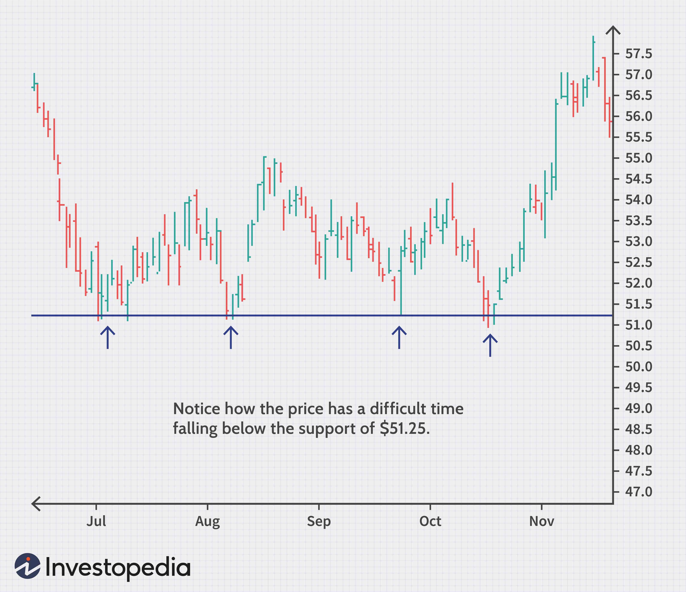

Technical analysis is an essential skill for traders aiming to identify key price levels, notably support and resistance. These levels are pivotal in determining potential price movements and inform trading decisions significantly. This article examines the understanding and application of support levels, particularly within the context of algorithmic trading. These price levels can optimize trading strategies by offering insights into market entry and exit points, thereby reducing risks associated with volatility.

With the advancement of technology, algorithmic trading has become increasingly instrumental in applying technical analysis methodologies effectively. It offers the ability to systematically identify patterns and execute transactions with enhanced speed and precision, crucial in today's fast-paced financial markets. Algorithmic trading leverages computational algorithms to analyze market data continuously, enabling traders to detect support levels more efficiently compared to manual analysis.



This discussion will also cover an overview of manual methods and automated systems for pinpointing support levels. While traditional methods involve analyzing trend lines and chart patterns, automated systems utilize algorithms and machine learning techniques to achieve a more dynamic detection of these key levels. By integrating both manual and automated approaches, traders can enhance their predictive accuracy and optimize their trading strategies.

## Table of Contents

## Understanding Support and Resistance

Support and resistance are crucial elements in technical analysis, serving as potential price reversal points that help traders make strategic decisions. Support levels are identified as price levels where a downtrend can be expected to pause due to a concentration of demand. They act like a floor that prevents prices from declining further. For example, if a stock repeatedly falls to $50 and then rebounds, $50 is considered a support level. Resistance levels, on the other hand, act as a ceiling, where the price tends to stop rising due to a concentration of selling interest.

These levels are instrumental in determining entry and exit points in the market. When a price approaches a support level, it might be a signal for traders to consider buying, anticipating a bounce. Conversely, when a price nears a resistance level, it might be time to sell or short, anticipating a decline. Understanding these dynamics can help traders plan effective strategies.

Market psychology significantly influences the formation of support and resistance levels. Traders and investors remember past price actions, and psychological factors such as fear and greed contribute to the establishment of these levels. For instance, if a stock consistently bounces back at a particular support level, traders might believe that it will continue to do so, reinforcing that level.

Accurate identification and analysis of support and resistance levels are paramount for making informed trading decisions, whether for short-term trades or long-term investment strategies. Utilizing technical analysis tools to objectively identify these levels can lead to better decision-making, minimizing the emotional aspect of trading. Recognizing patterns and validating them with historical data enhances the reliability of identified levels and ultimately improves trading outcomes.

## Technical Analysis Tools for Support Levels

Multiple tools and indicators are utilized in technical analysis to identify support levels effectively. Among the most common methods are trendlines, moving averages, and a variety of technical indicators.

**Trendlines and Moving Averages**

Trendlines are drawn on price charts to connect a series of descending price peaks or ascending price troughs, helping to visualize the direction of support levels. Moving averages serve a similar purpose, smoothing out price fluctuations over a specified duration to highlight trends. A popular form of moving average is the Simple Moving Average (SMA), which is calculated as follows:

$$
\text{SMA} = \frac{P_1 + P_2 + \ldots + P_n}{n}
$$

where $P_1, P_2, \ldots, P_n$ represent the previous n price points. Another common type is the Exponential Moving Average (EMA), which gives more weight to recent prices, thereby reacting more quickly to price changes.

**Psychological Support at Round Numbers**

Round numbers, such as 100, 1,000, or 10,000, often act as psychological support levels due to their perceived significance and memorability. Traders and investors occasionally place buy orders at these levels, anticipating that other market participants will do the same, thus reinforcing their role as support levels.

**Technical Indicators**

Indicators like the Relative Strength Index (RSI) and Moving Average Convergence Divergence (MACD) provide deeper insights into market [momentum](/wiki/momentum) and potential support levels. The RSI, for instance, measures the speed and change of price movements on a scale typically from 0 to 100. An RSI below 30 often signals an oversold condition, implying that a support level might be forming. In contrast, MACD is computed by subtracting the 26-period EMA from the 12-period EMA, and it assists traders in identifying potential buy and sell signals around support levels.

**Multi-timeframe Analysis**

Utilizing multi-timeframe analysis reinforces the validity of identified support levels. Observing price action on different timeframes—such as daily, weekly, and monthly charts—can provide a more comprehensive understanding of the persistence and robustness of support levels. Consistent support across multiple timeframes can indicate a stronger level.

**Education in Technical Analysis**

Training in technical analysis is critical for effectively identifying support levels. Engaging with educational resources, seminars, and webinars can advance one's understanding and application of these technical tools. Many trading platforms and financial institutions offer extensive educational material to help traders refine their technical analysis skills. Courses often cover a range of relevant topics, from basic chart reading to advanced algorithmic analysis techniques.

By combining these strategies and continuously improving through education, traders can enhance their proficiency in identifying and using support levels in their trading strategies.

## Implementing Support Level Analysis in Algorithmic Trading

Algorithmic trading enhances the efficiency and precision of market strategies by automating the identification and response to support and resistance levels. This section outlines how algorithmic systems utilize programming languages to achieve dynamic support level detection and execution.

Programming languages, such as Python, are instrumental in developing algorithms that identify support levels. Python's extensive libraries, including Pandas for data manipulation and Scikit-learn for [machine learning](/wiki/machine-learning), facilitate advanced analysis. By employing techniques like machine learning, algorithms can recognize dynamic patterns in price data, leading to more accurate support levels. For example, machine learning algorithms can adapt to changing market conditions, offering a proactive trading approach.

One mathematical technique leveraged in this context is K-Means clustering. This unsupervised machine learning algorithm groups data points into clusters based on their characteristics, which in trading can represent concentrated price areas that suggest support. K-Means clustering can be particularly useful for sorting historical price data into distinct levels:

```python
from sklearn.cluster import KMeans
import numpy as np

# Example data representing historical prices
price_data = np.array([135, 140, 138, 142, 139, 137, 136, 141]).reshape(-1, 1)

# Applying K-Means clustering to determine support levels
kmeans = KMeans(n_clusters=2).fit(price_data)
support_levels = kmeans.cluster_centers_
print("Identified Support Levels:", support_levels)
```

Algorithmic trading systems execute trades at these pre-determined support levels, minimizing human error and optimizing response times. By automating trade execution, traders can ensure consistent adherence to their strategic plans without being subject to emotional influences or delays.

Back-testing is essential in validating the reliability of these algorithms in trading decisions. By simulating trades over historical data, back-testing reveals the strengths and weaknesses of algorithmic strategies around support levels. It tests the algorithm's performance under various market conditions, allowing for constant refinement and improvement.

Overall, [algorithmic trading](/wiki/algorithmic-trading) represents a significant advancement in utilizing support level analysis by integrating technological innovations to enhance precision and adaptive response mechanisms.

## Evaluating the Effectiveness of Support Levels in Trading Strategies

The effectiveness of trading strategies that rely on support and resistance hinges on the precise identification of these levels. Support levels function as key indicators that traders use to make informed decisions regarding entry and [exit](/wiki/exit-strategy) points, playing a critical role in mitigating risks and optimizing returns.

To ensure the reliability of support levels, they must be evaluated against historical data. This analysis can help traders verify the consistency and performance of these levels under various market conditions. Historical testing enables the identification of recurring patterns and assists in distinguishing robust support levels from those that are merely coincidental or transient. The process involves back-testing where past price data is used to simulate the trading strategy, allowing for a realistic assessment of how the strategy might perform under similar conditions.

Moreover, factors such as market conditions, asset [volatility](/wiki/volatility-trading-strategies), and trader psychology significantly impact the strength and relevance of support levels. For example, in a highly volatile market, support levels may be more prone to breaches, which necessitates a reassessment of their reliability. Trader behavior can also influence these levels, as psychological anchors often cause traders to act in predictable ways at particular price points. Understanding these psychological elements, combined with a quantitative approach, can enhance the effectiveness of support level analysis.

Ongoing refinement of trading algorithms is crucial for maintaining alignment with market dynamics. As markets evolve, so too should the algorithms, requiring regular updates and recalibrations to adapt to new patterns or shifts in market sentiment. A feedback loop is essential in this process, where data is continually captured and analyzed post-trading to extract insights and enhance future strategy development.

Machine learning offers significant potential in optimizing support level strategies. Algorithms can be trained to recognize complex patterns in price movements and adjust support levels dynamically. Techniques such as [reinforcement learning](/wiki/reinforcement-learning) could be employed where the algorithm learns and adapts from its interactions with the market environment. 

Python, a widely used programming language in algorithmic trading, provides numerous libraries such as `pandas`, `numpy`, and `scikit-learn` that facilitate data manipulation and machine learning processes. For example, utilizing historical price data, a machine learning model can be created to predict future support levels:

```python
import pandas as pd
from sklearn.model_selection import train_test_split
from sklearn.ensemble import RandomForestClassifier

# Example: Load historical price data
data = pd.read_csv('historical_price_data.csv')
X = data[['feature1', 'feature2', 'feature3']]  # Features relevant to support levels
y = data['support_level']

# Split data into training and testing sets
X_train, X_test, y_train, y_test = train_test_split(X, y, test_size=0.2, random_state=42)

# Train a Random Forest model
model = RandomForestClassifier(n_estimators=100, random_state=42)
model.fit(X_train, y_train)

# Validate the model
accuracy = model.score(X_test, y_test)
print(f"Model Accuracy: {accuracy*100:.2f}%")
```

By leveraging such technologies, traders can achieve a more nuanced understanding and application of support levels, resulting in strategic advantages in the competitive landscape of trading.

## Conclusion

Support level analysis is a critical aspect of trading, offering traders insights into the potential floors below which asset prices might not fall. When combined with algorithmic systems, this analysis becomes even more potent, providing a framework for traders to enhance their predictive accuracy and mitigate potential losses. By effectively identifying and applying support levels, traders can anticipate market movements with greater precision, thereby optimizing their trading strategies.

Algorithmic trading provides a systematic approach to leverage these support levels. It integrates speed with precision, enabling traders to execute strategies at an accelerated pace compared to manual methods. Algorithms can continuously monitor market conditions, adjusting bids and asks in real-time based on pre-established support level indicators. This capability allows traders to react instantly to market fluctuations, capitalizing on opportunities as they arise and potentially improving overall trading outcomes.

The rapid evolution of technology in the trading sector necessitates ongoing research and development of innovative methods to identify and exploit support levels. Advanced tools, such as machine learning algorithms, offer promising avenues for enhancing support level detection and application. Machine learning models can continuously learn from market data, refining their predictions of support levels and providing traders with an adaptable strategy that evolves alongside market conditions.

As markets continue to change and become more complex, the strategies employed by traders must also evolve. Traders must remain vigilant, continuously updating and testing their methodologies to ensure they are well-suited to prevailing market trends. Employing an adaptable approach allows traders to remain competitive and prepared for future market developments, ensuring the sustained effectiveness of their trading strategies. The integration of support level analysis with cutting-edge technology positions traders to better navigate the ever-changing financial landscape.

## References & Further Reading

[1]: Bergstra, J., Bardenet, R., Bengio, Y., & Kégl, B. (2011). ["Algorithms for Hyper-Parameter Optimization."](https://papers.nips.cc/paper/4443-algorithms-for-hyper-parameter-optimization) Advances in Neural Information Processing Systems 24.

[2]: ["Advances in Financial Machine Learning"](https://www.amazon.com/Advances-Financial-Machine-Learning-Marcos/dp/1119482089) by Marcos Lopez de Prado

[3]: ["Evidence-Based Technical Analysis: Applying the Scientific Method and Statistical Inference to Trading Signals"](https://www.amazon.com/Evidence-Based-Technical-Analysis-Scientific-Statistical/dp/0470008741) by David Aronson

[4]: ["Machine Learning for Algorithmic Trading"](https://github.com/PacktPublishing/Machine-Learning-for-Algorithmic-Trading-Second-Edition) by Stefan Jansen

[5]: ["Quantitative Trading: How to Build Your Own Algorithmic Trading Business"](https://books.google.com/books/about/Quantitative_Trading.html?id=j70yEAAAQBAJ) by Ernest P. Chan