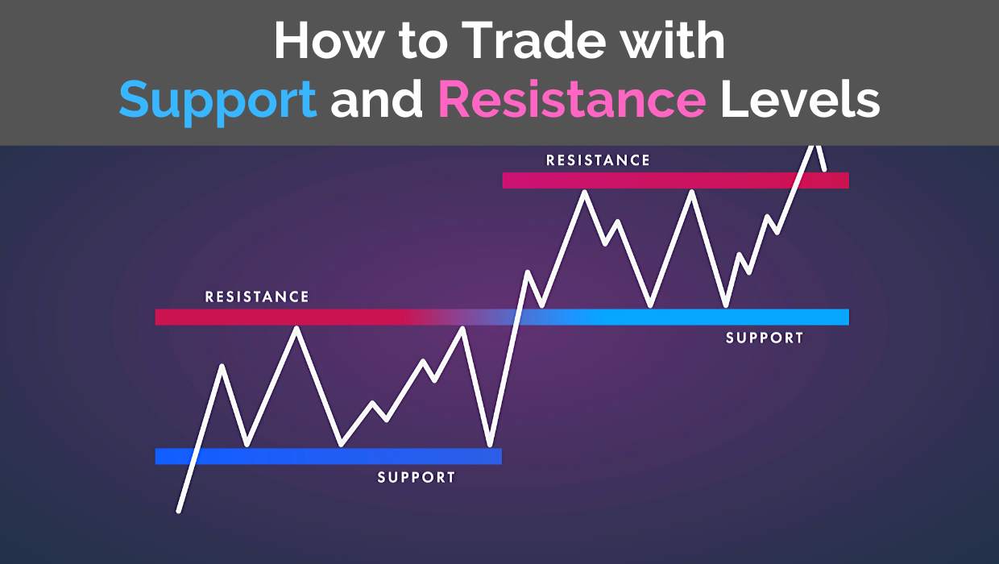

## Table of Contents

## What is a support level in trading?

A support level in trading is a price point where a stock or other asset tends to stop falling and start rising again. It's like a floor that the price bounces off of. Traders watch these levels closely because they can be good places to buy, hoping the price will go up from there.

Support levels form because of basic supply and demand. When the price of an asset drops to a certain point, more people might want to buy it, thinking it's a good deal. This increased demand can stop the price from falling further and might even push it higher. Over time, if the price keeps bouncing off the same level, that level becomes a strong support.

## How do you identify a support level on a price chart?

To identify a support level on a price chart, you need to look at past price movements. A support level is where the price has stopped going down and started going up several times. Imagine drawing a line under the lowest points of these bounces. If the price touches this line and then goes up again, that line is your support level.

It's helpful to look at longer time periods, like weeks or months, to find strong support levels. The more times the price hits the same level and bounces back, the stronger the support. Sometimes, you might see the price break through a support level, but if it quickly comes back up, that level can still be considered a support. Keep an eye on these levels because they can help you decide when to buy or sell.

## Why are support levels important for traders?

Support levels are important for traders because they help them make decisions about when to buy or sell. When the price of a stock or other asset drops to a support level, it often means that the price might start going up again. Traders look at these levels to find good times to buy, hoping to make money as the price rises from the support.

Understanding support levels can also help traders manage risk. If a trader buys near a support level and the price keeps falling, they might decide to sell to avoid losing more money. By knowing where the support levels are, traders can set their expectations and plan their moves more carefully, which can lead to better trading results.

## Can support levels be used in any financial market?

Yes, support levels can be used in any financial market, like stocks, [forex](/wiki/forex-system), commodities, and cryptocurrencies. They work the same way in all these markets. When the price of something drops to a support level, it often bounces back up. This happens because many people think it's a good time to buy when the price is low, and their buying pushes the price up again.

Traders in different markets look at support levels to decide when to buy or sell. For example, if a stock price hits a support level, a trader might buy it, hoping the price will go up. In the forex market, if a currency pair reaches a support level, traders might buy that currency, expecting its value to rise. Support levels help traders in any market to make smarter decisions and manage their risks better.

## What causes a support level to break?

A support level breaks when the price of an asset falls below it and keeps going down. This can happen for many reasons. One reason is if more people want to sell than buy at that price. When lots of people decide to sell, the price can drop below the support level because there aren't enough buyers to stop it.

Another reason a support level might break is if something big happens in the market or the world. For example, if a company does badly or there's bad news about the economy, people might get scared and sell their stocks quickly. This can push the price down past the support level. When a support level breaks, it can become a new resistance level, where the price might have trouble going up again.

## How do traders react when a support level is approached?

When a support level is approached, traders often get ready to make a move. They know that the price might stop going down and start going up again at this point. So, many traders might decide to buy the asset, hoping to make money as the price rises. They think it's a good time to buy because lots of other people might be thinking the same thing and their buying could push the price up.

But not all traders do the same thing. Some might be worried that the price will keep falling, so they might sell their assets to avoid losing money. Others might wait to see what happens, keeping a close eye on the price to see if it bounces back or breaks through the support level. It's a time when traders need to be careful and think about what they want to do next.

## What is the difference between a support level and a resistance level?

A support level is like a floor for the price of a stock or another asset. It's a price point where the price usually stops going down and starts going back up. This happens because more people want to buy at that price, thinking it's a good deal, which stops the price from falling further. Traders look at support levels to find good times to buy, hoping the price will rise from there.

A resistance level is the opposite. It's like a ceiling for the price. It's a point where the price often stops going up and starts going back down. This happens because more people want to sell at that price, thinking it's a good time to take their profits. Traders watch resistance levels to find good times to sell, hoping to make money before the price falls again. So, support levels and resistance levels help traders make decisions, but they work in opposite ways.

## How can historical data help in determining future support levels?

Historical data is really important for figuring out where future support levels might be. When you look at the past prices of a stock or any other asset, you can see where the price stopped going down and started going up before. These spots are the support levels. By looking at a chart and drawing a line under these low points, you can see where the price might stop falling again in the future. The more times the price hits the same spot and bounces back, the stronger that support level becomes.

Using historical data also helps traders understand how strong a support level might be. If a support level has held up many times in the past, it's more likely to hold up again. But if the price has broken through a support level before, traders will be more careful. They might think that the price could break through again. By studying the history, traders can make better guesses about what might happen next and plan their moves more carefully.

## What are the psychological factors that contribute to the formation of support levels?

Support levels in trading are influenced a lot by what people think and feel. When the price of something drops to a certain point, many people might think it's a good deal and decide to buy it. This belief that the price is low enough to be a good buy creates a kind of group thinking. Everyone sees the same price and reacts in a similar way, which can stop the price from falling further and might even push it up again. It's like everyone agrees that this price is a good spot to start buying.

These shared feelings and beliefs are what make support levels strong. If lots of people remember that the price bounced back from a certain point before, they might expect it to happen again. This expectation can make them more likely to buy when the price gets close to that level. So, the history of the price and what people think about it work together to create these important points where the price might stop falling and start rising.

## How do volume and price action confirm a support level?

Volume and price action can help show if a support level is strong. When the price of a stock or something else gets close to a support level, you can look at how many people are buying and selling. If a lot of people are buying at that price, it means the support level might be strong. High [volume](/wiki/volume-trading-strategy) at a support level means more people think it's a good time to buy, which can stop the price from falling more and might even push it up.

Price action also helps confirm a support level. When the price touches the support level and then goes up again, it shows that the support level is working. If this happens a few times, it makes the support level even stronger. Traders watch these patterns to decide if it's a good time to buy, hoping the price will go up from the support level. So, by looking at volume and how the price moves, traders can feel more sure about where the support levels are.

## What advanced techniques can be used to predict the strength of a support level?

To predict how strong a support level might be, traders can use something called technical indicators. One popular indicator is the Relative Strength Index (RSI). The RSI helps show if a stock is overbought or oversold. If the RSI shows that a stock is oversold when it hits a support level, it could mean the support level is strong because more people might want to buy it soon. Another useful indicator is the moving average convergence divergence (MACD). If the MACD shows a bullish signal when the price hits the support level, it can suggest that the price might go up from there.

Another advanced technique is to look at chart patterns. For example, if you see a double bottom pattern near a support level, it can mean the support is strong. A double bottom happens when the price hits the same low point twice and then goes up. This pattern shows that people are buying at that price, which can make the support level stronger. Also, traders can use trend lines to see if the overall trend is up or down. If the trend is up and the price hits a support level, it's more likely that the price will go up again. By combining these indicators and patterns, traders can get a better idea of how strong a support level might be.

## How do algorithmic trading systems incorporate support levels into their strategies?

Algorithmic trading systems use support levels to help them decide when to buy or sell. These systems are like smart computer programs that look at lots of data very quickly. They use past price information to find where support levels are. When the price of a stock or another thing gets close to a support level, the system might decide it's a good time to buy. The system thinks that if lots of people are buying at that price, it could stop the price from going down more and might even go up. So, the system can make trades based on these support levels without a person having to do anything.

Some advanced algorithmic systems also use other tools to make their decisions better. They might look at how many people are buying and selling, which is called volume, and use special indicators like the RSI or MACD to see if the support level is strong. If these tools show that the support level is likely to hold, the system might buy more or hold onto what it has. By combining all this information, the system can make smarter choices about when to trade, trying to make money when the price bounces back from a support level.

## What are the technical analysis tools used for identifying support levels?

Multiple tools and indicators are utilized in technical analysis to identify support levels effectively. Among the most common methods are trendlines, moving averages, and a variety of technical indicators.

**Trendlines and Moving Averages**

Trendlines are drawn on price charts to connect a series of descending price peaks or ascending price troughs, helping to visualize the direction of support levels. Moving averages serve a similar purpose, smoothing out price fluctuations over a specified duration to highlight trends. A popular form of moving average is the Simple Moving Average (SMA), which is calculated as follows:

$$
\text{SMA} = \frac{P_1 + P_2 + \ldots + P_n}{n}
$$

where $P_1, P_2, \ldots, P_n$ represent the previous n price points. Another common type is the Exponential Moving Average (EMA), which gives more weight to recent prices, thereby reacting more quickly to price changes.

**Psychological Support at Round Numbers**

Round numbers, such as 100, 1,000, or 10,000, often act as psychological support levels due to their perceived significance and memorability. Traders and investors occasionally place buy orders at these levels, anticipating that other market participants will do the same, thus reinforcing their role as support levels.

**Technical Indicators**

Indicators like the Relative Strength Index (RSI) and Moving Average Convergence Divergence (MACD) provide deeper insights into market [momentum](/wiki/momentum) and potential support levels. The RSI, for instance, measures the speed and change of price movements on a scale typically from 0 to 100. An RSI below 30 often signals an oversold condition, implying that a support level might be forming. In contrast, MACD is computed by subtracting the 26-period EMA from the 12-period EMA, and it assists traders in identifying potential buy and sell signals around support levels.

**Multi-timeframe Analysis**

Utilizing multi-timeframe analysis reinforces the validity of identified support levels. Observing price action on different timeframes—such as daily, weekly, and monthly charts—can provide a more comprehensive understanding of the persistence and robustness of support levels. Consistent support across multiple timeframes can indicate a stronger level.

**Education in Technical Analysis**

Training in technical analysis is critical for effectively identifying support levels. Engaging with educational resources, seminars, and webinars can advance one's understanding and application of these technical tools. Many trading platforms and financial institutions offer extensive educational material to help traders refine their technical analysis skills. Courses often cover a range of relevant topics, from basic chart reading to advanced algorithmic analysis techniques.

By combining these strategies and continuously improving through education, traders can enhance their proficiency in identifying and using support levels in their trading strategies.

## References & Further Reading

[1]: Bergstra, J., Bardenet, R., Bengio, Y., & Kégl, B. (2011). ["Algorithms for Hyper-Parameter Optimization."](https://papers.nips.cc/paper/4443-algorithms-for-hyper-parameter-optimization) Advances in Neural Information Processing Systems 24.

[2]: ["Advances in Financial Machine Learning"](https://www.amazon.com/Advances-Financial-Machine-Learning-Marcos/dp/1119482089) by Marcos Lopez de Prado

[3]: ["Evidence-Based Technical Analysis: Applying the Scientific Method and Statistical Inference to Trading Signals"](https://www.amazon.com/Evidence-Based-Technical-Analysis-Scientific-Statistical/dp/0470008741) by David Aronson

[4]: ["Machine Learning for Algorithmic Trading"](https://github.com/PacktPublishing/Machine-Learning-for-Algorithmic-Trading-Second-Edition) by Stefan Jansen

[5]: ["Quantitative Trading: How to Build Your Own Algorithmic Trading Business"](https://books.google.com/books/about/Quantitative_Trading.html?id=j70yEAAAQBAJ) by Ernest P. Chan