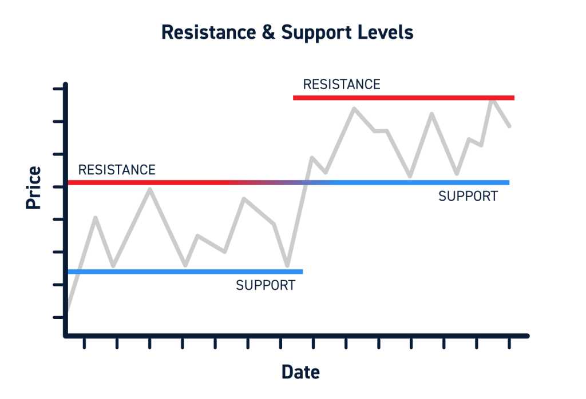

## Table of Contents

## What are support and resistance levels in financial markets?

Support and resistance levels are important concepts in financial markets that help traders and investors make decisions. Support is a price level where a financial asset, like a stock or currency, tends to stop falling and start increasing. It's like a floor that the price doesn't usually go below. Traders watch these levels because they believe that when the price reaches this point, it might be a good time to buy, expecting the price to go up again.

Resistance, on the other hand, is a price level where an asset tends to stop rising and start falling. It acts like a ceiling that the price struggles to break through. When the price hits this level, traders might think it's a good time to sell, expecting the price to drop. Both support and resistance levels are based on past price movements and can change over time as new data comes in.

Understanding these levels can help traders predict where prices might go next. If a price breaks through a resistance level, it might become a new support level. Similarly, if a price falls below a support level, that level might become a new resistance. By watching these levels, traders can make more informed decisions about when to buy or sell.

## How do support and resistance levels affect trading decisions?

Support and resistance levels help traders decide when to buy or sell. When a price gets close to a support level, traders might think it's a good time to buy. They believe the price won't go much lower and will start going up again. This can make more people want to buy, which can push the price up. On the other hand, when a price gets close to a resistance level, traders might think it's a good time to sell. They believe the price won't go much higher and will start going down again. This can make more people want to sell, which can push the price down.

These levels also help traders set their goals and limits. For example, if a trader buys near a support level, they might set a goal to sell when the price reaches the next resistance level. If the price breaks through a resistance level, it might become a new support level, and traders might see this as a sign to keep holding or buy more. Similarly, if a price falls below a support level, that level might become a new resistance level, and traders might see this as a sign to sell or wait for a better time to buy. By using support and resistance levels, traders can make smarter choices about when to enter or exit the market.

## What causes support and resistance levels to form?

Support and resistance levels form because of how people act when they trade. When lots of people think a price is too low and start buying, it can stop the price from falling more. This is how a support level forms. It's like a group of people agreeing that the price shouldn't go any lower, so they buy and push the price back up. On the other hand, when lots of people think a price is too high and start selling, it can stop the price from going up more. This is how a resistance level forms. It's like a group of people agreeing that the price shouldn't go any higher, so they sell and push the price back down.

These levels are also influenced by past prices. If a price has bounced off a certain level many times before, traders remember this and expect it to happen again. This memory of past prices helps create strong support and resistance levels. When traders see the price getting close to these levels, they might act in the same way as before, buying near support and selling near resistance. This behavior keeps these levels important and helps them stay in place over time.

## How can traders identify support and resistance levels on a chart?

Traders can identify support and resistance levels by looking at past prices on a chart. They look for times when the price stopped going down and started going up. This is a support level. They also look for times when the price stopped going up and started going down. This is a resistance level. By connecting these points on the chart, traders can draw lines that show where these levels are. The more times the price touches these lines without breaking through, the stronger the support or resistance level is.

Another way to find these levels is by using tools like trend lines and moving averages. A trend line is a straight line drawn along the highs or lows of the price to show the direction of the trend. If the price keeps bouncing off a trend line, it can act as a support or resistance level. Moving averages smooth out price data to show the average price over a certain time. When the price gets close to a moving average, it can act like a support or resistance level. By using these tools, traders can see where the price might stop and change direction, helping them make better trading decisions.

## What is the significance of historical price levels in determining support and resistance?

Historical price levels are very important for figuring out where support and resistance might be. When a price hits a certain level many times in the past and bounces back, it shows that many people agree on that price. This agreement makes the level strong. Traders look at these past prices to guess where the price might stop falling or rising in the future. If a price has stopped at the same level many times before, traders expect it to happen again. This helps them decide when to buy or sell.

These historical levels can also change over time. If a price breaks through a support or resistance level, that level can switch roles. A broken resistance level can become a new support level, and a broken support level can become a new resistance level. Traders watch these changes closely because they show shifts in what people think about the price. By understanding how historical prices affect support and resistance, traders can make better guesses about where the price might go next and plan their trades accordingly.

## How do moving averages relate to support and resistance levels?

Moving averages help traders find support and resistance levels by smoothing out the price over time. A moving average is like a line that shows the average price of a stock or other asset over a certain number of days. When the price of the asset gets close to this moving average line, it can act like a support or resistance level. If the price keeps bouncing off the moving average without going through it, the moving average becomes a strong support or resistance level. Traders watch these lines because they can show where the price might stop and change direction.

Different moving averages can show different support and resistance levels. A short-term moving average, like a 20-day moving average, can show quick changes in the price and help find support and resistance for short-term trades. A long-term moving average, like a 200-day moving average, can show bigger trends and help find support and resistance for longer-term trades. By looking at how the price interacts with these moving averages, traders can make better guesses about where the price might go next and plan their trades accordingly.

## What are the common strategies for trading around support and resistance levels?

One common strategy for trading around support and resistance levels is called "buying at support and selling at resistance." Traders watch the price as it gets close to a support level. If the price bounces off the support level and starts going up, traders buy the asset, hoping to sell it later at a higher price, maybe near a resistance level. When the price gets close to a resistance level, traders might sell the asset, expecting it to start going down again. This strategy works well when the support and resistance levels are strong and the price keeps bouncing off them.

Another strategy is called "breakout trading." Traders look for times when the price breaks through a support or resistance level. If the price breaks above a resistance level, traders might buy the asset, thinking it will keep going up. If the price breaks below a support level, traders might sell the asset, thinking it will keep going down. This strategy can be risky because the price might not keep moving in the same direction after breaking through a level. But if the breakout is strong, it can lead to big profits. Traders often use other tools, like moving averages or volume, to confirm that a breakout is real and not just a false move.

## How do psychological price levels impact support and resistance?

Psychological price levels are numbers that people think are important, like round numbers. These levels can make support and resistance stronger because many traders watch them. For example, if a stock price is going down and gets close to $50, a lot of people might think it's a good time to buy because $50 is a round number. This can stop the price from falling more and create a support level. On the other hand, if the price is going up and gets close to $100, a lot of people might think it's a good time to sell because $100 is a round number. This can stop the price from going up more and create a resistance level.

These psychological levels work because people remember them easily and make decisions based on them. When a lot of traders agree on these levels, it can make the price move in a certain way. For example, if many people decide to buy at $50, the price might go up from there. If many people decide to sell at $100, the price might go down from there. By understanding these psychological levels, traders can guess where the price might stop and change direction, helping them make better trading choices.

## What role do volume and liquidity play in the strength of support and resistance levels?

Volume and liquidity are important for making support and resistance levels strong. Volume is how many people are buying and selling. When a lot of people are trading at a certain price, it can make that price a strong support or resistance level. If many people buy at a support level, it can stop the price from falling more. If many people sell at a resistance level, it can stop the price from going up more. High volume shows that a lot of people agree on the price, which makes the level stronger.

Liquidity is how easy it is to buy or sell something without changing the price too much. When there's a lot of liquidity, it's easier for the price to stay at a support or resistance level. If there's not much liquidity, the price can move a lot with just a few trades, making support and resistance levels weaker. So, high volume and good liquidity can make support and resistance levels more reliable, helping traders make better guesses about where the price might go next.

## How can traders use support and resistance levels to set stop-loss and take-profit orders?

Traders can use support and resistance levels to set stop-loss orders to limit their losses. A stop-loss order is like a safety net that tells the computer to sell the asset if the price falls to a certain level. Traders often set their stop-loss just below a support level. If the price breaks through the support level, it might keep falling, so the stop-loss helps the trader get out before losing too much money. For example, if a trader buys a stock at $50 and the support level is at $48, they might set the stop-loss at $47. This way, if the price goes below $48, the trader won't lose more than they planned.

Traders also use support and resistance levels to set take-profit orders to lock in their profits. A take-profit order tells the computer to sell the asset when it reaches a certain price. Traders often set their take-profit just below a resistance level. If the price gets close to the resistance level, it might stop going up, so the take-profit helps the trader sell before the price starts to fall. For example, if a trader buys a stock at $50 and the resistance level is at $55, they might set the take-profit at $54. This way, if the price goes up to $55, the trader can make a profit before the price might drop again. By using support and resistance levels to set stop-loss and take-profit orders, traders can manage their trades better and protect their money.

## What are the limitations and potential pitfalls of relying on support and resistance levels?

Relying on support and resistance levels can be tricky because they are not always exact. Sometimes the price might go a little above or below these levels before it starts moving in the expected direction. This can make traders think the level has been broken when it hasn't, leading them to make wrong decisions. Also, support and resistance levels can change over time. What was a strong level in the past might not be as strong now, so traders need to keep checking their charts and updating their levels. If they don't, they might miss out on new levels that have formed.

Another problem is that many traders might be looking at the same levels. If a lot of people try to buy at a support level or sell at a resistance level at the same time, it can cause the price to move in unexpected ways. This can make the levels less reliable. Also, relying too much on support and resistance without considering other things like news, trends, and the overall market can lead to mistakes. Traders need to use these levels along with other tools and information to make the best decisions.

## How can advanced traders combine support and resistance with other technical indicators for more robust trading strategies?

Advanced traders can combine support and resistance levels with other technical indicators to make their trading strategies stronger. One common way is to use moving averages along with support and resistance. Moving averages can help confirm when a price is really bouncing off a support or resistance level. For example, if the price touches a support level and then starts going up, traders might look at the moving average to see if it's also going up. If both the price and the moving average are moving in the same direction, it can give traders more confidence that the price will keep going up. Another useful indicator is the Relative Strength Index (RSI), which shows if a stock is overbought or oversold. If the price hits a support level and the RSI is low, it might be a good time to buy because the stock is likely to go up soon.

Traders can also use volume indicators to make their support and resistance strategies better. High volume at a support or resistance level can show that the level is strong and more likely to hold. For example, if the price hits a resistance level and the volume is high, it means a lot of people are selling, which makes the resistance level stronger. Traders can use this information to decide when to sell. Another helpful tool is the Fibonacci retracement levels, which can show where the price might stop and change direction. If a Fibonacci level matches up with a support or resistance level, it can make that level even more important. By using these other indicators along with support and resistance, traders can make better guesses about where the price will go next and plan their trades more carefully.

## What is Algorithmic Trading and how does it relate to Market Reversal Strategy?

Combining technical analysis with [algorithmic trading](/wiki/algorithmic-trading) seamlessly integrates human analytical skills with the precision and speed of automated systems. This synthesis allows for the effective execution of trading strategies based on market reversal signals, which are primarily recognized through preset rules and conditions derived from technical indicators. The automation aspect empowers traders to optimize their execution, mitigate emotions, and manage risks efficiently.

One prominent approach in algorithmic trading is the pivot reversal strategy. This method focuses on identifying pivot points, which are central price levels that signal potential market reversals. Algorithms are programmed to detect these pivot points through historical price data analysis and statistical models. For instance, a simple pivot point can be calculated using the formula:

$$
\text{Pivot Point (PP)} = \frac{\text{High} + \text{Low} + \text{Close}}{3}
$$

Once identified, these points assist the algorithm in making precise decisions on trade entries and exits. The algorithm can be set to initiate a trade when the market price crosses above a pivot point, suggesting a potential upward reversal, or sell short when the price crosses below, indicating a potential downward reversal.

Algorithmic tools, such as the AT Trader Algo, enhance this process by automating the recognition and trading based on trendline reversals. These tools employ complex algorithms that not only identify pivot points but also adjust trading parameters based on real-time data, [volatility](/wiki/volatility-trading-strategies), and other market conditions. A Python snippet illustrating a basic automated trading logic might look like this:

```python
def calculate_pivot_point(high, low, close):
    return (high + low + close) / 3

def should_enter_trade(current_price, pivot_point):
    if current_price > pivot_point:
        return "buy"
    elif current_price < pivot_point:
        return "sell"
    else:
        return "hold"

# Example usage
high = 105
low = 95
close = 100
current_price = 102

pivot_point = calculate_pivot_point(high, low, close)
action = should_enter_trade(current_price, pivot_point)
print(f"Pivot Point: {pivot_point}, Action: {action}")
```

Such algorithms allow the strategic identification of market entry and exit points, ensuring that trades are executed at the most opportune times. The automation of these processes doesn't merely optimize decision-making but also incorporates dynamic adjustments based on market trends, resulting in a more robust and responsive trading strategy.

While algorithmic trading in trend reversals offers various advantages, a robust strategy must consider external market factors and integrate them into the algorithm for enhanced accuracy. Continual refinement and stress testing of these algorithms are crucial to adapt to the ever-evolving market conditions.

## References & Further Reading

[1]: Pring, M. J. (2002). ["Technical Analysis Explained: The Successful Investor's Guide to Spotting Investment Trends and Turning Points."](https://www.amazon.com/Technical-Analysis-Explained-Fifth-Successful/dp/0071825177) McGraw-Hill.

[2]: Murphy, J. J. (1999). ["Technical Analysis of the Financial Markets: A Comprehensive Guide to Trading Methods and Applications."](https://archive.org/details/technicalanalysi0000murp) New York Institute of Finance.

[3]: Elder, A. (2002). ["Come Into My Trading Room: A Complete Guide to Trading."](https://www.amazon.com/Come-Into-My-Trading-Room/dp/0471225347) John Wiley & Sons.

[4]: Chan, E. (2009). ["Quantitative Trading: How to Build Your Own Algorithmic Trading Business."](https://github.com/ftvision/quant_trading_echan_book) John Wiley & Sons.

[5]: Jansen, S. (2018). ["Machine Learning for Algorithmic Trading: Predictive Models to Extract Signals from Market and Alternative Data for Systematic Trading Strategies with Python."](https://www.amazon.com/Machine-Learning-Algorithmic-Trading-alternative/dp/1839217715) Packt Publishing.