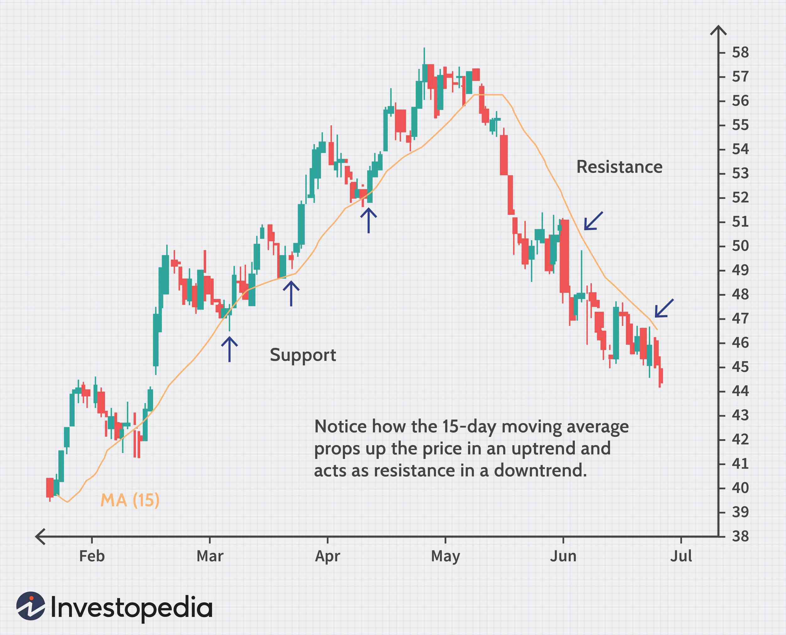

This article examines market reversals, technical analysis, support and resistance levels, and their critical role in algorithmic trading. Market reversal strategies focus on pivotal points where market trends change direction. By understanding these mechanics, traders can identify opportunities to enter or exit markets at optimal moments when the underlying direction of an asset's price movement shifts.

Technical analysis is integral to these strategies, relying heavily on support and resistance levels. These levels are key points on a price chart where a trend might pause or reverse, helping traders make informed predictions about future price movements. The identification of such levels allows traders to anticipate potential reversals, thereby providing a strategic edge in the marketplace. Charts and historical price data are scrutinized to recognize these support and resistance zones, which may guide traders in making decisions.



Algorithmic trading introduces a modern framework for capitalizing on technical analysis and market reversals. By utilizing automated systems, traders can execute strategies at a speed and consistency unattainable by human traders alone. These algorithms can process vast amounts of data, identify reversal patterns, and execute trades based on predefined criteria without emotional interference. As a result, algorithmic trading enhances the efficiency and effectiveness of trading strategies centered around market reversals, ensuring they are applied with precision and at the most opportune times. 

By marrying the traditional art of technical analysis with the advanced capabilities of algorithmic systems, traders are better equipped to navigate the complex dynamics of financial markets and capitalize on trends and reversals with greater confidence.

## Table of Contents

## Understanding Market Reversals

Market reversals represent a crucial shift in the direction of a prevailing trend in financial markets. Recognizing these reversals enables traders to capitalize on potential price movements, offering opportunities for profit by entering or exiting positions strategically.

Trend reversals and retracements are distinct phenomena within market movements. A trend reversal indicates a complete change in the direction of the overall market movement. For instance, a downtrend transforms into an uptrend when a series of lower lows and lower highs transitions into higher highs and higher lows. This shift is often identified using technical indicators such as moving averages, the Relative Strength Index (RSI), or trendline breaks. In contrast, retracements are temporary pauses or pullbacks in an existing trend, often caused by profit-taking or short-term imbalances in supply and demand. Unlike reversals, retracements do not signify a change in the market direction but rather a short-lived correction.

Technical indicators play a pivotal role in distinguishing between reversals and retracements. Moving averages, for example, help smooth out price data, making trends easier to identify. When short-term moving averages cross above long-term moving averages, it may signal a potential upward reversal, commonly known as a "golden cross." Conversely, a "death cross," where a short-term moving average crosses below a long-term moving average, may indicate a downward reversal.

Another set of indicators useful for identifying reversal signals includes oscillators like the RSI or the Moving Average Convergence Divergence (MACD). The RSI measures the speed and change of price movements, indicating overbought or oversold conditions that might precede reversals. For example, an RSI value above 70 might suggest that a security is overbought, implying a potential downward reversal. On the other hand, MACD is valuable for identifying changes in [momentum](/wiki/momentum), with crossovers between the MACD line and the signal line serving as potential reversal signals.

Effective trading execution necessitates timely identification of reversal signals. Incorporating technical indicators into a comprehensive strategy allows traders to differentiate between genuine trend reversals and transient retracements. This capability enhances decision-making, enabling market participants to navigate and capitalize on the dynamic nature of financial markets efficiently.

## Technical Analysis: The Role of Support and Resistance

Support and resistance levels are integral components of technical analysis. These levels signify price points on a chart where an asset's price repeatedly halts its upward or downward trajectory. Support is recognized as a price level where a downtrend can be expected to pause due to demand concentration, leading to a stabilization or a bounce in prices upward. Conversely, resistance occurs at a point where a rising price trend faces a barrier due to an increase in supply, potentially reversing or halting the upward movement.

### Transformation of Support and Resistance

A fundamental aspect of understanding support and resistance is their potential transformation. When a support level is breached, it may become a resistance level, and vice versa. This phenomenon can be attributed to the psychological shift among traders. For instance, once a support level is broken, traders who bought at or above support levels might decide to sell at break-even or minimal loss once prices rise to the prior support, now acting as resistance. Similarly, if a resistance level is surpassed, it might transform into a support level, as new market participants now view it as a favorable entry point.

### Practical Examples

Historical data provides numerous instances where support and resistance levels have influenced stock indices and individual stocks. Consider the case of the S&P 500 index, which often exhibits clear support and resistance zones visible on long-term charts. For example, the index encountering support around the 3200 level on multiple occasions demonstrated a persistent floor that curbed further declines. Similarly, the Dow Jones Industrial Average has frequently tested and respected historical resistance levels, acting as a ceiling during attempts to breach the 30,000 mark.

To illustrate with an individual stock, Apple Inc. (AAPL) often showcases support and resistance dynamics. A prominent example occurred when Apple's stock rallied past the $150 resistance level, which had previously rejected multiple upward attempts. After decisively breaching this level, $150 transformed into support, aiding in stabilizing future price retracements.

### Technical Analysis in Practice

To leverage support and resistance for trading, practitioners often deploy various tools, such as moving averages, trendlines, and Fibonacci retracement levels, to identify potential zones. A simple algorithm to track these levels in Python might involve using libraries such as pandas for data manipulation and matplotlib for visualization:

```python
import pandas as pd
import matplotlib.pyplot as plt

# Load price data into a pandas DataFrame
data = pd.read_csv('stock_prices.csv', parse_dates=['Date'], index_col='Date')
price_data = data['Close']

# Calculate moving average to identify support/resistance levels
data['MA50'] = price_data.rolling(window=50).mean()

# Plotting the close price and moving average
plt.figure(figsize=(12, 6))
plt.plot(data.index, data['Close'], label='Close Price', color='blue')
plt.plot(data.index, data['MA50'], label='50-Day MA', color='red')
plt.title('Stock Price with Support/Resistance Levels')
plt.xlabel('Date')
plt.ylabel('Price')
plt.legend()
plt.show()
```

In this script, a 50-day moving average is used as an example to indicate potential support and resistance levels. Moving averages smooth out price data, providing clearer insights into market trends and pivotal levels where support or resistance could occur.

Understanding support and resistance enhances predictive capabilities in trading, enabling traders to make informed decisions about entry and [exit](/wiki/exit-strategy) points. The mastery of these concepts, complemented by algorithmic assessments, can refine trading strategies and improve the potential for successful investments.

## Algorithmic Trading and Market Reversal Strategy

Combining technical analysis with [algorithmic trading](/wiki/algorithmic-trading) seamlessly integrates human analytical skills with the precision and speed of automated systems. This synthesis allows for the effective execution of trading strategies based on market reversal signals, which are primarily recognized through preset rules and conditions derived from technical indicators. The automation aspect empowers traders to optimize their execution, mitigate emotions, and manage risks efficiently.

One prominent approach in algorithmic trading is the pivot reversal strategy. This method focuses on identifying pivot points, which are central price levels that signal potential market reversals. Algorithms are programmed to detect these pivot points through historical price data analysis and statistical models. For instance, a simple pivot point can be calculated using the formula:

$$
\text{Pivot Point (PP)} = \frac{\text{High} + \text{Low} + \text{Close}}{3}
$$

Once identified, these points assist the algorithm in making precise decisions on trade entries and exits. The algorithm can be set to initiate a trade when the market price crosses above a pivot point, suggesting a potential upward reversal, or sell short when the price crosses below, indicating a potential downward reversal.

Algorithmic tools, such as the AT Trader Algo, enhance this process by automating the recognition and trading based on trendline reversals. These tools employ complex algorithms that not only identify pivot points but also adjust trading parameters based on real-time data, [volatility](/wiki/volatility-trading-strategies), and other market conditions. A Python snippet illustrating a basic automated trading logic might look like this:

```python
def calculate_pivot_point(high, low, close):
    return (high + low + close) / 3

def should_enter_trade(current_price, pivot_point):
    if current_price > pivot_point:
        return "buy"
    elif current_price < pivot_point:
        return "sell"
    else:
        return "hold"

# Example usage
high = 105
low = 95
close = 100
current_price = 102

pivot_point = calculate_pivot_point(high, low, close)
action = should_enter_trade(current_price, pivot_point)
print(f"Pivot Point: {pivot_point}, Action: {action}")
```

Such algorithms allow the strategic identification of market entry and exit points, ensuring that trades are executed at the most opportune times. The automation of these processes doesn't merely optimize decision-making but also incorporates dynamic adjustments based on market trends, resulting in a more robust and responsive trading strategy.

While algorithmic trading in trend reversals offers various advantages, a robust strategy must consider external market factors and integrate them into the algorithm for enhanced accuracy. Continual refinement and stress testing of these algorithms are crucial to adapt to the ever-evolving market conditions.

## Advantages and Limitations of Algo Trading in Trend Reversals

Algorithmic trading, particularly in trend reversal strategies, offers numerous advantages that can significantly enhance trading efficiency. A primary benefit is the elimination of emotional biases. Algo trading systems operate based on predefined rules and parameters, which reduces the influence of human emotions that often lead to suboptimal trading decisions. Traders are frequently swayed by emotions such as fear and greed, which can negatively impact their decision-making process. By employing algorithms, these emotional factors are minimized, allowing for more rational and consistent trading practices.

Another advantage of algorithmic trading is the capability for extensive [backtesting](/wiki/backtesting). Before an algorithm is deployed in live markets, it can be rigorously tested against historical data. This capability allows traders to evaluate potential strategies under different market conditions and adjust their parameters for optimal performance. For trend reversal strategies, backtesting can be particularly beneficial, as it enables the identification of potential reversal points and the conditions under which these points have historically signaled a change in trend. This historical perspective can help in refining algorithms to better capture reversal opportunities.

However, there are limitations associated with algo trading in trend reversals. One significant limitation is the reliance on historical data. While backtesting can provide insights, past performance is not always indicative of future results, especially in volatile or rapidly changing markets. The dynamics of financial markets are continuously evolving, and an algorithm that performs well historically may not necessarily perform well in the present or future.

Additionally, the risk of false signals in volatile markets presents a challenge. In such environments, prices can move erratically, and algorithms may misinterpret these movements as legitimate trend reversals when they are merely temporary fluctuations or noise in the market. This can lead to frequent incorrect trades and potential losses.

To mitigate these risks, traders can adopt adaptive strategies and robust risk management frameworks. Adaptive strategies involve continuously updating algorithmic models based on real-time market data, thus allowing the system to learn from new patterns as they emerge. This adaptability can improve the accuracy of detecting genuine trend reversals. Moreover, integrating risk management techniques, such as setting stop-loss orders and using position sizing strategies, can help protect against significant losses due to false signals or unforeseen market events.

In implementing these solutions, traders can leverage modern programming languages like Python, which offers a variety of libraries for financial analysis, such as pandas for data manipulation and [backtrader](/wiki/backtrader) for strategy backtesting. This combination of technological resources and analytical methods forms a comprehensive approach to utilizing algorithmic trading for trend reversals effectively.

## Conclusion

Market reversals represent a significant facet of technical analysis, offering traders opportunities to benefit from shifts in trend direction. These reversals are not merely random occurrences but are often the result of identifiable patterns and signals that skilled traders can recognize and exploit. By understanding the intricacies of market movements, traders can effectively leverage reversals to optimize their trading outcomes.

When market reversal strategies are combined with algorithmic trading, they create a robust framework for trade execution. Algorithmic trading systems can automate diverse strategies, ensuring that trades adhere strictly to predefined rules without succumbing to emotional biases. This automation allows for rapid decision-making and execution, critical in today's fast-paced markets. Sophisticated algorithms can analyze large datasets, identify potential reversals, and execute trades at optimal entry and exit points, enhancing the efficiency and effectiveness of trading strategies.

For sustained success, traders must continuously refine their strategies. This involves integrating new technologies and insights into their trading practices. In an environment characterized by constant change and innovation, staying updated with the latest advancements is essential. Traders should embrace the development of adaptive strategies, utilizing tools that can learn and evolve with emerging market conditions. Machine learning and [artificial intelligence](/wiki/ai-artificial-intelligence) are particularly promising, offering the potential to refine algorithmic trading models based on real-time data analysis and evolving market behaviors.

In conclusion, market reversals, when coupled with the precision and speed of algorithmic trading, provide a formidable toolkit for traders. As markets continue to evolve, the integration of cutting-edge technologies and dynamic strategies will be key to achieving consistent success. Embracing innovation and maintaining a proactive approach to strategy development will enable traders to navigate and thrive in increasingly complex and competitive markets.

## References & Further Reading

[1]: Pring, M. J. (2002). ["Technical Analysis Explained: The Successful Investor's Guide to Spotting Investment Trends and Turning Points."](https://www.amazon.com/Technical-Analysis-Explained-Fifth-Successful/dp/0071825177) McGraw-Hill.

[2]: Murphy, J. J. (1999). ["Technical Analysis of the Financial Markets: A Comprehensive Guide to Trading Methods and Applications."](https://archive.org/details/technicalanalysi0000murp) New York Institute of Finance.

[3]: Elder, A. (2002). ["Come Into My Trading Room: A Complete Guide to Trading."](https://www.amazon.com/Come-Into-My-Trading-Room/dp/0471225347) John Wiley & Sons.

[4]: Chan, E. (2009). ["Quantitative Trading: How to Build Your Own Algorithmic Trading Business."](https://github.com/ftvision/quant_trading_echan_book) John Wiley & Sons.

[5]: Jansen, S. (2018). ["Machine Learning for Algorithmic Trading: Predictive Models to Extract Signals from Market and Alternative Data for Systematic Trading Strategies with Python."](https://www.amazon.com/Machine-Learning-Algorithmic-Trading-alternative/dp/1839217715) Packt Publishing.