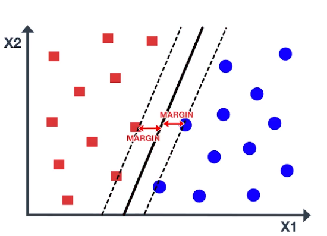

In the evolving world of financial markets, algorithmic trading is at the forefront of innovation. As markets become more complex and data-driven, the need for sophisticated analytical tools has never been greater. Among the various machine learning techniques currently employed, Support Vector Machines (SVMs) have emerged as a powerful tool, particularly for tasks that involve classification. SVMs are renowned for their ability to handle small, structured datasets, which frequently characterize certain trading scenarios. Their ability to construct hyperplanes as decision boundaries makes them especially suitable for binary classification tasks that are common in trading.

Once highly popular, SVMs have found a niche in handling specific trading scenarios where datasets are small and manageable. The reduced complexity and faster processing time of SVMs contribute significantly to their suitability in these cases. Such characteristics can be advantageous when algorithmic trading strategies require timely decisions based on smaller, high-quality datasets rather than vast volumes of data.



This article aims to explore the role of SVMs in algorithmic trading, examining their strengths and weaknesses as well as how they can be practically implemented. Through a comprehensive exploration of SVMs, this guide will provide insights into the mathematical foundations that underpin their functionality—concepts such as the maximization of the margin between classes and the importance of support vectors. By understanding the principles behind SVMs and their application to trading algorithms, traders and researchers can better assess when SVMs may be the right choice for their specific needs.

With relevant examples and mathematical intuition, this guide provides insights into why SVMs might be the right choice in certain trading circumstances. We will tackle practical implementation issues, such as the selection of kernel functions and parameter tuning, to ensure that SVMs not only offer theoretical appeal but also deliver tangible benefits in real-world algorithmic trading setups.

## Table of Contents

## Understanding Support Vector Machines

Support Vector Machines (SVMs) are a robust [machine learning](/wiki/machine-learning) technique prominently used for classification tasks. Their fundamental operation revolves around identifying a hyperplane that optimally separates classes within a high-dimensional feature space. This separation is crucial for distinguishing among different categories within the dataset.

A hyperplane in the context of SVMs is not confined to the conventional concept of a plane in three-dimensional space but rather extends to a subspace within a multi-dimensional setting. It acts as a decision boundary that partitions the dataset into distinct categories. Each side of the hyperplane represents one of the classes that the SVM aims to differentiate. For instance, in a simple two-dimensional representation, a hyperplane would appear as a line separating data points belonging to two classes.

The primary objective of using a hyperplane in SVMs is to maximize the margin, which is defined as the distance between the hyperplane and the closest data points from each class, known as support vectors. These support vectors are critical as they determine the position and orientation of the hyperplane. By maximizing this margin, SVMs enhance their ability to generalize to new, unseen data, thereby improving the model's classification performance. Mathematically, this can be expressed as the following optimization problem:

$$

\min_{\mathbf{w}, b} \frac{1}{2} \|\mathbf{w}\|^2 
$$

subject to the condition:

$$

y_i (\mathbf{w} \cdot \mathbf{x}_i + b) \geq 1 
$$

for each training example $\mathbf{x}_i$ with class label $y_i$. Here, $\mathbf{w}$ represents the weight vector perpendicular to the hyperplane, while $b$ denotes the bias term.

Through their elegant approach of hyperplane-based separation, SVMs are particularly effective when handling datasets that are cleanly separable or nearly so, making them a popular choice in various classification problems within [algorithmic trading](/wiki/algorithmic-trading) and beyond.

## Mathematics Behind Support Vector Machines

Support Vector Machines (SVMs) are fundamentally rooted in solving an optimization problem. At their core, SVMs seek to determine the hyperplane that maximizes the margin between two classes in a dataset. The margin refers to the distance from the hyperplane to the nearest data point of any class, with the optimal solution ensuring the widest possible margin. This maximization problem is crucial as it leads to a model that generalizes well to unseen data.

Support vectors are the essential data points that lie closest to the hyperplane. These points are critical in defining the position and orientation of the hyperplane. In many scenarios, these are the only data points that actively influence the decision boundary, ensuring that SVMs remain memory efficient due to their reliance on a smaller subset of the entire dataset.

Mathematically, the SVM classification problem can be formulated as an optimization problem:

$$
\min \frac{1}{2} \|\mathbf{w}\|^2
$$

subject to the constraints:

$$
y_i(\mathbf{w} \cdot \mathbf{x}_i + b) \geq 1, \quad \forall i
$$

where $\mathbf{w}$ is the weight vector, $\mathbf{x}_i$ represents the input features, $y_i$ is the class label (either +1 or -1), and $b$ is the bias. The objective is to minimize the norm of the weight vector $\|\mathbf{w}\|^2$, which equivalently maximizes the margin. 

Solving this optimization problem involves the use of Lagrange multipliers and can be expressed as a dual formulation. This duality allows SVMs to handle larger datasets more efficiently and offers a framework to extend the linear classifier to non-linear cases using kernel functions.

The process ensures that the model correctly classifies the training data while maintaining robustness through margin maximization. Proper selection and optimization of the hyperplane lead to a balance between fitting the training data well and ensuring enough generalizability to handle new data accurately.

## Soft Margin Classifier

In many practical applications, it is uncommon for datasets to be perfectly separable. This necessitates considerations beyond the ideal scenario of clear-cut class distinctions. The concept of the 'soft margin' in Support Vector Machines (SVMs) addresses such situations by allowing for certain misclassifications, thereby enhancing the model's capability to handle real-world data complexities.

The soft margin framework introduces slack variables $(\xi_i)$ for each data point, where $i$ indexes the instances in the dataset. These variables measure the degree of misclassification, enabling the model to tolerate some errors while striving for the largest possible margin. Thus, the optimization problem originally structured for SVMs is reformulated to include these slack variables:

$$
\min \frac{1}{2} \| \mathbf{w} \|^2 + C \sum_{i=1}^{n} \xi_i
$$

subject to the constraints:

$$
y_i(\mathbf{w}^T \mathbf{x}_i + b) \geq 1 - \xi_i, \quad \xi_i \geq 0
$$

Here, $\mathbf{w}$ is the weight vector, $\mathbf{x}_i$ are the input features, $b$ is the bias term, $y_i$ denotes the class label, and $C$ is the regularization parameter. The role of $C$ is pivotal; it functions as a trade-off mechanism, balancing the width of the margin against the penalty of classification errors. A higher $C$ constrains the model to reduce errors more aggressively, potentially at the cost of a smaller margin. Conversely, a lower $C$ allows for a larger margin with more leniency towards misclassifications.

This integration of slack variables and the regularization parameter creates a flexible model that can adapt to the noise and overlap in real-world data. By adjusting $C$, practitioners can tailor the SVM to align with specific priorities—either emphasizing a stricter adherence to margin maximization or allowing for broader error accommodation to handle complex, noisy datasets. The soft margin thus enhances the applicability of SVMs across diverse domains, including challenging financial market predictions where data complexity and inter-class ambiguities frequently occur.

## Non-linear Models and Kernel Trick

Support Vector Machines (SVMs) are versatile tools used for complex classification tasks, particularly in non-linear contexts. This adaptability is primarily achieved through the kernel trick, a method that allows SVMs to operate in transformed feature spaces without explicitly computing these transformations. 

### Kernel Trick 

In essence, the kernel trick involves applying a kernel function that implicitly projects the input data into a higher-dimensional space. The goal is to make the dataset linearly separable in this transformed space, even if it is not linearly separable in the original feature space. This transformation enables the SVM to find a hyperplane that effectively separates the data points of different classes.

Mathematically, the kernel function $K(x, x')$ replaces the dot product $x \cdot x'$ in the SVM formulation, where $x$ and $x'$ are feature vectors. The power of the kernel trick is in its ability to compute the dot product in the higher-dimensional space without ever explicitly computing the coordinates of the data in that space. This efficiency is particularly advantageous for managing the computational cost, as it avoids the curse of dimensionality.

### Common Kernels 

1. **Polynomial Kernel**: This kernel is expressed as $K(x, x') = (x \cdot x' + c)^d$, where $c$ is a constant and $d$ is the degree of the polynomial. The polynomial kernel allows for more flexible decision boundaries than a linear kernel and can model complex relationships between features. It is often used when interactions up to a certain degree are expected between the features.

2. **Radial Basis Function (RBF) Kernel**: Also known as the Gaussian kernel, it is defined as $K(x, x') = \exp(-\gamma \|x - x'\|^2)$, where $\gamma$ is a parameter that controls the flexibility of the decision boundary. The RBF kernel is powerful for its ability to handle non-linear classification tasks, as it can map points into infinite-dimensional space, making it particularly suitable for scenarios where the relationship between features is highly complex.

These kernels enable SVMs to perform well in situations where the data exhibits non-linear patterns, offering diverse ways to adjust the decision boundary, thus enhancing the model's accuracy and robustness. By selecting an appropriate kernel and tuning its parameters, practitioners can tailor the SVM to address specific classification challenges within algorithmic trading and other domains.

## Application of SVMs in Algorithmic Trading

Support Vector Machines (SVMs) have found a significant application in algorithmic trading, where they are utilized to predict market trends, classify trading signals, and optimize trading strategies. This is particularly effective with datasets that are small and well-organized, making SVMs a valuable tool for quantitative analysts working with limited data.

SVMs are trained on historical market data to identify patterns that may suggest future market movements. The historical data typically includes dozens of financial indicators, technical analysis tools, and past price information. By identifying patterns inherent in this data, SVMs can generate predictions on whether a security's price will increase, decrease, or stay flat. Such predictions are based on the model's ability to classify different states of the market using a decision function that separates different classes (e.g., "buy" or "sell" signals).

A fundamental strength of SVMs is their capability to manage non-linear relationships in data. In financial markets, patterns often do not follow a simple linear relationship due to various influencing factors such as market sentiment, global economic changes, and political events. SVMs address this complexity by using kernel functions, which transform the input features into a higher-dimensional space, enabling the creation of a more flexible decision boundary. For example, a radial basis function (RBF) kernel can be employed to capture intricate patterns in the market data without the need for an explicit transformation:

$$
K(x_i, x_j) = \exp \left(- \frac{\|x_i - x_j\|^2}{2\sigma^2} \right)
$$

Here $x_i$ and $x_j$ represent data points, and $\sigma$ is a parameter that determines the function's spread.

The versatility of SVMs in handling complex, non-linear patterns thus makes them particularly useful in scenarios where traditional linear models such as linear regression or even some decision tree algorithms might not perform adequately. This ability helps in constructing robust algorithmic trading strategies capable of adapting to changing market conditions.

In practical terms, the implementation of an SVM for trading involves choosing appropriate hyperparameters and kernels that align with the specific market and trading goals. It also entails careful consideration of the trade-off between bias and variance, especially when dealing with limited data. Hyperparameter tuning and cross-validation are crucial processes to ensure the model is neither overfitting nor underfitting the training data.

To illustrate, a simple Python code snippet to train an SVM for trading purposes might look as follows:

```python
from sklearn import svm
from sklearn.model_selection import train_test_split
import pandas as pd

# Assuming 'market_data' is a Pandas DataFrame with features as columns and 'labels' for buy/sell signal
X = market_data.drop('labels', axis=1)
y = market_data['labels']
X_train, X_test, y_train, y_test = train_test_split(X, y, test_size=0.2, random_state=42)

# Create and train the SVM model
model = svm.SVC(kernel='rbf', C=1.0, gamma='scale')
model.fit(X_train, y_train)

# Predict and assess model
predictions = model.predict(X_test)
accuracy = model.score(X_test, y_test)
print(f'Model accuracy: {accuracy}')
```

In summary, SVMs' ability to capture complex patterns, their robustness in avoiding overfitting through appropriate kernel choices, and the direct applicability to small, structured datasets make them a powerful component in the toolbox of algorithmic trading professionals.

## Advantages and Challenges of SVMs

Support Vector Machines (SVMs) offer several advantages that make them a prominent choice for algorithmic trading and other practical applications. One of the core strengths of SVMs is their capability to operate effectively in high-dimensional spaces. This is particularly beneficial when dealing with complex datasets that involve numerous features, as SVMs focus primarily on the data points that are most influential in defining the boundary between different classes. These influential points are known as support vectors. By concentrating on these support vectors, SVMs are highly memory-efficient, only storing and utilizing the critical data required to define the decision boundary.

An additional strength of SVMs lies in their robustness and stability when dealing with data that may not be perfectly linearly separable. While not unique to SVMs, the use of kernel functions allows the transformation of input data into higher dimensions, enabling the effective handling of non-linear relationships without escalating computational complexity. This flexibility enhances their applicability to diverse trading scenarios where non-linear interactions are common.

Despite these advantages, SVMs also present challenges, particularly when applied to large datasets. The computational cost associated with training SVMs can be significant, as the optimization process required to find the optimal hyperplane can become resource-intensive. As the size of the dataset increases, the computational demands correspondingly rise, potentially leading to inefficiencies in processing time and resource use.

Moreover, SVMs do not inherently provide probabilistic interpretations of class membership. This means that, unlike models such as logistic regression or Naive Bayes, SVMs do not offer probabilities of belonging to a certain class, which can be crucial in decision-making processes where risk assessment and probability estimates are essential. To address this limitation, methods such as Platt scaling can be employed, albeit adding another layer of complexity to model implementation.

For SVMs to achieve optimal performance in practical applications, selecting the appropriate kernel function and fine-tuning parameters is crucial. The choice of kernel can significantly affect the model's ability to handle non-linear patterns in the data, while parameter tuning, specifically the regularization parameter $C$ and kernel parameters such as the degree in polynomial kernels or gamma in radial basis function kernels, directly impacts the trade-off between achieving a smooth decision boundary and minimizing classification errors.

In summary, while Support Vector Machines provide powerful tools for classification tasks within algorithmic trading, their effectiveness hinges on careful management of computational requirements and thoughtful selection and tuning of model parameters.

## Conclusion

Support Vector Machines (SVMs) demonstrate significant applicability in the sphere of algorithmic trading, particularly for binary classification tasks where datasets are limited. Their prowess lies in their adaptability, facilitated by the use of kernel functions, which enable SVMs to tackle both linear and non-linear classification problems effectively. By leveraging the 'kernel trick', SVMs transform data into higher-dimensional spaces without incurring prohibitive computational costs. This characteristic is invaluable in financial markets where capturing complex, non-linear relationships is often essential for accurate predictions.

A notable strength of SVMs is their ability to manage model complexity and avoid overfitting, primarily due to their reliance on support vectors. These are the data points that lie closest to the decision boundary, ensuring that the SVM model generalizes well even with limited training data. This makes SVMs particularly useful in scenarios where the dataset size is a constraint, allowing them to extract meaningful insights without the risk of overfitting to noise in the data.

However, while SVMs offer robust performance in specific situations, they are not universally superior across all trading environments. They can be computationally demanding when scaled to larger datasets and do not inherently provide probabilistic estimates of class memberships. Consequently, the appropriate selection of kernel functions and meticulous parameter tuning are critical to harnessing their full potential in practical applications.

In essence, when employed judiciously with well-chosen datasets and parameters, SVMs can significantly enhance prediction capabilities in algorithmic trading, making them a potent component of a quantitative analyst's analytical framework. Despite their limitations, the potential of SVMs to offer powerful predictive insights should not be underestimated, providing a decisive edge in nuanced trading scenarios.

## References & Further Reading

[1]: Cortes, C., & Vapnik, V. (1995). ["Support-Vector Networks."](https://link.springer.com/article/10.1007/BF00994018) Machine Learning, 20(3), 273–297.

[2]: Cristianini, N., & Shawe-Taylor, J. (2000). ["An Introduction to Support Vector Machines and Other Kernel-based Learning Methods."](https://www.semanticscholar.org/paper/An-Introduction-to-Support-Vector-Machines-and-Cristianini-Shawe-Taylor/6ec7c724aa1d906e9e9f81c58497adddb22175b8) Cambridge University Press.

[3]: Vapnik, V. (1998). ["Statistical Learning Theory."](https://www.semanticscholar.org/paper/Statistical-learning-theory-Vapnik/1e52db1f61a5f0083cbe87845c019ab351bfe6c9) Wiley-Interscience.

[4]: Smola, A. J., & Schölkopf, B. (2004). ["A Tutorial on Support Vector Regression."](http://alex.smola.org/papers/2003/SmoSch03b.pdf) Statistics and Computing, 2004, 14: 199–222.

[5]: Kuhn, M., & Johnson, K. (2013). ["Applied Predictive Modeling."](https://link.springer.com/book/10.1007/978-1-4614-6849-3) Springer.

[6]: Bennett, K. P., & Campbell, C. (2000). ["Support Vector Machines: Hype or Hallelujah?"](https://dl.acm.org/doi/10.1145/380995.380999) ACM SIGKDD Explorations Newsletter, 2(2), 1-13.