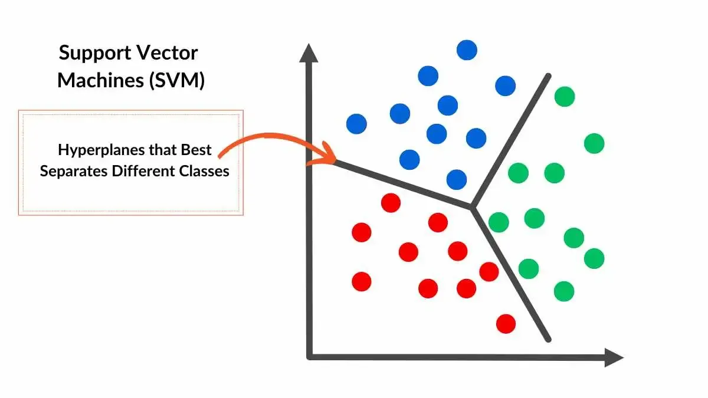

## Table of Contents

## What are Support Vector Machines (SVMs) and what are they used for?

Support Vector Machines, often called SVMs, are a type of machine learning algorithm used for classification and regression tasks. They work by finding the best line or hyperplane that separates different groups of data points. Imagine you have a bunch of red and blue dots on a piece of paper, and you want to draw a line that separates the red dots from the blue dots. SVMs try to find the line that is as far away as possible from both the closest red and blue dots, which helps in making the separation more accurate.

SVMs are used in many fields, like recognizing handwritten numbers, classifying emails as spam or not spam, and even in medical diagnosis to tell if a tumor is cancerous or not. They are popular because they can handle data that is not easily separated by a straight line, by using something called a "kernel trick" to transform the data into a higher dimension where it can be separated more easily. This makes SVMs very powerful and flexible for solving complex problems.

## How does an SVM work to classify data?

An SVM works by finding the best way to split different groups of data. Imagine you have two types of fruits, apples and oranges, and you want to separate them on a table. You can draw a line between them, but you want this line to be as far away as possible from both the closest apple and the closest orange. This line is called the "hyperplane," and the distance between the hyperplane and the closest points from each group is called the "margin." The SVM tries to maximize this margin to make the separation as clear and accurate as possible.

Sometimes, the data can't be split with a straight line because it's all mixed up. That's where the "kernel trick" comes in. The kernel trick helps the SVM by transforming the data into a higher dimension where it's easier to draw a line to separate the groups. For example, if you can't separate apples and oranges on a flat table, you might be able to do it if you could lift the fruits into the air and draw a curved surface around them. This makes SVMs very useful for dealing with complex data that doesn't line up neatly in a simple way.

## What is the difference between hard margin and soft margin in SVMs?

In SVMs, a hard margin means the line that separates the data is very strict. It only works if the data can be split perfectly with no mistakes. Imagine drawing a line on a piece of paper to separate red and blue dots, and the line must be so perfect that no red dot is on the blue side and no blue dot is on the red side. If even one dot is on the wrong side, you can't use a hard margin. This is good when your data is very clean and can be split perfectly, but it's not useful if your data has any mistakes or overlaps.

A soft margin, on the other hand, is more flexible. It allows for some mistakes or overlaps in the data. Instead of trying to find a perfect line, it looks for a line that makes the fewest mistakes possible. You can think of it like drawing a line where a few red dots might end up on the blue side, or a few blue dots on the red side, but overall, the line does a good job of separating the groups. This is useful in real life because data is often messy and not perfect, so a soft margin helps the SVM work better with real-world data.

## What is the kernel trick and why is it important in SVMs?

The kernel trick is a smart way that SVMs use to handle data that's hard to separate with a straight line. Imagine you have some dots on a piece of paper, and you can't draw a line to split them into two groups. The kernel trick helps by lifting the dots into a higher dimension where it's easier to draw a line to separate them. It's like if you can't separate apples and oranges on a flat table, but if you could lift them into the air, you might be able to draw a curved surface around them to keep them apart.

This trick is really important because it makes SVMs much more powerful and flexible. Without the kernel trick, SVMs would only work well with data that can be split with a straight line, which isn't very common in real life. By using the kernel trick, SVMs can handle all sorts of messy and complicated data, making them useful for things like recognizing handwriting, sorting emails, and even helping doctors tell if a tumor is cancerous or not. It's like giving the SVM a superpower to deal with the real world's messiness.

## What are the common types of kernels used in SVMs?

The most common type of kernel used in SVMs is the linear kernel. This is the simplest one and works by drawing a straight line to separate the data. It's like trying to split apples and oranges on a table with a single line. The linear kernel is good when the data can be separated easily with a straight line, but it doesn't work well if the data is more complicated.

Another common kernel is the polynomial kernel. This one is like using a curved line or even a more complex shape to separate the data. It's helpful when the data can't be split with a straight line but can be separated if you draw a curve around it. The polynomial kernel lets the SVM lift the data into a higher dimension to make it easier to separate.

The radial basis function (RBF) kernel, also known as the Gaussian kernel, is also widely used. It's like using a bubble or a balloon to wrap around the data points. This kernel is very flexible and can handle data that's really mixed up and hard to separate. It's good for a lot of real-world problems because it can deal with data that's not neatly organized.

## How do you choose the right kernel for an SVM?

Choosing the right kernel for an SVM depends on what your data looks like and what problem you're trying to solve. If your data can be easily split with a straight line, like if you have two groups of points that are clearly on different sides of a line, then a linear kernel is the simplest and usually the best choice. It's like using a ruler to draw a line on a piece of paper to separate red and blue dots.

But if your data is more complicated and can't be split with a straight line, you might need a different kernel. A polynomial kernel can help if the data can be separated with a curve, like if you need to draw a wavy line to keep apples and oranges apart on a table. If the data is really messy and mixed up, the radial basis function (RBF) kernel, also called the Gaussian kernel, is often a good choice. It's like using a bubble to wrap around the points and separate them. You might need to try different kernels and see which one works best for your specific problem.

## What is the role of the C parameter in SVMs?

The C parameter in SVMs is like a knob that you can turn to control how strict or forgiving the SVM is when it separates the data. Imagine you're drawing a line to split red and blue dots on a piece of paper. If you turn the C parameter up high, the SVM will try really hard to get the line right and won't allow many mistakes. It's like being a strict teacher who wants everything to be perfect. But if you turn the C parameter down low, the SVM will be more relaxed and allow for some mistakes, like a teacher who is okay with a few errors if the overall job is good.

Choosing the right C parameter is important because it affects how well the SVM works. If C is too high, the SVM might try too hard to fit the training data perfectly, which can make it bad at guessing new data. This is called overfitting, and it's like memorizing all the answers for a test without really understanding the subject. If C is too low, the SVM might not try hard enough, and it might not separate the data well, which can make it bad at guessing too. So, you need to find a balance, like finding the right amount of strictness to make the SVM work well with both the data you have and new data it hasn't seen before.

## How can SVMs handle multi-class classification?

SVMs are really good at splitting data into two groups, but what if you have more than two groups? That's where multi-class classification comes in. One way to do this is called the "one-vs-one" approach. Imagine you have three types of fruit: apples, oranges, and bananas. With the one-vs-one approach, you would train the SVM to separate apples from oranges, then apples from bananas, and finally oranges from bananas. You do this for every pair of groups, and then when you want to classify a new fruit, you let all these SVMs vote on which group it belongs to. The group that gets the most votes wins.

Another way to handle multi-class classification is the "one-vs-rest" approach. Let's go back to our fruit example. With the one-vs-rest approach, you train one SVM to separate apples from everything else (oranges and bananas), another SVM to separate oranges from everything else (apples and bananas), and a third SVM to separate bananas from everything else (apples and oranges). When you want to classify a new fruit, you run it through all three SVMs, and the one that says "yes, this is my group" the strongest wins. Both methods can work well, but you might need to try them out to see which one works better for your specific problem.

## What are the advantages of using SVMs over other classification methods?

SVMs have some special advantages that make them really useful. One big advantage is that they work well even when you don't have a lot of data to train with. They can find the best line to split the data into groups without needing tons of examples. Another cool thing about SVMs is that they can handle data that's all mixed up and hard to separate. They use something called the kernel trick to lift the data into a higher dimension where it's easier to draw a line to keep the groups apart. This makes SVMs very flexible and able to deal with all sorts of complicated problems.

Another advantage is that SVMs are really good at avoiding overfitting. Overfitting is when a model tries too hard to fit the training data perfectly but then doesn't work well with new data. SVMs have a special parameter called C that helps control this. By setting C just right, you can make the SVM work well with both the data you have and new data it hasn't seen before. This makes SVMs reliable and good at making predictions that are accurate and useful in the real world.

## What are the limitations and challenges of using SVMs?

One of the main challenges with SVMs is that they can be slow to train, especially when you have a lot of data. Imagine trying to find the best line to split a huge pile of dots; it takes a long time to check all the possibilities. This can be a problem if you need quick results or if you're working with a big dataset. Also, SVMs need a lot of memory to store all the calculations they do, which can be tough if you're using a computer that doesn't have a lot of space.

Another limitation is that SVMs can be hard to understand and explain. They use complicated math to find the best line to split the data, and it's not always easy to see why they made the choices they did. This can be a problem if you need to explain your model to someone else or if you want to understand how it's making decisions. Plus, choosing the right settings, like the kernel and the C parameter, can be tricky. You might need to try a lot of different options to find the one that works best for your specific problem, which can take time and effort.

## How do you optimize the performance of an SVM model?

To optimize the performance of an SVM model, you need to carefully choose the right kernel and the C parameter. The kernel helps the SVM handle complicated data, so you might need to try different kernels like the linear, polynomial, or RBF kernel to see which one works best for your data. The C parameter controls how strict the SVM is when it separates the data. If C is too high, the SVM might try too hard to fit the training data perfectly, which can make it bad at guessing new data. If C is too low, it might not try hard enough, and it might not separate the data well. So, you need to find a balance that makes the SVM work well with both the data you have and new data it hasn't seen before.

Another way to optimize the SVM's performance is by using a technique called cross-validation. This means you split your data into smaller pieces, train the SVM on some of the pieces, and then test it on the others. You do this over and over again with different pieces of data to see how well the SVM works on average. This helps you find the best settings for the kernel and the C parameter without overfitting to just one set of data. By trying different settings and using cross-validation, you can make your SVM model as accurate and reliable as possible for real-world use.

## What are some advanced techniques or variations of SVMs used in research and industry?

One advanced technique used with SVMs is called "multi-class SVMs." While regular SVMs are great at splitting data into two groups, multi-class SVMs can handle more than two groups. There are two main ways to do this: the one-vs-one approach and the one-vs-rest approach. In the one-vs-one approach, you train an SVM for every pair of groups, so if you have three groups, you train three SVMs. Each SVM votes on which group a new data point belongs to, and the group with the most votes wins. In the one-vs-rest approach, you train one SVM for each group to separate it from all the others. When you want to classify a new data point, you see which SVM says "yes, this is my group" the strongest. Both methods can work well, but you might need to try them out to see which one works better for your specific problem.

Another advanced variation is "kernel learning," where you don't just use one kernel but combine different kernels to make a better one. This can help the SVM handle even more complicated data. Imagine you have a bunch of tools like a ruler, a curve, and a bubble, and you use them together to draw the best line to split your data. By mixing different kernels, you can create a custom kernel that fits your data perfectly. This technique is used in research and industry to make SVMs even more powerful and flexible for solving tough problems.

Lastly, there's "online SVMs," which are useful when you have a lot of data coming in all the time, like in real-time applications. Regular SVMs need to see all the data at once to train, but online SVMs can learn from new data as it comes in, without needing to start over. This is like learning a little bit more each day instead of trying to learn everything at once. Online SVMs are great for things like predicting stock prices or monitoring traffic, where you need to keep updating your model with new information to make the best predictions.

## What is Understanding Support Vector Machines?

Support Vector Machines (SVMs) are a robust [machine learning](/wiki/machine-learning) technique prominently used for classification tasks. Their fundamental operation revolves around identifying a hyperplane that optimally separates classes within a high-dimensional feature space. This separation is crucial for distinguishing among different categories within the dataset.

A hyperplane in the context of SVMs is not confined to the conventional concept of a plane in three-dimensional space but rather extends to a subspace within a multi-dimensional setting. It acts as a decision boundary that partitions the dataset into distinct categories. Each side of the hyperplane represents one of the classes that the SVM aims to differentiate. For instance, in a simple two-dimensional representation, a hyperplane would appear as a line separating data points belonging to two classes.

The primary objective of using a hyperplane in SVMs is to maximize the margin, which is defined as the distance between the hyperplane and the closest data points from each class, known as support vectors. These support vectors are critical as they determine the position and orientation of the hyperplane. By maximizing this margin, SVMs enhance their ability to generalize to new, unseen data, thereby improving the model's classification performance. Mathematically, this can be expressed as the following optimization problem:

$$

\min_{\mathbf{w}, b} \frac{1}{2} \|\mathbf{w}\|^2 
$$

subject to the condition:

$$

y_i (\mathbf{w} \cdot \mathbf{x}_i + b) \geq 1 
$$

for each training example $\mathbf{x}_i$ with class label $y_i$. Here, $\mathbf{w}$ represents the weight vector perpendicular to the hyperplane, while $b$ denotes the bias term.

Through their elegant approach of hyperplane-based separation, SVMs are particularly effective when handling datasets that are cleanly separable or nearly so, making them a popular choice in various classification problems within [algorithmic trading](/wiki/algorithmic-trading) and beyond.

## What is the Mathematics Behind Support Vector Machines?

Support Vector Machines (SVMs) are fundamentally rooted in solving an optimization problem. At their core, SVMs seek to determine the hyperplane that maximizes the margin between two classes in a dataset. The margin refers to the distance from the hyperplane to the nearest data point of any class, with the optimal solution ensuring the widest possible margin. This maximization problem is crucial as it leads to a model that generalizes well to unseen data.

Support vectors are the essential data points that lie closest to the hyperplane. These points are critical in defining the position and orientation of the hyperplane. In many scenarios, these are the only data points that actively influence the decision boundary, ensuring that SVMs remain memory efficient due to their reliance on a smaller subset of the entire dataset.

Mathematically, the SVM classification problem can be formulated as an optimization problem:

$$
\min \frac{1}{2} \|\mathbf{w}\|^2
$$

subject to the constraints:

$$
y_i(\mathbf{w} \cdot \mathbf{x}_i + b) \geq 1, \quad \forall i
$$

where $\mathbf{w}$ is the weight vector, $\mathbf{x}_i$ represents the input features, $y_i$ is the class label (either +1 or -1), and $b$ is the bias. The objective is to minimize the norm of the weight vector $\|\mathbf{w}\|^2$, which equivalently maximizes the margin. 

Solving this optimization problem involves the use of Lagrange multipliers and can be expressed as a dual formulation. This duality allows SVMs to handle larger datasets more efficiently and offers a framework to extend the linear classifier to non-linear cases using kernel functions.

The process ensures that the model correctly classifies the training data while maintaining robustness through margin maximization. Proper selection and optimization of the hyperplane lead to a balance between fitting the training data well and ensuring enough generalizability to handle new data accurately.

## What is a Soft Margin Classifier?

In many practical applications, it is uncommon for datasets to be perfectly separable. This necessitates considerations beyond the ideal scenario of clear-cut class distinctions. The concept of the 'soft margin' in Support Vector Machines (SVMs) addresses such situations by allowing for certain misclassifications, thereby enhancing the model's capability to handle real-world data complexities.

The soft margin framework introduces slack variables $(\xi_i)$ for each data point, where $i$ indexes the instances in the dataset. These variables measure the degree of misclassification, enabling the model to tolerate some errors while striving for the largest possible margin. Thus, the optimization problem originally structured for SVMs is reformulated to include these slack variables:

$$
\min \frac{1}{2} \| \mathbf{w} \|^2 + C \sum_{i=1}^{n} \xi_i
$$

subject to the constraints:

$$
y_i(\mathbf{w}^T \mathbf{x}_i + b) \geq 1 - \xi_i, \quad \xi_i \geq 0
$$

Here, $\mathbf{w}$ is the weight vector, $\mathbf{x}_i$ are the input features, $b$ is the bias term, $y_i$ denotes the class label, and $C$ is the regularization parameter. The role of $C$ is pivotal; it functions as a trade-off mechanism, balancing the width of the margin against the penalty of classification errors. A higher $C$ constrains the model to reduce errors more aggressively, potentially at the cost of a smaller margin. Conversely, a lower $C$ allows for a larger margin with more leniency towards misclassifications.

This integration of slack variables and the regularization parameter creates a flexible model that can adapt to the noise and overlap in real-world data. By adjusting $C$, practitioners can tailor the SVM to align with specific priorities—either emphasizing a stricter adherence to margin maximization or allowing for broader error accommodation to handle complex, noisy datasets. The soft margin thus enhances the applicability of SVMs across diverse domains, including challenging financial market predictions where data complexity and inter-class ambiguities frequently occur.

## How are SVMs applied in algorithmic trading?

Support Vector Machines (SVMs) have found a significant application in algorithmic trading, where they are utilized to predict market trends, classify trading signals, and optimize trading strategies. This is particularly effective with datasets that are small and well-organized, making SVMs a valuable tool for quantitative analysts working with limited data.

SVMs are trained on historical market data to identify patterns that may suggest future market movements. The historical data typically includes dozens of financial indicators, technical analysis tools, and past price information. By identifying patterns inherent in this data, SVMs can generate predictions on whether a security's price will increase, decrease, or stay flat. Such predictions are based on the model's ability to classify different states of the market using a decision function that separates different classes (e.g., "buy" or "sell" signals).

A fundamental strength of SVMs is their capability to manage non-linear relationships in data. In financial markets, patterns often do not follow a simple linear relationship due to various influencing factors such as market sentiment, global economic changes, and political events. SVMs address this complexity by using kernel functions, which transform the input features into a higher-dimensional space, enabling the creation of a more flexible decision boundary. For example, a radial basis function (RBF) kernel can be employed to capture intricate patterns in the market data without the need for an explicit transformation:

$$
K(x_i, x_j) = \exp \left(- \frac{\|x_i - x_j\|^2}{2\sigma^2} \right)
$$

Here $x_i$ and $x_j$ represent data points, and $\sigma$ is a parameter that determines the function's spread.

The versatility of SVMs in handling complex, non-linear patterns thus makes them particularly useful in scenarios where traditional linear models such as linear regression or even some decision tree algorithms might not perform adequately. This ability helps in constructing robust algorithmic trading strategies capable of adapting to changing market conditions.

In practical terms, the implementation of an SVM for trading involves choosing appropriate hyperparameters and kernels that align with the specific market and trading goals. It also entails careful consideration of the trade-off between bias and variance, especially when dealing with limited data. Hyperparameter tuning and cross-validation are crucial processes to ensure the model is neither overfitting nor underfitting the training data.

To illustrate, a simple Python code snippet to train an SVM for trading purposes might look as follows:

```python
from sklearn import svm
from sklearn.model_selection import train_test_split
import pandas as pd

# Assuming 'market_data' is a Pandas DataFrame with features as columns and 'labels' for buy/sell signal
X = market_data.drop('labels', axis=1)
y = market_data['labels']
X_train, X_test, y_train, y_test = train_test_split(X, y, test_size=0.2, random_state=42)

# Create and train the SVM model
model = svm.SVC(kernel='rbf', C=1.0, gamma='scale')
model.fit(X_train, y_train)

# Predict and assess model
predictions = model.predict(X_test)
accuracy = model.score(X_test, y_test)
print(f'Model accuracy: {accuracy}')
```

In summary, SVMs' ability to capture complex patterns, their robustness in avoiding overfitting through appropriate kernel choices, and the direct applicability to small, structured datasets make them a powerful component in the toolbox of algorithmic trading professionals.

## References & Further Reading

[1]: Cortes, C., & Vapnik, V. (1995). ["Support-Vector Networks."](https://link.springer.com/article/10.1007/BF00994018) Machine Learning, 20(3), 273–297.

[2]: Cristianini, N., & Shawe-Taylor, J. (2000). ["An Introduction to Support Vector Machines and Other Kernel-based Learning Methods."](https://www.semanticscholar.org/paper/An-Introduction-to-Support-Vector-Machines-and-Cristianini-Shawe-Taylor/6ec7c724aa1d906e9e9f81c58497adddb22175b8) Cambridge University Press.

[3]: Vapnik, V. (1998). ["Statistical Learning Theory."](https://www.semanticscholar.org/paper/Statistical-learning-theory-Vapnik/1e52db1f61a5f0083cbe87845c019ab351bfe6c9) Wiley-Interscience.

[4]: Smola, A. J., & Schölkopf, B. (2004). ["A Tutorial on Support Vector Regression."](http://alex.smola.org/papers/2003/SmoSch03b.pdf) Statistics and Computing, 2004, 14: 199–222.

[5]: Kuhn, M., & Johnson, K. (2013). ["Applied Predictive Modeling."](https://link.springer.com/book/10.1007/978-1-4614-6849-3) Springer.

[6]: Bennett, K. P., & Campbell, C. (2000). ["Support Vector Machines: Hype or Hallelujah?"](https://dl.acm.org/doi/10.1145/380995.380999) ACM SIGKDD Explorations Newsletter, 2(2), 1-13.