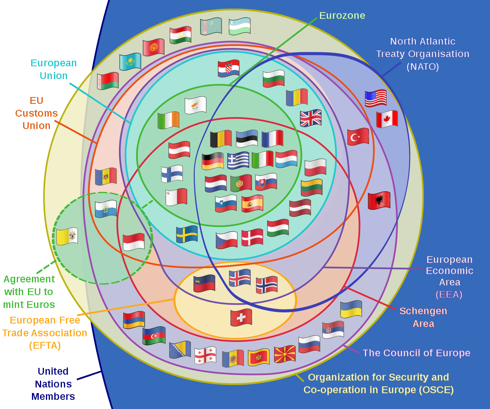

In today's interconnected world, supranational organizations have taken an increasingly pivotal role in shaping global governance. As economies become more interdependent, these entities assist in the harmonization of international policies that affect trade, security, and economic development. Supranational bodies such as the European Union, United Nations, and World Trade Organization serve as platforms for forging collaborative strategies and establishing global norms that facilitate cooperation across borders. 

Concurrently, the financial sector is witnessing transformative changes due to the advent of algorithmic trading. This technology utilizes complex algorithms to automate trading decisions, allowing for rapid transactions based on comprehensive market data analysis. The proliferation of algorithmic trading introduces new complexities and efficiencies to financial markets, necessitating comprehensive regulatory frameworks to ensure market integrity. Supranational regulations have become instrumental in defining these frameworks, establishing international standards that mitigate potential risks such as market manipulation and volatility. 

This interdependence between supranational governance and technological advancements like algorithmic trading underscores a nuanced dynamic that influences global economic policies and trading strategies. For policymakers, investors, and stakeholders, understanding how these elements interact is crucial to navigating an increasingly complex global landscape. By fostering transparent regulations and promoting technological innovation, supranational organizations help establish a stable and predictable financial environment that benefits global markets. These forces collectively shape the modern economic order, ushering in an era where informed governance and innovative trading techniques drive sustainable growth and stability.

## Table of Contents

## Understanding Supranational Global Governance

Supranational governance represents a form of international cooperation wherein member states willingly transfer a portion of their national sovereignty to collective institutions. This model is designed to promote effective collaboration, mitigate conflicts, and advance shared economic and social policies across borders. By pooling sovereignty, member states aim to achieve outcomes that might be difficult or impossible to attain independently.

The European Union (EU) serves as a prime example of supranational governance. It possesses its own institutions capable of creating laws and regulations that take precedence over national laws in specific areas. The EU's structure allows for unified policies in areas such as trade, environment, and competition, which facilitate seamless cooperation among its member countries.

The United Nations (UN) exemplifies another dimension of supranational governance. While it does not have the same legislative power as the EU, the UN plays a crucial role in fostering international peace and security, human rights, and social progress. Through its various bodies, such as the Security Council and the General Assembly, the UN facilitates dialogue and decision-making on pressing global issues, demonstrating the potential of supranational governance to address challenges beyond the capacity of individual nations.

Similarly, the World Trade Organization (WTO) illustrates how supranational entities can create frameworks for addressing international trade and economic issues. The WTO establishes rules governing international trade with the goal of reducing barriers and promoting fair competition. Its dispute resolution mechanism underscores its supranational characteristic by providing a platform for countries to resolve trade conflicts based on agreed international standards.

Supranational governance adapts to meet emerging global challenges, such as climate change and trade regulation. These challenges often transcend national borders, requiring coordinated strategies to be effectively addressed. For instance, global climate initiatives, like the Paris Agreement, represent efforts by supranational entities to unify countries under common environmental goals.

In conclusion, supranational governance epitomizes a strategic response to contemporary global issues, striving for enhanced cooperation among nations while balancing national and collective interests. Through shared institutions, member states can better navigate the complexities of an interconnected world by implementing collective solutions for challenges that impact the global community.

## The Role of International Organizations

## The Role of International Organizations

International organizations play a significant role in establishing global standards and regulations essential for maintaining stability and order in trade, security, and finance. These organizations act as vital platforms for negotiation and collaboration, enabling countries to address and resolve transnational issues effectively. By facilitating dialogue and cooperation, they contribute to a more interconnected and cohesive international community.

Key institutions such as the International Monetary Fund (IMF), the World Bank, and the World Trade Organization (WTO) are instrumental in promoting economic stability and fostering development. The IMF, for instance, provides policy advice, financial assistance, and technical expertise to help member countries achieve macroeconomic stability. The World Bank focuses on poverty reduction and supports sustainable development by offering loans and grants for various projects, particularly in developing nations. Meanwhile, the WTO oversees international trade agreements, aiming to ensure smooth and predictable trade flows.

One of the primary functions of these organizations is to create a stable and predictable economic environment that encourages investment. By establishing common rules and reducing uncertainties, they enable investors to make informed decisions, enhancing capital flows and fostering economic growth globally. For instance, the WTO's trade facilitation agreements help reduce trade barriers and streamline customs procedures, thereby lowering transaction costs for businesses.

Additionally, these international bodies address economic crises and foster recovery through coordinated efforts. During financial turbulence, they offer critical support and guidance, helping countries implement effective policy measures. This support is crucial in restoring confidence in global markets and ensuring the resumption of growth.

In summary, international organizations are indispensable in shaping global economic landscapes. Their efforts in setting standards, facilitating cooperation, and ensuring stability contribute to a more equitable and prosperous world economy. As global challenges continue to evolve, the role of these organizations in guiding collective economic and social policy will remain pivotal.

## Algorithmic Trading in a Globalized Economy

Algorithmic trading represents a significant evolution in the financial markets, utilizing advanced algorithms to execute trades at speeds and volumes that exceed human capability. Essentially, this form of trading leverages computational algorithms to make informed decisions on buying and selling securities based on intricate market data and trends. These algorithms can incorporate a vast array of factors, from historical data analysis to pattern recognition and real-time market monitoring, to optimize trading strategies.

One of the prominent features of [algorithmic trading](/wiki/algorithmic-trading) is its high-frequency trading ([HFT](/wiki/high-frequency-trading-strategies)) capability, which involves executing a large number of orders at extremely fast speeds, often in fractions of a second. This requires sophisticated technologies and infrastructure that can process vast amounts of financial data and execute trades rapidly. The ability to react almost instantaneously to market changes provides a competitive edge, allowing traders to capitalize on small price discrepancies and market inefficiencies.

Supranational regulations play an essential role in ensuring the stability and integrity of algorithmic trading across global markets. These regulations help standardize trading practices, reduce systemic risks, and mitigate the possibilities of market manipulation and excessive [volatility](/wiki/volatility-trading-strategies). For instance, organizations like the Basel Committee on Banking Supervision and the International Organization of Securities Commissions (IOSCO) develop guidelines that promote robust risk management practices and encourage market transparency.

The globalized economy further amplifies the impact of algorithmic trading by bridging financial markets around the world. This connectivity facilitates unprecedented levels of efficiency and [liquidity](/wiki/liquidity-risk-premium) and fosters a more integrated financial system. It enables market participants in different regions to interact seamlessly, breaking down traditional barriers associated with time zones and geographic locations.

As the world becomes increasingly interconnected, the prevalence and reliance on algorithmic trading are expected to grow. This evolution necessitates ongoing collaboration between regulatory bodies and financial institutions to ensure that algorithmic trading continues to contribute to market efficiency without compromising stability or fairness. The balance of promoting technological innovation while safeguarding market integrity remains a critical priority in the rapidly evolving landscape of global finance.

## Challenges and Criticisms of Supranational Entities

Critics of supranational entities contend that such governance structures may erode national sovereignty and democratic accountability. This concern arises as member states transfer certain decision-making powers to supranational institutions, potentially diminishing the direct control citizens and national governments have over their domestic affairs. A key issue in this context is the balance between respecting national interests and fulfilling global responsibilities. Supranational bodies, by their nature, operate on a transnational level, which can impose external standards and regulations that may not always align with local priorities or cultural values.

Moreover, these entities often face challenges of unequal representation and bureaucratic inefficiencies. Unequal representation can lead to dominance by more powerful nations within these organizations, marginalizing smaller or less economically influential countries. This raises questions about fairness and equity in decision-making processes. Bureaucratic inefficiencies, on the other hand, can manifest in the form of slow decision-making processes, excessive red tape, and a disconnect between supranational policies and local implementation.

Additionally, reaching consensus among diverse member states presents a significant challenge. Supranational governance requires collaboration among nations with varying political systems, economic interests, and cultural backgrounds. This diversity can complicate negotiations, leading to prolonged deliberations and compromises that may dilute the effectiveness of policies.

Addressing these criticisms is crucial for future policy development. Supranational entities must strive to enhance transparency, inclusivity, and efficiency in their operations. Innovative governance models that incorporate stakeholder engagement and adaptive regulatory frameworks could help in reconciling national and global priorities. This balance is necessary to maintain the benefits of global cooperation while safeguarding the autonomy and accountability of individual nations.

## The Future of Global Finance and Governance

The future of global finance and governance is poised for transformation through the integration of [artificial intelligence](/wiki/ai-artificial-intelligence) (AI) and [machine learning](/wiki/machine-learning). These technologies are expected to enhance market efficiencies by automating complex decision-making processes, leading to more accurate and faster trading operations. AI algorithms can analyze vast datasets, identify patterns, and forecast market trends with greater precision than traditional methods. This capability optimizes resource allocation and improves market liquidity.

One significant trend is the shift towards decentralized governance models. Blockchain technology, with its transparent and distributed ledger system, exemplifies this move. Decentralization reduces reliance on central authorities, enabling more direct and efficient interactions between market participants. This transformation is particularly relevant in creating financial systems that offer greater accessibility to underserved regions and communities by reducing barriers to entry.

Adaptive regulatory frameworks are also evolving in response to these technological advancements. As AI and machine learning continue to permeate financial and governance systems, regulations must adapt to ensure these technologies are deployed responsibly. Regulatory bodies are being challenged to strike a balance between innovation and risk management. This involves developing standards that encourage technological growth while safeguarding against potential threats like data breaches or algorithmic biases.

In building an inclusive global financial system, embracing digital innovations is imperative, alongside ensuring security and equity. Digital currencies and fintech solutions offer revolutionary ways to conduct transactions and manage assets, providing financial services to previously unbanked populations. Nonetheless, this shift requires robust cybersecurity measures to protect sensitive information and ensure system integrity.

The future will likely be defined by cooperative strategies between supranational organizations and technological entities. Collaborations could lead to standardized protocols and practices that enhance interoperability across borders. These partnerships are essential for resolving cross-border regulatory challenges and ensuring that the benefits of technological advancements are maximized globally.

In summary, the integration of AI and machine learning represents a significant opportunity to redefine global finance and governance. These technologies, coupled with decentralized models and adaptive regulatory frameworks, promise to create a more efficient, secure, and inclusive financial ecosystem. The ongoing collaboration between international organizations and technology developers will be crucial in steering this transformation, fostering an era of unprecedented global connectivity and economic prosperity.

## Conclusion

Supranational governance, international cooperation, and advancements in technology are significantly reshaping global economic landscapes. These dynamics present both challenges and opportunities that require a nuanced understanding for effective navigation. As the world becomes more interconnected, the role of supranational entities and technological innovations, such as algorithmic trading, in shaping economic policies and strategies grows increasingly prominent.

One of the fundamental aspects is the need to develop future strategies that balance innovation with ethical standards and sustainability. This balance is crucial to ensuring that technological advancements do not lead to market inequalities or ethical dilemmas. For instance, algorithmic trading, while enhancing market efficiency, also holds potential risks of market manipulation and requires robust regulatory oversight. Therefore, crafting policies that foster innovation while maintaining rigorous ethical standards is essential.

As global economies become increasingly interdependent, collaborative approaches that integrate governance and technology are pivotal in promoting prosperity and stability. Effective cooperation among supranational organizations, technological firms, and nation-states can lead to more resilient financial systems. These partnerships can facilitate the development of inclusive frameworks that embrace digital innovations while safeguarding economic security and equity.

The future of global finance and governance will likely witness more decentralized models, adaptive regulatory frameworks, and the integration of artificial intelligence in decision-making processes. Embracing these trends while addressing existing challenges can pave the way for a more equitable and sustainable global economic order. Overall, the collaborative efforts of international entities, alongside technological advancements, are set to define the next era of global governance and economic development.

## References & Further Reading

[1]: ["Algorithms for Hyper-Parameter Optimization"](https://dl.acm.org/doi/10.5555/2986459.2986743) by James Bergstra, Remi Bardenet, Yoshua Bengio, and Balázs Kégl, Advances in Neural Information Processing Systems 24, 2011.

[2]: Lopez de Prado, M. ["Advances in Financial Machine Learning"](https://www.amazon.com/Advances-Financial-Machine-Learning-Marcos/dp/1119482089), Wiley, 2018.

[3]: Aronson, D.R. ["Evidence-Based Technical Analysis: Applying the Scientific Method and Statistical Inference to Trading Signals"](https://www.amazon.com/Evidence-Based-Technical-Analysis-Scientific-Statistical/dp/0470008741), Wiley, 2006.

[4]: Jansen, S. ["Machine Learning for Algorithmic Trading"](https://github.com/stefan-jansen/machine-learning-for-trading), Packt Publishing, 2020.

[5]: Chan, E.P. ["Quantitative Trading: How to Build Your Own Algorithmic Trading Business"](https://github.com/ftvision/quant_trading_echan_book), Wiley, 2008.