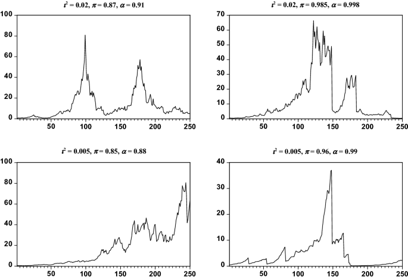

## Table of Contents

## What is the Supremum augmented Dickey-Fuller (SADF) test?

The Supremum Augmented Dickey-Fuller (SADF) test is a statistical method used to detect the presence of bubbles in financial markets. It builds on the traditional Augmented Dickey-Fuller (ADF) test, which checks if a time series is stationary or has a unit root. The SADF test improves upon the ADF by repeatedly applying the test to different parts of the data, looking for the highest test statistic, or supremum, across these tests. This approach makes it more effective at identifying periods where the price movements might be driven by speculative bubbles rather than fundamental economic factors.

In simple terms, the SADF test works by taking a series of smaller samples from the full data set and running the ADF test on each of these samples. By doing this, it can spot moments where the data behaves unusually, suggesting a bubble might be forming. This makes the SADF test particularly useful for financial analysts and economists who need to monitor markets for signs of instability. It's like looking at different parts of a long movie to see if there are any scenes where the action suddenly changes, indicating something unusual is happening.

## Why is the SADF test used in financial econometrics?

The SADF test is used in financial econometrics because it helps to find bubbles in the market. Bubbles are times when prices go up a lot, not because of real value, but because people are just buying and selling a lot. The SADF test is good at spotting these times because it looks at different parts of the price data over time. It does this by running many tests, each on a different piece of the data, and then picks the biggest result to see if there's a bubble.

This test is really useful for people who study and work with financial markets. They can use it to see if the market is behaving in a way that might not last, which could be risky for investors. By using the SADF test, these experts can warn others about possible bubbles before they burst, helping to make better decisions about buying and selling. It's like a tool that helps them keep an eye on the market's health, making sure it's not getting too crazy.

## How does the SADF test differ from the standard Dickey-Fuller test?

The SADF test and the standard Dickey-Fuller test both aim to check if a time series has a unit root, which means it's not stationary and could be influenced by trends or random walks. The standard Dickey-Fuller test does this by looking at the whole data set at once. It tries to see if there's a way to make the data more stable by subtracting a part of it from itself, and if that works, the data might not have a unit root.

The SADF test goes a step further. Instead of looking at the whole data set at once, it breaks the data into smaller pieces and runs the Dickey-Fuller test on each piece. It then picks the biggest result from all these tests. This method helps the SADF test find times when the data might be acting weird, like during a market bubble. So, while the standard Dickey-Fuller test gives one big picture, the SADF test looks at many smaller pictures to catch moments of unusual behavior.

## What are the steps to perform the SADF test?

To perform the SADF test, you start by choosing a time series, like stock prices, that you want to check for bubbles. Then, you decide on a starting point and an ending point for your first test. You run the standard Augmented Dickey-Fuller (ADF) test on the data from the starting point to the ending point. This test checks if the data has a unit root, meaning it's not stable over time. You keep track of the test statistic from this ADF test.

Next, you move the ending point a little further along the time series and run the ADF test again, but this time on a slightly longer piece of data. You keep doing this, moving the ending point further and further until you've tested all possible lengths of data from your starting point to the end of the series. Each time you run the ADF test, you save the test statistic. After you've done all these tests, you look at all the test statistics you've collected and pick the biggest one. This biggest number is called the supremum. If this supremum is bigger than a certain critical value, you can say there's evidence of a bubble in your data.

## What is the null hypothesis of the SADF test?

The null hypothesis of the SADF test is that there is no bubble in the data. This means the data is behaving normally and doesn't have any periods where prices go up a lot because of people buying and selling too much, instead of because of real value.

To check this, the SADF test runs many smaller tests on different parts of the data. It looks for the biggest result from all these tests. If this biggest result is very big, it suggests that there might be a bubble, and the null hypothesis can be rejected. If the biggest result isn't that big, then the null hypothesis is not rejected, and we believe there's no bubble in the data.

## How do you interpret the results of the SADF test?

When you do the SADF test, you're trying to find out if there's a bubble in your data. A bubble is when prices go up a lot, not because of real value, but because people are buying and selling a lot. The SADF test looks at different parts of your data and picks the biggest result from all these tests. If this biggest result is bigger than a certain number, called the critical value, it means you can say there's a bubble in your data. This is like finding a big peak in your data that suggests something unusual is happening.

If the biggest result from the SADF test is not bigger than the critical value, then you can't say there's a bubble. This means the data is behaving normally, and there's no sign of prices going up because of too much buying and selling. So, the SADF test helps you understand if the market is getting too crazy or if it's just normal ups and downs. It's a useful tool for people who want to keep an eye on the market's health and make smart decisions about buying and selling.

## Can you explain the concept of 'supremum' in the context of the SADF test?

In the SADF test, the 'supremum' is like finding the highest point or the biggest number out of all the tests you run. Imagine you're looking at a series of hills, and you want to know which one is the tallest. Each hill represents a test on a part of your data, and the height of the hill is the result of that test. The supremum is the height of the tallest hill, the biggest result from all those tests.

If this biggest result, the supremum, is very high, it means there might be a bubble in your data. A bubble is when prices go up a lot because people are buying and selling too much, not because of real value. So, the supremum helps you spot if there's something unusual happening in your data, like a bubble. If the supremum isn't that high, then there's no sign of a bubble, and your data is behaving normally.

## What are the limitations of the SADF test?

The SADF test is a helpful tool, but it's not perfect. One big problem is that it can sometimes say there's a bubble when there isn't one, or it might miss a real bubble. This can happen because the test looks at many parts of the data and picks the biggest result, which might just be a random high number and not a real sign of a bubble. It's like trying to find a needle in a haystack by looking at the biggest piece of straw; sometimes the biggest piece isn't the needle.

Another issue is that the SADF test needs a lot of data to work well. If you don't have enough data, the test might not be able to find a bubble even if there is one. Also, the test can be tricky to use because it depends on choosing the right starting and ending points for the tests. If you pick the wrong points, you might get the wrong answer. So, while the SADF test is useful for spotting bubbles, it's important to use it carefully and know its limits.

## How does the SADF test handle structural breaks in time series data?

The SADF test is designed to look for bubbles in time series data, but it can have trouble when there are big changes, or structural breaks, in the data. A structural break is like a sudden shift in the way the data behaves, maybe because of a big event like a new law or a financial crisis. These breaks can make the SADF test think there's a bubble when there isn't one, or it might miss a real bubble because the break messes up the test's results. So, the SADF test might not work as well if the data has these big changes.

To deal with this, some people use other methods along with the SADF test to check for structural breaks first. They might use special tests that are good at finding these big changes before running the SADF test. This way, they can be more sure that any bubbles the SADF test finds are real and not just caused by a sudden shift in the data. It's like making sure the ground is flat before you start looking for hills, so you know any hills you find are real and not just bumps from the uneven ground.

## What are some practical applications of the SADF test in real-world scenarios?

The SADF test is really useful for people who watch the stock market or other financial markets. They use it to see if there are times when prices are going up a lot because people are buying and selling too much, not because of real value. This is called a bubble. By using the SADF test, these experts can warn others about possible bubbles before they burst, which can help investors make smarter choices about when to buy or sell. For example, if the SADF test shows a bubble in a certain stock, an investor might decide to sell that stock before the bubble bursts and the price drops.

Another practical use of the SADF test is in real estate markets. People who study these markets can use the SADF test to see if there are bubbles in housing prices. If the test finds a bubble, it can be a sign that prices might fall soon. This information is important for people who are thinking about buying or selling a house. They can use the results of the SADF test to decide if it's a good time to make a move in the market, helping them avoid buying at the peak of a bubble or selling before prices go down.

## How does the SADF test compare to other tests for detecting bubbles in financial markets?

The SADF test is one of many tools used to find bubbles in financial markets, and it has its own special way of working. Unlike some other tests, the SADF test looks at different parts of the data over time and picks the biggest result to see if there's a bubble. This makes it good at spotting bubbles that might come and go quickly. Other tests, like the standard Dickey-Fuller test, just look at the whole data set at once, which might not catch these fast-moving bubbles. Another test, the Generalized Supremum ADF (GSADF) test, is similar to the SADF but can handle more than one bubble at the same time, making it useful when the market might have several bubbles happening.

However, the SADF test has its limits, just like other tests. For example, the Phillips, Shi, and Yu (PSY) test is another method that looks for bubbles but uses a different way to check the data. The PSY test can be better at finding bubbles that grow slowly over time, while the SADF test might miss these because it's looking for quick changes. Also, the SADF test can sometimes say there's a bubble when there isn't one, or miss a real bubble, especially if there are big changes in the data. So, while the SADF test is a helpful tool, it's often used along with other tests to get a fuller picture of what's happening in the market.

## What are the latest advancements or modifications to the SADF test methodology?

The SADF test has seen some new changes to make it work better. One big change is the Generalized Supremum ADF (GSADF) test, which is like the SADF test but can find more than one bubble at the same time. This is helpful because sometimes the market can have several bubbles happening together. Another change is that people have started using something called bootstrap methods with the SADF test. These methods help check if the results are real or just random, making the test more reliable.

Also, researchers have been working on ways to make the SADF test better at handling big changes in the data, called structural breaks. These changes can mess up the test's results, so new methods try to spot these breaks first before running the SADF test. This helps make sure the test finds real bubbles and not just strange changes in the data. Overall, these advancements are making the SADF test a more powerful tool for watching financial markets and spotting bubbles early.

## What is the Role of the Supremum Augmented Dickey-Fuller (SADF) Test?

The Supremum Augmented Dickey-Fuller (SADF) test is an econometric tool used to detect periods of explosive behavior in financial time series, indicative of asset bubbles. Developed to refine the traditional Augmented Dickey-Fuller (ADF) test, the SADF test addresses the challenge of identifying bubbles by employing a recursive right-tailed unit root test. This approach allows for the detection of explosive roots at various points within a time series, improving the identification of financial bubbles as they form.

The SADF test operates by estimating an ADF regression model over a sequence of forward-expanding samples. The process starts with a minimum window of initial observations and increases incrementally, testing for the presence of a unit root at each increment. The test statistic is computed as the supremum (i.e., the maximum) of the ADF t-[statistics](/wiki/bayesian-statistics) across all sample windows. The primary advantage of this method is its ability to detect the initiation of explosive periods without requiring knowledge of when the bubble will end.

In comparison, the generalized SADF (GSADF) test extends the SADF approach by conducting the tests over a broader set of windows, including backward-expanding, allowing for a more comprehensive examination of potential explosive behaviors over various time horizons. While the SADF test computes the supremum over forward-expanding samples only, the GSADF performs a double supremum procedure over both backward and forward-expanding samples. This extension allows the GSADF test to capture bubbles of varying lengths and address multiple bubble occurrences within a single time series, offering a more flexible and robust testing framework.

Methodologically, the SADF test detects explosiveness by identifying deviations from a random walk within financial data, suggesting non-stationarity due to a bubble's explosive nature. The test is rooted in the concept of unit-root testing, where the null hypothesis implies a unit root (indicating a random walk), and the alternative hypothesis suggests a temporary period of explosiveness. The SADF test's ability to identify significant left-skewness in the test statistic distribution is crucial, as it points to an explosive, and thus potentially a bubble-driven, market behavior.

Mathematically, the SADF test employs the recursive equation:

$$

y_t = \alpha + \beta t + \rho y_{t-1} + \sum_{i=1}^{k} \gamma_i \Delta y_{t-i} + \epsilon_t 
$$

for $t = 1, \ldots, T$, where $\Delta y_{t-i}$ is the lagged difference term, $\epsilon_t$ is a white-noise error term, and $\rho$ represents the autoregressive parameter of interest. The SADF statistic is the supremum value of the t-statistic for $\rho$ across all sample sizes considered during the test.

Through this robust analytical approach, the SADF test has become vital in detecting speculative bubbles in diverse markets, including equities, real estate, and commodities. Accurate bubble detection assists traders, economists, and policymakers in making informed decisions aimed at mitigating the detrimental impacts of financial exuberance and potential market corrections.

## What are the technical aspects and advanced considerations?

The Supremum Augmented Dickey-Fuller (SADF) test is a statistical method grounded in time series analysis, primarily utilized for the identification of financial bubbles by detecting explosiveness in asset prices. It extends the traditional Augmented Dickey-Fuller (ADF) test, which is designed to test for a unit root in a time series, indicating whether a series is non-stationary. The SADF test, an improvement introduced by Phillips et al. (2011), enhances the ADF by allowing the test to be applied multiple times over a rolling window, making the identification of explosive behavior more robust and adaptive over time.

Mathematically, the SADF test evaluates the following regression equation:

$$

\Delta y_t = \alpha + \beta y_{t-1} + \sum_{i=1}^{k} \Gamma_i \Delta y_{t-i} + \epsilon_t 
$$

where $\Delta y_t$ denotes the first difference of the time series, $\alpha$ is a constant, $\beta$ is the coefficient under scrutiny, $\Gamma_i$ are coefficients for the lagged differences, $k$ represents the number of lags included in the model, and $\epsilon_t$ denotes a white-noise error term. The SADF test specifically focuses on the supremum of ADF statistics over a set of forward expanding windows, effectively allowing the detection of explosive behaviors at various points in time.

In bubble detection, considering heteroscedasticity—where the variability of a variable is unequal across levels of another variable—is crucial. Financial time series often exhibit this property, which can bias test statistics if not addressed appropriately. Adjustments, such as heteroscedasticity-robust standard errors, are generally employed to ensure the accuracy of test results. These adjustments are important because they allow for the correct identification of explosive periods without the noise introduced by changing variances.

Monte Carlo simulations play a key role in evaluating the performance of the SADF test. These simulations involve generating a large number of random samples of the time series data—under both the null hypothesis of a unit root and the alternative hypothesis of explosiveness—to assess the distribution and power of the test. Through these simulations, the finite sample behavior of the SADF test and its variants, like the Generalized Supremum ADF (GSADF) test, are investigated. The GSADF further extends SADF by considering backward as well as forward tests, allowing for even more precise bubble detection over various sample periods.

Monte Carlo studies have demonstrated the SADF test's effectiveness in identifying bubbles before they burst, highlighting both its strengths and any limitations in different market conditions. These studies are fundamental, offering insights into the empirical size and power of the test, influencing the calibration of critical values used during hypothesis testing in practical scenarios. As such, SADF and GSADF have shown a robust ability to detect bubble phases in financial data, underpinning their application in contemporary financial market analysis.

## References & Further Reading

[1]: Phillips, P. C. B., Wu, Y., & Yu, J. (2011). ["Explosive Behavior in the 1990s Nasdaq: When Did Exuberance Escalate Asset Values?"](http://korora.econ.yale.edu/phillips/pubs/art/p1349.pdf) Econometrica, 79(1), 201-230.

[2]: Phillips, P. C. B., Shi, S., & Yu, J. (2015). ["Testing for Multiple Bubbles: Historical Episodes of Exuberance and Collapse in the S&P 500."](http://korora.econ.yale.edu/phillips/pubs/art/p1498.pdf) International Economic Review, 56(4), 1043-1078.

[3]: Fu, Y., & Lee, C. (2018). ["Financial Contagion and Recession Effects on Sovereign Credit Ratings: Evidence from Industry CDS Index Market."](https://en.wikipedia.org/wiki/Kung_Fu_Panda) Journal of International Financial Markets, Institutions and Money, 55, 137-150.

[4]: Homm, U., & Breitung, J. (2012). ["Testing for Speculative Bubbles in Stock Markets: A Comparison of Alternative Methods"](https://academic.oup.com/jfec/article-abstract/10/1/198/757787). Journal of Financial Econometrics, 10(1), 198-231.

[5]: Shiller, R. J. (2015). ["Irrational Exuberance"](https://press.princeton.edu/books/paperback/9780691173122/irrational-exuberance) (3rd ed.). Princeton University Press.