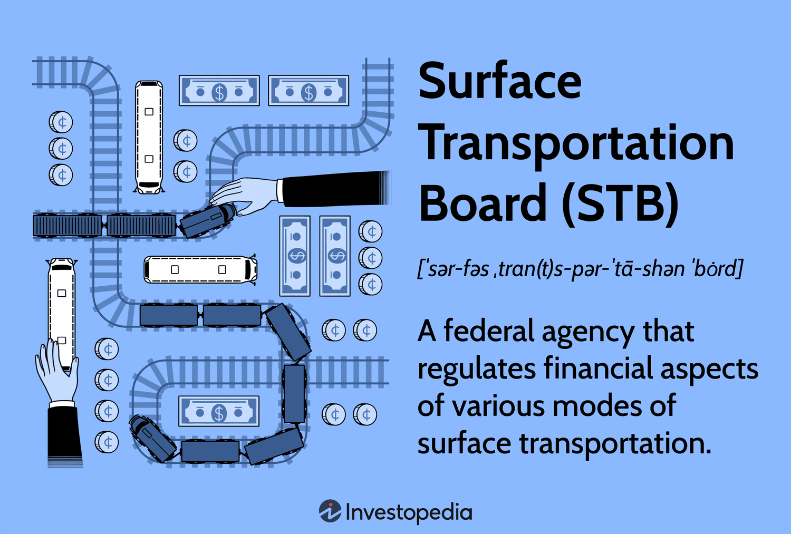

The complexities of transportation regulation are essential to understanding the modern logistics and trading landscapes. As global trade continues to expand, efficient transportation systems become increasingly crucial, requiring careful regulatory oversight to ensure fair competition and economic stability. The Surface Transportation Board (STB) serves as a key federal agency tasked with overseeing the financial aspects of surface transportation, primarily focusing on the U.S. rail sector. Established under the ICC Termination Act of 1995, the STB was designed to continue the regulatory functions of its predecessor, the Interstate Commerce Commission, adapting them to fit the modern economic environment.

Transportation and trading have become significantly interconnected with the rise of technology. Advanced logistics strategies and innovations in transportation facilitate more rapid and reliable movement of goods, harmonizing with algorithmic trading methods, which rely on the swift and efficient exchange of commodities and information. Algorithmic trading involves the use of algorithms to execute trades at speeds and frequencies impossible for human traders, often capitalizing on minute discrepancies in transportation costs and delivery times—areas directly influenced by STB regulations.

Understanding how the STB functions in this intricate ecosystem involves examining its history, regulatory influence, and the modern intersections with technology-driven sectors. As trading systems continue to adopt more complex algorithms, the role of the STB in ensuring these processes remain competitive and fair becomes increasingly vital. By maintaining a focus on both transportation efficiency and financial regulation, the STB supports a national infrastructure that adapts to the evolving economic landscape, ensuring robustness and equity in commerce. This article explores these dynamics, offering a comprehensive view of the STB's continuing relevance in today's rapidly changing economic climate.

## Table of Contents

## The Role and Responsibilities of the Surface Transportation Board (STB)

The Surface Transportation Board (STB) is a crucial federal regulatory agency responsible for supervising the economic aspects of the U.S. railway sector, along with certain other transportation segments. The STB's primary roles involve adjudicating rate disputes, overseeing rail mergers, and ensuring that competitive practices are upheld within these industries. These functions are vital for maintaining an equitable and efficient transportation system that supports the broader economic landscape.

A clear understanding of the STB's mission and organizational framework is essential to grasp its extensive regulatory reach. The STB functions as an economic regulatory body, primarily focusing on rail transport. It ensures that the rates assessed by rail carriers are reasonable and reflective of fair market dynamics, thus protecting the interests of both consumers and service providers. This task involves the evaluation and resolution of rate disputes whenever disagreements arise over tariff implementations or cost assessments.

In addition to rate oversight, the STB plays a significant role in managing rail mergers and acquisitions. These activities are crucial in safeguarding competitive market conditions, preventing monopolistic practices, and ensuring that the benefits of efficient transport are realized across the economy. The STB's stringent review process ensures that mergers do not unfairly limit competition or harm consumer interests. Moreover, the STB regulates various service-related disputes and rail line transactions, maintaining an orderly and transparent process for all stakeholders involved.

The passage of the Surface Transportation Board Reauthorization Act of 2015 was a pivotal moment for the agency. This legislation re-established the STB as an independent authority, disentangling it from the U.S. Department of Transportation. The act granted the STB greater autonomy and flexibility in its operations, enabling it to address regulatory challenges more promptly and effectively. This newfound independence reaffirmed the STB's capacity to prioritize its commitments to ensuring a competitive and efficient transportation infrastructure. The act also introduced statutory changes that enhanced the Board's ability to self-initiate investigations and implement processes aimed at expediting dispute resolutions.

In summary, the STB's critical roles encompass rate regulation, merger oversight, and dispute resolution, which collectively ensure fair market competition and economic stability within the U.S. transportation sector. The Reauthorization Act of 2015 fortified the Board's independence, granting it the latitude required to adapt swiftly to the evolving landscape of transportation and commerce.

## Historical Evolution: From ICC to STB

The transformation from the Interstate Commerce Commission (ICC) to the Surface Transportation Board (STB) marks a significant evolution in the regulation of transportation in the United States. Established in 1887, the ICC was the first federal agency designed to regulate the railroad industry, which was a critical component of the nation's infrastructure and commerce at the time. The ICC aimed to ensure fair rates, eliminate rate discrimination, and regulate other aspects of common carriers, including trucking, as transportation modes developed.

For over a century, the ICC played a pivotal role in overseeing and managing transportation regulations. However, the economic deregulation wave that began in the 1970s challenged the relevance and efficiency of the ICC's regulatory framework. Legislative actions began shifting toward a more market-driven approach, reducing strict oversight in favor of boosting competition and efficiency within the transport sector.

The ICC Termination Act of 1995 was a legislative milestone that ultimately led to the dissolution of the ICC. This act was part of broader privatization and deregulation efforts aimed at modernizing transportation oversight to better meet contemporary economic needs. It acknowledged the necessity for a new entity to continue some regulatory functions while eliminating outdated practices that no longer served a rapidly transforming transportation landscape. Consequently, in 1996, the Surface Transportation Board (STB) was established as an independent agency, tasked with assuming many of the residual responsibilities from the ICC.

The newly formed STB was designed to regulate more efficiently the economic issues related to railroads and, to a lesser extent, other modes of surface transportation. Its creation signified a shift towards a regulatory structure that emphasized market-based solutions while maintaining the oversight necessary to uphold fair competition and resolve disputes. This transition reflects a broader trend in federal oversight moving from comprehensive regulation to targeted and adaptive governance, aligning with modern economic principles.

The transition from the ICC to the STB marked a significant change in how federal transportation regulation is approached. It underscores an era where the government sought to reconcile the need for oversight with the imperatives of a dynamic and competitive market environment. Understanding these legislative and organizational changes is crucial for comprehending the current regulatory landscape of U.S. transportation, which balances the remnants of historical oversight with the demands of present-day commerce.

## Key Functions and Impact on Transport and Commerce

The Surface Transportation Board (STB) plays a critical role in overseeing and regulating the economics of the U.S. railway sector. This responsibility encompasses several key functions, including the regulation of railway mergers, the sale of railway lines, and the resolution of service disputes, all aimed at ensuring economic stability and fair competition.

When it comes to railway mergers, the STB is responsible for evaluating proposed consolidations to prevent monopolistic practices that could arise from limited competition within the industry. The evaluation process often involves a comprehensive analysis of the economic impact of the merger, taking into consideration factors such as market share, potential changes in service quality, and implications for consumer prices. By ensuring that mergers align with public interest and competitive standards, the STB helps maintain market balance.

In addition to mergers, the STB oversees the sale of railway lines. This oversight ensures that any transfer of ownership does not negatively impact service levels or result in unfair pricing practices. The STB evaluates the economic feasibility of such sales, ensuring they promote efficient utilization of transportation assets and maintain accessibility for shippers and communities reliant on these rail services.

Service disputes, another vital area of STB’s jurisdiction, often pertain to disagreements between carriers and shippers regarding rates and service quality. The STB acts as an arbiter in these disputes, working to resolve issues in a manner that preserves equitable treatment for all parties involved. By enforcing regulations that require reasonable and just rates, the STB safeguards against discriminatory pricing and service practices.

Beyond the railway sector, the STB's purview extends to other forms of transportation, such as passenger rails and intercity buses. Although its primary focus is on freight railroads, the STB's regulatory framework influences passenger rail carriers, particularly in aspects related to service performance and economic competition. This oversight is crucial for the stability and efficiency of public transport systems that complement the broader transportation network.

The impact of the STB’s decisions reaches beyond transportation logistics, influencing economic stability across various sectors. By fostering a competitive transportation environment, the STB contributes to lower costs and better services for businesses and consumers alike. This efficiency, in turn, enhances the overall competitiveness of the national economy.

In conclusion, the STB's regulatory oversight ensures that transportation networks operate in a fair, competitive, and economically viable manner. Its decisions have far-reaching implications, safeguarding against monopolistic behavior and promoting innovation in service delivery within the transportation sector. Such efforts are essential for sustaining an efficient transportation infrastructure that supports national commerce.

## Interaction with Algorithmic Trading

Algorithmic trading leverages mathematical models and high-speed automated systems to execute trades. This method capitalizes on the rapidity of data processing and trade execution to make financial markets more efficient. The intersection of transportation efficiency and financial markets is evident in sectors where timely delivery of goods directly affects market dynamics, such as those heavily reliant on rail transport.

The Surface Transportation Board (STB) holds significant sway over how transportation networks operate, particularly in railways, which are vital for the movement of bulk commodities. The efficiency improvements and regulatory decisions made by the STB can indirectly affect [algorithmic trading](/wiki/algorithmic-trading) strategies. For instance, if the STB implements regulations that lead to faster rail services, companies involved in commodities trading can benefit from reduced delivery times and costs. This, in turn, could prompt algorithmic trading systems to adjust their models, emphasizing quicker execution times and altering the valuation of trade strategies based on logistic efficiencies.

Consider a scenario where a change in rail transport regulation by the STB facilitates faster shipping times. Algorithmic trading systems might incorporate this data to forecast price movements of commodities more accurately, reflecting their anticipated availability in markets. The trading volumes could closely monitor these changes, making use of faster data processing to adjust positions in real-time, thus maintaining competitive market standings.

While the STB does not directly regulate trading algorithms, its decisions can impact the parameters these algorithms consider, especially for sectors tied closely to rail logistics. Any regulation that influences rail service efficiency, cost, or accessibility can present trading opportunities or necessitate a re-evaluation of trading algorithms to align with new market realities. Therefore, understanding the nuances of STB regulations becomes essential for traders who employ algorithmic trading systems, enabling them to anticipate market movements with greater precision.

## Conclusion: The Relevance of STB in Today's Economy

The Surface Transportation Board (STB) plays a crucial role in the United States' economy by overseeing transportation logistics. As a regulatory entity, the STB ensures the efficiency and competitiveness of the national transportation network, primarily through its oversight of the rail sector and other surface transportation modes. This regulatory assurance not only supports an integrated and fluid movement of goods but also fosters economic stability by maintaining fair competition among transport operators.

The historical context and evolution of the STB provide valuable insights for stakeholders aiming to understand and navigate its regulations. Established after the termination of the Interstate Commerce Commission, the STB has adapted to the dynamic landscape of transportation regulation over time. By understanding the agency’s foundational history as well as its ongoing functions, stakeholders can make informed decisions, particularly in scenarios influenced by algorithmic trading. The coherence between transportation efficiency and financial market operations is notable, as rapid data and trade execution depend on seamless logistics that the STB helps to regulate.

Continuous adaptation of the STB is pivotal as both commerce and technology evolve. With advancing technological innovations, such as algorithmic trading, the agency must refine its regulatory frameworks to address emerging challenges and opportunities. This involves not only keeping pace with technological advancements but also anticipating the potential impacts these changes might have on transportation and economic activities. The STB’s ability to align regulatory practices with the contemporary needs of the transportation sector underscores its continuing relevance and importance in a rapidly transforming economic environment.

## References & Further Reading

[1]: Coyle, D. (2014). ["The Economics of Enough: How to Run the Economy as if the Future Matters"](https://www.amazon.com/Economics-Enough-Economy-Future-Matters/dp/0691156298). Princeton University Press.

[2]: Interstate Commerce Commission. (1995). ["ICC Termination Act of 1995."](https://en.wikipedia.org/wiki/ICC_Termination_Act_of_1995)

[3]: Lopez de Prado, M. (2018). ["Advances in Financial Machine Learning"](https://www.amazon.com/Advances-Financial-Machine-Learning-Marcos/dp/1119482089). Wiley.

[4]: Oster, C. V., Strong, J. S., & Zorn, C. K. (1997). ["Deregulation and the Future of Intercity Passenger Rail."](https://faculty.wcas.northwestern.edu/ipsavage/104-13.pdf) RAND Corporation.

[5]: Wilner, F. N. (2019). ["Railroad Mergers: History, Analysis, Insight."](https://www.amazon.com/Railroad-Mergers-History-Analysis-Insight/dp/0911382194) Indiana University Press.