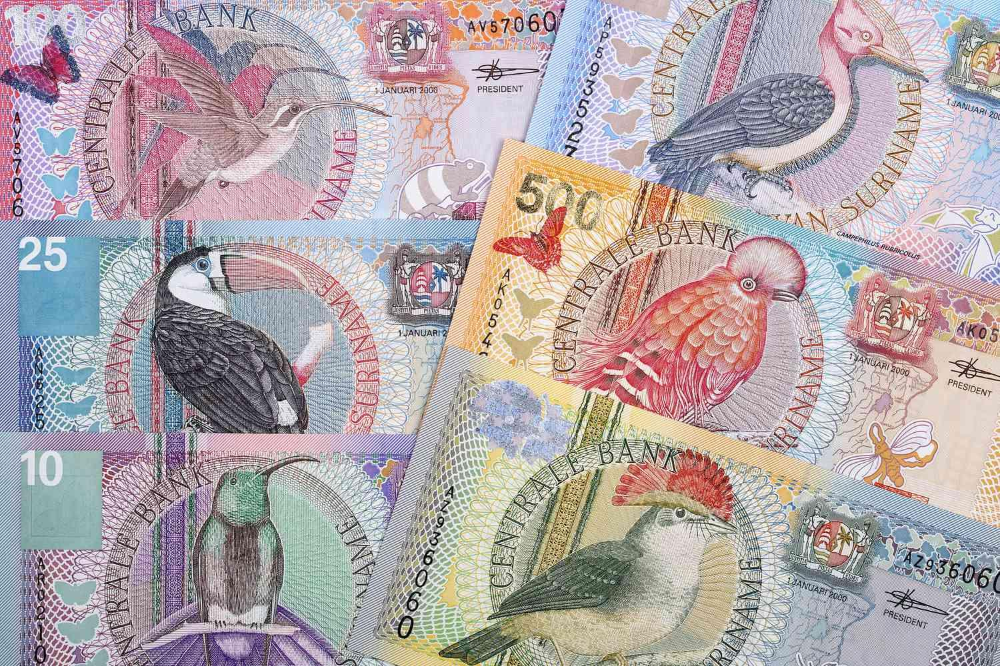

The Suriname Guilder (SRG) was a pivotal element of Suriname's economy, reflecting its colonial history and the economic progress and challenges encountered by the nation. As the primary currency until 2004, the SRG was intrinsic to economic transactions within the country and with international trade partners. Suriname, located on the northeastern coast of South America, has a financial landscape historically characterized by its rich natural resources, such as bauxite, gold, and oil. However, the country's economy faces significant challenges, including volatility in global commodity prices and inflation, which have historically impacted financial stability and the efficacy of its monetary policies.

Algorithmic trading, a method that utilizes computer programs to follow a defined set of instructions for placing trades to generate profits at a speed and frequency that is beyond human capability, has become a significant force in global markets. Its relevance extends to emerging markets, where it presents opportunities to enhance liquidity and efficiency in currency trading. By leveraging mathematical models and historical data, algorithmic trading can offer insights and opportunities that traditional trading methods might overlook. For emerging economies like Suriname, this technology holds promise as a tool to navigate financial market challenges more effectively.



This article aims to explore the historical roots of the Suriname Guilder and the transition to the Surinamese Dollar (SRD), evaluating the economic implications of this currency shift. Additionally, it will examine the potential for algorithmic trading to impact Suriname's financial ecosystem positively. As Suriname continues to develop economically and structurally, understanding the dynamics of its currency market, both past and present, and the prospective role of advanced trading strategies could reveal new pathways for economic enhancement and stability.

## Table of Contents

## History of the Suriname Guilder (SRG)

The Suriname Guilder (SRG) has roots that extend back to the colonial era when Suriname was part of the Dutch colonial empire. As a currency, the SRG mirrored the Dutch Guilder, reflecting Suriname's historical ties and economic dependency on the Netherlands. The introduction of the SRG marked a period where Suriname's monetary system was closely aligned with Dutch financial practices, influencing trade and economic policies within the colony.

During its utilization, the SRG played a central role in Suriname’s economic development, supporting trade in agricultural products, particularly sugar, coffee, and cocoa, which were the country's main exports. However, the SRG also faced several challenges. In the latter half of the 20th century, global economic shifts, political instability, and local economic mismanagement led to significant fiscal issues. Suriname experienced hyperinflation, reducing the Guilder’s purchasing power and undermining economic stability. The SRG’s value saw drastic fluctuations due to external debts and volatile commodity prices – elements that were pivotal in shaping the era's financial landscape.

In 2004, the Suriname Guilder was officially replaced by the Surinamese Dollar (SRD) as a response to the aforementioned economic challenges. The transition aimed to stabilize the national economy and curb inflation. This currency reform was part of a broader restructuring strategy, designed to restore investor confidence and facilitate financial transactions. The SRD was introduced at a conversion rate of 1,000 SRG to 1 SRD, effectively redenominating the currency rate to handle previous hyperinflation and create a more manageable monetary system. This move was seen as essential for improving economic credibility and fostering sustainable growth within the country.

## Economic Context of Suriname

Suriname's economy presents a complex blend of challenges and opportunities, largely driven by its reliance on natural resources. The country's economic structure is heavily dependent on industries such as mining, particularly bauxite, gold, and oil, which constitute significant portions of its export revenue. This dependency on a few key commodities makes Suriname's economic health highly susceptible to global market fluctuations.

Global commodity prices play a pivotal role in shaping Suriname's economic landscape. When the prices for gold and oil rise, the country's revenue increases, thereby enhancing its economic stability and growth prospects. Conversely, a decline in these prices can lead to budgetary deficits, reduced public spending, and overall economic contraction. For example, during periods of low global oil and gold prices, Suriname has faced substantial economic challenges, including reduced foreign exchange earnings and pressured fiscal reserves.

Inflation poses another persistent challenge to Suriname's economy. The country has experienced periods of high inflation, often linked to external factors such as volatile commodity prices, as well as internal factors like monetary policy and currency devaluation. Inflation erodes purchasing power and can lead to increased cost of living, which affects the socio-economic stability of the nation. The inflation rate is influenced by several variables, including foreign exchange rates, government fiscal policies, and external economic shocks.

Inflation can be expressed through the formula:

$$
\text{Inflation Rate} = \left( \frac{\text{Price Level in Current Year} - \text{Price Level in Previous Year}}{\text{Price Level in Previous Year}} \right) \times 100 \%
$$

Suriname's currency, the Surinamese Dollar (SRD), is directly affected by these economic dynamics. Fluctuations in economic indicators, such as inflation and global commodity prices, can lead to [volatility](/wiki/volatility-trading-strategies) in the SRD's exchange rate, impacting international trade and investment. This economic environment underscores the importance of diversifying Suriname's economic activities and strengthening fiscal and monetary policies to mitigate the effects of these challenges. In recent years, there have been efforts to explore alternative economic sectors and implement policies aimed at improving economic resilience. 

As Suriname navigates these economic realities, strategic utilization of its natural resources, effective management of inflationary pressures, and a keen understanding of global market trends will be crucial in shaping its economic future.

## Algorithmic Trading: An Emerging Opportunity

Algorithmic trading, often called algo trading, utilizes computer algorithms to automate trading decisions based on various quantitative and qualitative indicators. This approach has significantly influenced global financial markets by improving trading efficiency, enhancing [liquidity](/wiki/liquidity-risk-premium), and reducing transaction costs. As of the early 21st century, algo trading represents a substantial portion of the [volume](/wiki/volume-trading-strategy) on major stock exchanges, showcasing its transformative impact on financial trading.

In the context of currencies like the Suriname Guilder (SRG) and the Surinamese Dollar (SRD), [algorithmic trading](/wiki/algorithmic-trading) presents both opportunities and challenges. Algo trading can provide enhanced liquidity to the Surinamese currency market, which might be characterized by lower trading volumes compared to major currencies. By facilitating quicker transaction times and offering tighter spreads, algo trading could help in making the Surinamese currency more appealing to international investors.

Additionally, algorithmic strategies can help in exploiting market inefficiencies—which are more prevalent in emerging markets like Suriname's. Techniques such as [arbitrage](/wiki/arbitrage), [market making](/wiki/market-making), and sentiment analysis could be employed. For example, [statistical arbitrage](/wiki/statistical-arbitrage) strategies could exploit price discrepancies of the SRD across different trading platforms. A simple trading algorithm in Python might look like:

```python
import numpy as np

def arbitrage_opportunity(price_A, price_B, threshold):
    spread = price_A - price_B
    if spread > threshold:
        return "Sell A, Buy B"
    elif spread < -threshold:
        return "Buy A, Sell B"
    else:
        return "No action"

# Example usage
price_A, price_B = 7.45, 7.40  # hypothetical SRD prices on different exchanges
action = arbitrage_opportunity(price_A, price_B, threshold=0.05)
print(action)
```

However, algorithmic trading in the Surinamese context also comes with risks. Due to the relatively small scale and less liquid nature of Suriname's currency market, there might be pronounced volatility. This could amplify losses if algorithms are not designed to cope with sudden market shifts or lack fail-safes against erratic price movements.

Moreover, infrastructure and regulatory constraints may pose significant hurdles. The effectiveness of algorithmic trading relies heavily on robust IT infrastructure and clear regulatory frameworks, areas where emerging markets may lag behind. Without appropriate systems in place to handle high-frequency trades and safeguard against systemic risks, the benefits of algorithmic trading may not be fully realized.

Despite these challenges, the advantages of implementing algorithmic trading in Suriname's currency market are noteworthy. By increasing participation and interest in the SRD, algorithmic trading can contribute to economic growth and stable financial markets in Suriname. Its potential to transform trading practices could align Suriname more closely with global financial trends, fostering a more resilient and dynamic economic environment.

## The Transition to the Surinamese Dollar (SRD)

The transition from the Suriname Guilder (SRG) to the Surinamese Dollar (SRD) in 2004 marked a significant phase in Suriname's economic history, driven by the need to stabilize the national economy and simplify monetary transactions. The logistical execution of this currency shift involved multifaceted tasks, including the introduction of new banknotes, withdrawal of the old currency, and ensuring that financial institutions were prepared to handle the transition seamlessly.

The implications for trade were substantial. The SRD was introduced at an exchange rate of 1 SRD to 1,000 SRG, a move intended to enhance the currency's strength and ease of transaction calculations. This revaluation aimed to facilitate trade by stabilizing the currency's value, thereby increasing trust among international trading partners and reducing the complexities involved in currency conversion.

Public response to the new currency was mixed, as is common with major monetary changes. Initial reactions ranged from confusion and skepticism to cautious optimism. Public awareness campaigns were crucial in educating the population about the new currency's value, helping to mitigate concerns and ease the adaptation process. The adjustment period involved recalibrating pricing systems and ensuring that automatic systems, such as ATMs and cash registers, were updated to handle SRD transactions.

Post-transition economic stability was a primary concern for policymakers. The shift to the SRD was designed to curb hyperinflation and stabilize the economy, which had been struggling due to fluctuating exchange rates and high inflation under the SRG. Throughout this period, monitoring inflation rates and fiscal policies became crucial in assessing the SRD's efficacy. Although the initial phase included inflationary spikes as the market adjusted, the transition ultimately laid a foundation for more controlled economic growth and currency stability.

In examining the transition's long-term effects, it became apparent that while the SRD brought about a more manageable and robust currency framework, challenges such as inflation persistence and global economic pressures continued to exert influence. Nonetheless, the move to the Surinamese Dollar was a key strategy aimed at positioning Suriname for improved economic stability and growth in the international market.

## Algo Trading Strategies for SRG

Algorithmic trading, commonly referred to as algo trading, employs computer algorithms to place trades with little to no human intervention. These algorithms can operate under pre-defined criteria, such as timing, price, quantity, or any other mathematical model. For the Suriname Guilder (SRG), applying such algorithmic trading strategies can leverage emerging market dynamics, characterized by higher volatility and the potential for significant price movements. Below are common algorithmic trading strategies and how they can be applied to the SRG:

### Common Algorithmic Trading Strategies and Their Application to the SRG

1. **Trend Following**: This strategy involves algorithms designed to capitalize on long-term trends within a currency market. In the context of SRG, this could mean tracking historical data to predict future price movements. The algorithm would automatically execute trades based on signals such as moving averages or momentum indicators. Given the potentially volatile nature of emerging markets like Suriname, trend following can help capture price increases anticipated over extended periods.

   Python Example:
   ```python
   import pandas as pd
   import talib

   # Sample data for SRG price
   data = pd.read_csv('srg_price_data.csv')
   close_prices = data['Close']

   # Calculate moving average
   short_window = 40
   long_window = 100
   signals = pd.DataFrame(index=data.index)
   signals['signal'] = 0.0
   signals['short_mavg'] = close_prices.rolling(window=short_window, min_periods=1).mean()
   signals['long_mavg'] = close_prices.rolling(window=long_window, min_periods=1).mean()

   # Generate trading signals
   signals['signal'][short_window:] = np.where(signals['short_mavg'][short_window:] > signals['long_mavg'][short_window:], 1.0, 0.0)
   signals['positions'] = signals['signal'].diff()
   ```

2. **Mean Reversion**: This assumes that the currency price will revert to its average over time. For SRG, identifying periods of abnormal returns or deviations from the mean can enable algorithms to exploit these inefficiencies. The algorithm places trades to profit from these 'reversions'.

   Python Example:
   ```python
   import numpy as np

   # Compute the historical mean and standard deviation
   mean = close_prices.mean()
   std_dev = close_prices.std()

   # Detect mean reversion opportunities
   z_score = (close_prices - mean) / std_dev
   data['z_score'] = z_score

   # Generating signals
   data['signal'] = np.where(data['z_score'] > 1.5, -1, np.where(data['z_score'] < -1.5, 1, 0))
   ```

3. **Arbitrage**: This involves simultaneous buying and selling of a currency to profit from price differences in different markets or forms. In emerging markets such as Suriname, inefficiencies can arise due to exchange rate fluctuations or differing reporting standards, making arbitrage strategies potentially lucrative if detected early.

4. **Market Making**: Known for providing liquidity, market making algorithms place limit orders to buy and sell around the current market price. This strategy could be applied to SRG by maintaining a balanced portfolio between different trading pairs that include the SRG with the intention of profiting from the bid-ask spread.

### Potential for Exploiting Market Inefficiencies in Emerging Currencies

Emerging markets often display less liquidity, regulatory overlap, and greater exposure to global economic shifts, providing opportunities for exploiting inefficiencies. The SRG, given its historical volatility and less coverage by large financial entities, could present opportunities for well-configured algorithms to capture value.

### Case Studies on Successful Algo Trading in Similar Economic Environments

While specific case studies directly related to the SRG might be limited, anecdotal evidence from similar emerging markets suggests potential success. For instance, algorithmic trading strategies applied in Southeast Asian and African markets have succeeded in capitalizing on the volatility and rapid price changes. These case studies highlight the importance of robust risk management and customization of algorithms to fit the unique characteristics of each market. 

In summary, applying algorithmic trading strategies to SRG requires an understanding of both the potential benefits and the inherent risks involved. By leveraging these strategies, traders may enhance their capabilities to navigate the complexities of Suriname's currency environment, exploiting inefficiencies and maximizing returns.

## Future Prospects for Suriname's Currency

Economic developments in Suriname hold a pivotal role in shaping the future trajectory of its currency market. Suriname's economy is significantly dependent on the extraction and export of natural resources, particularly gold and oil. The fluctuations in global commodity prices directly influence the national currency, the Surinamese Dollar (SRD). Positive movements in commodity prices can bolster governmental revenues, potentially strengthening the SRD. However, downturns can exert pressure on the currency, leading to depreciation and inflation. Diversifying the economy could mitigate these risks, contributing to a more resilient currency market.

The integration of technology and innovation is transforming Suriname's financial sector, offering an array of opportunities that could affect the currency market. Digital banking solutions, mobile payment systems, and [cryptocurrency](/wiki/cryptocurrency) adoption are gradually becoming significant. These advancements may enhance transaction efficiency and accessibility, thereby fostering an inclusive financial environment. Moreover, blockchain technology offers potential enhancements in transparency and security in financial transactions, which could be instrumental in stabilizing the national currency.

Algorithmic trading represents a burgeoning opportunity for Suriname's currency, leveraging technology to forecast and exploit market movements. Algorithms, particularly those based on [machine learning](/wiki/machine-learning), can process vast amounts of data to predict market behavior, offering a strategic advantage in trading the SRD. By employing statistical models and historical data, these algorithms can identify price trends and execute trades with optimal timing. 

A simple moving average strategy, which is a common algorithmic trading approach, can be applied to the SRD:

```python
def moving_average(prices, window_size):
    return [sum(prices[i:i + window_size]) / window_size for i in range(len(prices) - window_size + 1)]

prices = [10, 12, 13, 15, 18, 16, 17]  # sample price data
window_size = 3
ma_prices = moving_average(prices, window_size)
```

This Python code calculates the moving average of the currency price over a specified period, providing insights into potential buy or sell signals based on trend reversals or continuations.

The benefits of algorithmic trading for the SRD include increased market liquidity and efficiency. Algorithms can execute trades at speeds and frequencies beyond human capability, potentially stabilizing the currency by reducing volatility. However, the implementation of these technologies must be accompanied by a robust regulatory framework to oversee their operation and ensure market integrity.

In summary, the future prospects for Suriname's currency are intricately tied to economic diversification, technological innovation, and the adoption of advanced trading techniques. By integrating these elements, Suriname could enhance the stability and appeal of the SRD, potentially attracting increased foreign investment and fostering a more robust economic landscape.

## Conclusion

The Suriname Guilder (SRG) played a pivotal role in the economic landscape of Suriname, serving as the primary currency from its colonial inception until 2004. Its function was deeply intertwined with the country's economic development and challenges. The transition from the SRG to the Surinamese Dollar (SRD) marked a significant shift aimed at stabilizing the economy and aligning with modern financial practices.

Algorithmic trading presents an innovative avenue for economic growth in Suriname's currency market. By utilizing advanced computational techniques to analyze market data and execute trades, algorithmic trading can enhance market efficiency and liquidity. The potential benefits include better price discovery and reduced transaction costs, which could stabilize the Surinamese Dollar and attract international investors. Such advancements could help mitigate the volatility often experienced in emerging markets, offering a buffer against global economic fluctuations.

However, the journey toward integrating algorithmic trading is not without its challenges. The existing economic environment in Suriname, characterized by dependency on commodities and inflationary pressures, poses risks to the effective implementation of these strategies. Additionally, technological infrastructure and regulatory frameworks need to evolve to support these advanced trading mechanisms.

In conclusion, while the SRG's transition to the SRD represented a functional endeavor to modernize Suriname's monetary system, the future of its currency market could be significantly shaped by the adoption of algorithmic trading. These strategies present both an opportunity for economic stabilization and a challenge that demands comprehensive planning and investment in technology and education. The potential to leverage such trading methods could position Suriname advantageously in the global financial landscape, fostering economic resilience and growth.

## References & Further Reading

[1]: Marcos López de Prado. ["Advances in Financial Machine Learning."](https://www.amazon.com/Advances-Financial-Machine-Learning-Marcos/dp/1119482089) Wiley, 2018.

[2]: David Aronson. ["Evidence-Based Technical Analysis: Applying the Scientific Method and Statistical Inference to Trading Signals."](https://www.amazon.com/Evidence-Based-Technical-Analysis-Scientific-Statistical/dp/0470008741) Wiley, 2006.

[3]: Stefan Jansen. ["Machine Learning for Algorithmic Trading: Predictive Models to Extract Signals from Market and Alternative Data for Systematic Trading Strategies with Python."](https://github.com/stefan-jansen/machine-learning-for-trading) Packt Publishing, 2020.

[4]: Ernest P. Chan. ["Quantitative Trading: How to Build Your Own Algorithmic Trading Business."](https://www.amazon.com/Quantitative-Trading-Build-Algorithmic-Business/dp/0470284889) Wiley, 2008.

[5]: John Bergstra, Rémi Bardenet, Yoshua Bengio, and Balázs Kégl. ["Algorithms for Hyper-Parameter Optimization."](https://dl.acm.org/doi/10.5555/2986459.2986743) Advances in Neural Information Processing Systems 24, 2011.