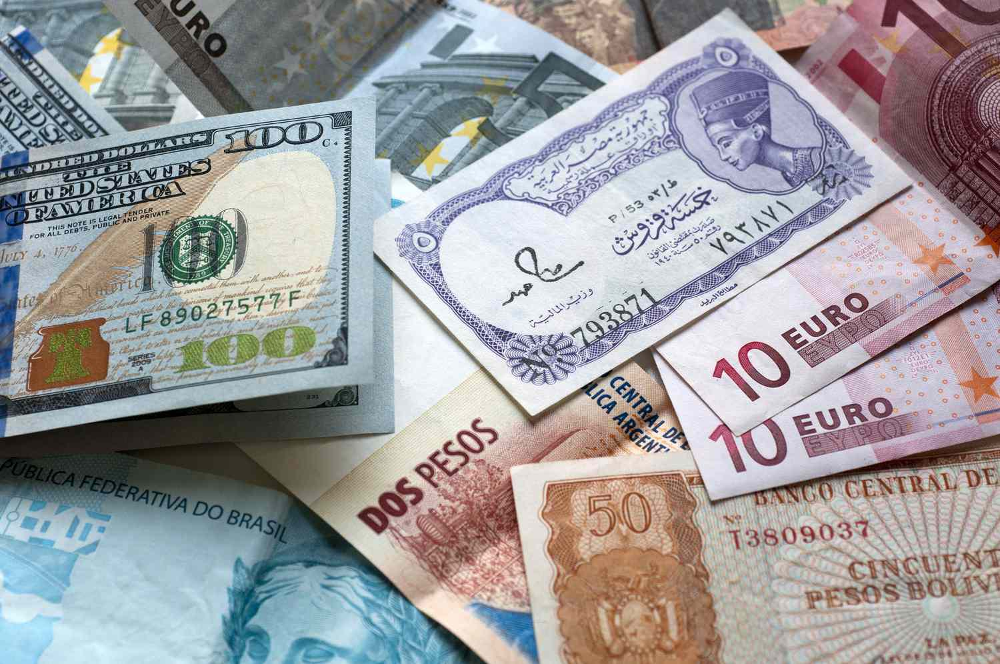

## Table of Contents

## What is the Surinamese Dollar?

The Surinamese Dollar is the official money used in Suriname, a country in South America. It is also called the Surinam Dollar. The symbol for the Surinamese Dollar is SRD, and it is written as $ or S$. People in Suriname use this money to buy things like food, clothes, and other things they need.

The Surinamese Dollar was first used in 2004. Before that, Suriname used a different money called the Surinamese Guilder. The government of Suriname makes the Surinamese Dollar and controls how much of it is made. Like other countries' money, the value of the Surinamese Dollar can go up or down compared to other countries' money. This can affect how much things cost in Suriname.

## How is the Surinamese Dollar abbreviated?

The Surinamese Dollar is shortened to SRD. This is the official way to write it when talking about money in Suriname. You might also see it written as $ or S$, but SRD is used to make it clear it's the Surinamese Dollar and not another country's dollar.

When people write about money in Suriname, they use SRD to show they are talking about the Surinamese Dollar. This helps avoid confusion with other dollars, like the US Dollar or the Australian Dollar. So, if you see SRD, you know it's about Suriname's money.

## What is the current exchange rate of the Surinamese Dollar to the US Dollar?

The exchange rate between the Surinamese Dollar (SRD) and the US Dollar (USD) changes every day. As of my last update, 1 US Dollar was equal to about 38 Surinamese Dollars. But remember, this number can go up or down because many things affect it, like how much people want to buy and sell the currency.

If you want to know the exact rate right now, you should check a website that gives live exchange rates or ask at a bank. These places will have the most up-to-date information. Knowing the current rate is important if you are planning to travel to Suriname or if you need to send money there.

## What are the main factors affecting the value of the Surinamese Dollar?

The value of the Surinamese Dollar is affected by many things, like how much people want to buy and sell it, how the economy of Suriname is doing, and what the government does with money. If more people want to buy the Surinamese Dollar, its value can go up. But if fewer people want it, its value can go down. The economy of Suriname is important too. If the country is making and selling more things, the Surinamese Dollar might become stronger. But if the economy is not doing well, the currency can lose value.

Another big [factor](/wiki/factor-investing) is what the government does with money. If the government prints too much money, it can make the Surinamese Dollar worth less because there is more of it around. Also, if Suriname borrows a lot of money from other countries or if it has a lot of debt, this can make the Surinamese Dollar weaker. The value of the Surinamese Dollar can also change based on what is happening with other countries' money, like the US Dollar. If the US Dollar gets stronger, the Surinamese Dollar might get weaker compared to it.

## How has the Surinamese Dollar performed historically against major currencies?

The Surinamese Dollar has had a lot of ups and downs when compared to major currencies like the US Dollar, the Euro, and the British Pound. When it first started in 2004, it was set at a rate of about 2.7 SRD to 1 USD. Over the years, the Surinamese Dollar has lost a lot of its value. By 2016, the exchange rate was around 7 SRD to 1 USD. This shows that the Surinamese Dollar was getting weaker compared to the US Dollar. The main reason for this was because Suriname's economy was not doing well, and the government was printing more money to try and fix things, which made the Surinamese Dollar worth less.

In recent years, the Surinamese Dollar has continued to lose value. By 2020, the exchange rate had jumped to around 14 SRD to 1 USD, and it kept going up. As of my last update, it was around 38 SRD to 1 USD. This big change shows that the Surinamese Dollar has become much weaker over time. The reasons for this include problems in Suriname's economy, like falling prices for things the country sells, like oil and gold, and the government having a lot of debt. All these things together have made the Surinamese Dollar less valuable compared to major currencies like the US Dollar.

## What are the key industries driving the Surinamese economy?

The key industries that drive the Surinamese economy are mining, agriculture, and services. Mining is very important because Suriname has a lot of natural resources like gold and bauxite. Gold mining is a big part of the economy, and bauxite is used to make aluminum. These resources are sold to other countries, which brings money into Suriname. Agriculture is also important. Farmers grow things like rice, bananas, and vegetables. These crops help feed people in Suriname and are also sold to other countries.

Services are another key part of the economy. This includes things like banking, tourism, and transportation. Banks help people save and borrow money, which is important for the economy. Tourism brings in money from people who visit Suriname to see its beautiful nature and culture. Transportation helps move goods and people around the country and to other places. All these industries together help make the Surinamese economy work and grow.

## How does inflation impact the Surinamese Dollar and the economy?

Inflation means that prices for things like food, clothes, and other stuff go up over time. In Suriname, high inflation can make the Surinamese Dollar worth less. When inflation is high, people need more Surinamese Dollars to buy the same things they used to buy with less money. This can make people feel like their money is not worth as much, and it can be hard for them to afford things they need. If inflation keeps going up a lot, it can make the Surinamese Dollar weaker compared to other countries' money, like the US Dollar.

High inflation can also affect the whole economy of Suriname. When prices go up a lot, businesses might find it harder to plan and grow because they don't know how much things will cost in the future. This can make them less likely to invest in new projects or hire more people. Also, if people see that their money is losing value quickly, they might spend it right away instead of saving it, which can make inflation even worse. The government might try to control inflation by changing how much money is in the economy or by setting rules for prices, but it can be hard to stop inflation once it starts going up a lot.

## What role does the Central Bank of Suriname play in managing the Surinamese Dollar?

The Central Bank of Suriname is very important for managing the Surinamese Dollar. It controls how much money is in the country by deciding how much to print and how much to keep in banks. This helps keep the value of the Surinamese Dollar stable. If there is too much money, the Central Bank can take some out of the economy to stop prices from going up too fast. If there is not enough money, it can put more in to help businesses and people buy things they need.

The Central Bank also sets the interest rates, which is the cost of borrowing money. By changing these rates, it can make it easier or harder for people and businesses to get loans. If the Central Bank wants to slow down the economy and stop prices from going up too fast, it can raise interest rates. If it wants to help the economy grow, it can lower interest rates. All these actions help the Central Bank keep the Surinamese Dollar strong and the economy healthy.

## What are the recent economic reforms in Suriname and their impact on the Surinamese Dollar?

Suriname has been trying to fix its economy by making some big changes. One big change was in 2020 when the government decided to let the Surinamese Dollar's value be decided by the market instead of setting it themselves. This was done to make the economy more honest and to stop people from using other countries' money instead of the Surinamese Dollar. Another change was to cut down on how much the government was spending and to try to get more money from taxes. These changes were meant to make the economy stronger and the Surinamese Dollar more stable.

These changes have had a big effect on the Surinamese Dollar. Letting the market decide the value made the Surinamese Dollar lose value very quickly at first, which made things more expensive for people in Suriname. But over time, this change has helped make the economy more real and has encouraged more people to use the Surinamese Dollar instead of other currencies. Cutting government spending and raising taxes has been hard for people, but it has also helped to make the economy more stable in the long run. Overall, these reforms are trying to make the Surinamese Dollar stronger and the economy healthier, but it will take time to see all the good effects.

## How do international trade and foreign investment influence the Surinamese economy and currency?

International trade and foreign investment are very important for the Surinamese economy and the value of the Surinamese Dollar. When Suriname sells things like gold, bauxite, and agricultural products to other countries, it brings money into the country. This can make the Surinamese Dollar stronger because there is more demand for it. But if Suriname buys more things from other countries than it sells, it can make the Surinamese Dollar weaker because there is less demand for it. Foreign investment, like when companies from other countries put money into businesses in Suriname, can also help the economy grow and make the Surinamese Dollar stronger. But if foreign investors take their money out of Suriname, it can make the Surinamese Dollar weaker.

The balance of trade and the amount of foreign investment can change a lot and affect the Surinamese economy and currency. If Suriname can sell more of its products to other countries and attract more foreign investment, it can help the economy grow and make the Surinamese Dollar more stable. But if there are problems with selling products or if foreign investors are not happy with how things are going in Suriname, it can make the economy weaker and the Surinamese Dollar lose value. So, it's important for Suriname to keep good relationships with other countries and make it a good place for foreign companies to invest.

## What are the challenges faced by the Surinamese economy in maintaining currency stability?

The Surinamese economy faces many challenges in keeping the Surinamese Dollar stable. One big problem is that the economy depends a lot on selling natural resources like gold and bauxite. If the prices of these resources go down, Suriname earns less money from other countries. This can make the Surinamese Dollar weaker because there is less demand for it. Also, the government has a lot of debt, which can make people worry about the economy. When people are worried, they might not want to keep their money in Surinamese Dollars, which can make the currency lose value.

Another challenge is high inflation. When prices go up a lot, people need more Surinamese Dollars to buy the same things. This can make the Surinamese Dollar worth less over time. The Central Bank tries to control inflation by changing how much money is in the economy, but it can be hard to stop prices from going up too fast. The government has also tried to make the economy more stable by letting the market decide the value of the Surinamese Dollar and by cutting spending. But these changes can take a long time to work, and in the short term, they can make things harder for people in Suriname.

## What are the future economic projections for Suriname and the potential impact on the Surinamese Dollar?

The future economic projections for Suriname show that there could be some good changes coming. The government is working on making the economy stronger by cutting down on spending and trying to attract more foreign investment. If these plans work well, the economy might grow more, and the Surinamese Dollar could become more stable. Also, if the prices of Suriname's main exports like gold and bauxite go up, it could bring more money into the country and make the Surinamese Dollar stronger. But, these things take time, and there are no guarantees that everything will go as planned.

On the other hand, there are still some big challenges that could make it hard for the Surinamese Dollar to stay stable. High inflation is a big problem that could keep making things more expensive for people in Suriname. If inflation stays high, the Surinamese Dollar might keep losing value. Also, if the government has trouble paying its debts, it could make people worry about the economy and the currency. So, even though there are plans to make things better, the future of the Surinamese Dollar will depend a lot on how well these plans work and how the global economy affects Suriname's exports.

## References & Further Reading

[1]: Andreani, P., Widmer, P., & Duenyas, I. (2019). ["Algorithmic and High-Frequency Trading."](https://assets.cambridge.org/97811070/91146/frontmatter/9781107091146_frontmatter.pdf) International Series in Operations Research & Management Science.

[2]: Lopez de Prado, M. (2018). ["Advances in Financial Machine Learning."](https://www.amazon.com/Advances-Financial-Machine-Learning-Marcos/dp/1119482089) John Wiley & Sons.

[3]: Aronson, D. R. (2007). ["Evidence-Based Technical Analysis: Applying the Scientific Method and Statistical Inference to Trading Signals."](https://www.amazon.com/Evidence-Based-Technical-Analysis-Scientific-Statistical/dp/0470008741) John Wiley & Sons.

[4]: Jansen, S. (2020). ["Machine Learning for Algorithmic Trading, Second Edition."](https://github.com/stefan-jansen/machine-learning-for-trading) Packt Publishing.

[5]: Chan, E. P. (2009). ["Quantitative Trading: How to Build Your Own Algorithmic Trading Business."](https://github.com/ftvision/quant_trading_echan_book) John Wiley & Sons.