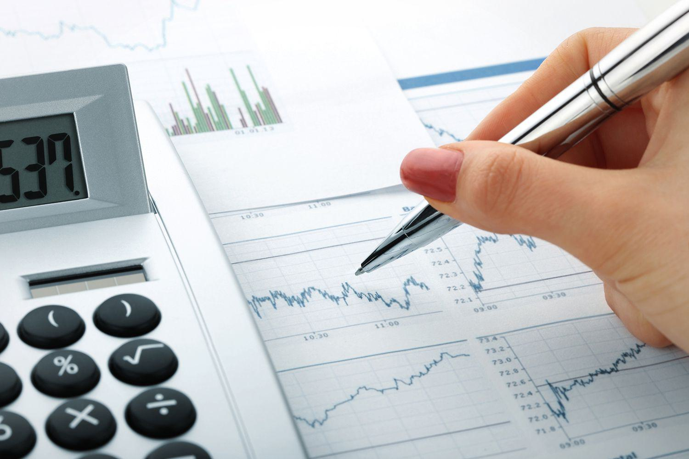

The financial world is rapidly evolving with the integration of advanced technologies and innovative economic concepts. In recent times, terms like 'financial units', 'surplus spending', and 'economic overflow' have increasingly become pivotal in understanding modern financial markets and economic structures. Financial units include individuals, corporations, and even countries with the power to influence economic outcomes by their spending and investment decisions. Surplus spending units, those with excess earnings, provide the capital necessary for economic growth, thereby highlighting the crucial role of these entities in global finance.

An important development in this evolving landscape is algorithmic trading, an automated system for executing trades. It operates through computer programs that adhere to a predefined set of instructions. The primary objective is to generate profits at a velocity and frequency beyond human capability. For example, algorithmic trading can exploit statistical arbitrage opportunities by executing trades in milliseconds. Implementing a simple moving average crossover strategy in Python might look like this:



```python
import numpy as np

def moving_average_crossover(prices, short_window, long_window):
    signals = np.zeros(len(prices))
    short_mavg = np.convolve(prices, np.ones(short_window)/short_window, mode='valid')
    long_mavg = np.convolve(prices, np.ones(long_window)/long_window, mode='valid')

    for i in range(len(long_mavg)):
        if short_mavg[i] > long_mavg[i]:
            signals[i + long_window - 1] = 1  # Buy signal
        elif short_mavg[i] < long_mavg[i]:
            signals[i + long_window - 1] = -1 # Sell signal
    return signals
```

Algorithmic trading has emerged as a tool to navigate the complex interplay of financial units, surplus spending, and economic overflow. The connections between these elements influence contemporary economic landscapes, dictating trading strategies and market dynamics. Understanding these interactions is essential for grasping modern financial markets and devising strategies that effectively leverage technological advancements for economic growth and stability.

## Table of Contents

## Understanding Financial Units and Surplus Spending

Financial units are pivotal entities within the economic framework, encompassing individuals, households, corporations, and countries. These units systematically accumulate wealth, exercising a profound influence on economic outcomes through their financial decisions and activities. As they engage in various economic transactions, financial units play critical roles in determining both microeconomic and macroeconomic landscapes.

Surplus spending units, a specific category within financial units, are characterized by their financial behavior of generating more income than their immediate consumption demands. This surplus of funds can be strategically invested or saved, creating a reserve of capital that serves multiple economic purposes. Such surplus spending units significantly underpin economic growth by infusing the market with capital, thereby fostering a climate conducive to innovation, expansion, and sustainability.

The impact of surplus spending units extends to financing crucial sectors of the economy. These units frequently provide the financial resources required for businesses seeking to scale operations, governments aiming to fund public projects, and deficit spending units in need of market stabilization. Their contributions are instrumental in maintaining the equilibrium of capital flow within the economy, facilitating [liquidity](/wiki/liquidity-risk-premium), and ensuring the availability of funds.

The importance of surplus spending is underscored when considering global economic health, as it highlights the interdependencies between various economic actors. Surplus funds act as a lifeline that finances not just growth but also resilience against economic downturns. For instance, during periods of financial distress, surplus spending units can offer necessary capital injections, aiding recovery efforts and stabilizing markets.

In summary, financial units and, specifically, surplus spending units, are integral components of the economic system. Their role in accumulating and allocating capital underscores their contribution to overall economic stability and progress. Understanding their function provides valuable insights into the mechanisms underlying economic health, emphasizing the essential nature of their contributions to market vitality and growth.

## Economic Overflow: A Byproduct of Surplus Spending

Economic overflow arises when financial units possessing a surplus of funds inject these resources into the market, resulting in enhanced investments and stimulation of economic activities. Surplus spending units, which may include individuals, corporations, or governments, play a crucial role in this process. When these entities generate more wealth than they consume, they create excess capital that can be allocated to various economic sectors.

The contribution of economic overflow to global economic stability and growth is significant. By providing essential funding, surplus spending enables the development of infrastructure, spurs innovation, and supports various industrial, technological, and social development projects. For instance, investments in infrastructure can lead to improved transportation systems, expanding commerce and, consequently, increasing economic productivity. In the field of innovation, surplus spending can foster research and development activities, leading to technological advancements that further drive economic progress.

Economic overflow also plays a critical part in maintaining the health of financial systems by providing liquidity to markets, promoting efficient capital distribution, and reducing the cost of borrowing. This can help businesses expand operations, create jobs, and improve overall living standards. However, while economic overflow can lead to prosperity and progress, understanding its dynamics is crucial for policymakers and economists in order to avoid potential drawbacks such as economic imbalances or financial bubbles.

Economists and policymakers must monitor the flow and allocation of surplus funds to ensure that they are used effectively and do not lead to economic distortions. For example, an excessive concentration of surplus funds into a specific sector could inflate asset prices unreasonably, risking a market bubble that might eventually burst and cause economic downturns. Effective economic policies, financial regulations, and investment strategies are therefore essential to manage the distribution of economic overflow and maintain a balanced economic environment.

## The Role of Algorithmic Trading in Economic Overflow

Algorithmic trading has become a crucial facet of modern financial markets, particularly through its capability to leverage economic overflow. Economic overflow arises when surplus spending units, entities with excess funds, inject capital into markets. This can increase investments and drive economic activity. Algorithmic trading facilitates the quick and effective deployment of these surplus funds by utilizing computational algorithms to manage trading operations.

Algorithms in trading optimize financial transactions by swiftly analyzing vast amounts of data to discern market trends. These computer programs execute trades based on predefined conditions at speeds unavailable to human traders, maximizing potential returns on investments. The typical [algorithmic trading](/wiki/algorithmic-trading) strategy involves capturing micro-trends in the market, which are minimally impacted by larger market swings, thereby safeguarding investments against broader economic fluctuations.

Consider a simple Python example of an algorithmic trading function using a moving average crossover strategy:

```python
def moving_average_crossover(prices, short_window=50, long_window=200):
    short_ma = prices.rolling(window=short_window, min_periods=1).mean()
    long_ma = prices.rolling(window=long_window, min_periods=1).mean()
    signal = (short_ma > long_ma).astype(int)
    return signal

# Example usage with hypothetical price data as a pandas DataFrame
import pandas as pd
prices = pd.Series([100, 102, 104, 103, 100, 99, 98, 101, 105, 107]) # Hypothetical closing prices
crossover_signal = moving_average_crossover(prices)
```

In the example, the function compares short-term and long-term moving averages of stock prices to generate buy (1) or sell (0) signals. Such algorithms enable traders to respond to market conditions quickly, optimizing their investment strategies informed by economic overflow.

Beyond market trend identification, algorithmic trading is integral for enhancing market liquidity. Liquidity, the ease with which assets can be bought or sold, is vital for the health of financial markets. Algorithmic trades often constitute a significant portion of market transactions, allowing for rapid and efficient adjustment of asset positions while minimizing transaction costs. This efficiency is particularly advantageous for surplus spending units seeking cost-effective management of their investments.

Algorithmic trading also addresses the problem of slippage, the difference between the expected price of a trade and the actual price. By timing trades precisely, algorithms help limit slippage and spread costs, ensuring surplus funds are utilized optimally. 

Thus, algorithmic trading not only capitalizes on economic overflow by reallocating surplus funds effectively but also ensures market operations remain fluid and cost-efficient, benefiting the broader economic landscape. The synergy of surplus spending and algorithmic trading contributes substantially to sustaining dynamic and robust financial markets.

## Implications for Global Markets

The interaction between surplus spending units and algorithmic trading has profound implications for global financial markets. This dynamic relationship influences several key aspects of financial systems, particularly asset prices, market [volatility](/wiki/volatility-trading-strategies), and overall stability.

Surplus spending units, by virtue of their excess capital, inject significant liquidity into the markets. This liquidity is often channeled through algorithmic trading systems that are designed to execute trades with high speed and efficiency. These systems leverage advanced algorithms to interpret market data, identify trends, and make rapid trading decisions. As a result, they can influence asset prices by creating substantial buy or sell pressures, thus impacting the supply and demand dynamics in markets.

Market volatility is another critical area affected by the interaction between surplus spending and algorithmic trading. On one hand, the enhanced liquidity provided by these trading algorithms can stabilize prices by smoothing out large fluctuations and reducing bid-ask spreads. On the other hand, the same algorithms can exacerbate volatility when they respond to market signals in a manner that amplifies price swings. This duality poses challenges for market participants and highlights the importance of understanding how algorithmic trading strategies function in real-time market conditions.

Furthermore, while the efficient capital allocation facilitated by algorithmic trading can drive economic growth, it also presents potential risks. One of the primary risks is market manipulation, where algorithms might engage in practices like quote stuffing or spoofing to create artificial market conditions. Such actions can undermine market integrity and lead to significant financial losses. Another concern is systemic risk, where the failure of one algorithm or trading strategy could trigger a cascade of market disruptions, similar to what was observed during the 2010 Flash Crash.

Given these implications, it is crucial for regulators, investors, and market participants to collaborate and develop comprehensive frameworks to mitigate potential risks associated with algorithmic trading. Regulators must devise robust policies to monitor trading activities, prevent manipulative practices, and ensure transparency. Investors and traders, meanwhile, should enhance their understanding of algorithmic strategies and engage in practices that promote market stability.

In summary, while the interaction between surplus spending units and algorithmic trading offers significant opportunities for economic advancement, it also demands careful oversight and strategic regulation to ensure that financial markets remain efficient, fair, and stable.

## Future Outlook: Opportunities and Challenges

As financial markets progress, the integration of surplus spending, economic overflow, and algorithmic trading is anticipated to shape future opportunities and challenges significantly. These elements, when effectively managed, can transform the financial landscape by promoting efficiency, inclusivity, and growth.

Opportunities primarily arise from the potential of technology to enhance market access and operational efficiency. Algorithmic trading, with its capacity for rapid data processing and execution, enables participants to engage in financial markets more effectively. This technological advance fosters market inclusivity by reducing entry barriers for smaller investors, potentially democratizing access to financial markets. Moreover, algorithmic trading can optimize capital allocation from surplus spending units, directing funds to sectors where they can spur innovation and development. Python, with its robust libraries like NumPy and pandas, can facilitate the development of sophisticated trading algorithms that analyze large datasets, identify patterns, and execute trades efficiently, thus maximizing returns while minimizing risk.

```python
import numpy as np
import pandas as pd

# Simple example of a moving average crossover strategy
def generate_signals(prices, short_window=40, long_window=100):
    signals = pd.DataFrame(index=prices.index)
    signals['price'] = prices
    signals['short_mavg'] = prices.rolling(window=short_window, min_periods=1).mean()
    signals['long_mavg'] = prices.rolling(window=long_window, min_periods=1).mean()
    signals['signal'] = 0.0
    signals['signal'][short_window:] = np.where(signals['short_mavg'][short_window:] > signals['long_mavg'][short_window:], 1.0, 0.0)
    signals['positions'] = signals['signal'].diff()
    return signals

# Example prices data
prices = pd.Series([100, 102, 101, 105, 110, 107, 108, 112, 115])
signals = generate_signals(prices)
print(signals)
```

However, these advancements are accompanied by challenges, particularly concerning regulatory frameworks and ethical considerations. The rapid pace of automated trading can amplify market volatility, leading to potential systemic risks. Flash crashes and market manipulation are pertinent concerns that necessitate robust regulation. Regulators face the challenge of crafting rules that ensure market stability without stifling innovation. Additionally, ethical concerns about fairness arise, as algorithmic trading can create an uneven playing field where technologically advanced participants gain disproportionate advantages. Addressing these issues requires a keen focus on ethical standards and the implementation of regulatory measures that promote transparency and equitable trading practices.

Balancing technological innovation with regulation is essential to maximize these financial trends' benefits while mitigating associated risks. A holistic strategy that incorporates advanced analytics, strict regulatory oversight, and a commitment to ethical standards will be crucial for sustainable economic development. The interplay of these components is vital to ensuring that financial systems remain resilient, efficient, and fair, facilitating continued progress in global economic landscapes.

## Conclusion

The synergistic relationship between surplus spending units, economic overflow, and algorithmic trading reflects the complexity and dynamism inherent in modern financial ecosystems. Surplus spending units, which accumulate and channel excess capital, drive economic growth by providing the necessary resources for investment and innovation. Economic overflow, emerging from this surplus, serves as a catalyst for further market activity, supporting diverse sectors and enhancing financial stability.

Algorithmic trading leverages these surplus funds to optimize investment strategies, utilizing advanced computational techniques to analyze market data and execute trades with precision. By efficiently allocating capital, algorithmic trading not only improves liquidity and reduces transaction costs but also influences asset prices and market volatility. This has significant implications for stakeholders, from policymakers and investors to corporations and financial institutions, who must carefully navigate these interdependencies to innovate and maintain stability.

The future of economic and financial landscapes depends largely on the thoughtful integration and regulation of these elements. Proper management ensures that surplus spending leads to beneficial economic overflow, channelled efficiently through algorithmic trading. Regulatory frameworks must evolve to address emerging challenges, such as market manipulation and systemic risks associated with increased automation.

Sustained economic prosperity will rely on collaboration among technologists, regulators, and market participants to devise strategies that balance technological advancements with ethical considerations. Emphasizing transparency, fairness, and robustness in financial systems will allow the full potential of these intertwined components to be harnessed, fostering global economic growth and resilience.

## References & Further Reading

[1]: Bergstra, J., Bardenet, R., Bengio, Y., & Kégl, B. (2011). ["Algorithms for Hyper-Parameter Optimization."](https://dl.acm.org/doi/10.5555/2986459.2986743) Advances in Neural Information Processing Systems 24.

[2]: ["Advances in Financial Machine Learning"](https://www.amazon.com/Advances-Financial-Machine-Learning-Marcos/dp/1119482089) by Marcos Lopez de Prado

[3]: ["Evidence-Based Technical Analysis: Applying the Scientific Method and Statistical Inference to Trading Signals"](https://www.amazon.com/Evidence-Based-Technical-Analysis-Scientific-Statistical/dp/0470008741) by David Aronson

[4]: ["Machine Learning for Algorithmic Trading"](https://github.com/stefan-jansen/machine-learning-for-trading) by Stefan Jansen

[5]: ["Quantitative Trading: How to Build Your Own Algorithmic Trading Business"](https://www.amazon.com/Quantitative-Trading-Build-Algorithmic-Business/dp/1119800064) by Ernest P. Chan