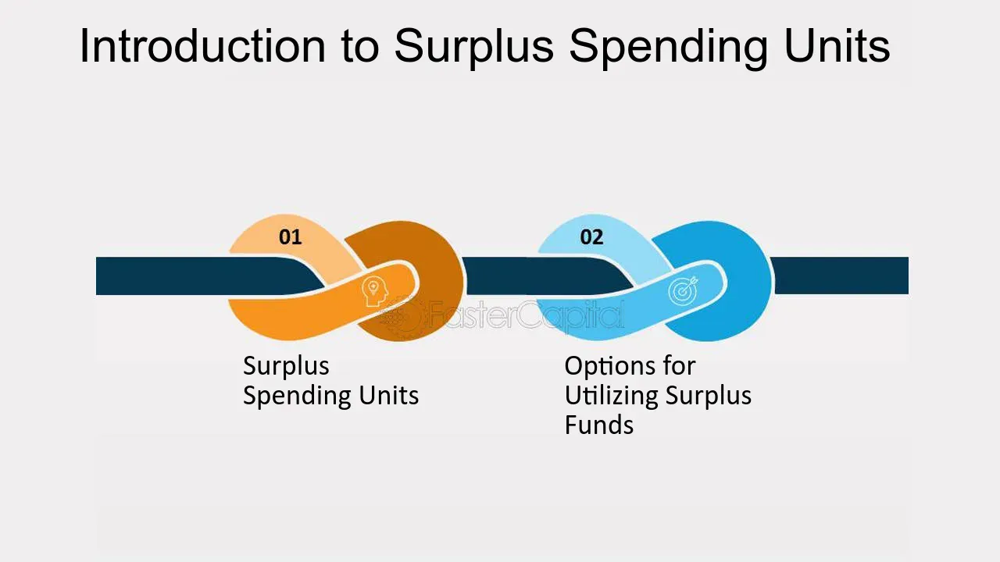

## Table of Contents

## What is a surplus spending unit?

A surplus spending unit is someone or a group that has more money coming in than they spend. This could be a person, a family, a business, or even a country. When they earn more than they use, they have extra money left over. They might save this money, invest it, or use it to pay off debts.

For example, if a family earns $5,000 a month and only spends $4,000, they have a surplus of $1,000. They can put this money into a savings account, buy stocks, or pay down their credit card. Being a surplus spending unit is good because it means you are financially stable and can plan for the future.

## How does a surplus spending unit differ from a deficit spending unit?

A surplus spending unit is someone or a group that earns more money than they spend. This means they have extra money left over each month or year. They can save this money, invest it, or use it to pay off debts. Being a surplus spending unit is good because it means you are financially stable and can plan for the future.

On the other hand, a deficit spending unit is someone or a group that spends more money than they earn. This means they have to borrow money or use savings to cover their expenses. Being a deficit spending unit can be risky because it might lead to debt problems if not managed carefully. It's important for a deficit spending unit to find ways to either earn more or spend less to become financially stable.

## Can you provide examples of typical surplus spending units?

A typical surplus spending unit could be a young professional who just started their career. They might earn a good salary but live with their parents to save on rent. Since they don't have many expenses, they can save a big part of their income. They might put this money into a savings account or invest it in stocks. This helps them build a strong financial future.

Another example is a retired couple who have paid off their home and have a steady income from pensions and investments. They might not need to spend a lot of money each month because they don't have a mortgage or other big expenses. This means they can live comfortably and still have money left over to enjoy their hobbies or help their family. Being a surplus spending unit in retirement can make life easier and more enjoyable.

## What role do surplus spending units play in the economy?

Surplus spending units play an important role in the economy. They have extra money that they can save or invest. When they save money in banks, the banks can use that money to give loans to other people or businesses. This helps the economy grow because more people can start businesses or buy homes. When surplus spending units invest their money in stocks or bonds, it helps companies grow and create jobs. This is good for everyone because it means more people can work and earn money.

Another way surplus spending units help the economy is by spending their extra money on goods and services. When they buy things, it helps businesses make more money. This can lead to more jobs and a stronger economy. Also, if surplus spending units use their extra money to pay off debts, it can make the economy more stable. This is because less debt means people and businesses are less likely to have money problems, which can hurt the economy. In short, surplus spending units help the economy by saving, investing, spending, and paying off debts.

## How do surplus spending units affect savings and investment?

Surplus spending units have more money coming in than they spend. This extra money can be saved in banks. When they save, banks have more money to lend to others. This helps people buy homes or start businesses, which is good for the economy. More loans mean more growth and more jobs.

Surplus spending units can also invest their extra money. They might buy stocks or bonds. When they invest in stocks, they help companies grow. This can lead to more jobs and a stronger economy. When they buy bonds, they help the government or businesses borrow money at a lower cost. This makes it easier for them to do big projects that help everyone.

## What are the financial behaviors commonly associated with surplus spending units?

Surplus spending units often save a lot of their extra money. They might put it in a bank account where it can earn a little interest. This helps them build up a safety net for the future. They might also use their savings to pay off debts, like credit cards or loans. This makes their financial life more stable and less stressful.

Another common behavior is investing. Surplus spending units might buy stocks or bonds. This can help their money grow over time. They might also spend some of their extra money on things they enjoy, like travel or hobbies. But they do this carefully, making sure they still have enough left over to save and invest. This balance helps them stay financially healthy and enjoy life at the same time.

## How do government policies impact surplus spending units?

Government policies can have a big impact on surplus spending units. For example, if the government changes tax laws, it can affect how much money surplus spending units have left over after paying taxes. If taxes go up, they might have less money to save or invest. But if taxes go down, they could have more money to put into savings or investments. Also, government policies about interest rates can make a difference. If interest rates are high, surplus spending units might earn more from their savings. But if rates are low, they might look for other ways to make their money grow, like investing in stocks.

Another way government policies affect surplus spending units is through programs that encourage saving and investing. For example, the government might offer tax breaks for people who put money into retirement accounts. This can make it more attractive for surplus spending units to save for the future. On the other hand, if the government cuts back on these programs, surplus spending units might not have as many good options for saving and investing. Overall, government policies can shape the choices surplus spending units make about their extra money, influencing how they save, invest, and spend.

## What are the economic implications of having a high number of surplus spending units in a country?

Having a lot of surplus spending units in a country can be good for the economy. When people and businesses have more money than they spend, they often save or invest it. This means banks have more money to lend to others, which can help people buy homes or start new businesses. More loans can lead to more growth and more jobs. Also, when surplus spending units invest in stocks, it helps companies grow and create even more jobs. This can make the economy stronger and help everyone.

But there can also be some challenges. If too many people are saving and not spending enough, it might slow down the economy. When people don't spend, businesses might not make as much money, and they might have to cut jobs. This can lead to less growth. Governments might need to find a balance, encouraging saving and investing but also making sure people spend enough to keep the economy moving. Overall, a high number of surplus spending units can be a good thing, but it needs to be managed carefully to keep the economy healthy.

## How do surplus spending units interact with financial institutions?

Surplus spending units often put their extra money into banks. When they save money in a bank, it helps the bank have more money to lend to others. This is good because it means more people can get loans to buy homes or start businesses. Banks might also pay interest on the money saved, which gives surplus spending units a little extra money over time. This makes saving in banks a safe and easy way for them to keep their money growing.

Surplus spending units also work with other financial institutions like investment firms. They might invest their extra money in stocks or bonds. When they buy stocks, they help companies grow and create jobs. When they buy bonds, they help the government or businesses borrow money at a lower cost. This can lead to more projects that help the economy. By saving and investing, surplus spending units play a big role in keeping the economy strong and healthy.

## What strategies can surplus spending units employ to maximize their economic impact?

Surplus spending units can help the economy a lot by saving their extra money in banks. When they save, banks have more money to give as loans to people who want to buy homes or start businesses. This helps the economy grow because more people can do big things with the money they borrow. Surplus spending units can also look for banks that offer good interest rates on savings. This way, they can earn a little more money over time, which they can then use to save even more or invest.

Another way surplus spending units can make a big impact is by investing their extra money in stocks or bonds. When they buy stocks, they help companies grow and create jobs. This is good for everyone because it means more people can work and earn money. When they buy bonds, they help the government or businesses borrow money at a lower cost. This can lead to more projects that help the economy. By choosing to invest wisely, surplus spending units can help make the economy stronger and more stable.

Surplus spending units can also spend some of their extra money on goods and services. When they buy things, it helps businesses make more money. This can lead to more jobs and a stronger economy. They should try to spend on things that are made locally, which helps their community even more. By balancing saving, investing, and spending, surplus spending units can have a big positive effect on the economy.

## How do global economic conditions influence the behavior of surplus spending units?

Global economic conditions can change how surplus spending units act. If the world economy is doing well, surplus spending units might feel more confident. They might invest more in stocks because they think companies will grow. They might also spend more on things they enjoy, like travel or new gadgets, because they feel good about the future. But if the global economy is not doing well, they might be more careful. They might save more money in banks instead of investing in stocks, because they are worried about losing money. They might also spend less on things they don't need, to make sure they have enough money if times get tough.

Sometimes, global economic conditions can make interest rates change. If interest rates go up, surplus spending units might put more money into savings accounts because they can earn more interest. This can help them grow their money safely. But if interest rates go down, they might look for other ways to make their money grow, like investing in stocks or buying bonds. They need to keep an eye on what's happening around the world to make smart choices about their extra money.

## What advanced economic theories explain the dynamics of surplus spending units in modern economies?

One advanced economic theory that helps explain the dynamics of surplus spending units is the life-cycle hypothesis. This theory says that people try to keep their spending the same over their whole life. When they are young and earning less, they might borrow money or use savings. But when they are older and earning more, they become surplus spending units. They save and invest their extra money to use later when they retire. This theory shows how surplus spending units help the economy by saving and investing, which can lead to more growth and jobs.

Another theory is the permanent income hypothesis. This theory says that people base their spending on what they think their income will be over a long time, not just what they earn right now. If surplus spending units think their income will stay high, they might spend more now and save less. But if they think their income might go down, they might save more and spend less. This theory helps explain why surplus spending units might change how they save and spend based on what they think will happen in the future. It shows how their actions can affect the economy in different ways.

## References & Further Reading

[1]: Bergstra, J., Bardenet, R., Bengio, Y., & Kégl, B. (2011). ["Algorithms for Hyper-Parameter Optimization."](https://dl.acm.org/doi/10.5555/2986459.2986743) Advances in Neural Information Processing Systems 24.

[2]: ["Advances in Financial Machine Learning"](https://www.amazon.com/Advances-Financial-Machine-Learning-Marcos/dp/1119482089) by Marcos Lopez de Prado

[3]: ["Evidence-Based Technical Analysis: Applying the Scientific Method and Statistical Inference to Trading Signals"](https://www.amazon.com/Evidence-Based-Technical-Analysis-Scientific-Statistical/dp/0470008741) by David Aronson

[4]: ["Machine Learning for Algorithmic Trading"](https://github.com/stefan-jansen/machine-learning-for-trading) by Stefan Jansen

[5]: ["Quantitative Trading: How to Build Your Own Algorithmic Trading Business"](https://www.amazon.com/Quantitative-Trading-Build-Algorithmic-Business/dp/1119800064) by Ernest P. Chan