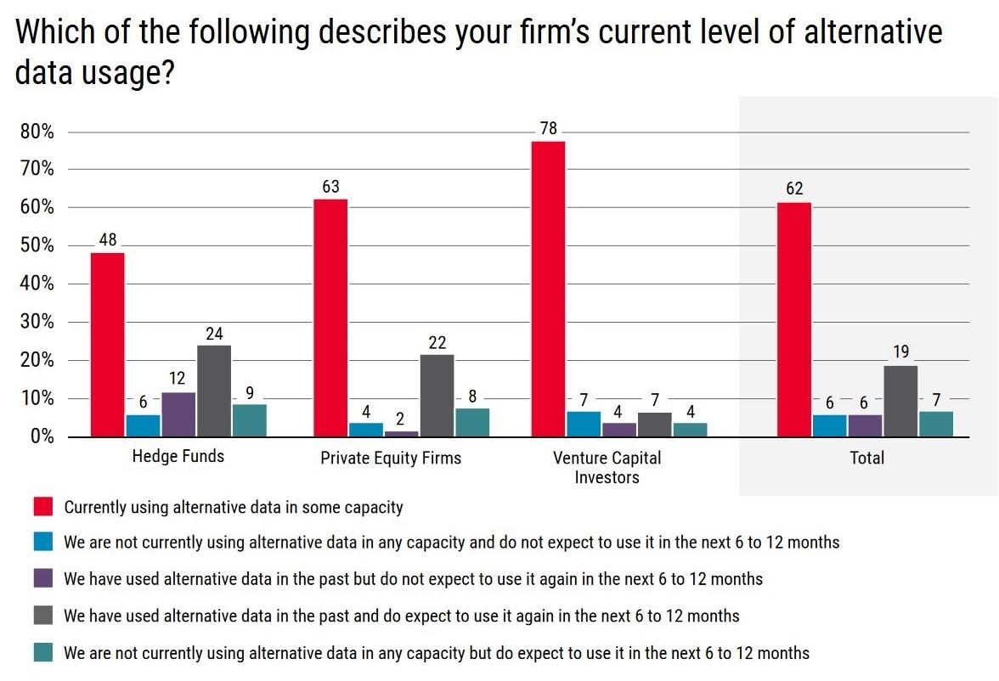

## Table of Contents

## What is alternative data?

Alternative data refers to information that is not typically found in traditional financial statements or market reports. It includes data from sources like social media, satellite imagery, credit card transactions, and web traffic, which can provide unique insights into a company's performance or market trends. Investors and analysts use this data to gain a competitive edge by uncovering patterns and trends that are not visible through conventional data sources.

This type of data is especially useful for making more informed investment decisions. For example, by analyzing satellite images of parking lots, one can estimate the foot traffic at a retail store, which might indicate the store's sales performance. Similarly, tracking social media sentiment can help predict consumer behavior and market movements. As technology advances, the use of alternative data is becoming more widespread, helping businesses and investors stay ahead in a rapidly changing market.

## How does alternative data differ from traditional data?

Alternative data is different from traditional data because it comes from unusual places. Traditional data is what you usually see in financial reports, like a company's earnings or stock prices. This kind of data is easy to find and everyone uses it. On the other hand, alternative data can come from things like social media posts, satellite pictures, or even credit card swipes. This data is not as easy to get, but it can tell you new things that traditional data can't.

Using [alternative data](/wiki/best-alternative-data) can help people see what's happening in a way that traditional data can't. For example, if you want to know how busy a store is, traditional data might only show you the store's sales numbers. But with alternative data, like satellite images of the store's parking lot, you can see how many cars are there and guess how many people are shopping. This can give you a better idea of how well the store is doing. As more people use technology, alternative data is becoming more important for making smart choices in business and investing.

## What are some common sources of alternative data?

Alternative data comes from many different places that are not the usual sources like financial reports. Some common sources are social media platforms like Twitter and Instagram. People share their thoughts and experiences on these sites, and by looking at what they say, you can learn about what they like or don't like. Another source is satellite images. These pictures from space can show how busy a place is, like how full a parking lot is at a shopping center. This can help guess how many people are visiting that place.

Credit card transactions are also a big source of alternative data. By looking at where and how people spend their money, you can see trends in what they buy. Web traffic data is another source, which shows how many people visit a website and what they do there. This can tell you if a company's website is popular or if people are interested in their products. All these sources give different pieces of information that can help understand what's happening in the market or with a company.

## Why is alternative data important for surveys?

Alternative data is important for surveys because it can give us new and different information that we can't get from traditional surveys. When people fill out surveys, they might not always tell the truth or remember everything correctly. But with alternative data, like looking at what people post on social media or tracking where they go using their phones, we can see what they are really doing and thinking. This can make our surveys more accurate and helpful.

For example, if we want to know how people feel about a new product, we can look at social media to see what they are saying about it. This can give us a more honest and up-to-date picture than just asking them in a survey. Also, alternative data can help us reach people who might not usually fill out surveys, like young people who spend a lot of time online. By using this kind of data, we can make our surveys better and learn more about what people really want and need.

## How can alternative data be used to enhance survey results?

Alternative data can make survey results better by giving us information that we can't get from just asking people questions. When people answer surveys, they might not always tell the truth or remember everything right. But if we look at what they do on social media or where they go using their phones, we can see what they really think and do. This can help us check if what people say in surveys matches what they actually do. For example, if a survey says people like a new product, but social media shows they are complaining about it, we know there might be a problem.

Using alternative data also helps us reach more people, especially those who don't usually fill out surveys. Young people, for instance, might not answer a survey, but they share a lot on social media. By looking at their posts, we can learn about their likes and dislikes. This way, we can get a fuller picture of what different groups of people think and do. So, alternative data helps make our surveys more accurate and useful by giving us a clearer and more complete view of what's really going on.

## What are the challenges of integrating alternative data into surveys?

One big challenge of using alternative data in surveys is getting the right data. Alternative data comes from many different places like social media, satellite pictures, and credit card transactions. It can be hard to find the exact data you need and make sure it's correct. Also, this data can be very messy and hard to understand. You need special tools and skills to clean it up and make sense of it, which can take a lot of time and money.

Another challenge is keeping people's information private. When you use data from social media or credit cards, you have to be very careful about not sharing personal details. There are strict rules about how you can use this data, and if you don't follow them, you could get in big trouble. It's important to make sure you're not breaking any laws or hurting anyone's privacy when you use alternative data in your surveys.

Lastly, it can be tough to mix alternative data with the answers people give in surveys. The two types of data are very different, and it's not always easy to put them together in a way that makes sense. You have to be careful to make sure the alternative data really matches up with what people are saying in the surveys. If you don't do this right, you might end up with confusing or wrong results.

## What ethical considerations should be taken into account when using alternative data?

When using alternative data, it's really important to think about privacy. This kind of data often comes from personal sources like social media or credit card transactions. It's easy to accidentally share someone's private information, which can hurt them. So, you need to be very careful to follow the rules about data privacy. These rules are there to protect people, and if you break them, you could get in big trouble. Always make sure you're using the data in a way that respects people's privacy and doesn't harm them.

Another thing to consider is fairness. Alternative data can sometimes show biases or leave out certain groups of people. For example, if you only look at data from one social media platform, you might miss out on what other people are thinking or doing. This can make your results unfair or not accurate. It's important to try to use data from different places and make sure you're not leaving anyone out. By doing this, you can make sure your use of alternative data is fair and helps everyone equally.

## How can one ensure the quality and reliability of alternative data?

Ensuring the quality and reliability of alternative data starts with checking where the data comes from. You need to make sure the sources are trustworthy and that the data is collected in a good way. For example, if you're using social media data, you should look at how the posts are gathered and if they represent what most people think. It's also important to clean up the data, which means getting rid of any mistakes or weird information. This can be a lot of work, but it helps make sure the data you're using is correct and useful.

Another way to make sure alternative data is good is by comparing it with other information. If the alternative data matches up with traditional data or other sources, it's more likely to be reliable. You can also use special tools and methods to check the data's quality. These tools can help you see if there are any patterns or problems in the data. By being careful and using these methods, you can trust that the alternative data you're using is high quality and will help you make better decisions.

## What are some advanced techniques for analyzing alternative data in surveys?

One advanced technique for analyzing alternative data in surveys is using [machine learning](/wiki/machine-learning). This is a type of computer program that can learn from data and find patterns that people might miss. For example, machine learning can look at thousands of social media posts and figure out what people really think about a product. This can help make survey results more accurate by comparing what people say in surveys with what they post online. It's like having a smart helper that can sort through a lot of information quickly and find the important stuff.

Another technique is called sentiment analysis. This is when computers read text, like social media posts or online reviews, and figure out if people are feeling happy, sad, or angry about something. By using sentiment analysis on alternative data, you can see how people really feel about a topic, which might be different from what they say in a survey. This can help you understand if people are telling the truth or if they are just saying what they think you want to hear. It's a powerful way to get a more honest picture of what people think and feel.

## Can you provide case studies where alternative data significantly impacted survey outcomes?

A company wanted to know how people felt about their new product. They did a survey and most people said they liked it. But when they looked at social media posts using alternative data, they saw a lot of people were actually complaining about the product. This showed that the survey results were not telling the whole truth. By using alternative data, the company found out that people were not happy with the product and they made changes to fix the problems. This helped them make a better product that people really liked.

Another case was about a store that wanted to know how busy they were. They did a survey asking people if they visited the store often, and most said yes. But when they used satellite images to look at the parking lot, they saw it was not as full as they thought. This alternative data showed that fewer people were coming to the store than the survey suggested. The store used this information to start new promotions and make their store more attractive. As a result, more people started coming to the store, and their business got better.

## What future trends are expected in the use of alternative data for surveys?

In the future, more and more people will use alternative data to make surveys better. As technology gets better, it will be easier to collect and understand data from places like social media, satellite pictures, and credit card transactions. This will help surveys be more accurate because they can check what people say against what they actually do. Also, new tools like machine learning will help sort through this data quickly and find important patterns that we might miss otherwise. This means surveys will be able to give us a clearer picture of what people really think and feel.

Another trend will be using alternative data to reach more people, especially those who don't usually fill out surveys. For example, young people who spend a lot of time online might not answer traditional surveys, but their social media posts can tell us a lot about what they like and don't like. By looking at this data, we can learn about groups of people that are hard to reach with regular surveys. This will make surveys more inclusive and give us a better understanding of what different groups of people want and need.

## How can organizations start implementing alternative data strategies in their survey methodologies?

Organizations can start using alternative data in their surveys by first figuring out what kind of information they need. They should look at what they want to learn from the surveys and then find alternative data sources that can help them. For example, if they want to know how people feel about a new product, they might look at social media posts or online reviews. It's important to make sure the data they choose is reliable and comes from trustworthy places. They might need to use special tools or hire experts to help them gather and clean up the data so it's ready to use.

Once they have the data, organizations can compare it with what people say in their surveys. This can help them see if the survey results match up with what people are really doing and thinking. For example, if the survey says people like a product but social media shows they are complaining about it, the organization knows there might be a problem. They can also use advanced techniques like machine learning to find patterns in the data that they might miss otherwise. By doing this, they can make their surveys more accurate and get a better understanding of what people really want and need.

## References & Further Reading

[1]: Bergstra, J., Bardenet, R., Bengio, Y., & Kégl, B. (2011). ["Algorithms for Hyper-Parameter Optimization."](https://papers.nips.cc/paper/4443-algorithms-for-hyper-parameter-optimization) Advances in Neural Information Processing Systems 24.

[2]: ["Advances in Financial Machine Learning"](https://www.amazon.com/Advances-Financial-Machine-Learning-Marcos/dp/1119482089) by Marcos Lopez de Prado

[3]: ["Evidence-Based Technical Analysis: Applying the Scientific Method and Statistical Inference to Trading Signals"](https://www.amazon.com/Evidence-Based-Technical-Analysis-Scientific-Statistical/dp/0470008741) by David Aronson

[4]: ["Machine Learning for Algorithmic Trading"](https://github.com/stefan-jansen/machine-learning-for-trading) by Stefan Jansen

[5]: ["Quantitative Trading: How to Build Your Own Algorithmic Trading Business"](https://books.google.com/books/about/Quantitative_Trading.html?id=j70yEAAAQBAJ) by Ernest P. Chan