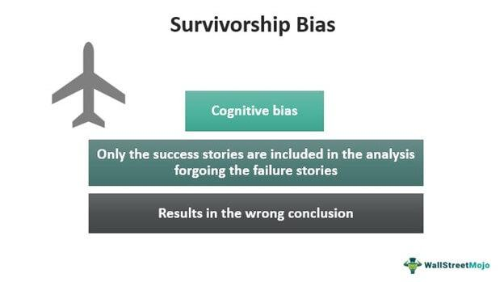

Algorithmic trading has fundamentally transformed financial markets by enabling the execution of intricate and varied strategies with unparalleled precision and speed. As algorithms increasingly dominate trading floors, many traders and financial institutions are relying on complex models to generate profits and manage risk. Despite its advantages, algorithmic trading faces the challenge of potential statistical biases that can taint data and subsequent analysis.

Among the type of biases that can disrupt the integrity of trading systems, survivorship bias and other forms of statistical biases are particularly notorious. Survivorship bias occurs when analyses consider only the entities that have 'survived' past filtering criteria and ignore those that have failed or been removed from datasets. This can lead to overly optimistic performance evaluations because only successful or currently operating entities are included in assessments. Other biases that may impact decision-making include selection bias and look-ahead bias, which similarly distort the perception of data and can lead to skewed outcomes.



These biases have profound implications, especially in the areas of risk assessment and strategy development within algorithmic trading. If unaddressed, they can lead to inaccurate performance appraisals and misguided investment decisions. Consequently, traders may underestimate risks or overestimate potential returns, leading to poor strategy execution and financial losses.

Understanding the implications of statistical biases is a critical step for any trader or investor looking to optimize their algorithmic trading models. This article aims to offer insights into different biases affecting algorithmic trading and explores potential strategies to mitigate their impact, ensuring more accurate and reliable trading models moving forward.

## Table of Contents

## Understanding Statistical Biases in Algorithmic Trading

Statistical biases arise when the data used in a study or analysis is not a true representation of the entire population. In the context of algorithmic trading, these biases can severely affect the validity of performance assessments, leading to flawed trading models and potentially misguided financial decisions.

**Survivorship Bias** is a predominant issue where datasets only include successful entities. In trading, this typically means focusing exclusively on stocks that have not gone bankrupt, thus presenting a deceptively favorable performance history. This bias can cause traders to overestimate returns and underestimate risks because the failed or delisted stocks, which could have significantly affected the performance metrics, are excluded.

**Selection Bias** occurs when the criteria for selecting data is not random, which can skew the results of an analysis. In algorithmic trading, if the data being analyzed is cherry-picked—for example, only including stocks from a high-performing sector—this can result in over-optimistic algorithmic results that aren't achievable under normal market conditions.

**Look-Ahead Bias** involves using information in a model that would not have been available or known during the time period being analyzed. This often happens when historical data is backtested with future information inadvertently included, giving a misleading view of how a trading strategy would have actually performed. This bias can be especially harmful as it might suggest a predictive accuracy that does not exist, leading to unreliable trading strategies.

To develop robust trading models that accurately reflect real-world market conditions, it is crucial to recognize and understand these biases. For instance, statisticians must ensure that datasets used for developing and [backtesting](/wiki/backtesting) trading strategies are comprehensive and representative. This can involve using datasets that include both successful and failed companies to avoid survivorship bias and ensuring that selection criteria are transparent and unbiased to prevent selection bias. Additionally, rigorous controls must be in place to verify that no future information impacts backtests, thus avoiding look-ahead bias.

Below is a simple Python example demonstrating the potential impact of survivorship bias in analyzing historical stock performance:

```python
import pandas as pd
import numpy as np

# Sample data simulating stock return percentages
data = {
    'Stock': ['A', 'B', 'C', 'D'],
    'Returns': [0.10, 0.15, -0.05, np.nan]  # Assume stock D went bankrupt
}

df = pd.DataFrame(data)

# Without correcting for survivorship bias
average_return_biased = df['Returns'].mean()
print(f"Biased Average Return: {average_return_biased:.2%}")

# Correcting for survivorship bias by considering mean of non-NaN returns
average_return_unbiased = df['Returns'].fillna(0).mean()  # Assume zero return for bankrupt stocks
print(f"Unbiased Average Return: {average_return_unbiased:.2%}")
```

This snippet calculates the average stock returns with and without considering survivorship bias. In practice, failing to account for stocks that become defunct (represented here with NaN) can yield skewed insights into strategy performance. Addressing such biases ensures a more realistic and dependable evaluation, essential for the development of sustainable [algorithmic trading](/wiki/algorithmic-trading) models.

## Survivorship Bias: A Common Pitfall

Survivorship bias poses a substantial risk in algorithmic trading by providing an inaccurate and overly optimistic view of historical performance. This bias occurs when analyses are conducted only on entities that have succeeded or survived to a specific point in time, while those that have failed or exited are ignored. In the context of financial markets, this often means focusing only on stocks or companies that are currently listed or operational, while excluding those that have been delisted or gone bankrupt. 

The impact of such bias is significant because it misrepresents the true historical performance by excluding unsuccessful entities, potentially leading traders to overestimate the reliability and profitability of trading strategies. This inflation of success is particularly problematic during backtesting, where past market data is used to simulate the performance of a trading strategy. Backtesting with survivorship-biased data often results in performance metrics that do not accurately reflect the strategy's potential risks or returns, particularly in volatile markets.

For instance, consider a scenario in which an algorithmic trading strategy includes historical stock data, but only for companies that are currently listed on a stock exchange. This dataset excludes companies that have failed, which generally exhibit worse financial performance before delisting. As a result, backtested returns seem more favorable than they would have been if failed entities had been included. The implication is that a strategy may appear to generate significant returns with low risk, whereas, in reality, the inclusion of all entities might have shown reduced returns or higher [volatility](/wiki/volatility-trading-strategies).

The importance of recognizing and correcting for survivorship bias can be illustrated through a simple Python code snippet. This example demonstrates how handling a dataset without considering survivorship bias can skew results.

```python
import numpy as np
import pandas as pd

# Simulated dataset with survivorship bias
# Only includes surviving companies
surviving_data = {'Company': ['A', 'B', 'C'],
                  'Returns': [0.05, 0.03, 0.04]}

# Simulated dataset including all companies
complete_data = {'Company': ['A', 'B', 'C', 'D', 'E'],
                 'Returns': [0.05, 0.03, 0.04, -0.02, -0.03]}

surviving_df = pd.DataFrame(surviving_data)
complete_df = pd.DataFrame(complete_data)

# Calculate average returns
average_surviving = surviving_df['Returns'].mean()
average_complete = complete_df['Returns'].mean()

print(f"Average Returns with Survivorship Bias: {average_surviving:.2f}")
print(f"Average Returns (Complete Data): {average_complete:.2f}")
```

The output of this code highlights the discrepancy in average returns when survivorship bias is present versus when it is corrected for. By analyzing the complete data set, traders can obtain a more realistic view of potential returns and associated risks.

Addressing survivorship bias requires utilizing comprehensive datasets, including all relevant entities regardless of their current status. Traders must ensure that their backtesting methodologies account for both survived and failed entities to avoid misrepresenting the viability of their strategies. Being vigilant about this bias aids in developing more accurate trading models, ultimately contributing to more reliable investment decisions.

## Impact of Biases on Risk Assessment

Statistical biases can significantly affect risk assessment in algorithmic trading by distorting the accuracy of volatility estimates and the recognition of downside risks. Volatility is a critical measure of risk, often calculated using historical price data to predict future fluctuations. When biases such as survivorship, selection, or look-ahead bias are present, they lead to skewed datasets, resulting in an underestimation or overestimation of true market volatility.

Survivorship bias, for instance, occurs when only successful entities are included in datasets, ignoring those that have failed or exited the market. This can lead to an unjustifiably optimistic view of the market's historical performance, thus misrepresenting the actual volatility experienced over the period. As a result, risk models may underestimate the likelihood of extreme market movements, causing traders to be inadequately prepared for potential losses.

Furthermore, the presence of such biases can affect the recognition of downside risks—the potential losses that might arise from adverse market movements. By underreporting the frequency or severity of downturns, biased data can mislead traders into believing that the potential downside is less significant than it truly is. This can have direct implications on investment decisions, leading traders to adopt riskier positions under the assumption that market conditions are more benign than they actually are.

Ignoring these biases during the risk assessment process can lead to a cascade of miscalculations. Misjudging volatility and downside risk might result in inappropriate allocation of capital and inadequate hedging strategies. This could ultimately expose traders and investors to unanticipated losses, particularly in turbulent market conditions. To mitigate these effects, it is essential to employ comprehensive data that accounts for all market entities, including those that have failed. Techniques such as imposing realistic constraints on backtesting scenarios or incorporating out-of-sample testing can help correct biased estimations and ensure a more accurate portrayal of market risks.

In summary, accurate risk assessment in algorithmic trading hinges on recognizing and correcting for statistical biases. Failure to do so not only skews the perception of historical performance but also imperils traders with improper risk management strategies, potentially leading to significant financial losses.

## Mitigating Biases in Algo Trading

Mitigating biases in algorithmic trading begins with the construction of comprehensive datasets. A dataset that includes both successful and failed entities prevents skewed analyses that may otherwise arise from over-representation of thriving stocks, which is often the case when survivorship bias is present. The following strategies can help in this endeavor:

1. **Incorporating Comprehensive Datasets**: One of the primary steps in bias mitigation is ensuring that datasets capture the full spectrum of market entities, including delisted stocks and failed companies. This approach ensures that analyses consider all factors influencing market dynamics, providing a more balanced view of historical performance.

2. **Adjusted Backtesting Procedures**: To accurately reflect past market conditions, traders can modify backtesting processes. Traditional backtesting often errs by excluding data from non-surviving stocks. By integrating historical data of these failed entities, traders can better understand how their strategies would perform under various market conditions. The inclusion of the full universe of stocks, both past and present, can be achieved by using comprehensive historical databases that include delisted securities.

3. **Diverse Market Conditions in Strategy Design**: Designing trading strategies that are resilient across various market conditions is crucial. This includes stress-testing strategies against historical events such as market crashes or financial crises. A diversified approach ensures that algorithms are not merely optimized for periods of market growth but are robust against downturns as well.

4. **Advanced Analytical Techniques**: Employing statistical methods such as Monte Carlo simulations can help understand the potential variability of trading strategies under different market scenarios. Additionally, regularization techniques in machine learning, such as L1 and L2 regularization, can help prevent overfitting to biased datasets by penalizing complex models that may not generalize well to unseen data.

   Here's a simple Python code example demonstrating the use of regularization in a [machine learning](/wiki/machine-learning) context:

   ```python
   from sklearn.linear_model import Lasso
   import numpy as np

   # Example dataset
   X = np.array([[1, 2], [2, 1], [3, 4], [4, 3]])
   y = np.array([2.7, 2.3, 3.1, 3.9])

   # Lasso regression with L1 regularization
   model = Lasso(alpha=0.1)
   model.fit(X, y)

   print("Coefficients:", model.coef_)
   ```

5. **Periodic Review and Adaptation**: The trading framework should include a mechanism for regular review and adaptation of strategies. This involves not only revisiting the datasets used for algorithm training but also recalibrating parameters to align with current market conditions. Such periodic reassessments help in identifying new biases and maintaining strategy efficacy over time.

By adopting these methodologies, practitioners can significantly reduce the impact of statistical biases in their algorithmic trading, fostering more reliable and accurate predictions of market behavior. Furthermore, it enhances the robustness of trading strategies, ensuring they deliver optimal performance across diverse financial landscapes.

## Conclusion

Algorithmic trading, with its ability to process vast amounts of data and execute complex strategies at high speeds, represents a transformative force in financial markets. However, this technological advancement carries inherent risks, primarily manifested in the form of statistical biases like survivorship bias. These biases, if left unchecked, can distort analytical outcomes, leading traders astray with overly optimistic evaluations of historical performance.

Addressing these biases is crucial for building more accurate and resilient trading strategies. By systematically identifying and mitigating statistical biases, traders can improve the integrity of their backtesting and performance metrics. Employing comprehensive datasets that include both successful and unsuccessful entities can help neutralize the effects of survivorship bias. Moreover, adopting robust backtesting procedures tailored to consider all market conditions ensures that trading models are not only theoretically appealing but also practically viable.

Effective risk assessment should accurately encapsulate both the potential returns and the possible downside risks. Ensuring this accuracy involves recognizing and correcting for latent biases that might otherwise cause an underestimation of risk levels. Implementing such measures allows for more informed investment decisions, ultimately enhancing the success rate of algorithmic trading strategies.

In conclusion, while the prospects of algorithmic trading are expansive, careful attention to the potential pitfalls posed by statistical biases is imperative. By addressing these issues, traders can unlock substantial benefits, crafting strategies that are not only profitable but also resilient to the myriad uncertainties of financial markets.

## References & Further Reading

[1]: ["Quantitative Trading: How to Build Your Own Algorithmic Trading Business"](https://www.amazon.com/Quantitative-Trading-Build-Algorithmic-Business/dp/0470284889) by Ernest P. Chan

[2]: ["Advances in Financial Machine Learning"](https://www.amazon.com/Advances-Financial-Machine-Learning-Marcos/dp/1119482089) by Marcos Lopez de Prado

[3]: ["Evidence-Based Technical Analysis: Applying the Scientific Method and Statistical Inference to Trading Signals"](https://www.amazon.com/Evidence-Based-Technical-Analysis-Scientific-Statistical/dp/0470008741) by David Aronson

[4]: ["Machine Learning for Algorithmic Trading"](https://github.com/PacktPublishing/Machine-Learning-for-Algorithmic-Trading-Second-Edition) by Stefan Jansen

[5]: Bergstra, J., Bardenet, R., Bengio, Y., & Kégl, B. (2011). ["Algorithms for Hyper-Parameter Optimization."](https://proceedings.neurips.cc/paper/2011/file/86e8f7ab32cfd12577bc2619bc635690-Paper.pdf) Advances in Neural Information Processing Systems 24.