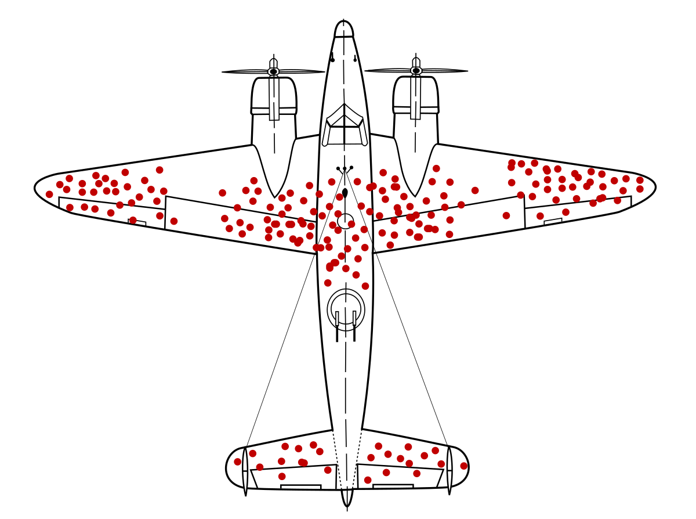

## Table of Contents

## What is survivor bias?

Survivor bias is when we only look at the people or things that made it through a tough situation, and we forget about the ones that didn't. It's like only seeing the winners and not the losers. For example, if you only study successful businesses, you might think you know what makes a business successful, but you're missing out on learning from the businesses that failed.

This bias can lead to wrong conclusions because we're not seeing the whole picture. Imagine you're trying to figure out how to survive a shipwreck. If you only talk to the survivors, you might think that swimming really well is the key to survival. But maybe the people who couldn't swim at all died, and you never get to hear their stories. So, it's important to consider both the survivors and the ones who didn't make it to get a full understanding of any situation.

## How does survivor bias affect decision-making?

Survivor bias can mess up our decision-making because it makes us focus only on the success stories. When we make choices based on what worked for others who made it through, we might think those are the best ways to go. But we're missing out on learning from the failures. For example, if you want to start a business and you only read about the successful ones, you might copy their strategies without knowing why many other businesses failed using the same methods.

This can lead to bad decisions because we don't have the full picture. If you're trying to figure out how to invest money, looking only at the stocks that went up might make you think those are safe bets. But you won't know about the stocks that crashed and burned. So, when making decisions, it's important to look at both the successes and the failures to get a better understanding of what might work and what might not.

## Can you provide examples of survivor bias in everyday life?

Survivor bias can show up when we think about famous people. We often hear stories about successful actors, musicians, or athletes. We might think that if we follow their paths, we'll be successful too. But we don't hear about all the people who tried to become famous and didn't make it. There are many more people who tried and failed than those who succeeded, but we only see the winners. This can make us think that becoming famous is easier than it really is.

Another example is in the world of investing. When we read about people who made a lot of money from the stock market, it's easy to think that investing is a sure way to get rich. But we don't hear about all the people who lost money. The stories of big wins get shared a lot, but the losses are often kept quiet. This can make us think that investing is less risky than it really is, and we might make decisions based on incomplete information.

## What are the common sources of survivor bias in data collection?

One common source of survivor bias in data collection is when we only look at the data that's easy to get. For example, if we're studying businesses, we might only look at the ones that are still around because it's easier to get information about them. We might not have data on the businesses that closed down, so we miss out on learning from their failures. This can make us think that all businesses are doing well when really, many have failed.

Another source is when we focus on the people or things that are successful or visible. In medical research, for example, we might only study patients who survived a certain treatment. We might not have data on the patients who didn't make it, so we think the treatment is more effective than it really is. This can lead to wrong conclusions about what works and what doesn't, because we're only seeing part of the story.

## How can survivor bias lead to incorrect conclusions in research?

Survivor bias can make research go wrong because it only looks at the things that made it through a tough situation. Imagine you're studying a new medicine. If you only look at the people who got better after taking it, you might think the medicine works great. But what about the people who got worse or didn't get better at all? If you don't include them in your study, you're missing important information. This can make you think the medicine is more effective than it really is, leading to wrong conclusions.

In another example, let's say you're researching what makes a business successful. If you only study the businesses that are still around, you might think you've found the secret to success. But you're not looking at the businesses that failed. Maybe they used the same strategies as the successful ones, but something else went wrong. By only focusing on the survivors, you're not getting the full picture. This can lead to incorrect ideas about what really works in business, because you're only seeing one side of the story.

## What industries are most affected by survivor bias?

The finance industry is really affected by survivor bias. When people look at stock market data, they often only see the stocks that did well. They might think those stocks are safe to invest in. But they don't see the stocks that crashed and lost money. This can make people think investing is easier and less risky than it really is. They might make bad choices because they're only looking at the winners.

The entertainment industry also feels the impact of survivor bias a lot. We hear a lot about actors, musicians, and athletes who made it big. It's easy to think that if you follow their path, you'll be successful too. But we don't hear about all the people who tried and didn't make it. There are way more people who tried to become famous and failed than those who succeeded. This can make it seem like becoming famous is easier than it really is, leading to wrong ideas about what it takes to succeed in entertainment.

## What are the mechanisms through which survivor bias operates?

Survivor bias happens when we only pay attention to the people or things that made it through a tough situation. We focus on the winners and forget about the losers. This can happen because it's easier to get information about the survivors. For example, in business, it's easier to study companies that are still around than those that closed down. We might think we know what makes a business successful, but we're missing out on learning from the failures. This can lead to wrong ideas because we're only seeing part of the story.

Another way survivor bias works is when we only look at the successful or visible examples. In medicine, if we only study patients who got better after a treatment, we might think the treatment works great. But we're not seeing the patients who got worse or didn't get better. This can make us think the treatment is more effective than it really is. By only focusing on the survivors, we don't get the full picture, and this can lead to incorrect conclusions about what works and what doesn't.

## How can one identify survivor bias in a dataset or study?

To spot survivor bias in a dataset or study, you need to look at what's missing. If you're only seeing the people or things that made it through a tough situation, and you're not seeing the ones that didn't, that's a sign of survivor bias. For example, if you're studying businesses and you only have data on the ones that are still around, you're missing out on the ones that closed down. This can make you think that all businesses are doing well when really, many have failed.

Another way to identify survivor bias is to check if the study only focuses on successful or visible examples. If you're looking at a new medicine and you only see the patients who got better, you might think the medicine works great. But if you don't see the patients who got worse or didn't get better, you're missing important information. By only focusing on the survivors, you're not getting the full picture, and this can lead to wrong conclusions about what works and what doesn't.

## What statistical methods can be used to correct for survivor bias?

One way to fix survivor bias is by using a method called "inverse probability weighting." This means you give more weight to the data from the people or things that are less likely to survive. For example, if you're studying businesses, you might give more importance to the data from businesses that are struggling because they're less likely to be around in the future. By doing this, you can balance out the data and get a better picture of what's really going on.

Another method is called "multiple imputation." This is when you guess the missing data from the people or things that didn't make it. For example, if you're studying a medicine and you don't have data on the patients who got worse, you can use what you know about the other patients to guess what might have happened to them. This helps you include the missing information in your study, so you can make better conclusions. Both of these methods help you see the full picture and avoid the mistakes that come from only looking at the survivors.

## How does survivor bias impact investment and financial analysis?

Survivor bias can mess up investment and financial analysis by making people focus only on the stocks or funds that did well. When someone looks at past performance, they might see only the investments that made money and think those are safe bets. But they're missing out on the ones that lost money. This can make investing seem easier and less risky than it really is. If someone only looks at the winners, they might put their money into the same kinds of investments without knowing why many others failed.

In the world of mutual funds, survivor bias can make people think that funds always do well. When a fund does badly, it might close down or merge with another fund. So, when someone looks at the list of funds, they only see the ones that are still around and doing okay. This can make it seem like all funds are successful, but really, many have failed. By only looking at the survivors, people might make bad choices about where to invest their money because they're not seeing the full picture.

## What are the ethical implications of survivor bias in scientific research?

Survivor bias in scientific research can lead to wrong conclusions, which can be harmful. If researchers only look at the people or things that made it through a tough situation, they might think a treatment or strategy works better than it really does. For example, if a study on a new medicine only includes patients who got better, it might make the medicine seem more effective than it is. This can lead to doctors using the medicine on more patients, even though it might not help everyone. This is not fair to the patients who might get worse or not get better at all.

Another ethical problem with survivor bias is that it can make people trust research less. If people find out that a study only looked at the survivors and ignored the ones who didn't make it, they might think the research is not honest. This can make it harder for scientists to get people to take part in future studies. It's important for research to be fair and include all the data, so people can trust the results and make good choices based on them. By ignoring the failures, survivor bias can hurt the trust that's needed for good science.

## How can organizations implement strategies to mitigate the effects of survivor bias?

Organizations can start by making sure they collect data on everything, not just the successes. If they're studying businesses, they should look at the ones that closed down, not just the ones that are still around. This means they need to find ways to get information about the failures, even if it's harder. By including all the data, they can see the full picture and make better decisions. They might need to use special methods like inverse probability weighting or multiple imputation to make sure the data is balanced and fair.

Another way organizations can fight survivor bias is by being open about their methods. They should tell people how they collected their data and what they did to make sure it's fair. This helps build trust and makes sure everyone knows the whole story. By being honest about the successes and failures, organizations can make sure their research is useful and helps people make good choices. It's important to remember that looking at only the winners can lead to wrong ideas, so including the losers is key to getting things right.

## References & Further Reading

[1]: ["Quantitative Trading: How to Build Your Own Algorithmic Trading Business"](https://www.amazon.com/Quantitative-Trading-Build-Algorithmic-Business/dp/0470284889) by Ernest P. Chan

[2]: ["Advances in Financial Machine Learning"](https://www.amazon.com/Advances-Financial-Machine-Learning-Marcos/dp/1119482089) by Marcos Lopez de Prado

[3]: ["Evidence-Based Technical Analysis: Applying the Scientific Method and Statistical Inference to Trading Signals"](https://www.amazon.com/Evidence-Based-Technical-Analysis-Scientific-Statistical/dp/0470008741) by David Aronson

[4]: ["Machine Learning for Algorithmic Trading"](https://github.com/PacktPublishing/Machine-Learning-for-Algorithmic-Trading-Second-Edition) by Stefan Jansen

[5]: Bergstra, J., Bardenet, R., Bengio, Y., & Kégl, B. (2011). ["Algorithms for Hyper-Parameter Optimization."](https://proceedings.neurips.cc/paper/2011/file/86e8f7ab32cfd12577bc2619bc635690-Paper.pdf) Advances in Neural Information Processing Systems 24.