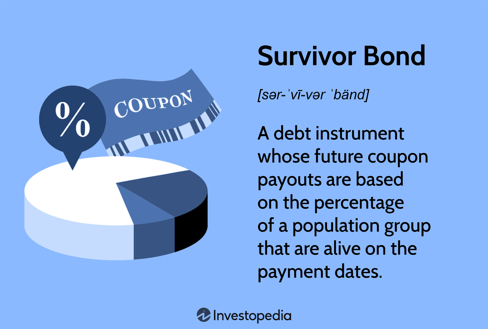

## Table of Contents

## What are Survivor Bonds?

Survivor Bonds are a type of financial product designed to help people who have lost their loved ones. They work by allowing people to invest money in a bond, and if a specific person, like a family member, passes away, the investors get their money back with interest. The money from the bond can then be used to help the family of the person who died.

These bonds are helpful because they provide financial support during a difficult time. For example, if someone's parent dies, the money from the Survivor Bond can help pay for funeral costs or other expenses. This can make a big difference for families who are struggling to cope with both their loss and money problems.

## How do Survivor Bonds work?

Survivor Bonds are a way to help families when someone they love dies. People buy these bonds and put money into them. If the person named in the bond passes away, the money in the bond, plus some extra interest, goes to the family. This can help them pay for things like funerals or other costs that come up when someone dies.

The way it works is simple. You choose a person, like a parent or a spouse, and you invest money in a Survivor Bond for them. If that person dies, the bond pays out the money to the people you've named as beneficiaries. This gives families a bit of financial help during a tough time, making it easier to manage without their loved one.

## Who can invest in Survivor Bonds?

Anyone can invest in Survivor Bonds. You don't need to be rich or have a lot of money to start. All you need is to care about someone and want to help their family if something happens to them.

When you buy a Survivor Bond, you choose the person you want to protect. This could be a parent, a spouse, or anyone close to you. If that person passes away, the money you put into the bond, plus some extra, goes to the people you've said should get it. This helps families when they are going through a hard time.

## What are the benefits of investing in Survivor Bonds?

Investing in Survivor Bonds can help families when someone they love dies. If the person you choose for the bond passes away, the money you put in, plus some extra, goes to the family. This can help them pay for things like funerals or other costs that come up when someone dies. It's a way to make sure the people you care about are looked after, even if you're not around to help them.

Another benefit is that it gives you peace of mind. Knowing that you've done something to help your family if something happens to you or someone else can make you feel better. It's like having a safety net for the people you love. This can be really important, especially if you worry about what might happen to your family if they lose someone important.

## What are the risks associated with Survivor Bonds?

One risk of Survivor Bonds is that you might not get your money back if the person you chose for the bond stays alive. If they live a long time, you won't get the money back until they pass away. This means you have to wait a long time to see any return on your investment, and you might need that money for something else in the meantime.

Another risk is that the company selling the Survivor Bonds could go out of business. If that happens, you might lose your investment. It's important to check if the company is trustworthy and has a good history before you invest your money with them. This way, you can feel more confident that your money is safe.

## How are Survivor Bonds different from traditional bonds?

Survivor Bonds are different from traditional bonds because they are tied to the life of a specific person. With a traditional bond, you lend money to a government or a company, and they pay you back with interest over time, no matter what happens to anyone. But with a Survivor Bond, you only get your money back, plus interest, if the person you chose for the bond passes away. This makes Survivor Bonds more like a type of insurance than a regular investment.

Another difference is that traditional bonds usually have a set time when they mature, and you get your money back then. Survivor Bonds don't have a set time; you have to wait until the person you chose dies. This can be a long time, and it means you might not be able to use that money for other things you need. Traditional bonds are more predictable because you know when you'll get your money back, but Survivor Bonds depend on something you can't control, like someone's life.

## What is the historical performance of Survivor Bonds?

Survivor Bonds are a newer type of investment, so they don't have a long history like traditional bonds. Because they depend on someone passing away, it's hard to say exactly how they've done over time. But we can look at some examples to get an idea. In cases where the person named in the bond has died, the bonds have paid out the money to the family, just like they're supposed to. This has helped families cover costs like funerals and other expenses.

The performance of Survivor Bonds can be different for each person. If the person you chose for the bond lives a long time, you might have to wait many years to get your money back. This means you won't see any return on your investment for a long time. But if the person passes away sooner, the bond can pay out quickly, which can be a big help to the family. Overall, Survivor Bonds are more about helping families than making money, so their "performance" is really about how well they support people during tough times.

## How are the returns on Survivor Bonds calculated?

The returns on Survivor Bonds are calculated based on the amount of money you put into the bond and the interest rate that the bond offers. When you buy a Survivor Bond, you choose how much money to invest. The company selling the bond will tell you the interest rate, which is like a reward for lending them your money. If the person you chose for the bond passes away, you get your original investment back, plus the interest that has built up over time.

For example, if you invest $10,000 in a Survivor Bond with an interest rate of 3% per year, and the person you chose dies after 5 years, you would get your $10,000 back plus $1,500 in interest. That's because 3% of $10,000 is $300, and over 5 years, that adds up to $1,500. The exact amount of interest you earn depends on how long it takes for the person to pass away and the interest rate of the bond.

## What role do Survivor Bonds play in estate planning?

Survivor Bonds can be a helpful part of estate planning. They are a way to make sure your family has some money if you pass away. When you buy a Survivor Bond, you choose someone, like yourself or a family member, and if that person dies, the money from the bond goes to the people you've named. This can help pay for things like funerals or other costs that come up when someone dies. It's like having a safety net for your family, making sure they are taken care of even if you're not around.

Using Survivor Bonds in estate planning can also give you peace of mind. Knowing that you've done something to help your family if something happens to you can make you feel better. It's important to think about how long it might take for the bond to pay out, because if the person you chose lives a long time, your family might have to wait a while to get the money. But overall, Survivor Bonds can be a good way to make sure your loved ones are looked after when you're gone.

## How do regulatory frameworks affect Survivor Bonds?

Regulatory frameworks can have a big impact on Survivor Bonds. These rules are made by governments to make sure that financial products like Survivor Bonds are safe and fair for everyone. They can decide who can sell Survivor Bonds, how much they can charge, and what they need to tell people before they buy them. If the rules are strict, it might be harder for companies to offer Survivor Bonds, but it can also make people feel more confident that their money is safe.

Different countries might have different rules about Survivor Bonds. In some places, there might be a lot of rules that make it hard to start selling Survivor Bonds. In other places, the rules might be easier, which could mean more people can buy and sell them. No matter where you are, it's important to know the rules in your area so you can make good choices about whether to invest in Survivor Bonds.

## What are the tax implications of investing in Survivor Bonds?

When you invest in Survivor Bonds, you need to think about taxes. The money you get back from a Survivor Bond might be taxed, but it depends on where you live. In some places, the money you get when the person you chose for the bond passes away might be seen as income, and you'll have to pay taxes on it. In other places, it might be treated differently, like part of an inheritance, which could mean you don't have to pay as much tax or maybe none at all.

It's a good idea to talk to a tax expert before you buy a Survivor Bond. They can help you understand how much tax you might have to pay and how to plan for it. Knowing the tax rules in your area can help you make a smart choice about whether Survivor Bonds are right for you and your family.

## What advanced strategies can be used to optimize returns from Survivor Bonds?

To optimize returns from Survivor Bonds, one strategy is to carefully choose the person you name in the bond. If you pick someone who is older or has health issues, the bond might pay out sooner, which means you'll get your money back faster with interest. But this also means you need to think about how soon you might need that money for other things. Another strategy is to buy Survivor Bonds from different people. This way, if one person lives a long time, you might still get money back from another bond sooner.

Another way to optimize returns is to look for Survivor Bonds with higher interest rates. Some companies might offer better rates than others, so it's worth shopping around. You can also think about how Survivor Bonds fit into your overall investment plan. If you have other investments that give you money more quickly, you might be able to wait longer for the Survivor Bond to pay out. Talking to a financial advisor can help you figure out the best way to use Survivor Bonds to meet your goals.

## References & Further Reading

[1]: Blake, D., Cairns, A., & Dowd, K. (2006). ["Living with Mortality: Longevity Bonds and Other Mortality-Linked Securities."](https://www.cambridge.org/core/journals/british-actuarial-journal/article/abs/living-with-mortality-longevity-bonds-and-other-mortalitylinked-securities/3ABB9EF1B62672AB62AF922B9577E4B4) British Actuarial Journal, 12(1), 153-197.

[2]: Cairns, A. J. G., Blake, D., & Dowd, K. (2008). ["Modelling and Management of Mortality Risk: A Review."](http://actuaries.org/afir/colloquia/rome2/cairns_blake_dowd.pdf) Scandinavian Actuarial Journal.

[3]: Dahl, M., & Møller, T. (2006). ["Valuation and Hedging of Life Insurance Liabilities with Systematic Mortality Risk."](https://www.sciencedirect.com/science/article/pii/S0167668706000473) Finance and Stochastics, 10, 79–108.

[4]: ["Advances in Financial Machine Learning"](https://www.amazon.com/Advances-Financial-Machine-Learning-Marcos/dp/1119482089) by Marcos Lopez de Prado.

[5]: Brière, M., & Szafarz, A. (2017). ["Factor Investing: A Welfare-Improving New Investment Paradigm or a New Agency Problem?"](https://www.hanken.fi/system/files/2020-09/2._marie_briere_-_factors_diversification_and_t-costs_2020_09_17_hanken_helsinki.pdf) Journal of Banking & Finance, 77, 86-103.