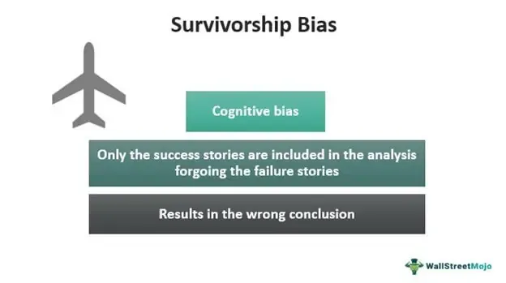

Survivorship bias is a logical error that occurs when researchers or analysts only consider the successful cases while ignoring the failures. This bias can lead to misleading conclusions as it overlooks the full dataset. In financial analysis and investing, survivorship bias can skew the perceived performance of mutual funds, stocks, or investment strategies by focusing solely on entities that have survived over a given time period while excluding those that have failed or been delisted. This often results in overstated performance metrics and a distorted view of risk and return.

Algorithmic trading has gained significant traction in financial markets, leveraging computer algorithms to automatically execute trades based on pre-set rules. Its popularity is driven by several advantages, including speed and precision, which can potentially enhance trading efficiency and returns. However, like all data-driven endeavors, algorithmic trading is susceptible to various biases in the input data, particularly survivorship bias.



Understanding survivorship bias is crucial in the context of algorithmic trading. When backtesting trading strategies, for example, relying on datasets of active companies without considering those that failed can lead to over-optimistic assessments and flawed strategies. Addressing this bias is essential for developing realistic and effective trading models.

The objective of this article is to explore how survivorship bias affects investment decisions and the integrity of algorithmic trading strategies. By examining its implications and suggesting ways to mitigate its impact, this discussion aims to sharpen the analytical tools of financial professionals, ensuring more accurate and reliable investment strategies.

## Table of Contents

## Understanding Survivorship Bias in Financial Markets

Survivorship bias is a logical error that arises when the outcomes of successful entities are disproportionately emphasized while the failures, which are no longer visible, are overlooked. This bias skews analyses and conclusions, leading to overly optimistic assessments. In financial markets, survivorship bias can affect investment strategies and mutual fund performance analysis significantly.

In investing, consider a scenario where mutual fund performance is evaluated over a decade. Typically, mutual funds that have been successful are more likely to persist; those that fail or underperform are often closed and removed from the datasets. This selective survival means that only the more successful funds are assessed when calculating average returns. Consequently, the calculated average return of mutual funds can be misleadingly high because it reflects only the performance of the survivors, not accounting for those that exited the market due to poor performance.

Ignoring failed funds can lead to overestimated performance metrics. Let's illustrate this: suppose the initial dataset contains 100 mutual funds. Over ten years, 30 funds fail and [exit](/wiki/exit-strategy) the market, leaving 70 successful funds whose performance is documented and analyzed. Although the 70 surviving funds may show robust performance, the genuine average performance of all 100 funds will be lower, which is not obvious from the analysis limited only to survivors.

The implications of survivorship bias are significant for investor perceptions and decision-making. Investors might be led to believe that investing in mutual funds is more profitable than it truly is, prompting overconfidence in mutual fund investment. This misperception can lead to suboptimal investment decisions, as investors fail to account for the risk and likelihood of fund failure. Moreover, performance metrics that do not adjust for survivorship bias can mislead investors to allocate capital based on inflated historical returns, potentially increasing their risk exposure.

Overall, understanding survivorship bias is crucial for accurate performance analysis and informed investment decisions. Recognizing and adjusting for this bias enables more realistic expectations and strategies that better reflect the intricacies and inherent risks of financial markets.

## Algorithmic Trading: An Overview

Algorithmic trading involves the use of computer algorithms to execute trades in financial markets. These algorithms make trading decisions based on pre-defined criteria, allowing for transactions to be carried out at high speed and with great precision. The evolution of technology and access to massive datasets have facilitated the growth of [algorithmic trading](/wiki/algorithmic-trading), making it a dominant force in today's financial markets.

The primary advantage of algorithmic trading is its ability to process large volumes of data and execute orders swiftly, which is essential in exploiting fleeting market opportunities. While human traders may take seconds or minutes to analyze market conditions and execute a trade, algorithms can complete these tasks in milliseconds, significantly increasing the trader's potential to capitalize on small price differentials. Moreover, algorithmic trading eliminates human emotions from the decision-making process, reducing errors caused by bias and erratic behavior.

Algorithmic trading strategies range from simple rule-based systems to complex [machine learning](/wiki/machine-learning) models. Simple strategies might involve executing trades when certain conditions are met, such as moving averages crossing over. On the other hand, more complex strategies can involve statistical [arbitrage](/wiki/arbitrage) or the use of neural networks to predict market trends.

However, algorithmic trading is not without its risks. One significant risk is data bias, including survivorship bias. Survivorship bias occurs when only successful entities are considered in analysis, neglecting those that failed or were delisted. In the context of algorithmic trading, this bias can distort [backtesting](/wiki/backtesting) results, as historical data used to validate strategies may inadvertently ignore failed instruments or periods of poor performance. This can lead to overly optimistic assumptions about a strategy's efficacy, potentially resulting in substantial financial losses when applied in real-world trading.

To mitigate such risks, traders must employ comprehensive datasets that include all relevant historical data, rather than focusing solely on entities that have survived up to the present. Additionally, incorporating robust data validation and cleaning techniques is vital to ensure that the datasets accurately represent the entire market landscape. By understanding and accounting for biases like survivorship bias, traders can develop more reliable algorithmic trading strategies that better withstand the test of actual market conditions.

## The Impact of Survivorship Bias on Algorithmic Trading

Survivorship bias in algorithmic trading primarily manifests during the backtesting phase, where historical data is used to simulate how a trading strategy might have performed in the past. The omission of failed companies or funds from this historical dataset can make backtested results appear overly promising. For instance, if a backtest only includes data on stocks that are still listed, it neglects those that have underperformed and been delisted. As a result, the strategy seems more successful than it truly is because it assumes a historical performance that included only successful entities.

Consider a trading strategy designed to buy and hold technology stocks over the past decade. If the backtest dataset omits companies that failed or went bankrupt, such as past dot-com bubble casualties, the strategy would appear consistently profitable. In reality, however, investing during that period involved significant risk and losses that are not represented in the biased dataset. Thus, investors are misled into believing the strategy's success rate and stability are higher than they actually are, which is exemplified through improved key performance metrics like Sharpe ratio or annualized returns.

The financial risks of implementing strategies influenced by survivorship bias are considerable. Investors may embark on trading strategies that seem high-performing but are intrinsically flawed due to omitted data. When executed in real markets, these strategies may not only underperform but incur significant losses. This is particularly concerning in high-frequency trading environments, where milliseconds matter, and assumptions based on skewed data can yield catastrophic financial results.

Quantitative traders and analysts must therefore strive to mitigate the impact of survivorship bias. This involves ensuring their datasets are comprehensive, including now-defunct companies alongside successful ones during backtesting. By acknowledging and adjusting for this bias, traders can develop more realistic strategies that genuinely reflect market complexities and variability, ultimately minimizing potential financial downturns when transitioning from simulated to actual trading environments.

## Identifying Survivorship Bias in Financial Analysis

Identifying survivorship bias in financial analysis involves several important steps and considerations to ensure accurate performance metrics and decision-making. One crucial method for detecting survivorship bias is comprehensive data collection. This includes gathering information on both successful and unsuccessful entities, such as failed companies and delisted stocks. By incorporating data on entities that have ceased to exist, analysts can develop a more realistic understanding of historical performance and mitigate overestimations associated with survivorship bias.

To further augment this process, several statistical techniques and software tools can be employed to uncover potential biases in datasets. For example, advanced statistical methods such as regression analysis and bootstrapping can help identify deviations in performance that might be attributed to survivability factors rather than genuine skill or strategy efficacy. In practice, using Python libraries like pandas, NumPy, and SciPy facilitates the detection of such biases:

```python
import pandas as pd
import numpy as np
from scipy import stats

# Load a sample dataset
data = pd.read_csv('financial_data.csv')

# Check for data completeness, including failed entities
complete_data = data.dropna()

# Perform statistical analysis to detect bias
performance_metrics = complete_data['return']
z_scores = stats.zscore(performance_metrics)

# Identify outliers and potential biases
outliers = complete_data[np.abs(z_scores) > 3]

print("Identified potential biases:", outliers)
```

Statistical testing can also be complemented by visualization tools that illustrate changes in dataset composition over time. This step can provide visual evidence of survivorship bias effects where surviving entities may show over-optimized results compared to a comprehensive dataset that includes failed entities.

The use of robust databases and software platforms that track historical data inclusively is essential. Platforms that provide access to exhaustive market data, including entities that have failed or been delisted, allow for a more nuanced analysis and reduce the risk of biased conclusions.

In summary, detecting survivorship bias requires both diligent data collection practices and the application of sophisticated statistical tools. By focusing on these areas, financial analysts can better ensure the accuracy and reliability of their analyses and improve investment decision-making processes.

## Strategies to Mitigate Survivorship Bias in Algorithmic Trading

To effectively mitigate survivorship bias in algorithmic trading, traders and analysts need to employ a variety of strategies focused on data integrity and testing practices.

Firstly, using robust and clean datasets that include all market entities, both extant and defunct, is crucial. Survivorship bias often occurs when datasets are incomplete, missing delisted stocks, bankrupt companies, or funds that have been closed. Comprehensive datasets can be sourced from vendors that ensure historical inclusivity or through partnerships with financial data providers that archive all data. For example, reconstructing investment universe histories by including all stocks that were traded during the study period can help prevent overestimations of a strategy's success rate.

Simulation and diverse testing environments play a significant role in avoiding survivorship bias. By simulating trades in a controlled environment that mimics realistic market conditions, traders can test strategies against various scenarios, including those involving market downfalls or crashes. This allows for a broader understanding of how a strategy might perform over different market cycles. Diverse backtesting involves using different datasets to test the strategy multiple times, ensuring that success isn't a product of specific market conditions during the original testing phase. These practices assist in identifying hidden risks and avoid giving undue weight to historical success.

Creating an unbiased testing framework involves the application of advanced statistical techniques and machine learning models to recognize and adjust for bias. Techniques such as cross-validation, bootstrapping, and Monte Carlo simulations can provide a more balanced view of potential outcomes. For example, cross-validation involves partitioning data into subsets, training the algorithm on some sets while assessing its performance on others, thereby reducing the risk of overfitting or bias. Here's a simple Python code example for cross-validation using the scikit-learn library:

```python
from sklearn.model_selection import cross_val_score
from sklearn.ensemble import RandomForestClassifier
import numpy as np

# Sample dataset and model
X = np.array([[...], [...]])  # feature set
y = np.array([...])  # labels

# Define the model
model = RandomForestClassifier()

# Perform cross-validation
scores = cross_val_score(model, X, y, cv=5)

# Display mean and standard deviation of scores
print(f'Mean Accuracy: {np.mean(scores)}, Standard Deviation: {np.std(scores)}')
```

This code effectively distributes the evaluation load across different data selections, helping to measure how generalizable the trading strategy is.

Lastly, regular audits and updates of datasets and testing methodologies are essential for staying ahead of potential biases. Traders and analysts must be proactive in revisiting data sources, testing environments, and analytical approaches to account for market evolution and ensure the continued relevancy of their strategies. By employing these measures, the integrity of algorithmic trading outcomes can be significantly improved, fostering more accurate and reliable investment decisions.

## Best Practices for Financial Analysts and Traders

To minimize the impacts of survivorship bias in financial analysis and trading, financial analysts and traders can adopt several best practices. These practices help ensure their decision-making is grounded in comprehensive and accurate evaluations, reducing the risk of misinformed strategies.

First, portfolio diversification remains a fundamental strategy. By diversifying across various asset classes, sectors, and geographic locations, traders can mitigate the risk of portfolio concentration and the misleading outcomes that survivorship bias can produce. A diversified portfolio lessens the impact of any single failed entity on the overall performance, providing a more reliable performance metric.

Regular strategy reviews are equally vital. Analysts and traders should conduct frequent evaluations of their portfolio strategies to incorporate new data and market developments, ensuring their approaches remain relevant and effective. By systematically assessing performance and adjusting strategies, traders can identify potential biases and rectify them promptly. Employing adaptive algorithms that continuously learn from market data can enhance this process.

Continuous education is another critical practice. The financial markets are ever-evolving, influenced by technological advances, regulatory changes, and economic developments. Traders and analysts should engage in ongoing learning to stay abreast of the latest market trends and analytical techniques. This can involve attending workshops, enrolling in online courses, or reading current research publications. Staying informed enables practitioners to better understand potential data biases and adapt their strategies accordingly.

Incorporating technology, such as advanced data analytics and machine learning tools, can further aid in recognizing and mitigating survivorship bias. Techniques like k-fold cross-validation enable the analysis of data subsets to identify biases. Implementing Python libraries such as scikit-learn can facilitate these processes:

```python
from sklearn.model_selection import cross_val_score
from sklearn.linear_model import LinearRegression
import numpy as np

# Example dataset
X = np.random.rand(100, 5)
y = np.random.rand(100)

# Model
model = LinearRegression()

# Perform k-fold cross-validation
scores = cross_val_score(model, X, y, cv=5)
print("Cross-validated scores:", scores)
```

Finally, maintaining an open and analytical mindset is essential. Traders should be skeptical of overly optimistic performance results and seek to understand the underlying assumptions and datasets. Encouraging a culture of questioning and critical thinking within trading teams can lead to more robust and unbiased investment decisions.

By implementing these best practices—portfolio diversification, regular strategy reviews, continuous education, technological integration, and critical analysis—financial analysts and traders can reduce the impact of survivorship bias. These steps are essential in achieving more accurate assessments of market opportunities and risks, leading to more reliable investment outcomes.

## Conclusion and Future Implications

In summarizing the article's exploration of survivorship bias and its effects on investment decisions and algorithmic trading strategies, several critical insights emerge. Survivorship bias is a pervasive issue in financial analysis, stemming from the tendency to focus on successful entities while ignoring those that have failed or been delisted. This can lead to skewed perceptions of performance and risk, ultimately distorting decision-making processes. In algorithmic trading, where backtesting strategies are heavily relied upon, the implications of survivorship bias can be particularly pronounced, as it may falsely enhance the perceived success of trading strategies.

Awareness of survivorship bias is crucial for financial analysts and traders. Ignoring this bias can result in overconfident investment strategies that overlook potential pitfalls and misallocate resources. Recognizing and proactively addressing survivorship bias through comprehensive data collection and analysis is essential. This includes incorporating data from failed and delisted entities into datasets, which ensures a more accurate reflection of market conditions and investment risk.

Looking to the future, algorithmic trading is poised to become increasingly sophisticated, shaped by advancements in data analytics and computational power. Accurate data analysis, mindful of biases, will play a central role in the evolution of these strategies. The integration of machine learning and [artificial intelligence](/wiki/ai-artificial-intelligence) in trading algorithms offers the potential for improved detection and correction of biases, beyond just survivorship bias, enhancing strategy robustness and performance. Consequently, traders and analysts must cultivate continuous learning and adaptation to anticipate and leverage these technological advancements effectively.

As the landscape of financial markets continues to evolve, those who succeed will be those who understand the complexities of biases like survivorship bias and proactively develop strategies to mitigate their impact. This involves leveraging diverse datasets, engaging in regular strategy evaluations, and staying updated on emerging trends in data analysis and trading technologies. Through diligent practice and adaptation, financial professionals can enhance their strategic decision-making, ultimately achieving more accurate and successful investment outcomes.

## References & Further Reading

[1]: Brown, S. J., Goetzmann, W., Ibbotson, R., & Ross, S. (1992). ["Survivorship Bias in Performance Studies."](https://www.jstor.org/stable/2962141) The Review of Financial Studies, 5(4), 553-580.

[2]: Malkiel, B. G. (1995). ["Returns from Investing in Equity Mutual Funds 1971 to 1991."](https://onlinelibrary.wiley.com/doi/abs/10.1111/j.1540-6261.1995.tb04795.x) The Journal of Finance, 50(2), 549-572.

[3]: Carhart, M. M. (1997). ["On Persistence in Mutual Fund Performance."](https://onlinelibrary.wiley.com/doi/full/10.1111/j.1540-6261.1997.tb03808.x) The Journal of Finance, 52(1), 57-82.

[4]: Lopez de Prado, M. (2018). ["Advances in Financial Machine Learning."](https://www.amazon.com/Advances-Financial-Machine-Learning-Marcos/dp/1119482089) Wiley.

[5]: Chan, E. (2008). ["Quantitative Trading: How to Build Your Own Algorithmic Trading Business."](https://github.com/ftvision/quant_trading_echan_book) Wiley.

[6]: Aronson, D. R. (2007). ["Evidence-Based Technical Analysis: Applying the Scientific Method and Statistical Inference to Trading Signals."](https://onlinelibrary.wiley.com/doi/book/10.1002/9781118268315) Wiley.

[7]: Jansen, S. (2020). ["Machine Learning for Algorithmic Trading."](https://github.com/stefan-jansen/machine-learning-for-trading) Packt Publishing.

[8]: Jegadeesh, N., & Titman, S. (1993). ["Returns to Buying Winners and Selling Losers: Implications for Stock Market Efficiency."](https://www.jstor.org/stable/2328882) Journal of Finance, 48(1), 65-91.