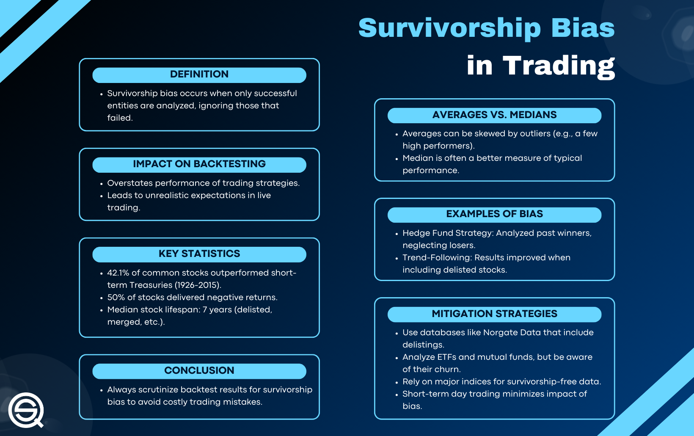

## Table of Contents

## What is survivorship bias?

Survivorship bias is when we only focus on the people or things that made it through a tough situation, and we forget about the ones that didn't. It's like looking at a group of successful people and thinking that their way is the only way to succeed, without considering all the others who tried the same thing but failed.

This can lead to wrong ideas and decisions. For example, if you only read books about successful businesses, you might think that starting a business is easy and always leads to success. But you're not seeing all the businesses that failed, which is important information too. So, it's important to remember to look at the whole picture, not just the survivors.

## How does survivorship bias affect investment decisions?

Survivorship bias can really mess up investment decisions. When people look at investment funds or stocks, they often only see the ones that did well and are still around. They don't see the ones that failed and disappeared. This can make it seem like investing is easier and more successful than it really is. For example, if you only look at the stock market funds that are doing well now, you might think that picking a good fund is easy. But you're missing all the funds that didn't make it.

This bias can lead people to make risky choices. They might think that because they see a lot of success stories, their chances of success are higher than they really are. This can make them put their money into investments that are too risky, hoping to get the same big returns they see in the success stories. But without considering the failures, they might not realize how much they could lose. So, it's important to look at the whole picture, not just the winners, when making investment decisions.

## Can you provide examples of survivorship bias in the stock market?

When people talk about the stock market, they often mention the big winners like Apple or Amazon. These companies are still around and doing well, so they get a lot of attention. But what about all the companies that tried to be the next big thing and failed? You don't hear about them because they're gone. This is survivorship bias. People see the success stories and think, "If I invest in stocks, I'll be rich too!" But they're only seeing part of the story.

Another example is mutual funds. When you look at lists of top-performing funds, you're only seeing the ones that did well. But there were probably a lot of funds that didn't make it onto those lists because they didn't do well and closed down. If you only look at the funds that are still around, you might think that [picking](/wiki/asset-class-picking) a good fund is easy. But it's not, because you're missing all the funds that failed. This can make you take bigger risks than you should, thinking that success is more common than it really is.

## What are the common sources of survivorship bias in financial data?

One common source of survivorship bias in financial data is the way stock market performance is reported. When you look at lists of top stocks or funds, you're only seeing the ones that did well and are still around. You don't see the ones that failed and disappeared. This makes it seem like investing is easier and more successful than it really is. People might think that if they just pick the right stock or fund, they'll be rich too, but they're missing the whole picture.

Another source is the way financial data is collected and presented. For example, databases that track stock performance often only include companies that are still listed on the stock exchange. They don't include the ones that went bankrupt or were delisted. This can make it look like the stock market is a safer place to invest than it really is. If you're only looking at the data of companies that survived, you might not realize how many companies failed along the way.

## How can an investor identify survivorship bias in investment reports?

To spot survivorship bias in investment reports, an investor should look at how the data is presented. If the report only talks about the stocks or funds that did well and are still around, that's a sign of survivorship bias. It's like only hearing about the winners and not the losers. For example, if a report shows a list of top-performing stocks over the last 10 years, it might not include the stocks that failed and disappeared during that time. This can make it seem like investing is easier and more successful than it really is.

Another way to identify survivorship bias is to check if the report mentions companies that went bankrupt or were delisted from the stock exchange. If it doesn't, then you're only seeing part of the story. It's important to know about the companies that didn't make it, because that gives you a better idea of the risks involved in investing. By looking for these signs, an investor can get a more complete picture of the market and make better decisions.

## What steps can be taken to mitigate the impact of survivorship bias in a portfolio?

To lessen the impact of survivorship bias in a portfolio, an investor should start by looking at all the data, not just the success stories. This means finding out about the companies that failed or got delisted from the stock exchange. By understanding the full picture, you can see how risky investing really is. It's like knowing the whole story, not just the happy ending. This can help you make smarter choices and not just follow the winners.

Another step is to use diversified investments. Instead of putting all your money into the stocks or funds that seem to be doing well now, spread it out across different types of investments. This way, you're not just betting on the survivors. You're giving yourself a better chance of handling the ups and downs of the market. By doing these things, you can build a portfolio that's more balanced and less affected by survivorship bias.

## How does survivorship bias influence mutual fund performance evaluations?

When people look at how well mutual funds are doing, they often only see the funds that are still around and doing well. This is called survivorship bias. It's like only seeing the winners of a race and not knowing about all the people who didn't finish. If you only look at the funds that made it, you might think that picking a good fund is easy. But you're missing all the funds that didn't do well and closed down. This can make you think that investing in mutual funds is safer and more successful than it really is.

To get a better idea of how mutual funds really perform, you need to look at all the funds, not just the ones that survived. This means finding out about the funds that failed and are no longer around. By understanding the whole story, you can see the real risks and rewards of investing in mutual funds. This can help you make better decisions and not just follow the funds that seem to be doing well now.

## What role does survivorship bias play in the analysis of startup success rates?

When people talk about startups, they often focus on the big success stories like Uber or Airbnb. These companies made it big, so they get a lot of attention. But there are many more startups that didn't make it. They ran out of money, couldn't find customers, or just didn't work out. When we only look at the startups that succeeded, we miss out on learning from the ones that failed. This is called survivorship bias. It makes it seem like starting a business is easier and more likely to succeed than it really is.

To get a true picture of startup success rates, we need to look at all startups, not just the ones that made it. By understanding why some startups fail, we can learn important lessons about what to avoid. This helps new entrepreneurs make better decisions and be more prepared for the challenges ahead. Without considering the failures, people might think that success is more common than it really is, leading them to take bigger risks without fully understanding the odds.

## How can historical data be adjusted to account for survivorship bias?

To adjust historical data for survivorship bias, you need to include information about all the companies or funds, not just the ones that are still around. This means finding out about the ones that failed or got delisted from the stock exchange. By adding this data back into your analysis, you get a more complete picture of what really happened. It's like putting all the pieces of a puzzle together, not just the ones that fit nicely.

Once you have all the data, you can see the true performance of the market or industry. This helps you understand the real risks and rewards. For example, if you're looking at stock market data, you'll see that many companies didn't make it, which can change your view on how easy or hard it is to succeed. By using this adjusted data, you can make better decisions and not just follow the success stories.

## What are the advanced statistical methods used to detect and correct for survivorship bias?

To detect and correct for survivorship bias, one common method is to use a technique called "backfilling." This means going back in time and adding the data of companies or funds that failed or were delisted to the historical records. By doing this, you get a more complete picture of what really happened. It's like filling in the gaps in a story so you can see the whole thing, not just the happy ending. This helps you understand the true performance of the market or industry, including the risks and rewards.

Another method is to use "survival analysis," which is a type of statistical analysis that looks at the time until an event happens, like a company going bankrupt. This method helps you see how long companies or funds last and what factors affect their survival. By including the data of those that didn't make it, you can correct for survivorship bias and get a more accurate view of success rates. This can help you make better decisions by understanding the full range of outcomes, not just the ones that survived.

## How does survivorship bias impact the evaluation of investment strategies over time?

When people look at how well their investment strategies are doing over time, they often only see the ones that worked out. This is called survivorship bias. It's like only seeing the winners of a race and not knowing about all the people who didn't finish. If you only look at the strategies that made money, you might think that picking a good strategy is easy. But you're missing all the strategies that didn't work out and were dropped. This can make you think that investing is safer and more successful than it really is.

To get a true picture of how well an investment strategy is doing, you need to look at all the strategies you tried, not just the ones that succeeded. This means keeping track of the ones that failed too. By understanding the whole story, you can see the real risks and rewards of your investment choices. This helps you make better decisions and not just follow the strategies that seem to be doing well now. Without considering the failures, you might think that success is more common than it really is, leading you to take bigger risks without fully understanding the odds.

## Can you discuss a case study where survivorship bias led to significant misjudgments in investment decisions?

One famous case where survivorship bias led to big mistakes in investment decisions is the story of Long-Term Capital Management (LTCM). LTCM was a [hedge fund](/wiki/hedge-fund-trading-strategies) started in the 1990s by some really smart people, including Nobel Prize winners. They used fancy math to make bets on the stock market, and at first, they made a lot of money. But they only looked at the times when their strategies worked and ignored the times when they didn't. This made them think their way of investing was safer than it really was. They kept betting bigger and bigger, thinking they couldn't lose. But when the market changed in ways they didn't expect, LTCM lost a lot of money very quickly. They almost caused a big financial crisis, and the government had to step in to save them.

This case shows how dangerous survivorship bias can be. LTCM's leaders only saw their past successes and didn't think about the times their strategies failed. If they had looked at all their bets, not just the winning ones, they might have been more careful. They might have seen that their strategies were riskier than they thought. Instead, they kept going all in, thinking they were unbeatable. This led to huge losses and almost brought down the whole financial system. It's a big lesson on why it's important to look at the whole picture, not just the winners, when making investment decisions.

## References & Further Reading

[1]: Brown, S. J., Goetzmann, W., Ibbotson, R., & Ross, S. (1992). ["Survivorship Bias in Performance Studies."](https://www.jstor.org/stable/2962141) The Review of Financial Studies, 5(4), 553-580.

[2]: Malkiel, B. G. (1995). ["Returns from Investing in Equity Mutual Funds 1971 to 1991."](https://onlinelibrary.wiley.com/doi/abs/10.1111/j.1540-6261.1995.tb04795.x) The Journal of Finance, 50(2), 549-572.

[3]: Carhart, M. M. (1997). ["On Persistence in Mutual Fund Performance."](https://onlinelibrary.wiley.com/doi/full/10.1111/j.1540-6261.1997.tb03808.x) The Journal of Finance, 52(1), 57-82.

[4]: Lopez de Prado, M. (2018). ["Advances in Financial Machine Learning."](https://www.amazon.com/Advances-Financial-Machine-Learning-Marcos/dp/1119482089) Wiley.

[5]: Chan, E. (2008). ["Quantitative Trading: How to Build Your Own Algorithmic Trading Business."](https://github.com/ftvision/quant_trading_echan_book) Wiley.

[6]: Aronson, D. R. (2007). ["Evidence-Based Technical Analysis: Applying the Scientific Method and Statistical Inference to Trading Signals."](https://onlinelibrary.wiley.com/doi/book/10.1002/9781118268315) Wiley.

[7]: Jansen, S. (2020). ["Machine Learning for Algorithmic Trading."](https://github.com/stefan-jansen/machine-learning-for-trading) Packt Publishing.

[8]: Jegadeesh, N., & Titman, S. (1993). ["Returns to Buying Winners and Selling Losers: Implications for Stock Market Efficiency."](https://www.jstor.org/stable/2328882) Journal of Finance, 48(1), 65-91.