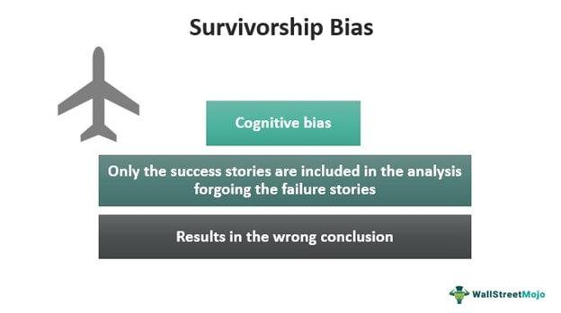

Survivorship bias is a well-documented cognitive bias that affects a variety of fields, notably algorithmic trading. It represents the tendency to concentrate on successful outcomes while disregarding those that did not succeed. This selective observation results in skewed analyses and decisions, where failures—critical for a comprehensive understanding—are overlooked. In algorithmic trading, this oversight manifests during performance evaluations and strategy development. By primarily focusing on successful trades or algorithms, traders may inadvertently inflate expected returns and underappreciate associated risks. This distorted perception can lead to over-optimistic trading strategies and an inaccurate assessment of the market's complexity.

Algorithmic trading, which relies on computer algorithms to automate trading decisions, is particularly susceptible to survivorship bias due to its dependency on historical data. When backtesting trading strategies, there is a risk of only considering data from stocks or strategies that have survived over time, ignoring those that were delisted or failed. This selective data can create an illusion of robust and profitable strategies, as it omits the unsuccessful counterparts that did not stand the test of time. Consequently, traders relying on such biased analyses may find their strategies lacking when applied to real-time markets, as these strategies were never truly tested against the full spectrum of market conditions.



This article explores the nuances of survivorship bias in algorithmic trading, emphasizing the pitfalls and challenges it poses. It also seeks to provide practical approaches to mitigate its impact, thereby aiding traders in making more informed and effective investment decisions. By acknowledging and addressing survivorship bias, traders can enhance the accuracy of their trading models and develop strategies that are better aligned with actual market conditions.

## Table of Contents

## What is Survivorship Bias in Algorithmic Trading?

Survivorship bias in [algorithmic trading](/wiki/algorithmic-trading) refers to analyzing data only from 'surviving' stocks or strategies while neglecting those that have been unsuccessful, delisted, or otherwise removed from the dataset. This bias is particularly relevant during the [backtesting](/wiki/backtesting) phase of an investment strategy, which is a crucial step for assessing its viability and potential profitability. By focusing exclusively on the data from stocks or strategies that have survived and ignoring those that have failed or been delisted, traders risk developing a skewed perception of a strategy’s effectiveness.

To better understand this, consider an algorithmic trading strategy that historically appears successful based on existing market data. If the data set only includes stocks that are currently listed and have performed well, the strategy may seem more successful than it actually is. The omission of failed or delisted stocks can lead to an inflated perception of potential returns because it does not account for the unlikelihood of selecting only winning stocks in a real market environment.

The consequences of survivorship bias are significant. It can lead to overestimated returns, where expected gains based on historical backtesting do not match real-world outcomes. Furthermore, risks are often underestimated as the data lacks examples of significant losses or failures that provide insights into strategy vulnerabilities.

In algorithmic trading, precise measurement of risk and return is essential. A formulaic approach might involve using Python to adjust and account for survivorship bias. For example, when backtesting:

```python
import pandas as pd

# Load historical data including both current and delisted stocks
data = pd.read_csv('full_market_data.csv')

# Filter out the survivors to measure the full spectrum of outcomes
non_survivors = data[data['status'] != 'active']

# Incorporate non-active data into analysis
complete_data = pd.concat([data, non_survivors], ignore_index=True)

# Perform analysis on complete data
results = analyze_strategy(complete_data)
```

This code snippet illustrates a simplified method to include both surviving and non-surviving stocks in an analysis, offering a more comprehensive understanding of a trading strategy's potential risks and rewards. By considering the broader financial ecosystem and incorporating full historical datasets, traders can gain a clearer and more realistic picture of their strategies' expected performance.

## Impact of Survivorship Bias on Algo Trading

Survivorship bias significantly impacts algorithmic trading by skewing the perceived performance of trading strategies. When failed strategies or stocks are ignored, traders and analysts only consider the successes, leading to an inaccurate representation of market dynamics and strategy effectiveness. The exclusion of delisted stocks in backtesting processes is a common manifestation of this bias, where only currently successful stocks are analyzed. This selective analysis can falsely inflate historical performance results, giving the impression that a trading strategy is more effective than it truly is. 

For instance, if a backtest only includes stocks that are currently listed and performing well, it ignores those that may have performed poorly and were subsequently delisted. Consequently, the backtest yields an overestimated positive return which is not reflective of the actual market conditions. This misrepresentation can lead traders to apply those strategies in real-world scenarios with the false expectation of achieving similar returns, often resulting in disappointing results.

Furthermore, survivorship bias contributes to the illusion that contemporary successful trading strategies are inherently superior. By ignoring failed attempts, it disregards the significant roles of luck and fluctuating market conditions. Successful strategies may simply be the ones that coincidentally align with recent market trends, rather than being attributable to any inherent superiority or predictive capability. This oversight can misguide traders into attributing too much weight to current trending strategies without accounting for the complexities and variabilities of market behavior.

## Examples in Market and Fund Performance

Market indices frequently perpetuate survivorship bias by including only stocks that are actively trading, thus ignoring those that have failed or been delisted. This creates an upward bias in the perceived performance of these indices, as they inherently omit stocks that have underperformed or exited the market. 

For instance, the S&P 500 index regularly updates its constituents to exclude companies that no longer meet its criteria. As a result, the average performance of the index may seem more robust than it is, as the weaker performing stocks that have been removed are not factored into historical performance assessments. This selective inclusion can lead investors to overestimate the potential returns of a passive investment strategy based on these indices.

Similarly, fund performance reports also reflect survivorship bias when they highlight only the successful funds or omit those that have closed or underperformed. This can present a skewed view of a fund manager’s efficacy. Institutional investors may find reports that emphasize only the returns of well-performing funds without disclosing those that have struggled, thus portraying an overly optimistic image of fund performance.

A notorious example of survivorship bias can be traced back to the dot-com bubble of the late 1990s and early 2000s. Post-bubble analyses often focused on surviving tech companies, disregarding the numerous startups that failed. This skewed review of tech stocks led many to misunderstand the inherent risks of tech investments at that time, as analyses that accounted only for surviving companies painted an inaccurately positive picture of the sector's robustness and potential profitability.

In combating survivorship bias, it is essential to consider analyses that include all relevant data, both from successes and failures, to provide a comprehensive view of market and fund performance. This approach ensures a realistic evaluation of investment risks and potential returns.

## Avoiding Survivorship Bias

To avoid survivorship bias in algorithmic trading, it's crucial to use comprehensive datasets that encompass both current and delisted stocks. By doing so, historical accuracy in backtesting is significantly improved. Delisted stocks often represent failed entities within the market, and excluding them skews the understanding of a strategy's performance. An inclusive dataset ensures a realistic evaluation of an investment strategy by reflecting the complete market history, including downturns and failures.

Incorporating complete market data is essential to understanding the full spectrum of market conditions and investment risks. This comprehensive approach enables traders to grasp the reality of market dynamics by acknowledging the impact of entities that have ceased to exist. For instance, if a trader were to rely solely on surviving stocks for backtesting, the derived performance metrics could misleadingly suggest higher returns and lower risks than those encountered in the actual market scenario.

Diversifying strategies is another key method to mitigate survivorship bias. By employing a range of trading strategies, traders can prepare for various market situations, reducing reliance on a single outcome. For example, combining a [momentum](/wiki/momentum)-based strategy with a value investment approach can diversify the potential risks and returns. Furthermore, integrating diverse market scenarios in simulation tests helps traders anticipate different market conditions, equipping them with strategies that can adapt to market shifts.

Consider the use of Python to incorporate delisted stocks into your backtesting framework. Below is a simple example of how one might import and handle such data:

```python
import pandas as pd

# Load current and delisted stock data
current_stocks = pd.read_csv('current_stocks.csv')
delisted_stocks = pd.read_csv('delisted_stocks.csv')

# Combine the datasets for a comprehensive view
all_stocks = pd.concat([current_stocks, delisted_stocks], ignore_index=True)

# Analyze historical performance including both data sets
# This ensures that backtesting reflects a complete market view

def calculate_return(prices):
    return (prices.iloc[-1] - prices.iloc[0]) / prices.iloc[0]

for stock in all_stocks['Symbol'].unique():
    stock_prices = all_stocks[all_stocks['Symbol'] == stock]['Price']
    print(f"Return for {stock}: {calculate_return(stock_prices):.2%}")
```

By ensuring that datasets include both existing and defunct stocks, traders can avoid misleading conclusions about their strategies’ performance. This holistic approach encourages a realistic appraisal of investment strategies, highlighting the importance of data integrity and diversity in strategic planning.

## Conclusion

Survivorship bias presents a significant challenge in the evaluation of trading strategies, potentially leading to overoptimistic and distorted performance assessments. If not addressed, this bias can result in misguided investment decisions and a misunderstanding of market realities. To counteract this effect, it is crucial for traders to utilize comprehensive datasets that encompass both active and inactive market entities. This approach ensures more accurate backtesting and strategy development, reflecting true historical market conditions. 

Implementing inclusive backtesting methods is essential to simulate realistic trading environments. By recognizing the role of failed or delisted stocks and incorporating them into analyses, traders can prevent the inadvertent exclusion of crucial data that may otherwise lead to overestimated returns. Consequently, strategies developed with these inclusive methodologies are more likely to withstand market [volatility](/wiki/volatility-trading-strategies) and unpredictability.

Ultimately, by acknowledging and mitigating the effects of survivorship bias, traders enhance their ability to craft informed, realistic, and effective investment strategies. This vigilance ensures a more robust understanding of potential risks and rewards, equipping traders to navigate market complexities with greater precision and confidence.

## References & Further Reading

[1]: Bergstra, J., Bardenet, R., Bengio, Y., & Kégl, B. (2011). ["Algorithms for Hyper-Parameter Optimization."](https://papers.nips.cc/paper/4443-algorithms-for-hyper-parameter-optimization) Advances in Neural Information Processing Systems 24.

[2]: ["Advances in Financial Machine Learning"](https://www.amazon.com/Advances-Financial-Machine-Learning-Marcos/dp/1119482089) by Marcos Lopez de Prado

[3]: ["Evidence-Based Technical Analysis: Applying the Scientific Method and Statistical Inference to Trading Signals"](https://www.amazon.com/Evidence-Based-Technical-Analysis-Scientific-Statistical/dp/0470008741) by David Aronson

[4]: ["Machine Learning for Algorithmic Trading"](https://github.com/stefan-jansen/machine-learning-for-trading) by Stefan Jansen

[5]: ["Quantitative Trading: How to Build Your Own Algorithmic Trading Business"](https://books.google.com/books/about/Quantitative_Trading.html?id=j70yEAAAQBAJ) by Ernest P. Chan