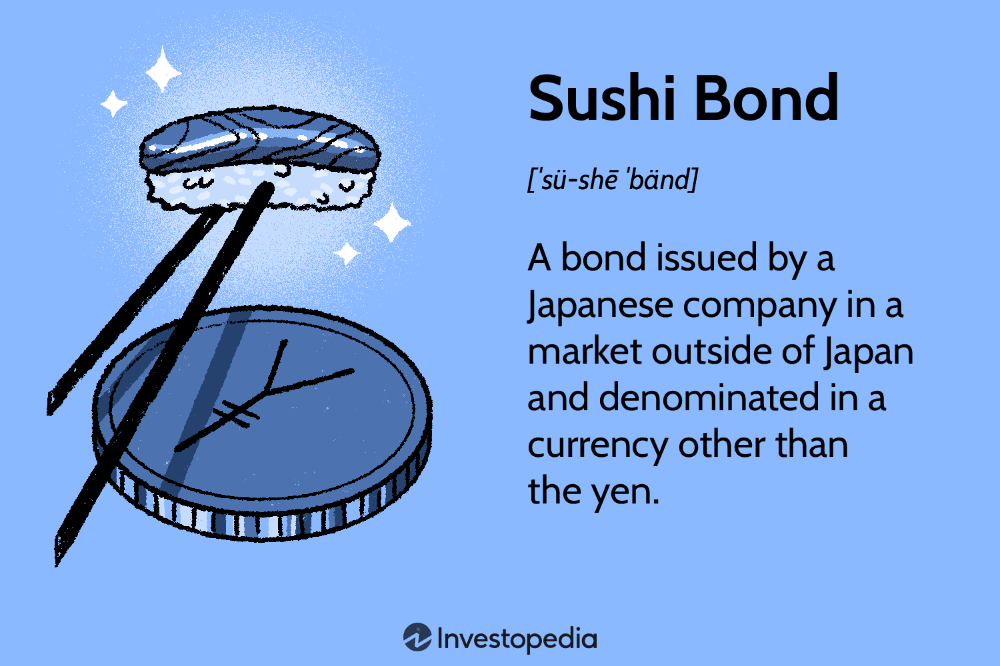

## Table of Contents

## What are Sushi Bonds?

Sushi Bonds are a type of bond that Japanese companies issue in their own currency, the yen, but they are sold outside of Japan. They are called Sushi Bonds because they are like sushi, which is a popular Japanese food known around the world. These bonds help Japanese companies raise money from investors in other countries.

Investors like Sushi Bonds because they can invest in yen without having to go to Japan. This can be good for them if they think the yen will become stronger compared to their own currency. For Japanese companies, issuing Sushi Bonds is a way to get money from a bigger pool of investors, not just those in Japan.

## How did Sushi Bonds get their name?

Sushi Bonds got their name because they are like sushi, a famous Japanese food. Just as sushi is enjoyed all over the world, Sushi Bonds are Japanese bonds that are sold to people outside of Japan. The name makes it easy to remember that these bonds are from Japan but are for international investors.

The term "Sushi Bond" helps people quickly understand the idea. It's a fun and simple way to describe a financial product that might otherwise sound complicated. By using the name of a well-known food, it makes the concept more approachable and easier to talk about.

## What is the history behind Sushi Bonds?

Sushi Bonds started to become popular in the early 2000s. Before that, Japanese companies mostly sold their bonds in Japan. But as more people around the world wanted to invest in yen, Japanese companies saw a chance to get money from outside Japan. They started selling these bonds in other countries, and they called them Sushi Bonds to make them sound interesting and easy to understand.

The idea of Sushi Bonds caught on quickly because it was a new way for Japanese companies to raise money. Investors from places like Europe and the United States liked the idea of investing in yen without having to go to Japan. This helped Japanese companies reach more people and get more money to grow their businesses. Over time, Sushi Bonds became a common way for Japanese companies to connect with international investors.

## Who typically issues Sushi Bonds?

Sushi Bonds are usually issued by Japanese companies. These companies want to raise money from people outside Japan. They might be big companies that everyone knows or smaller ones that are trying to grow. By selling Sushi Bonds, these companies can get money from investors all over the world.

Sometimes, the Japanese government or banks might also issue Sushi Bonds. They do this for the same reason: to get money from investors in other countries. This helps them finance big projects or support the economy. So, both private companies and public organizations in Japan use Sushi Bonds to reach a global audience.

## What are the benefits of investing in Sushi Bonds?

Investing in Sushi Bonds can be good for people who want to put their money into something that uses the Japanese yen. If you think the yen will get stronger compared to your own money, then buying Sushi Bonds could be a smart move. You can make money if the yen goes up in value. Also, Sushi Bonds let you invest in Japanese companies without having to go to Japan, which makes it easier for you to spread your money around different countries.

Another benefit is that Sushi Bonds can give you a steady income. When you buy a bond, the company that issued it pays you interest regularly. This can be a good way to get some money coming in without having to worry about the ups and downs of the stock market. Plus, because Sushi Bonds are from well-known Japanese companies, they can be seen as a safe place to put your money, which can give you peace of mind.

## What are the risks associated with Sushi Bonds?

Investing in Sushi Bonds comes with some risks that you should know about. One big risk is the change in currency value. If the yen gets weaker compared to your own money, you could lose money when you want to change your yen back to your own currency. This can happen even if the bond itself is doing well. Another risk is that the company issuing the bond might not be able to pay you back. If the company has money problems, they might not be able to give you your interest payments or return your money at the end.

Another thing to think about is the [interest rate](/wiki/interest-rate-trading-strategies) risk. If interest rates go up after you buy a Sushi Bond, the value of your bond might go down. This is because new bonds would be paying more interest, making your bond less attractive to other investors. Also, Sushi Bonds might not be as easy to sell quickly as other investments. If you need your money back fast, you might have trouble finding someone to buy your bond, or you might have to sell it for less than you paid.

## How do Sushi Bonds differ from other types of bonds?

Sushi Bonds are different from other bonds because they are issued by Japanese companies in yen, but they are sold to people outside of Japan. Most bonds are sold in the country where the company is from, but Sushi Bonds let Japanese companies get money from investors all over the world. This is good for the companies because they can reach more people, and it's good for investors because they can invest in yen without going to Japan.

Another way Sushi Bonds are different is that they are named after a popular Japanese food, which makes them easy to remember and talk about. Other bonds might have more boring names like "corporate bonds" or "government bonds." Sushi Bonds also come with the risk of changes in the value of the yen, which can be different from the risks of bonds in other currencies. So, while they share some things in common with other bonds, like paying interest and having a set time to pay back the money, Sushi Bonds have their own special features.

## What are the typical terms and conditions of Sushi Bonds?

Sushi Bonds usually have terms and conditions that tell you how long you have to wait before you get your money back, how much interest you will get, and when you will get it. These bonds can last for different amounts of time, like 5 years, 10 years, or even longer. The interest rate can be fixed, which means it stays the same the whole time, or it can change based on what's happening with interest rates in general. You get paid the interest usually every six months or every year.

The conditions also say what happens if the company can't pay you back. This is called the default risk. If the company has money problems, they might not be able to give you your interest or return your money at the end. There can also be rules about selling the bond before it's done. Sometimes you can sell it to someone else, but you might not get as much money as you paid for it. Knowing these terms and conditions helps you understand what you're getting into when you buy a Sushi Bond.

## How are Sushi Bonds rated and what does this mean for investors?

Sushi Bonds are rated by special companies called credit rating agencies. These agencies look at how likely it is that the company issuing the bond will be able to pay back the money they borrowed. They give the bond a grade, like AAA, AA, A, BBB, and so on. A higher grade, like AAA, means the bond is very safe and the company is very likely to pay you back. A lower grade, like BB or below, means the bond is riskier and there's a bigger chance the company might not pay you back.

For investors, the rating of a Sushi Bond is important because it helps them decide if the bond is a good investment. If you see a bond with a high rating, you might feel more comfortable buying it because it's less risky. But if the bond has a low rating, you might want to think twice because there's a bigger chance you could lose your money. The rating can also affect how much interest the bond pays. Bonds with lower ratings usually have to pay more interest to attract investors, because they are riskier.

## What has been the performance trend of Sushi Bonds in recent years?

In recent years, Sushi Bonds have had ups and downs, just like many other investments. When the Japanese yen is strong, Sushi Bonds can do well because investors get more money when they change their yen back to their own currency. But if the yen gets weaker, it can hurt the value of Sushi Bonds for people who don't use yen. Also, the interest rates in Japan have been very low, which means Sushi Bonds don't pay as much interest as some other bonds. This can make them less attractive to investors who are looking for high returns.

Despite these challenges, Sushi Bonds have still been popular with some investors. They like the chance to invest in yen without having to go to Japan, and they see it as a way to spread their money around different countries. Japanese companies have kept issuing Sushi Bonds because they can reach more investors this way. So, while the performance of Sushi Bonds can change a lot depending on the yen and interest rates, they remain an important part of the global bond market.

## How do regulatory environments affect Sushi Bonds?

The rules and laws in different countries can change how Sushi Bonds work. In Japan, the government has rules about how companies can issue bonds. These rules make sure that companies tell the truth about their bonds and don't trick people. When Japanese companies want to sell Sushi Bonds outside Japan, they also have to follow the rules of the countries where they are selling the bonds. This can be hard because each country might have different rules. If the rules in a country change, it can make it easier or harder for Japanese companies to sell Sushi Bonds there.

Changes in rules can also affect how much people want to buy Sushi Bonds. If a country makes new rules that make it safer to invest in bonds, more people might want to buy Sushi Bonds. But if the rules make it harder or riskier, fewer people might be interested. The rules can also change how much it costs for companies to issue Sushi Bonds. If the rules are strict and need a lot of paperwork, it can cost more money and time. So, the regulatory environment plays a big role in how Sushi Bonds are used and how well they do.

## What advanced strategies can be used when investing in Sushi Bonds?

One advanced strategy for investing in Sushi Bonds is called currency hedging. This means you try to protect yourself from changes in the value of the yen. If you think the yen might get weaker, you can use financial tools to make sure you don't lose too much money. This can make your investment safer, but it can also cost you some money to set up the hedge. So, you need to think about whether the cost is worth it compared to the risk of the yen going down.

Another strategy is to look at the credit ratings of the Sushi Bonds and mix them with other investments. If you buy bonds with different ratings, some safe and some riskier, you can spread out your risk. This is called diversification. You might also want to mix Sushi Bonds with stocks or bonds from other countries. This way, if something bad happens to the yen or to Japan's economy, your whole investment won't be in trouble. It's like not putting all your eggs in one basket.

A third strategy is to keep an eye on interest rates in Japan and around the world. If you think interest rates in Japan are going to go up, you might want to buy Sushi Bonds before that happens. When interest rates go up, new bonds will pay more interest, which can make the old bonds you already own less valuable. But if you buy before the rates go up, you can lock in the lower rates and still get a good deal. Watching interest rates can help you decide when to buy or sell Sushi Bonds to get the best return on your money.

## References & Further Reading

[1]: Ministry of Finance Japan. (2022). ["Japanese Government Bonds."](https://www.mof.go.jp/english/policy/jgbs/publication/newsletter/jgb2022_05e.pdf)

[2]: Bank of Japan. (2021). ["Developments in the JGB Markets."](https://www.boj.or.jp/en/research/rs_all_2021/index.htm)

[3]: Investopedia. ["Sushi Bond."](https://www.investopedia.com/terms/s/sushibond.asp)

[4]: Mizuno, T. (2019). "The Impact of Algorithmic Trading on Financial Markets in Japan." Journal of Financial Markets.

[5]: Financial Times. (2020). ["Japanese Corporate Bonds: A New Era."](https://www.ft.com/content/892ff601-9a15-40c8-b16e-c91887c7432a)

[6]: SIFMA (Securities Industry and Financial Markets Association). ["Algorithmic Trading and the Evolution of Electronic Markets."](https://www.sifma.org/)

[7]: Bloomberg. (2023). "Currency Exchange Rates and Their Impact on Japanese Bonds." Bloomberg.

[8]: Deloitte. (2022). ["Regulatory Challenges in the International Bond Market."](https://www2.deloitte.com/content/dam/Deloitte/fr/Documents/risk/Publications/deloitte_markets-regulatory_outlook-2022.pdf)