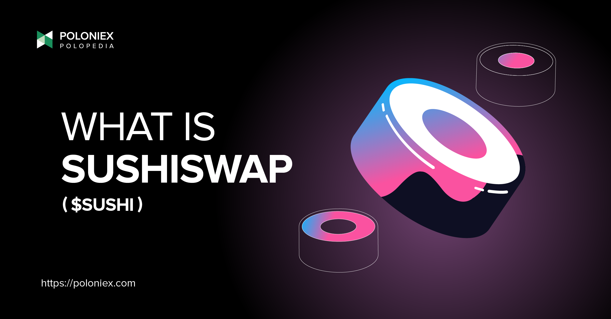

In the ever-evolving world of cryptocurrency, innovative projects like SushiSwap have carved a niche with unique offerings. Emerging as a significant entity in the decentralized finance (DeFi) landscape, SushiSwap has attracted attention for its robust functionalities. At the heart of its operations is the SUSHI token, a key element that facilitates a range of activities within the platform. SushiSwap not only functions as a decentralized exchange but also brings additional features that enhance its utility and appeal to users.

This article examines the dynamics of SushiSwap, emphasizing its history, functionality, and future prospects. Launched with the intent to transform traditional financial systems, SushiSwap employs a decentralized model that eliminates intermediaries, offering users seamless and permissionless access to financial services. An exploration of its journey reveals key moments of transformation and controversy, which have shaped its current stature and vision for the future.



Additionally, the integration of algorithmic trading into SushiSwap's framework plays a crucial role in enhancing user experience. Algorithmic trading allows for efficient and automated execution of trades, providing users with a competitive edge in the volatile cryptocurrency market. By leveraging predefined parameters, users can maximize their trading strategies and adapt to rapidly changing market conditions.

Our goal is to provide a comprehensive overview to understand why SushiSwap is more than just a decentralized exchange. By navigating the complexities and innovations of SushiSwap, readers will gain insight into its distinctive features and strategic advancements that contribute to its standing in the DeFi ecosystem.

## Table of Contents

## Understanding SushiSwap and SUSHI Tokens

SushiSwap is a decentralized cryptocurrency exchange (DEX) operating on the Ethereum blockchain. Unlike traditional exchanges that operate on an [order book](/wiki/order-book-trading-strategies) model, SushiSwap utilizes an Automated Market Maker (AMM) system to facilitate the trading of digital assets. This model eliminates the need for buyers and sellers to directly interact with one another, replacing order [books](/wiki/algo-trading-books) with liquidity pools. Liquidity providers contribute tokens to these pools and, in return, earn fees from trades that occur within them. This system not only enhances liquidity but also significantly reduces the dependency on intermediaries.

The SUSHI token is integral to the SushiSwap ecosystem. It serves multiple functions that enhance user experience and platform governance. One of the primary roles of the SUSHI token is governance. Token holders can propose and vote on protocol changes, enabling a decentralized decision-making process that empowers the community to steer the platform's direction. This participatory governance model is a defining feature of many decentralized finance (DeFi) projects, ensuring that stakeholders have a say in future developments.

In addition to its governance utility, the SUSHI token offers staking rewards. By staking SUSHI tokens, users can earn additional tokens, providing an incentive structure that encourages long-term holding and participation. Staking is a crucial mechanism in the DeFi sector as it helps to secure the network and maintain its smooth functioning.

Furthermore, SUSHI tokens incentivize [liquidity](/wiki/liquidity-risk-premium) provision, a critical aspect of the exchange’s sustainability. Liquidity providers are rewarded with SUSHI tokens, adding a compelling incentive for users to contribute their assets to liquidity pools. This, in turn, ensures that there is sufficient market depth for trading pairs, enhancing the efficiency and attractiveness of the SushiSwap platform.

The cumulative benefits provided by the SUSHI token not only amplify the functionalities of the SushiSwap platform but also align with the broader trends in DeFi, where tokens are designed to offer utility, governance, and incentives to create dynamic and self-sustaining ecosystems.

## The Evolution of SushiSwap

SushiSwap was launched in 2020 by the pseudonymous developer known as Chef Nomi. It was introduced as a decentralized exchange aimed at improving upon existing decentralized finance (DeFi) models. The platform generated significant interest due to its novel approach and ambitions to advance beyond what was offered by its predecessors in the DeFi space.

However, the initial phase of SushiSwap's journey was not without controversy. Shortly after its launch, the platform faced a notable [exit](/wiki/exit-strategy) scam incident. Chef Nomi unexpectedly withdrew funds from SushiSwap's development pool, leading to a crisis of trust among its community and participants. Despite this setback, the funds were eventually returned, and SushiSwap embarked on a path to reestablish community trust and regain its footing in the DeFi market.

Key to SushiSwap's recovery and subsequent growth were several governance overhauls. These were aimed at decentralizing control and implementing community-centered decision-making processes. Through these governance changes, SushiSwap sought to enhance transparency and ensure stakeholders had a voice in the platform's ongoing development and decision-making.

Moreover, strategic partnerships played a crucial role in revitalizing SushiSwap's presence and functionality. Collaborations with various blockchain entities allowed SushiSwap to expand its offerings and integrate additional features, further solidifying its position as a competitive DeFi platform.

In alignment with these developmental efforts, Sushi Labs was established as an organization dedicated to overseeing the platform's evolution. Its focus has been on ensuring protocol sustainability and diversifying the treasury, which are essential for long-term stability and growth in the rapidly changing DeFi landscape.

Overall, SushiSwap's evolution reflects a journey of overcoming early challenges through community engagement, governance refinements, and strategic collaborations. These initiatives have enabled the platform not only to regain trust and expand its user base but also to position itself for sustainable future growth.

## SushiSwap's Competitive Edge

SushiSwap distinguishes itself within the decentralized finance (DeFi) sector through several innovative features. Central to its competitive edge are its yield farming and liquidity mining functionalities. These features offer users the opportunity to earn rewards by providing liquidity or staking their [cryptocurrency](/wiki/cryptocurrency) holdings. By incentivizing such participation, SushiSwap ensures a robust liquidity pool, which is crucial for facilitating efficient trades.

One of the most notable strategies that contributed to SushiSwap's early success is the 'Vampire Attack.' This tactic was devised to capture liquidity from existing platforms, particularly Uniswap. By offering higher incentives to liquidity providers, SushiSwap was able to attract significant capital from its competitors, thereby rapidly increasing its liquidity base. This bold maneuver not only boosted SushiSwap's visibility but also established it as a serious contender in the DeFi arena.

Beyond its strategic techniques, SushiSwap is known for its distinctive user interface and design. The platform's Japanese restaurant-themed aesthetic provides a unique and engaging user experience. This design choice, while whimsical, is complemented by a user-friendly interface that simplifies navigation and interaction with the platform's features.

SushiSwap's capacity for innovation and adaptation has further solidified its position as a key player in the DeFi sector. The platform continually updates and improves its services, incorporating new technologies and strategies to meet the evolving needs of its user base. This ongoing development ensures that SushiSwap not only remains competitive but also anticipates trends and shifts within the cryptocurrency exchange landscape. Through its pioneering efforts, SushiSwap demonstrates a commitment to growth and to maintaining its status as a formidable force in decentralized finance.

## Algorithmic Trading on SushiSwap

Algorithmic trading is increasingly pivotal for cryptocurrency exchanges like SushiSwap due to the dynamic nature of digital markets. Through [algorithmic trading](/wiki/algorithmic-trading), users employ automated bots to execute trades based on predefined algorithms or conditions, thereby maximizing efficiency and minimizing human error. This automation is critical in volatile markets where rapid price changes require swift reactions to capitalize on emerging opportunities or mitigate potential losses.

The essence of algorithmic trading lies in its ability to perform complex calculations and execute trades within milliseconds. For instance, an automated bot can analyze market data and make decisions using various strategies such as [market making](/wiki/market-making), [arbitrage](/wiki/arbitrage), or [trend following](/wiki/trend-following). These strategies rely heavily on statistical models and [machine learning](/wiki/machine-learning) algorithms, allowing users to take advantage of even minor price discrepancies across different platforms.

SushiSwap users benefit from algorithmic trading tools that support both novice and seasoned traders. The availability of these tools on SushiSwap enhances user experience by accommodating those who may not have the expertise to engage in manual trading processes. For developers or advanced users, customizing bots to meet specific trading objectives is also possible, often utilizing programming languages such as Python. Here is a simplified example of a moving average crossover strategy that can be implemented using Python:

```python
import numpy as np
import pandas as pd

# Sample price data
price_data = pd.Series([100, 102, 104, 103, 106, 108, 107, 110])

# Calculate moving averages
short_window = 3
long_window = 5

signals = pd.DataFrame(index=price_data.index)
signals['price'] = price_data
signals['short_mavg'] = price_data.rolling(window=short_window, min_periods=1).mean()
signals['long_mavg'] = price_data.rolling(window=long_window, min_periods=1).mean()

# Generate signals
signals['signal'] = 0
signals['signal'][short_window:] = np.where(signals['short_mavg'][short_window:] > signals['long_mavg'][short_window:], 1, 0)
signals['positions'] = signals['signal'].diff()

print(signals)
```

This script generates buy and sell signals by calculating short-term and long-term moving averages. Such strategies empower traders to automate their transactions, relying on quantitative methods rather than intuition. This systematic approach not only helps in achieving consistency in trading practices but also aids in circumventing emotional biases.

In addition to strategy execution, algorithmic trading facilitates real-time market analysis. This capability is indispensable as it enables traders to continuously assess market conditions and adjust their strategies accordingly. As the DeFi sector evolves, platforms like SushiSwap continue to enrich their offerings with sophisticated algorithmic trading solutions, ensuring they cater to diverse user profiles and maintain competitiveness.

## Challenges and Future Prospects for SushiSwap

SushiSwap, despite its innovative offerings, is not without its challenges as it navigates a highly competitive decentralized finance (DeFi) market. The space is densely populated by other formidable projects such as Uniswap and PancakeSwap, which compete vigorously for user adoption and market share. These platforms have established robust user bases and continue to exert significant influence in the DeFi ecosystem. 

To differentiate itself and avoid obsolescence, SushiSwap must commit to continuous innovation and strategic differentiation. An essential aspect of this strategy is its ongoing upgrades, which aim to enhance user experience and platform capabilities. These upgrades often involve optimizing the platform’s Automated Market Maker (AMM) model and implementing new features that cater to the evolving needs of its diverse user base. 

Strategic partnerships play a crucial role in SushiSwap's efforts to secure its future growth. Noteworthy partnerships, such as those with blockchain platform Avalanche, are designed to expand the reach and functionality of the SushiSwap platform. These collaborations enable SushiSwap to tap into new user bases, benefit from Avalanche's scalable infrastructure, and offer lower transaction fees, thus increasing its competitive edge.

Additionally, the DeFi landscape is rapidly evolving, opening potential avenues for SushiSwap to expand into new blockchain networks. This expansion not only diversifies its technological base but also enhances its resilience against market volatilities and technical challenges inherent in the crypto space. By broadening its operational horizon across multiple chains, SushiSwap can attract a broader spectrum of users and liquidity providers, creating a more vibrant ecosystem.

In summary, while challenges from market competitors and the necessity for perpetual innovation persist, SushiSwap's strategic focus on upgrades, partnerships, and network expansion presents promising opportunities. By continuously evolving its infrastructure and forging strategic alliances, SushiSwap is poised to maintain and potentially expand its presence in the DeFi market.

## Conclusion

SushiSwap has emerged as a distinguished participant in the DeFi sector through its innovative features and strong community engagement. The SUSHI token plays a pivotal role in this ecosystem, providing users with the ability to partake in governance and earn rewards for their contributions. These functionalities not only incentivize user participation but also foster a sense of ownership and responsibility among stakeholders.

Maintaining a competitive advantage necessitates a delicate balance between innovation and sustainability. SushiSwap must continue to evolve by integrating new technological advancements and refining its existing infrastructure to remain relevant and appealing to users. This requires strategic foresight and adaptability in responding to the dynamic nature of the cryptocurrency market.

Strategic alliances are essential for SushiSwap to expand its reach and influence. Collaborations with other blockchain networks and DeFi platforms could facilitate cross-chain functionalities and increase its market share. SushiSwap's commitment to technological advancements, such as exploring algorithmic trading and enhancing user interfaces, positions it well for sustained relevance.

In summary, SushiSwap's capacity for growth and influence in the DeFi space is promising. By continually engaging with its community and harnessing technological progress, SushiSwap can potentially secure a long-lasting presence, offering value and innovation to its users and stakeholders.

## References & Further Reading

[1]: Bergstra, J., Bardenet, R., Bengio, Y., & Kégl, B. (2011). ["Algorithms for Hyper-Parameter Optimization."](https://dl.acm.org/doi/10.5555/2986459.2986743) Advances in Neural Information Processing Systems 24.

[2]: ["Advances in Financial Machine Learning"](https://www.amazon.com/Advances-Financial-Machine-Learning-Marcos/dp/1119482089) by Marcos Lopez de Prado

[3]: ["Evidence-Based Technical Analysis: Applying the Scientific Method and Statistical Inference to Trading Signals"](https://books.google.com/books/about/Evidence_Based_Technical_Analysis.html?id=MeoJAQAAMAAJ) by David Aronson

[4]: ["Machine Learning for Algorithmic Trading"](https://github.com/stefan-jansen/machine-learning-for-trading) by Stefan Jansen

[5]: ["Quantitative Trading: How to Build Your Own Algorithmic Trading Business"](https://www.amazon.com/Quantitative-Trading-Build-Algorithmic-Business/dp/1119800064) by Ernest P. Chan