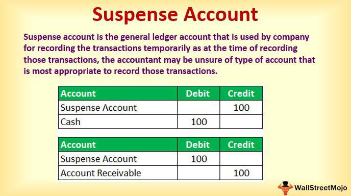

In finance, the intersection of accounting, financial management, and trading technologies like algorithmic trading presents unique opportunities and challenges. This multifaceted landscape is continuously evolving, offering significant potential for enhancing decision-making processes and optimizing financial operations. One element often overlooked yet pivotal in this ecosystem is the suspense account—a tool that manages financial ambiguities and intermediary processes during transactions.

Suspense accounts serve as temporary holding places for transactions with uncertainties or discrepancies. Their function extends beyond simple bookkeeping, playing a crucial role in various business contexts such as general ledger maintenance, mortgage servicing, and brokerage operations. By resolving transactional ambiguities, suspense accounts ensure more accurate financial reporting, contributing to the overarching goal of financial clarity.



Algorithmic trading, on the other hand, employs sophisticated algorithms to automate trading strategies, offering speed and efficiency. The application of AI and machine learning within this domain has transformed trading dynamics by enabling data-driven strategies. However, the rapid execution of trades can lead to temporary inconsistencies, highlighting the necessity of robust financial management practices, including the effective use of suspense accounts.

Understanding the synergies between these facets—accounting, financial management, and trading technologies—requires recognizing their respective contributions to modern financial ecosystems. Together, they aim to tackle the complexities of today's financial landscape. With advancements ranging from basic transactional handling to sophisticated trading strategies, the intertwined roles of suspense accounts and technology stand at the forefront of financial innovation, setting a new paradigm for how financial processes are managed and optimized.

## Table of Contents

## Understanding Suspense Accounts

Suspense accounts are essential tools in accounting, used to temporarily record uncertain or ambiguous transactions. These accounts facilitate the smooth functioning of various financial activities by acting as interim repositories for transactions that cannot be immediately classified. Suspense accounts are particularly valuable in ensuring the integrity and accuracy of financial records across multiple business applications.

In general ledger maintenance, suspense accounts are crucial for managing discrepancies that arise from transaction recording. For example, if a transaction is received without complete details or there is a mismatch in the accounting entries, the amount can be recorded in a suspense account until further information is obtained to make an accurate classification. This process prevents inaccuracies in the financial statements and allows for more comprehensive financial audits.

Mortgage servicing also sees significant use of suspense accounts, particularly when payments are received but there is a dispute regarding the correct allocation. Whether it’s due to a misunderstanding or an error in payment computation, suspense accounts hold these amounts, ensuring that payments are not misallocated and can be resolved promptly. This helps in maintaining the creditor's and debtor's confidence in the financial system’s reliability.

In brokerage firms, suspense accounts are employed when discrepancies occur in client accounts due to various factors, such as differences in transaction processing times or errors in trade execution records. By placing uncertain amounts into suspense accounts, brokerage firms can continue trading activities seamlessly while investigations into the discrepancies are conducted, minimizing the impact on the client’s investment strategy.

Overall, suspense accounts are pivotal in resolving transactional ambiguities. By providing a buffer for resolving uncertain transactions, these accounts play a critical role in ensuring the accuracy and transparency of financial reporting, which is essential for effective financial management and compliance with accounting standards.

## Role of Suspense Accounts in Financial Management

Suspense accounts are temporary accounts used to facilitate accurate record-keeping and error correction within financial management. Their function is to temporarily hold uncertain or ambiguous transactions until the discrepancies are resolved. This approach helps maintain a streamlined accounting process and ensures accurate financial records.

At its core, the suspense account acts as an interim holding space for transactions that cannot be immediately classified due to missing information or discrepancies. For instance, if a company receives a payment and the payer’s identity is unclear or the amount does not match any outstanding invoices, the payment is placed into a suspense account. Once the ambiguity is clarified, the transaction can be moved to its appropriate account.

Systematically handling payment discrepancies through suspense accounts is crucial for financial clarity. These accounts help in the classification of unexplained credits or debits, thereby preventing potential errors in the financial statements. Misclassifications can lead to imbalanced budgets and inaccuracies in financial reporting, which can have serious implications for an organization’s financial health and compliance.

Moreover, maintaining suspense accounts enhances the overall financial operations of an organization by facilitating error correction. As transactions are scrutinized and clarified, the financial data becomes more reliable, fostering better decision-making. This contributes to more precise financial forecasting. By ensuring that all transactions are accurately accounted for and categorized, businesses can generate forecasts that reflect their true financial position.

Suspense accounts also aid in the closure and reconciliation process. Regular reviews and clearances of these accounts are essential, ensuring that no transaction remains indefinitely unclassified, which would otherwise indicate poor financial control. Frequent reconciliation reduces the risk of long-standing discrepancies, fostering a disciplined approach to financial management.

In conclusion, the use of suspense accounts is a strategically vital practice within financial management. They serve as an accounting contingency, smoothing over potential disruptions in financial data integrity and providing a systematic method for managing transaction uncertainties. This ensures not only accuracy in financial records, but also supports robust financial strategies and decision-making.

## Algo Trading: Revolutionizing Finance

Algorithmic trading utilizes computer algorithms to execute trades at high speeds and with precision, fundamentally altering the landscape of financial markets. This approach employs mathematical models to determine the timing, price, and quantity of stock orders, minimizing human intervention and potentially increasing market efficiency.

The integration of [artificial intelligence](/wiki/ai-artificial-intelligence) (AI) and [machine learning](/wiki/machine-learning) into [algorithmic trading](/wiki/algorithmic-trading) strategies has significantly enhanced their sophistication. AI technologies analyze massive datasets, identifying patterns and trends that human traders might overlook. Machine learning models, particularly those employing neural networks, can adapt to market conditions by learning from historical data and optimizing trading decisions. For instance, supervised learning algorithms can predict market movements based on labeled data, whereas unsupervised learning algorithms might identify hidden patterns or anomalies in trading datasets.

Python is widely used for developing algorithmic trading models due to its robust libraries like NumPy, Pandas, and TensorFlow. A basic example of a mean-reversion strategy using Python might involve:

```python
import numpy as np
import pandas as pd

# Assume 'prices' is a pandas Series of stock prices
prices = pd.Series(...)

# Calculate moving averages
short_window = 40
long_window = 100

signals = pd.DataFrame()
signals['short_mavg'] = prices.rolling(window=short_window, min_periods=1, center=False).mean()
signals['long_mavg'] = prices.rolling(window=long_window, min_periods=1, center=False).mean()

# Create signals
signals['signal'] = 0.0
signals['signal'][short_window:] = np.where(signals['short_mavg'][short_window:] > signals['long_mavg'][short_window:], 1.0, 0.0)  
signals['positions'] = signals['signal'].diff()

print(signals.tail())
```

Algorithmic trading, while powerful, necessitates robust financial management practices to address discrepancies swiftly for optimal performance. These discrepancies can arise from various sources such as data inconsistency, errors in algorithm execution, or unexpected market conditions. Rapid identification and resolution of these issues are crucial to maintaining the reliability and effectiveness of algorithmic trading systems.

The infrastructure supporting algo trading requires continuous monitoring and updating. Advanced analytics and real-time data processing capabilities are essential to respond promptly to market changes. Risk management frameworks must be integrated into these systems to mitigate potential losses during high [volatility](/wiki/volatility-trading-strategies) or erroneous trades. Moreover, regulatory compliance is a critical aspect, as algorithmic trading must adhere to financial regulations to prevent market abuse and ensure fair trading practices.

Overall, algorithmic trading represents a paradigm shift in financial markets, leveraging technological advancements to enhance trading efficiency and accuracy. Its ongoing evolution, driven by AI and machine learning, continues to push the boundaries of what is possible in trading, offering both challenges and opportunities for financial professionals.

## Interplay Between Suspense Accounts and Algo Trading

Algorithmic trading, often characterized by the automation and rapid execution of trades, operates within a framework where precision and timeliness are paramount. This approach can sometimes result in temporary inconsistencies within trading data or financial records. Suspense accounts address these discrepancies, serving as interim accounts where uncertain or disputed transactions can be allocated until they are resolved.

In the fast-paced environment of algorithmic trading, transactions occur at high speed and [volume](/wiki/volume-trading-strategy), leading to potential categorization challenges. For instance, when a buy or sell order is executed at lightning speed, there may be a brief period where the associated transaction details, such as price or quantity, are not fully validated or reconciled. Suspense accounts temporarily hold these transactions, ensuring that incomplete or uncertain data does not immediately affect the financial statements or result in erroneous trading decisions.

Proper management of these accounts supports the integrity of the trading process. By ensuring that assets and liabilities are correctly categorized, these accounts aid in maintaining the continuity and reliability of trading strategies. This is particularly critical in algorithmic trading, where the smooth operation of trading algorithms depends on accurate and up-to-date financial data.

Effective management of suspense accounts can reduce the risk of operational disruptions in algorithmic trading. Timely reconciliation of these accounts, possibly through the use of automated systems, prevents the accumulation of unresolved transactions that could otherwise lead to financial inaccuracies or compliance issues. Automation tools can enhance the efficiency of suspense account management by continuously monitoring trades, highlighting discrepancies, and facilitating their resolution.

For example, consider a Python script that could be part of an automated reconciliation process:

```python
def reconcile_suspense(transactions, confirmed_orders):
    unresolved = []
    for txn in transactions:
        if txn not in confirmed_orders:
            unresolved.append(txn)
    return unresolved

# Example usage
transactions = ['Txn1', 'Txn2', 'Txn3']
confirmed_orders = ['Txn1', 'Txn3']

unresolved = reconcile_suspense(transactions, confirmed_orders)
print("Unresolved Transactions:", unresolved)
```

In this script, the function `reconcile_suspense` compares a list of transactions with confirmed orders. Transactions not found in the list of confirmed orders are considered unresolved and can be managed through suspense accounts until they are fully addressed.

By efficiently managing suspense accounts, trading firms can maintain the robustness and accuracy of their algorithmic trading operations, thus minimizing potential disruptions and safeguarding the reliability of their financial strategies. This integrated approach ensures that the dynamic and complex nature of modern trading is supported by a solid accounting framework.

## Challenges and Solutions in Managing Suspense Accounts

Managing suspense accounts involves navigating a series of challenges, including handling complex transactions, ongoing reconciliations, and ensuring the timely clearance of accounts. These challenges can be effectively addressed through the implementation of technological solutions, which enhance the efficiency and accuracy of suspense account management.

One of the primary difficulties in managing suspense accounts is the complexity of transactions that may contain ambiguities or discrepancies. These can arise from a variety of sources, such as incomplete information, mismatched data entries, or unrecognized payments. The task of reconciling these transactions is often labor-intensive and time-consuming, requiring meticulous attention to detail. However, the advent of AI-driven reconciliation tools offers a robust solution to these issues. By automating the reconciliation process, these tools minimize human error and expedite the identification and clearance of discrepancies in suspense accounts. They utilize machine learning algorithms to detect patterns and anomalies in transaction data, enhancing the accuracy of financial records.

Moreover, the integration of real-time data analytics further improves the management of suspense accounts by providing immediate insights into transactional data. Real-time analytics tools process and interpret large volumes of data swiftly, allowing financial managers to address discrepancies as they occur. This continuous monitoring capability ensures that financial statements remain transparent and up-to-date, fostering trust and confidence among stakeholders. For instance, using Python's pandas library, financial data can be efficiently processed to detect discrepancies across various datasets.

```python
import pandas as pd

# Sample data for transactions
data = {'Transaction_ID': [1, 2, 3, 4, 5],
        'Account': ['A123', 'B456', 'C789', 'A123', 'B456'],
        'Amount': [1500, -1500, 1500, 1500, -1600]}
df = pd.DataFrame(data)

# Function to identify and print discrepancies
def find_discrepancies(df):
    discrepancies = df.groupby('Account')['Amount'].sum()
    return discrepancies[discrepancies != 0]

discrepancies = find_discrepancies(df)
print("Discrepancies found in accounts:")
print(discrepancies)
```
This Python snippet demonstrates how discrepancies can be identified by aggregating transaction amounts and checking for accounts that do not balance out to zero. Such automated detection processes facilitate the rapid resolution of issues within suspense accounts.

In leveraging technology, organizations can navigate the complexities inherent in suspense account management, leading to enhanced operational efficiency and financial transparency. The application of AI and real-time data analytics not only simplifies processes but also prepares businesses to adapt swiftly to financial irregularities, positioning them for sustainable success in an increasingly digital financial landscape.

## Future Trends and Conclusion

As the landscape of finance continues to evolve, the adoption of technological solutions in accounting and financial management is set to accelerate. These technologies not only streamline processes but also enhance accuracy and decision-making abilities. Automation, facilitated by sophisticated software, can significantly reduce human error and improve efficiency in bookkeeping and financial reporting. Furthermore, enhanced analytics powered by big data and AI promise to refine financial projections and risk assessments, giving companies a competitive edge.

The role of suspense accounts is projected to undergo significant changes as digital finance and trading technologies advance. With algorithmic trading gaining traction, the timely and accurate resolution of transactional discrepancies via suspense accounts becomes even more critical. Automation tools and AI-driven reconciliation mechanisms are increasingly being deployed to manage these accounts effectively, allowing for real-time adjustments and thereby minimizing the potential disruption in trading operations.

For businesses aiming to maintain competitiveness and efficiency, a deep understanding of these evolving tools and technologies is imperative. As automation permeates more aspects of financial management, professionals must adapt by acquiring new skills in data analytics and technology-driven reconciliation methods. Additionally, future trends suggest that the integration of blockchain technology could further revolutionize the accounting sector, offering immutable and transparent transaction records that might redefine how suspense accounts are used and managed.

Thus, as the financial landscape shifts, businesses must evolve by leveraging these technological advancements in financial management and accounting. This approach will ensure not only compliance and accuracy but also strategic advantage in increasingly competitive markets.

## References & Further Reading

[1]: Bergstra, J., Bardenet, R., Bengio, Y., & Kégl, B. (2011). ["Algorithms for Hyper-Parameter Optimization."](https://papers.nips.cc/paper/4443-algorithms-for-hyper-parameter-optimization) Advances in Neural Information Processing Systems 24.

[2]: ["Advances in Financial Machine Learning"](https://www.amazon.com/Advances-Financial-Machine-Learning-Marcos/dp/1119482089) by Marcos Lopez de Prado

[3]: ["Evidence-Based Technical Analysis: Applying the Scientific Method and Statistical Inference to Trading Signals"](https://www.amazon.com/Evidence-Based-Technical-Analysis-Scientific-Statistical/dp/0470008741) by David Aronson

[4]: ["Machine Learning for Algorithmic Trading"](https://github.com/PacktPublishing/Machine-Learning-for-Algorithmic-Trading-Second-Edition) by Stefan Jansen

[5]: ["Quantitative Trading: How to Build Your Own Algorithmic Trading Business"](https://books.google.com/books/about/Quantitative_Trading.html?id=j70yEAAAQBAJ) by Ernest P. Chan