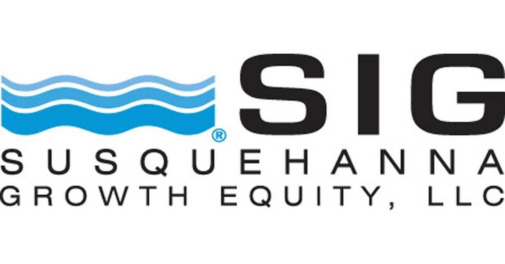

## Table of Contents

## What is Susquehanna International Group (SIG)?

Susquehanna International Group, or SIG, is a big company that started in 1987. It is based in Pennsylvania, USA. SIG works in many areas like trading stocks, buying and selling things, and even making technology. They have offices all over the world, not just in the USA. The company is known for being smart with money and using computers to help them make good choices.

SIG is also famous for helping new businesses grow. They give money to startups and help them become successful. This part of their work is called venture capital. Besides that, SIG also runs a big trading school where they teach people how to trade stocks and other things. This helps them find new talent to work for them. Overall, SIG is a big and important company in the world of finance and technology.

## When was Susquehanna International Group founded?

Susquehanna International Group, or SIG, was founded in 1987. It started in Pennsylvania, USA. The company began as a small business but grew quickly.

SIG works in many areas like trading stocks, buying and selling things, and making technology. They have offices all over the world. The company is known for being smart with money and using computers to help them make good choices.

## Who are the founders of Susquehanna International Group?

Susquehanna International Group, or SIG, was started by a group of friends. The main founders were Jeff Yass and Arthur Dantchik. They met each other when they were young and decided to start a business together.

Jeff and Arthur, along with their friends, began SIG in 1987. They wanted to use their skills in trading and technology to make a successful company. Over time, SIG grew bigger and became known for being smart with money and helping new businesses grow.

## What are the main business areas of SIG?

Susquehanna International Group, or SIG, works in many different areas. One big part of their business is trading. They trade stocks, options, and other financial things. They use computers and smart math to make good choices about what to buy and sell. This helps them make money and be successful in the trading world.

Another important area for SIG is venture capital. This means they give money to new, small businesses to help them grow. SIG looks for startups that they think will do well and gives them the money they need to become bigger. This part of their business helps new ideas and companies get started.

SIG also makes technology. They create computer programs and tools that help them trade better and faster. This technology is important because it helps them stay ahead in the fast world of trading. Overall, SIG's main business areas are trading, venture capital, and technology.

## In which countries does SIG operate?

Susquehanna International Group, or SIG, has offices in many countries around the world. They started in the United States, in Pennsylvania. From there, they grew and opened offices in other places in the US like Chicago and San Francisco.

SIG also has offices outside of the US. They have locations in countries like Australia, China, and Ireland. This helps them work with people and businesses all over the world.

Having offices in different countries helps SIG do business better. They can trade and invest in many places, and their technology can reach more people. This makes SIG a big and important company in the world of finance and technology.

## What types of financial services does SIG offer?

Susquehanna International Group, or SIG, offers many types of financial services. One main service is trading. They trade stocks, options, and other financial things. They use computers and smart math to make good choices about what to buy and sell. This helps them make money and be successful in the trading world. They also offer services to help other people and companies trade better. This includes giving them tools and advice to make smart trading decisions.

Another important service SIG offers is venture capital. This means they give money to new, small businesses to help them grow. SIG looks for startups that they think will do well and gives them the money they need to become bigger. This part of their business helps new ideas and companies get started. It's a way for SIG to invest in the future and help new businesses succeed.

SIG also provides technology services. They create computer programs and tools that help them trade better and faster. This technology is important because it helps them stay ahead in the fast world of trading. They also share this technology with others to help them trade more effectively. Overall, SIG's financial services include trading, venture capital, and technology, all aimed at helping them and others succeed in the financial world.

## How does SIG approach trading and technology?

SIG uses smart math and computers to make good choices in trading. They trade things like stocks and options. They look at a lot of information and use special computer programs to decide what to buy and sell. This helps them make money and be successful. They also help other people and companies trade better by giving them tools and advice. This makes SIG a leader in the trading world.

Technology is very important to SIG. They make their own computer programs and tools to help them trade faster and better. These tools help them stay ahead in the fast world of trading. SIG also shares this technology with others to help them trade more effectively. By using technology, SIG can do more trades and make better decisions. This is a big part of how they succeed in their business.

## What is SIG's approach to risk management?

SIG takes risk management very seriously. They use smart math and computers to understand and control risks. When they trade stocks, options, and other things, they look at a lot of information to make sure they are not taking too many chances. They have special computer programs that help them see what could go wrong and how to avoid big losses. This helps them make safer choices and protect their money.

Another way SIG manages risk is by spreading it out. They don't put all their money into one thing. Instead, they invest in many different things. This way, if one thing does not do well, they still have other things that might do better. It's like not putting all your eggs in one basket. By doing this, SIG can handle ups and downs in the market and keep their business strong.

## Can you explain SIG's corporate culture and values?

SIG's corporate culture is all about teamwork and learning. They believe that working together and sharing ideas helps everyone do better. They also think it's important to keep learning new things. That's why they have a big trading school where they teach people how to trade. They want everyone at SIG to keep growing and getting better at their jobs. This makes SIG a place where people feel supported and can reach their goals.

SIG also values being smart with money and using technology. They use computers and math to make good choices in trading. They believe that being careful and thinking ahead helps them succeed. They also like to help new businesses grow by giving them money and advice. This shows that SIG cares about the future and wants to help new ideas become successful. Overall, SIG's values are about teamwork, learning, being smart with money, and helping others.

## What are some notable achievements or milestones in SIG's history?

Susquehanna International Group, or SIG, started in 1987 in Pennsylvania. It began as a small business but grew quickly. One big milestone was when they opened offices in other places in the US like Chicago and San Francisco. This helped them become a bigger company and reach more people. Another important achievement was when they started working in other countries like Australia, China, and Ireland. This made SIG a global company and helped them do business all over the world.

Another notable milestone for SIG was their success in trading. They became known for using smart math and computers to make good choices in trading stocks and options. This helped them make a lot of money and be successful. SIG also started a big trading school where they teach people how to trade. This helped them find new talent and grow their business even more. They also began giving money to new businesses, which is called venture capital. This showed that SIG cares about helping new ideas and companies grow.

## How does SIG contribute to the financial markets?

SIG helps the financial markets by trading stocks, options, and other things. They use smart math and computers to make good choices about what to buy and sell. This helps keep the markets working well because they are always trading and making the market more active. SIG also gives tools and advice to other people and companies to help them trade better. This makes the whole market smarter and more efficient.

Another way SIG helps the financial markets is by giving money to new businesses. This is called venture capital. When SIG invests in startups, it helps them grow and become successful. This brings new ideas and companies into the market, which can make it more exciting and innovative. By doing this, SIG helps the market stay fresh and full of new opportunities.

## What are the future growth strategies and plans for SIG?

SIG wants to keep growing by using new technology and finding new ways to trade. They plan to keep making their computer programs better so they can trade faster and smarter. They also want to use their technology to help more people and companies trade better. This will help them stay ahead in the fast world of trading and make more money.

Another part of SIG's plan is to keep helping new businesses grow. They want to give more money to startups and help them become successful. This will bring new ideas and companies into the market, which can make it more exciting and innovative. By doing this, SIG hopes to keep the market fresh and full of new opportunities, which can help them grow even more in the future.

## References & Further Reading

[1]: ["Inside the Poker Player's Mind: A Key to Successful Trading"](https://www.amazon.com/Inside-Poker-Mind-General-Concepts-ebook/dp/B0B1QX2F16) - Investopedia article discussing the link between poker and trading.

[2]: ["High-Frequency Trading: A Practical Guide to Algorithmic Strategies and Trading Systems"](https://www.amazon.com/High-Frequency-Trading-Practical-Algorithmic-Strategies/dp/0470563761) by Irene Aldridge

[3]: Soros, G. (1987). ["The Alchemy of Finance: Reading the Mind of the Market."](https://www.wiley.com/en-us/The+Alchemy+of+Finance%3A+Reading+the+Mind+of+the+Market-p-9780471043133) - A book offering insights into financial theory and trading strategies.

[4]: Biais, B., Foucault, T., & Moinas, S. (2015). ["Equilibrium Fast Trading."](https://www.sciencedirect.com/science/article/pii/S0304405X15000288) The Review of Financial Studies, 19(3), 909-962.

[5]: ["Algorithmic and High-Frequency Trading"](https://www.amazon.com/Algorithmic-High-Frequency-Trading-Mathematics-Finance/dp/1107091144) by Álvaro Cartea, Sebastian Jaimungal, & José Penalva

[6]: Nisenson, M. (2003). ["Game Theory and Business Applications."](https://link.springer.com/book/10.1007/978-1-4614-7095-3) - This book explores the application of game theory in various business contexts, including financial markets.