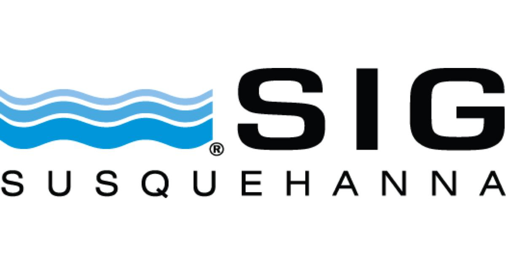

## Table of Contents

## What is Susquehanna International Group (SIG)?

Susquehanna International Group (SIG) is a financial company that was started in 1987. It is based in Pennsylvania, USA. SIG works in many areas of finance, like trading stocks, options, and other financial products. They also invest in new businesses and technologies. The company is known for using advanced technology and math to make smart decisions in trading and investing.

SIG has offices all around the world, including in places like Dublin, Hong Kong, and Sydney. They employ a lot of people who are experts in finance, technology, and math. The company is also involved in other businesses, like owning a casino and a sports team. SIG is respected in the finance world for being innovative and for helping to grow new companies.

## When was Susquehanna International Group founded?

Susquehanna International Group, or SIG, was founded in 1987. It started in Pennsylvania, USA. The company was created to work in the finance world, focusing on trading and investing.

SIG uses technology and math to make smart choices in trading stocks, options, and other financial products. They also help new businesses grow by investing in them. Over time, SIG has grown a lot and now has offices in many countries around the world.

## Who are the founders of Susquehanna International Group?

Susquehanna International Group, or SIG, was started by a group of friends who met at the University of Pennsylvania. The main founders are Jeff Yass, Arthur Dantchik, Joel Greenberg, and Steve Bloom. They all had a strong interest in finance and math, which helped them start the company.

These founders wanted to use their skills in trading and investing to build a successful business. They began SIG in 1987, focusing on using technology and math to make smart decisions in the financial markets. Over the years, their company has grown a lot and now works in many different areas of finance around the world.

## What are the main business areas of SIG?

Susquehanna International Group, or SIG, works in many parts of the finance world. They trade stocks, options, and other financial products. SIG uses computers and math to make smart choices about when to buy and sell these products. This helps them make money in the financial markets. They also invest in new businesses and technologies, helping these companies grow and succeed.

SIG has offices all over the world, like in Dublin, Hong Kong, and Sydney. They hire people who are good at finance, technology, and math. Besides trading and investing, SIG is involved in other businesses too. They own a casino and a sports team. This shows how SIG is not just about finance but also about growing and trying new things.

## In which countries does SIG operate?

Susquehanna International Group, or SIG, works in many countries around the world. They have offices in the United States, where they started in Pennsylvania. They also have offices in Ireland, specifically in Dublin. In Asia, SIG operates in Hong Kong and China. They also have a presence in Australia, with an office in Sydney.

SIG's global reach helps them trade and invest in different financial markets. By having offices in these countries, they can work closely with local businesses and understand different economies. This helps SIG make smart choices in trading stocks, options, and other financial products. It also allows them to support new businesses and technologies in these regions.

## What types of financial services does SIG offer?

Susquehanna International Group, or SIG, offers many types of financial services. They trade stocks, options, and other financial products. SIG uses computers and math to make smart choices about when to buy and sell these products. This helps them make money in the financial markets. They also help new businesses and technologies grow by investing in them. This means they give money to new companies to help them start and succeed.

SIG also works in other areas of finance. They offer services like market making, which means they help make sure there are always buyers and sellers in the market. This helps keep the market running smoothly. SIG also does research to understand how the markets work and how to make better trading decisions. They use this research to help their clients and to improve their own trading strategies.

## How does SIG's trading division function?

SIG's trading division works by buying and selling financial products like stocks and options. They use computers and math to decide when to buy and sell these products. This helps them make money in the financial markets. SIG's traders look at a lot of information to make smart choices. They use special computer programs to help them understand the markets better and make quick decisions.

The trading division also helps keep the markets running smoothly. They do this by being market makers, which means they make sure there are always buyers and sellers in the market. This is important because it helps other people trade easily. SIG's traders work in offices all around the world, like in the United States, Ireland, Hong Kong, and Australia. This helps them trade in different financial markets and understand different economies.

## What role does SIG play in the technology sector?

SIG plays a big role in the technology sector by investing in new tech companies. They give money to startups that are working on new ideas and technologies. This helps these companies grow and succeed. SIG looks for businesses that have good ideas and can use technology to solve problems. By investing in them, SIG helps bring new technology to the world.

SIG also uses technology in its own business. They use computers and math to make smart choices in trading stocks, options, and other financial products. This helps them make money in the financial markets. SIG's traders use special computer programs to understand the markets better and make quick decisions. This shows how important technology is to SIG's success.

## Can you explain SIG's approach to quantitative trading?

SIG's approach to quantitative trading involves using math and computers to make trading decisions. They look at a lot of data to find patterns and trends in the financial markets. This helps them decide when to buy and sell stocks, options, and other financial products. SIG uses special computer programs, called algorithms, to do this work quickly and accurately. These programs help SIG's traders make smart choices based on the data they see.

Quantitative trading at SIG is all about using technology to understand the markets better. They use math to create models that predict how the markets will move. These models help SIG make money by buying and selling at the right times. SIG's traders work with experts in math and technology to keep improving their methods. This way, they can stay ahead in the fast-changing world of finance.

## What are some notable achievements or milestones in SIG's history?

Since starting in 1987, Susquehanna International Group, or SIG, has grown a lot. They began by trading stocks and options, using computers and math to make smart choices. Over time, SIG became known for being good at quantitative trading. They used special computer programs to understand the markets better and make quick decisions. This helped them make money and grow their business. SIG also started investing in new businesses and technologies, helping these companies grow and succeed.

Another big milestone for SIG was expanding around the world. They opened offices in places like Dublin, Hong Kong, and Sydney. This allowed them to trade in different financial markets and understand different economies. SIG also got involved in other businesses, like owning a casino and a sports team. These steps showed how SIG was not just about finance but also about trying new things and growing in different ways.

## How does SIG contribute to the community and what are its corporate social responsibility initiatives?

SIG helps the community in many ways. They give money to schools and charities. This helps students learn and helps people who need support. SIG also works with groups that help the environment. They want to make the world a better place for everyone. By doing these things, SIG shows that they care about more than just making money.

SIG also has programs to help their employees give back. They let workers take time off to volunteer. This means employees can help in their communities. SIG also matches money that employees give to charities. This makes the donations bigger and helps more people. These efforts show that SIG wants to be a good part of the community and help make a difference.

## What are the future growth strategies and plans for SIG?

SIG wants to keep growing by using new technology and math to make smart choices in trading. They plan to keep using computers and special programs to understand the markets better. This will help them make more money and stay ahead in the fast-changing world of finance. SIG also wants to invest in more new businesses and technologies. By giving money to startups, they can help these companies grow and bring new ideas to the world.

Another part of SIG's plan is to expand to more places around the world. They already have offices in the United States, Ireland, Hong Kong, and Australia. SIG wants to open more offices in other countries. This will help them trade in more financial markets and understand different economies. By doing this, SIG can reach more people and help more businesses grow.

## References & Further Reading

[1]: Aldridge, I. (2013). ["High-Frequency Trading: A Practical Guide to Algorithmic Strategies and Trading Systems"](https://www.amazon.com/High-Frequency-Trading-Practical-Algorithmic-Strategies/dp/1118343506). Wiley.

[2]: Duhigg, C. (2009). ["Traders Profit With Computers Set at High Speed"](https://www.nytimes.com/2009/07/24/business/24trading.html) The New York Times.

[3]: Lopez de Prado, M. (2018). ["Advances in Financial Machine Learning"](https://www.amazon.com/Advances-Financial-Machine-Learning-Marcos/dp/1119482089). Wiley.

[4]: Narang, R. (2009). ["Inside the Black Box: A Simple Guide to Quantitative and High-Frequency Trading"](https://onlinelibrary.wiley.com/doi/book/10.1002/9781118267738). Wiley.

[5]: Patterson, S. (2013). ["Dark Pools: The Rise of the Machine Traders and the Rigging of the U.S. Stock Market"](https://www.amazon.com/Dark-Pools-Machine-Traders-Rigging/dp/0307887189). Crown Business.

[6]: Vaananen, L. (2013). ["Dark Pools and High Frequency Trading For Dummies"](https://www.dummies.com/book/business-careers-money/personal-finance/investing/general-investing/dark-pools-and-high-frequency-trading-for-dummies-281564/). For Dummies.

[7]: Zohar, A., & Nickerson, J. (2010). ["Efficient Market Hypothesis Revisited: Performance Analysis of Algorithmic and High-Frequency Trading"](https://pmc.ncbi.nlm.nih.gov/articles/PMC9250071/). Social Science Research Network.