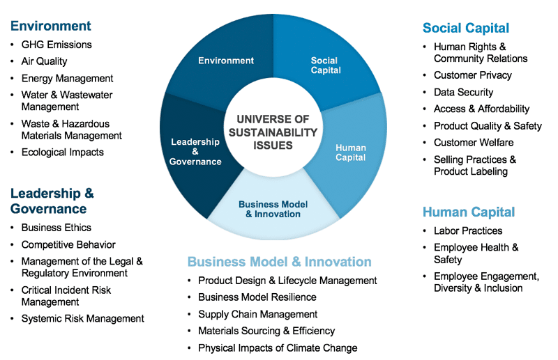

## Table of Contents

## What is the Sustainability Accounting Standards Board (SASB)?

The Sustainability Accounting Standards Board (SASB) is an organization that helps companies figure out which environmental, social, and governance (ESG) issues they should talk about with their investors. It gives companies guidelines on how to report these issues in a way that is clear and useful for investors who want to know about a company's sustainability efforts.

SASB focuses on issues that can affect a company's financial performance. For example, it might look at how a company manages its energy use or how it treats its workers. By following SASB's standards, companies can show investors that they are serious about sustainability and managing risks related to ESG factors. This can help investors make better decisions about where to put their money.

## When was the SASB founded and by whom?

The Sustainability Accounting Standards Board (SASB) was founded in 2011. It was started by Jean Rogers, who wanted to help companies and investors focus on important sustainability issues.

SASB works to make it easier for companies to talk about environmental, social, and governance topics in a clear way. This helps investors understand how these issues might affect a company's money and future.

## What is the main purpose of the SASB?

The main purpose of the Sustainability Accounting Standards Board (SASB) is to help companies tell investors about important environmental, social, and governance ([ESG](/wiki/esg-investing)) issues. SASB gives companies guidelines on what to talk about and how to do it clearly. This helps investors understand how these issues might affect a company's money and future.

By following SASB's standards, companies can show investors that they care about sustainability and managing risks related to ESG factors. This can help investors make better decisions about where to put their money. SASB focuses on issues that can impact a company's financial performance, like energy use or how it treats workers.

## How does the SASB differ from other sustainability standards organizations?

The Sustainability Accounting Standards Board (SASB) focuses on helping companies talk to investors about important environmental, social, and governance (ESG) issues. It gives companies clear guidelines on what to report and how to do it in a way that investors can understand. SASB looks at issues that can affect a company's money, like energy use or how it treats workers. This helps investors see how these issues might impact a company's future.

Other sustainability standards organizations might have different focuses. For example, the Global Reporting Initiative (GRI) helps companies report on a wider range of sustainability issues, not just those that affect financial performance. GRI's reports are often used to show a company's overall impact on the world, not just for investors. Another group, the Task Force on Climate-related Financial Disclosures (TCFD), focuses specifically on how climate change can affect a company's money. So, while SASB helps companies talk to investors about ESG issues, other groups might have different goals or cover different topics.

## What industries does the SASB cover with its standards?

The Sustainability Accounting Standards Board (SASB) covers many different industries with its standards. These industries are grouped into five main categories: consumer goods, extractive and minerals processing, financials, health care, infrastructure, renewable resources and alternative energy, resource transformation, services, and technology and communications. This way, SASB makes sure that the guidelines are useful for companies in all kinds of businesses.

Each industry has its own set of standards that focus on the environmental, social, and governance (ESG) issues that matter most for that industry. For example, the standards for the health care industry might talk about how hospitals manage waste, while the standards for the technology industry might focus on data privacy. By doing this, SASB helps companies in different industries tell investors about the sustainability issues that can affect their money and future.

## How are SASB standards developed and updated?

SASB standards are developed through a careful process that includes a lot of research and talking to people in different industries. First, SASB looks at many companies in each industry to find out which environmental, social, and governance (ESG) issues are important for their money and future. They talk to experts, investors, and companies to make sure they understand what matters most. After gathering all this information, SASB writes the standards and shares them with the public to get feedback. This helps make sure the standards are useful and correct.

Once the standards are made, SASB keeps them up to date. They watch for changes in industries and new issues that might come up. If something important changes, SASB starts a process to update the standards. They do more research and talk to people again to see if the standards need to change. This way, the standards stay helpful for companies and investors over time.

## What are the key components of a SASB standard?

A SASB standard has a few main parts that help companies talk to investors about important environmental, social, and governance (ESG) issues. First, each standard includes a list of topics that are important for the industry. These topics are things like energy use, how a company treats its workers, or how it manages waste. For each topic, the standard explains why it matters for the company's money and future. This helps companies focus on the issues that investors care about.

The second part of a SASB standard is the metrics and disclosures. These are specific things that companies should report to investors. For example, a company might need to say how much energy it uses or how many workplace accidents happen. The standard gives clear instructions on what to report and how to do it. This makes it easier for investors to understand and compare different companies. By following these parts of the standard, companies can show investors that they are serious about managing important ESG issues.

## How can companies implement SASB standards in their reporting?

Companies can start implementing SASB standards in their reporting by first figuring out which industry they belong to. SASB has different standards for different industries, so it's important to pick the right one. Once they know their industry, companies should look at the list of topics in the SASB standard for that industry. These topics are things like energy use, how the company treats its workers, or how it manages waste. Companies need to understand which of these topics are important for their business and could affect their money and future.

Next, companies should use the metrics and disclosures in the SASB standard to report on these topics. Metrics and disclosures are specific things that companies need to tell investors, like how much energy they use or how many workplace accidents happen. Companies should gather this information and include it in their reports. It's important to follow the SASB standard's instructions on what to report and how to do it. This helps investors understand the company's efforts on important environmental, social, and governance issues. By doing this, companies can show investors that they care about sustainability and managing risks related to these issues.

## What are the benefits of using SASB standards for businesses?

Using SASB standards can help businesses in many ways. First, it helps them talk to investors about important environmental, social, and governance issues. By following SASB standards, businesses can show investors that they care about sustainability and managing risks. This can make investors feel more confident about putting their money into the company. It also helps businesses focus on the issues that matter most for their industry, so they can work on improving those areas.

Another benefit is that SASB standards make reporting easier and clearer. The standards give businesses specific instructions on what to report and how to do it. This makes it easier for investors to understand and compare different companies. When businesses use SASB standards, they can show that they are serious about being open and honest about their sustainability efforts. This can help them build trust with investors and other important people, like customers and partners.

## How do SASB standards integrate with other financial reporting frameworks?

SASB standards are designed to work well with other financial reporting frameworks, like the ones used by companies to talk about their money. For example, SASB standards can fit into a company's annual report or other financial statements. This means that when a company talks about its money, it can also talk about important environmental, social, and governance issues in a way that investors can understand easily. By doing this, companies can give investors a complete picture of how they are doing, including both their financial performance and their sustainability efforts.

Using SASB standards with other financial reporting frameworks helps companies be more open and honest. It shows investors that the company is thinking about sustainability and managing risks related to environmental, social, and governance issues. This can make investors feel more confident about putting their money into the company. It also helps companies focus on the issues that matter most for their industry and show how they are working to improve those areas.

## What challenges might companies face when adopting SASB standards?

When companies start using SASB standards, they might find it hard at first. They need to figure out which industry they are in and then look at the list of topics that SASB says are important for that industry. This can be a lot of work because they have to gather information about things like energy use or how they treat workers. It might also be tough because they need to change how they report information to match what SASB asks for. This can take time and might need new systems or training for people in the company.

Another challenge is making sure that the information they report is correct and useful for investors. Companies need to be very careful to follow SASB's instructions on what to report and how to do it. If they don't, investors might not trust the information. Also, some companies might worry that reporting on these issues could make them look bad if they are not doing well in certain areas. But if they are honest and show they are working to improve, it can actually help build trust with investors over time.

## How does the SASB contribute to global sustainability efforts?

The Sustainability Accounting Standards Board (SASB) helps global sustainability efforts by giving companies a way to talk to investors about important environmental, social, and governance issues. SASB looks at what matters most for each industry and tells companies what they should report. This helps investors understand how these issues might affect a company's money and future. By using SASB standards, companies can show that they care about sustainability and are working to manage risks related to these issues. This can make investors more likely to put their money into companies that are serious about being sustainable.

When more companies use SASB standards, it helps the whole world move towards better sustainability. Investors can see which companies are doing well with environmental, social, and governance issues and choose to support those companies. This encourages more businesses to focus on sustainability because they know it matters to investors. Over time, this can lead to big changes in how companies work and help make the world a better place. By giving clear guidelines on what to report and how to do it, SASB plays a big role in pushing for global sustainability.

## How can SASB Standards be integrated with Algorithmic Trading?

The integration of Sustainability Accounting Standards Board (SASB) standards into [algorithmic trading](/wiki/algorithmic-trading) models represents a significant advancement in sustainable finance. SASB standards provide a structured framework for identifying, managing, and reporting on sustainability factors that are financially material to a company's performance. By embedding these standards into trading algorithms, investors can make more informed decisions that align with both financial performance goals and sustainability objectives.

SASB standards focus on industry-specific metrics that are crucial for sustainability assessment. Algorithmic trading models can incorporate these metrics by transforming qualitative ESG (Environmental, Social, and Governance) factors into quantifiable data points that are conducive to algorithmic analysis. For instance, algorithms can be programmed to evaluate a company's carbon emissions, water usage, labor practices, or governance policies based on SASB standards, assigning scores or weights to each [factor](/wiki/factor-investing) according to their materiality.

The quantification of ESG factors necessitates robust data analytics and computational methods. Advanced [machine learning](/wiki/machine-learning) models, such as regression analysis or decision trees, can be used to predict how changes in specific ESG criteria might impact a company's financial performance. Consider a simple linear regression model that predicts stock returns based on an ESG score:

$$
\text{Return}_i = \beta_0 + \beta_1 \times \text{ESG Score}_i + \epsilon_i
$$

where $\beta_0$ is the intercept, $\beta_1$ is the coefficient for the ESG score, and $\epsilon_i$ is the error term.

Several algorithmic trading platforms have already started incorporating sustainability measures into their strategies. For example, platforms like Aladdin by BlackRock integrate ESG data with traditional financial metrics to create a comprehensive view of investment risks and opportunities. Similarly, platforms such as Sustainalytics and Clarity AI provide data-driven insights to assess and integrate ESG factors into investment decisions.

These platforms often use Python to process large datasets and implement complex algorithms due to its extensive libraries and ease of use. The following Python snippet illustrates how an investor might incorporate ESG scores into a simple trading strategy using pandas for data manipulation and scikit-learn for modeling:

```python
import pandas as pd
from sklearn.linear_model import LinearRegression

# Load data
data = pd.read_csv('esg_data.csv')
X = data[['ESG_Score']]
y = data['Stock_Return']

# Initialize and fit the model
model = LinearRegression()
model.fit(X, y)

# Predict future returns based on ESG scores
data['Predicted_Return'] = model.predict(X)

# Example of a simple trading decision based on ESG-enhanced model
data['Trade_Signal'] = ['Buy' if ret > 0 else 'Sell' for ret in data['Predicted_Return']]
```

In conclusion, the integration of SASB standards into algorithmic trading not only enhances investment strategies by aligning them with sustainability criteria but also drives the growth of sustainable finance. Through sophisticated data analytics and algorithmic platforms, the potential for quantifying and utilizing ESG factors is expanding, offering investors new avenues to incorporate sustainability into their financial decisions.

## References & Further Reading

[1]: Eccles, R. G., & Krzus, M. P. (2010). ["One Report: Integrated Reporting for a Sustainable Strategy."](https://onlinelibrary.wiley.com/doi/book/10.1002/9781119199960) John Wiley & Sons.

[2]: Khan, M., Serafeim, G., & Yoon, A. (2016). ["Corporate Sustainability: First Evidence on Materiality."](https://www.semanticscholar.org/paper/Corporate-Sustainability%3A-First-Evidence-on-Khan-Serafeim/7fcd60dd4feceb576f44d138c94a04644eeb5537) The Accounting Review, 91(6), 1697-1724.

[3]: Sustainability Accounting Standards Board (SASB). (2020). ["SASB Conceptual Framework."](https://sasb.ifrs.org/wp-content/uploads/2019/05/SASB-Conceptual-Framework.pdf?source=post_page---------------------------) SASB.

[4]: Lopez de Prado, M. (2018). ["Advances in Financial Machine Learning."](https://www.amazon.com/Advances-Financial-Machine-Learning-Marcos/dp/1119482089) Wiley.

[5]: Jansen, S. (2020). ["Machine Learning for Algorithmic Trading."](https://github.com/stefan-jansen/machine-learning-for-trading) Packt Publishing.