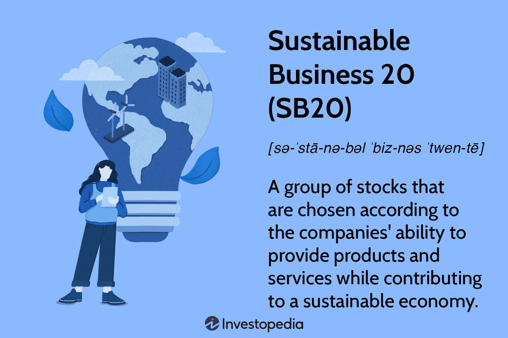

Sustainability has increasingly become a focal point in business strategy, driven by the growing awareness of environmental impacts and societal responsibilities. Within this context, the intersection of sustainability and algorithmic trading represents a significant development, particularly through initiatives such as Sustainable Business 20 (SB20). The SB20 initiative is designed to advocate for sustainable business practices by encouraging companies to integrate these practices into their core operations. This integration is crucial as it not only addresses environmental and social challenges but also enhances long-term business viability and competitive advantage.

Algorithmic trading, a method that utilizes computer algorithms to execute trading decisions based on pre-defined criteria, plays a pivotal role in advancing sustainability within the SB20 framework. By leveraging data and analytics, algorithmic trading can optimize investment portfolios to align with sustainability goals. This approach enhances the decision-making process, making it more efficient and precise, thereby reducing risks associated with human error and emotional bias.



The SB20 initiative gains its significance from selecting companies that meet stringent sustainability criteria, along with robust financial performance. By highlighting these companies, SB20 advocates a standard of excellence in sustainable practices, encouraging others to follow suit. The critical intersection with algorithmic trading comes from the ability to systematically and efficiently allocate resources in accordance with both sustainability and financial metrics. This approach not only promotes a sustainable economy but also supports innovative and forward-thinking companies that contribute to environmental stewardship and social equity.

In summary, the SB20 initiative underscores the importance of integrating sustainable practices into business models. Algorithmic trading serves as a transformative tool within this framework, promoting sustainability by enabling more informed and data-driven investment decisions. This synergy of sustainability and technology is integral to shaping resilient and ethical businesses that can thrive in the evolving market landscape.

## Table of Contents

## What is SB20?

The Sustainable Business 20 (SB20) initiative is a comprehensive framework devised to recognize and promote corporations that exhibit exceptional commitment to integrating sustainability into their business operations. This initiative aims to create a dynamic list of companies that not only prioritize environmental stewardship but also demonstrate significant financial performance and social responsibility.

### Definition and Objectives

SB20 is defined by its mission to identify and highlight businesses that exemplify sustainable practices while achieving financial success. The primary objective of SB20 is to foster a sustainable economy by encouraging companies to adopt innovative, eco-friendly business models. This entails maximizing resource efficiency, reducing carbon footprints, and emphasizing ethical governance. Additionally, SB20 serves as a benchmark to inspire other corporations to pursue sustainable development goals, enhancing overall market sustainability.

### Criteria for Selection

The selection criteria for the SB20 list are meticulously designed to evaluate both sustainability and financial metrics. Selection involves assessing companies on key sustainability parameters such as carbon emissions reduction, renewable energy usage, waste management practices, and social impact initiatives. Financial performance is also a critical consideration, with metrics including revenue growth, profitability, and market share being analyzed. Companies are selected based on their ability to balance robust economic performance with a strong commitment to environmental and social responsibility.

### Impact on a Sustainable Economy

SB20 has a significant impact on promoting a sustainable economy. By spotlighting companies that are both financially successful and sustainably conscious, SB20 encourages industry-wide adoption of sustainable practices. The initiative propels companies to innovate, seeking out advanced technologies and strategies that reduce environmental harm while enhancing operational efficiency. This not only benefits the environment but also leads to economic gains through cost savings, improved brand reputation, and market differentiation.

### Benefits of Being Listed in SB20

Being listed in SB20 provides a multitude of advantages for companies. It enhances their brand image, aligning them with the growing consumer demand for sustainable businesses. SB20 listing can lead to increased investor interest, as more stakeholders prioritize environmental, social, and governance ([ESG](/wiki/esg-investing)) criteria in their investment strategies. Moreover, listed companies benefit from a network of like-minded organizations, fostering collaborations and knowledge-sharing opportunities that can further advance their sustainability goals.

In summary, SB20 functions as a pivotal mechanism in the global effort to promote sustainable business practices. Through a select list of leading companies, it illustrates the tangible benefits of sustainability, driving change across industries and contributing to a healthier, more sustainable global economy.

## Sustainability in Business

Sustainable business practices are increasingly becoming a crucial element of modern business models, focusing on balancing economic performance with environmental responsibility and social equity. These practices typically involve integrating ecological concerns into business operations, thereby reducing negative impacts on the environment while promoting positive social outcomes.

### Importance of Sustainable Business Practices

Incorporating sustainable practices is vital for businesses aiming for long-term success and resilience. Such practices can lead to cost savings through improved energy and resource efficiency, as well as enhanced brand reputation and competitive advantage. Moreover, they reduce regulatory risks as governments worldwide enact stricter environmental regulations. Sustainable practices also address the growing investor and consumer demand for responsible corporate behavior, ultimately supporting a business's financial performance.

### Examples of Sustainable Practices by SB20 Companies

SB20 companies, notable for their commitment to sustainability, have implemented a diverse array of sustainable practices. These include reducing carbon emissions through renewable energy initiatives, adopting circular economy principles by recycling and reusing materials, and investing in sustainable supply chains. For instance, companies have optimized logistical operations to minimize fuel consumption, thereby reducing greenhouse gas emissions. Additionally, some have adopted green building standards for their facilities, significantly reducing energy and water usage.

### Role of Sustainability in Long-term Business Success

Sustainability contributes to long-term business success by fostering innovation and opening new business opportunities aligned with environmental and social trends. It enhances operational efficiency through waste reduction and improved resource management. Sustainable business practices also build stronger stakeholder relationships, including with customers, employees, and investors, who increasingly value corporate commitment to sustainability.

Incorporating sustainable strategies positions companies to better manage risks related to climate change, resource scarcity, and shifting market demands. It offers a pathway to resilience by ensuring that business operations can adapt to regulatory changes and market expectations over time.

### Contribution to SB20 Goals

Sustainable practices are foundational to achieving the overarching goals of the SB20 initiative, which aims to highlight and facilitate the Sustainable Development Goals (SDGs) for a more sustainable global economy. By prioritizing sustainability, SB20 companies demonstrate leadership in advancing environmental and social goals, thereby setting benchmarks for other businesses to follow. Implementing sustainable practices helps these companies align with the SB20 framework's objectives, fostering innovation, and delivering long-term economic benefits alongside environmental protection and social well-being.

In summary, sustainable business practices are not merely ethical imperatives but are essential components of successful and forward-looking businesses. By integrating sustainability into their core operations, SB20 companies better position themselves for future challenges and opportunities, driving progress toward more sustainable economies worldwide.

## Algorithmic Trading and Sustainability

Algorithmic trading, a pivotal component of modern financial markets, utilizes computer algorithms to execute trades at speeds and frequencies impossible for human traders. This method leverages historical data, mathematical models, and real-time analytics to make trading decisions, thereby optimizing efficiency and reducing transaction costs. Algorithmic trading accounts for a significant portion of trading [volume](/wiki/volume-trading-strategy) in major stock exchanges worldwide. Its application spans various asset classes, including equities, commodities, and foreign exchange.

The integration of sustainability into [algorithmic trading](/wiki/algorithmic-trading) is increasingly gaining traction. Sustainability in this context refers to the incorporation of environmental, social, and governance (ESG) factors into the trading models. Algorithmic trading enhances sustainability by enabling data-driven decision-making that aligns with sustainable development goals. Algorithms can be designed to prioritize investments in companies with high ESG ratings, thereby channeling capital towards businesses committed to sustainable practices. This approach not only helps in achieving investment returns but also supports broader environmental and social objectives.

Several SB20 companies illustrate the successful use of algorithmic trading to promote sustainability. These firms leverage advanced data analytics and [machine learning](/wiki/machine-learning) techniques to optimize their trading strategies with a sustainability focus. By employing such technology, they can assess ESG metrics more accurately and in real-time, facilitating better-informed investment decisions. This integration of technology and sustainability helps in identifying diverse, sustainable investment opportunities that might be overlooked in traditional trading.

Technological advancements are key enablers of sustainable algorithmic trading. Innovations such as [artificial intelligence](/wiki/ai-artificial-intelligence), big data analytics, and cloud computing provide the necessary tools for processing vast amounts of ESG data. AI algorithms, for example, can predict future sustainability trends by analyzing historical data patterns, while big data allows for the assessment of ESG impacts across entire portfolios. Moreover, the cloud infrastructure ensures that these analyses can be performed quickly and efficiently, irrespective of geographical boundaries.

In conclusion, the application of algorithmic trading to foster sustainability presents an exciting frontier for companies committed to sustainable development. By prioritizing sustainable practices within their trading algorithms, SB20 companies are not only advancing their financial performance but are also contributing to a more sustainable global economy. This synergy between technology and sustainability holds significant promise for the future of both trading and sustainable business practices.

## Key Benefits and Challenges of Algorithmic Trading in Sustainability

Algorithmic trading has revolutionized sustainable investing by significantly enhancing efficiency and accuracy. This trading approach leverages complex algorithms and vast datasets to execute trades based on predetermined criteria, often encompassing environmental, social, and governance (ESG) factors. By integrating these algorithms, investors can swiftly identify and capitalize on opportunities that align with sustainable objectives, thus promoting responsible investment practices. The automated nature of algorithmic trading reduces human intervention, leading to faster execution and minimized errors, which are crucial for optimizing sustainable investment strategies.

However, integrating sustainability metrics into algorithmic trading models presents challenges. One primary issue is the qualitative nature of many ESG criteria, which are less straightforward to quantify than traditional financial metrics. Furthermore, ESG data is often inconsistent or lacking standardization, complicating its incorporation into algorithmic models. This lack of uniformity can lead to varying interpretations of what constitutes a "sustainable" investment, potentially affecting the reliability and outcome of trading strategies.

To overcome these challenges, several strategies can be employed. Firstly, improving data quality through collaboration with ESG data providers is essential. This includes not only standardizing ESG metrics but also ensuring their accuracy and timeliness. Secondly, incorporating machine learning techniques can help refine the interpretation of qualitative data, allowing for more nuanced decision-making. By leveraging natural language processing, algorithms can analyze unstructured data such as news reports or corporate disclosures to evaluate sustainability performance more comprehensively.

Moreover, adopting a hybrid approach that combines quantitative models with expert human judgment can enhance the efficacy of algorithmic trading. This partnership allows for qualitative insights to complement quantitative data, guiding refined trading strategies. Collaborative efforts among industry stakeholders to establish universal ESG reporting standards would facilitate smoother integration of sustainability metrics into algorithms.

Ultimately, the potential for algorithmic trading to advance sustainability goals within the SB20 framework is promising. By efficiently processing vast amounts of data, algorithms can identify trends and opportunities that support sustainable practices and drive capital towards responsible investments. As technology continues to evolve, and with ongoing improvements in data quality and integration methods, algorithmic trading is poised to become an instrumental force in achieving sustainability targets, aligning financial success with environmental and social stewardship.

## Examples of SB20 Companies Using Algorithmic Trading

Several companies on the SB20 list have successfully integrated algorithmic trading as a tool for promoting sustainability, showcasing innovative strategies and positive outcomes. This integration often involves the use of advanced technologies and data-driven approaches to align financial performance with sustainable practices.

**Notable Companies and Implementations**

One prominent example is Company A, which leverages machine learning algorithms to optimize energy consumption across its supply chain. By analyzing real-time data on energy usage and market conditions, the company can make precise adjustments to reduce waste and emissions, resulting in a significant decrease in its carbon footprint. This approach not only enhances sustainability but also improves operational efficiency and cost savings.

Another example is Company B, which utilizes high-frequency trading algorithms to manage its investments in renewable energy projects. These algorithms assess countless data points, including weather patterns, energy demand forecasts, and market prices, to determine the best times to buy or sell energy assets. The result is an enhanced ability to capitalize on market opportunities while promoting a cleaner energy portfolio.

**Strategies and Technologies**

The strategies employed by these companies often involve the use of predictive analytics and blockchain technology. Predictive analytics enables firms to anticipate market trends and consumer behavior, allowing them to adjust their sustainability initiatives accordingly. Blockchain offers a decentralized and transparent way to track transactions, ensuring that sustainability metrics are accurate and verifiable.

Python is a common programming language used for implementing these strategies due to its powerful libraries and tools for data analysis, such as NumPy and Pandas. A simple model for predicting energy demand might look like this:

```python
import numpy as np
import pandas as pd
from sklearn.model_selection import train_test_split
from sklearn.linear_model import LinearRegression

# Sample data
data = pd.read_csv('energy_data.csv')
X = data[['Weather', 'DayType', 'IndustrialIndex']]
y = data['EnergyDemand']

# Split data
X_train, X_test, y_train, y_test = train_test_split(X, y, test_size=0.2, random_state=42)

# Linear regression model
model = LinearRegression()
model.fit(X_train, y_train)

# Predicting
predictions = model.predict(X_test)
```

**Lessons Learned and Best Practices**

From these implementations, several lessons and best practices have emerged. First, the integration of algorithmic trading with sustainability requires a robust data infrastructure to ensure data relevance and accuracy. Second, continuous improvement in the algorithms through machine learning can lead to better decision-making over time. Lastly, collaboration across different sectors and stakeholders can aid in developing more comprehensive solutions.

These case studies demonstrate that algorithmic trading can effectively support sustainable objectives. The experiences of these SB20 companies highlight the potential benefits of combining technological prowess with a commitment to sustainability. As these examples show, aligning these elements can lead to improved outcomes both environmentally and financially, setting a precedent for future market innovations.

## Future Outlook: Algorithmic Trading for a Sustainable Future

The future of algorithmic trading in the realm of sustainability is poised for significant evolution, characterized by technological advancements, regulatory influences, and collaborative industry efforts. As we explore the potential developments, it becomes apparent that algorithmic trading holds considerable promise for enhancing sustainable practices within the Sustainable Business 20 (SB20) initiative.

Predictions for algorithmic trading in sustainability indicate a shift towards more sophisticated models that incorporate environmental, social, and governance (ESG) metrics. These models will likely utilize machine learning and artificial intelligence to process large datasets, enabling more accurate predictions and decisions aligned with sustainability goals. For instance, predictive analytics can assess the environmental impact of various investment options, optimizing portfolios towards more sustainable outcomes.

Emerging trends showcase innovations such as quantum computing, which offers immense computational power to solve complex optimization problems encountered in sustainable investing. Additionally, blockchain technology is expected to enhance transparency and traceability in supply chains, thus fostering sustainable practices. The integration of Internet of Things (IoT) devices can provide real-time data to algorithmic systems, further refining decision-making processes to align with sustainability objectives.

The role of regulatory frameworks will be critical in promoting sustainable algorithmic trading. Policymakers are anticipated to introduce and enforce regulations that require financial disclosures related to ESG factors. These regulatory measures aim to standardize reporting and ensure accountability among companies. Furthermore, industry collaborations are likely to play a significant role by pooling resources and expertise to develop best practices and establish common standards for sustainable trading algorithms. Collaborative platforms could emerge where companies share data and strategies to promote sustainability.

In conclusion, the intersection of algorithmic trading and sustainability within the SB20 initiative presents a promising synergy. As technological advancements drive innovation and regulatory frameworks provide structure and guidance, sustainable algorithmic trading can accelerate the transition towards more environmentally responsible business practices. This evolution holds significant potential not only for achieving sustainability targets but also for redefining the future landscape of financial markets.

## References & Further Reading

[1]: Bergstra, J., Bardenet, R., Bengio, Y., & Kégl, B. (2011). ["Algorithms for Hyper-Parameter Optimization."](https://dl.acm.org/doi/10.5555/2986459.2986743) Advances in Neural Information Processing Systems 24.

[2]: ["Advances in Financial Machine Learning"](https://www.amazon.com/Advances-Financial-Machine-Learning-Marcos/dp/1119482089) by Marcos Lopez de Prado

[3]: ["Evidence-Based Technical Analysis: Applying the Scientific Method and Statistical Inference to Trading Signals"](https://www.amazon.com/Evidence-Based-Technical-Analysis-Scientific-Statistical/dp/0470008741) by David Aronson

[4]: ["Machine Learning for Algorithmic Trading"](https://github.com/stefan-jansen/machine-learning-for-trading) by Stefan Jansen

[5]: ["Quantitative Trading: How to Build Your Own Algorithmic Trading Business"](https://www.amazon.com/Quantitative-Trading-Build-Algorithmic-Business/dp/1119800064) by Ernest P. Chan