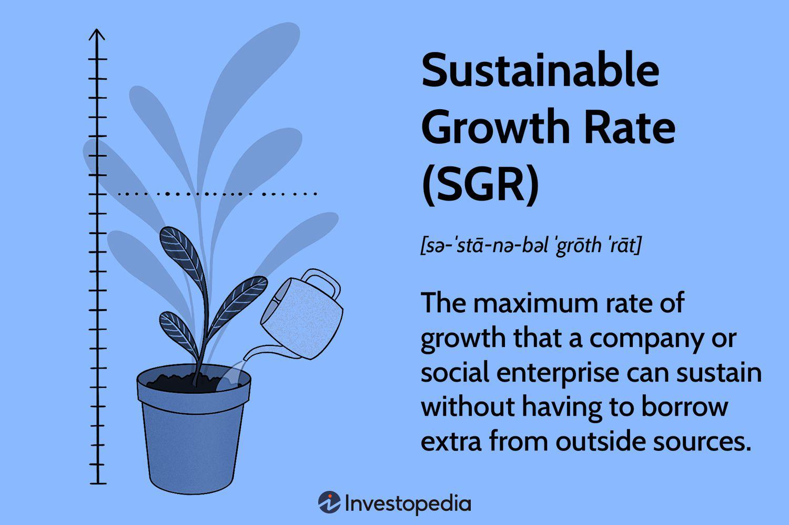

In financial analysis, the Sustainable Growth Rate (SGR) is a vital metric for assessing a company's potential to expand using its own resources. SGR measures the maximum growth rate a company can sustain without relying on external financing options such as debt or new equity issuance. This capability is crucial for maintaining financial health and ensuring long-term viability.

Within the setting of algorithmic trading, understanding SGR becomes integral to refining decision-making processes. Algorithmic traders utilize SGR as part of their analytics toolkit, which aids in predicting a company's financial trajectory and sustainable development potential. Through these predictions, traders can make more informed decisions, enhance financial forecasting, and plan strategically.

This article offers a comprehensive guide on SGR's role and significance in both financial and trading sectors, highlighting its utility in evaluating a firm's self-sustaining growth potential and its strategic implementations in algorithmic trading.

## Table of Contents

## Understanding Sustainable Growth Rate (SGR)

Sustainable Growth Rate (SGR) is a critical financial metric that signifies the maximum growth rate a firm can achieve using its internal resources, without resorting to additional debt or equity financing. The calculation of SGR hinges upon two key financial elements: Return on Equity (ROE) and the retention ratio. These elements demonstrate how much profit is reinvested back into the company, thereby highlighting the growth potential based solely on existing financial operations.

The formula for SGR is expressed as:

$$
\text{SGR} = \text{ROE} \times (1 - \text{Dividend Payout Ratio})
$$

Where the Dividend Payout Ratio reflects the percentage of earnings paid to shareholders as dividends, the retention ratio $(1 - \text{Dividend Payout Ratio})$ represents the portion of net income that is retained within the company for growth and development purposes.

SGR is instrumental for companies aiming to align their growth strategies in a manner that avoids overleveraging. By understanding the boundaries of growth achievable through retained earnings and profits, companies can make informed strategic decisions that do not compromise their financial stability. This is particularly crucial for maintaining a sustainable growth trajectory and avoiding the pitfalls associated with excessive financial leverage.

Moreover, SGR serves as a pivotal indicator of a company's financial health and its potential for growth without external funding. It enables stakeholders to gauge how effectively a company employs its own resources to fuel growth, providing insight into the efficiency of internal capital management. This perspective is valuable for investors and managers who seek to evaluate the long-term sustainability of a company's growth prospects.

In summary, Sustainable Growth Rate is a vital metric for assessing a firm's capability to grow by leveraging its internal financial resources, thereby serving as a cornerstone for sound financial planning and management. Through strategic use of SGR, companies can ensure they are neither overextending themselves financially nor missing out on maximizing their intrinsic growth potential.

## SGR in Financial Metrics for Algorithmic Trading

In [algorithmic trading](/wiki/algorithmic-trading), financial metrics such as the Sustainable Growth Rate (SGR) are crucial for constructing effective trading algorithms. SGR represents a company's ability to grow using solely its internal resources, a critical element in forecasting long-term growth and sustainability. Algorithmic traders integrate SGR into their models to refine trading strategies and improve decision-making processes.

The application of SGR in algorithmic trading involves analyzing a firm's internal resource management, which provides insights into its capacity for sustainable expansion. By understanding this growth potential, traders can better predict the company's future performance, minimizing investment risks associated with overleveraging or pursuing unsustainable growth paths.

Traders utilize SGR to align with their predictive algorithms, which often incorporate complex calculations of internal growth indicators. The formula for SGR is:

$$

\text{SGR} = \text{ROE} \times (1 - \text{Dividend Payout Ratio}) 
$$

where Return on Equity (ROE) measures a company's profitability relative to shareholder equity, and the Dividend Payout Ratio indicates the proportion of earnings distributed as dividends.

By applying this formula, traders can project the maximum growth rate that the company can sustain without additional external funding. This projection allows traders to adjust their strategies according to anticipated company growth, ultimately optimizing their investment portfolios.

Additionally, the incorporation of SGR within algorithmic trading frameworks ensures that traders account for the financial trajectory based on existing resource management practices. This holistic approach to incorporating internal growth metrics with external market analysis aids in constructing a balanced and comprehensive risk assessment model, enhancing the robustness of trading algorithms. 

Ultimately, integrating SGR analysis enables traders to identify growth trends and adapt to dynamic market conditions, fostering more informed strategic decisions that promote long-term success in the trading sector.

## Calculating SGR: A Step-by-Step Guide

The Sustainable Growth Rate (SGR) is calculated using the formula:

$$
\text{SGR} = \text{ROE} \times (1 - \text{Dividend Payout Ratio})
$$

where ROE represents the Return on Equity, and the Dividend Payout Ratio indicates the proportion of earnings paid to shareholders as dividends. Understanding a company's net profit margin and asset utilization is crucial for accurately calculating SGR.

### Step-by-Step Calculation

1. **Calculate Return on Equity (ROE):**

   ROE is a measure of financial performance, and it is calculated as the net income divided by shareholders' equity. The formula is:

   \[ \text{ROE} = \frac{\text{Net Income}}{\text{Shareholders' Equity}}
$$

   Assume a company has a net income of $500,000 and shareholders' equity of $2,000,000. The ROE would be:

   \[ \text{ROE} = \frac{500,000}{2,000,000} = 0.25 \text{ or } 25\%
$$

2. **Determine the Dividend Payout Ratio:**

   This ratio is calculated as the dividends paid divided by the net income. If the company distributes a $100,000 dividend, the ratio is:

   \[ \text{Dividend Payout Ratio} = \frac{100,000}{500,000} = 0.2 \text{ or } 20\%
$$

3. **Calculate Retention Ratio:**

   The retention ratio, which is the complement of the dividend payout ratio, is calculated as:

   \[ \text{Retention Ratio} = 1 - \text{Dividend Payout Ratio} = 1 - 0.2 = 0.8 \text{ or } 80\%
$$

4. **Derive the Sustainable Growth Rate (SGR):**

   Substitute the calculated ROE and retention ratio into the SGR formula:

   \[ \text{SGR} = 0.25 \times 0.8 = 0.20 \text{ or } 20\%
$$

This SGR of 20% implies that the company can grow its revenue, earnings, and dividends at a rate of 20% per year without needing additional financing.

### Implications in Business Decision-Making and Trading

Understanding the SGR provides firms and traders with insights into sustainable business expansion. Companies can use it to gauge their growth capabilities based on reinvested profits rather than relying on debt or issuing new equity. For traders, an effective evaluation of a company’s SGR can inform investment strategies, helping identify businesses with solid internal growth potential. When incorporated into forecasting and analysis, SGR helps optimize strategic decisions by assessing a firm's inherent growth limitations and opportunities. This systematic SGR approach reinforces prudent financial planning and robust trading assessments.

## SGR vs. Other Financial Ratios

Sustainable Growth Rate (SGR) differs significantly from other financial ratios such as the Price/Earnings to Growth (PEG) ratio, offering distinct insights into company performance and potential. SGR focuses on a firm's capacity to grow using its own generated resources, showcasing the potential growth rate that a company can sustain through reinvestment of its earnings without resorting to external financing like new equity or debt. It is calculated using the formula:

$$
\text{SGR} = \text{ROE} \times (1 - \text{Dividend Payout Ratio})
$$

This formula reveals how much of the profits are reinvested back into the company, thus highlighting the internally sustainable growth potential based on past performance metrics such as Return on Equity (ROE) and dividend policies.

In contrast, the PEG ratio offers insights into how a company’s growth expectations align with its current market valuation, factoring in the earnings growth rate. This ratio is calculated as follows:

$$
\text{PEG Ratio} = \frac{\text{P/E Ratio}}{\text{Earnings Growth Rate}}
$$

The PEG ratio extends beyond pure earnings valuation by integrating growth dimensions, providing a pivotal tool for investors focusing on growth potential in relation to stock price.

Each ratio serves different analytical needs. SGR is particularly valuable for internal financial planning, providing a metric for firms to evaluate how effectively they can expand using existing resources. It is widely used for assessing financial health and strategic planning where reliance on external financing is to be minimized. In this context, algorithmic traders might leverage SGR as part of a broader approach to evaluate financial sustainability and predict long-term growth trajectories.

Conversely, the PEG ratio attracts attention from investors looking to assess whether a stock is overvalued or undervalued relative to its projected growth. It is favored in equity analysis, particularly when comparing companies within the same industry or sector. Traders and investors prefer the PEG ratio when making decisions oriented towards market valuation and growth expectations, as it provides insights into how growth is priced into the current stock value.

In summary, while SGR is integral for understanding a firm's growth capability using internal funds, the PEG ratio is essential for relating growth to market expectations. Both ratios, when utilized judiciously, can guide investors and traders in making informed decisions tailored to different analytical scenarios.

## Limitations and Challenges of SGR

The Sustainable Growth Rate (SGR) serves as a critical indicator of a company's capacity to expand using its own resources, assuming consistent financial ratios. However, this assumption is a significant limitation. SGR presumes that key financial metrics such as Return on Equity (ROE) and retention ratio remain stable over time, which rarely mirrors the fluctuating nature of actual market conditions. Such assumptions may lead to overestimations or underestimations of a company's true growth potential.

A significant challenge in employing SGR is the over-reliance on historical data. This historical perspective provides a backward-looking view, potentially overlooking dynamic market developments. For instance, shifts in consumer preferences, regulatory changes, or technological advancements can drastically alter a company's growth trajectory, which historical data alone may not capture accurately.

Moreover, SGR does not account for external market factors such as economic downturns, competitive pressures, and industry disruptions. These external elements can substantially affect a company's profitability and hence its growth capacity, leading to scenarios where the calculated SGR is no longer valid.

Traders and analysts must recognize that SGR alone cannot provide a complete picture of a company's growth prospects. Integrating additional metrics and tools is essential to address this limitation. For a more comprehensive analysis, traders can incorporate market forecasts, competitive analysis, and industry trends alongside SGR calculations. For example, using a multifactor model that includes macroeconomic indicators or sentiment analysis can enhance the robustness of the growth forecast.

In practice, complementing SGR with such diverse analytical tools allows for a more nuanced view of a company's growth potential, mitigating the risk of misjudgment due to static or historical data. Employing these supplementary strategies can enhance decision-making processes, aligning them more closely with the dynamic reality of markets.

## Strategic Use of SGR in Growth and Innovation

Sustainable Growth Rate (SGR) can serve as a pivotal tool for companies seeking to orchestrate strategic expansions while minimizing financial risks. By optimizing the reinvestment of earnings, organizations can enhance their SGR, allowing for a more efficient allocation of internal resources and fostering sustainable development. The strategic use of SGR enables a company to gauge its growth capacity and maintain equilibrium between profitability and reinvestment needs.

Effective reinvestment of earnings is a critical element in amplifying SGR. When a company reinvests its retained earnings wisely, it boosts its Return on Equity (ROE), which directly impacts the SGR. The formula for SGR, defined as SGR = ROE x (1 - Dividend Payout Ratio), shows that an increase in ROE can lead to greater sustainable growth potential. For instance, by channeling earnings into high-yield projects, improving operational efficiencies, or innovating product offerings, a company can elevate its ROE, thereby increasing its SGR. This approach not only heightens the company’s internal growth capacity but also ensures that expansion does not rely heavily on external debt or equity financing, which often [carry](/wiki/carry-trading) additional risks.

In the context of algorithmic trading, incorporating SGR into trading strategies can significantly improve decision frameworks and growth assessments. Algoritmic traders can use SGR to forecast a company’s growth potential based solely on its reinvestment capabilities and profitability. This information is crucial in developing algorithms that predict future stock value through comprehensive financial modeling and data analysis. By integrating SGR alongside other financial indicators, algorithms can recognize patterns and trends that denote favorable growth trajectories, thus enhancing the robustness and predictive accuracy of trading systems.

Algorithmic strategies can also leverage SGR to assess the long-term viability of investment opportunities, particularly in volatile market conditions. For instance, a company with a high SGR might be considered a safer investment during economic downturns because it does not depend on external financing to sustain its operations. Traders can program algorithmic systems to identify such companies, mitigating risk by prioritizing investments with favorable SGR outcomes. Additionally, algorithms can continuously adjust their strategic positions based on real-time updates of SGR, aligning trading activities with the evolving financial landscapes of target companies.

In summary, strategic use of SGR is a critical component in both corporate growth planning and algorithmic trading. By effectively reinvesting earnings to optimize SGR, companies enhance their long-term growth prospects without incurring unnecessary financial risks. Meanwhile, algorithmic trading systems that incorporate SGR offer a sophisticated framework for analyzing and predicting sustainable growth, ultimately contributing to more informed investment decisions and superior market performance.

## Conclusion

Sustainable Growth Rate (SGR) serves as a vital metric in evaluating a company's capacity to grow using its internal resources. This indicator not only aids corporate entities in strategy formulation but also provides algorithmic traders a tool to predict and model growth potential effectively. By computing SGR, businesses can align their expansion initiatives without unnecessarily increasing their reliance on external financing options, such as debt or equity issuance. 

For algorithmic trading, embedding SGR into trading models enhances the predictive accuracy of sustainable growth trajectories. Traders benefit from leveraging SGR to identify firms with strong internal growth capacities, which can inform trading strategy and risk management decisions. The integration of SGR into quantitative models aids in crafting a well-rounded, data-informed perspective of market entities, facilitating the recognition of well-positioned firms within competitive environments.

The successful utilization of SGR in financial analysis is instrumental for strategic, informed decision-making. By utilizing SGR in conjunction with other financial metrics, businesses and traders can optimize their growth forecasts and investment strategies, creating robust frameworks that withstand market fluctuations and capitalize on growth opportunities. This approach ensures entities are better equipped to navigate the complexities of evolving financial landscapes while maintaining a strong competitive edge.

## References & Further Reading

[1]: Damodaran, A. (2012). ["Investment Valuation: Tools and Techniques for Determining the Value of Any Asset"](https://archive.org/details/investmentvaluat0000damo_n6k9) (3rd ed.). Wiley Finance.

[2]: Higgins, R. C. (2015). ["Analysis for Financial Management"](http://students.aiu.edu/submissions/profiles/resources/onlineBook/i5a6J5_Analysis_for_Financial_Management_10th.pdf) (11th ed.). McGraw-Hill Education.

[3]: Bodie, Z., Kane, A., & Marcus, A. J. (2014). ["Investments"](https://books.google.com/books/about/EBOOK_Investments_Global_edition.html?id=BMsvEAAAQBAJ) (10th ed.). McGraw-Hill Education.

[4]: Van Horne, J. C., & Wachowicz, J. M. (2008). ["Fundamentals of Financial Management"](https://www.amazon.com/Van-Horne-Fundamentals-Financial-Management/dp/0273713639) (13th ed.). Prentice Hall.

[5]: Hull, J. C. (2017). ["Options, Futures, and Other Derivatives"](https://www.semanticscholar.org/paper/Options%2C-Futures%2C-and-Other-Derivatives-Hull/89bdee500c8623864fc9eb7a471546aa713acc44) (9th ed.). Pearson.