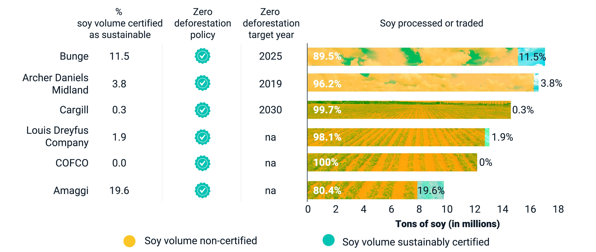

## Table of Contents

## What is sustainable investing?

Sustainable investing is a way of investing money in companies that are good for the environment, society, and the economy. It means choosing to put your money into businesses that try to make the world a better place. These companies might focus on things like reducing pollution, treating their workers fairly, or helping the community.

People who do sustainable investing believe that they can make money and help the planet at the same time. They look at how a company behaves and what it does to make sure it is not harming the environment or people. By choosing these kinds of companies, investors hope to support positive changes and create a better future for everyone.

## Why is sustainable investing important in 2021?

In 2021, sustainable investing became more important because people started to care more about the environment and social issues. They wanted their money to help fix problems like climate change and unfair treatment of workers. Companies that focus on being good to the planet and people started to do better in the market. This showed that you can make money and help the world at the same time.

Also, in 2021, governments and big organizations began to make rules that encourage sustainable practices. This made it easier for investors to find and support companies that are trying to make a positive impact. As more people learned about sustainable investing, it became a popular way to invest, showing that it's not just a trend but a smart way to think about the future.

## What are the key trends in sustainable investing for 2021?

In 2021, one big trend in sustainable investing was the focus on climate change. More and more investors wanted to put their money into companies that are working to reduce carbon emissions and help the planet. This was because people were seeing more extreme weather and wanted to do something about it. Companies that were doing good things for the environment started to get more attention and money from investors.

Another trend was the rise of social issues in investing. Investors started to care more about how companies treat their workers, support their communities, and promote equality. This meant looking at things like fair wages, diversity in the workplace, and how companies help the people around them. As a result, companies that were doing well in these areas started to attract more investment.

A third trend was the growth of new tools and data to help with sustainable investing. In 2021, there were more ways for investors to find out which companies were really making a positive impact. This included new ratings and reports that showed how companies were doing on environmental and social issues. These tools made it easier for people to make smart choices about where to invest their money.

## How does sustainable investing differ from traditional investing?

Sustainable investing is different from traditional investing because it looks at more than just making money. Traditional investing focuses on how much profit a company can make and how much its stock price might go up. Investors look at things like financial reports and market trends to decide where to put their money. The main goal is to get the best return on investment, without worrying too much about other things.

On the other hand, sustainable investing cares about the impact a company has on the world. It looks at how a company treats the environment, its workers, and the community. Investors who choose sustainable investing want to make money, but they also want to support companies that are trying to make the world a better place. This means they might avoid companies that pollute a lot or treat their workers badly, even if those companies could make a lot of money.

In summary, while traditional investing is all about financial returns, sustainable investing balances financial goals with environmental and social benefits. It's about making money and making a positive impact at the same time. This approach is becoming more popular as people realize that they can invest in a way that helps the planet and society, not just their wallets.

## What are the main types of sustainable investments available in 2021?

In 2021, one main type of sustainable investment was ESG investing. ESG stands for Environmental, Social, and Governance. This means investors look at how a company treats the environment, how it treats its workers and the community, and how it is run. Companies that do well in these areas get more investment. Another type was impact investing. This is when investors put their money into projects or companies that are trying to solve specific problems, like building renewable energy or helping people in poor areas. The goal is to make money and make a positive impact at the same time.

Another type of sustainable investment in 2021 was socially responsible investing (SRI). This is when investors avoid companies that do things they don't like, such as making weapons or tobacco. Instead, they choose companies that match their values and beliefs. SRI has been around for a long time, but it got more popular in 2021 as more people wanted to invest in a way that reflects their morals. Finally, there were green bonds, which are like loans that companies or governments take out to do projects that help the environment, like building wind farms or improving water systems. Investors buy these bonds to help fund these projects and get their money back with interest.

## How can beginners start with sustainable investing?

Beginners can start with sustainable investing by first learning about what it means. Sustainable investing is about putting your money into companies that are good for the environment and society. You can read books, watch videos, or look at websites that explain how it works. Once you understand the basics, you can start looking for companies that focus on things like reducing pollution, treating workers fairly, or helping the community. There are also funds and investment options that are specifically designed for sustainable investing, so you can choose one that matches your goals and values.

After you've done your research, the next step is to start small. You don't need a lot of money to begin. Many investment platforms let you start with just a little bit, and you can add more over time. Look for investment apps or websites that offer sustainable options and are easy to use. Some platforms even have tools that help you see how companies are doing in terms of being good to the environment and people. As you get more comfortable, you can invest more and learn more about different types of sustainable investments, like ESG funds, impact investing, or green bonds.

## What are the risks associated with sustainable investing?

Sustainable investing has some risks that you should know about. One risk is that it might be harder to find good companies to invest in. Since you're looking for companies that are good for the environment and society, you might have fewer choices than if you were just looking at how much money a company can make. This can make it trickier to build a strong investment portfolio. Another risk is that sustainable companies might not always do as well financially as other companies. Sometimes, companies that focus on being good to the planet and people might not make as much profit, which can affect your returns.

Another thing to think about is that the rules and information about sustainable investing can change. What is considered a sustainable company today might not be seen the same way in the future. This can make it hard to know if you're really investing in a good company. Also, there can be a lot of greenwashing, where companies say they are sustainable but aren't really doing much. This can make it hard to trust the information you find. So, it's important to do your research and keep learning about the companies you invest in.

## How do regulatory changes in 2021 impact sustainable investing?

In 2021, regulatory changes made a big difference for sustainable investing. Governments and big organizations started to make new rules to help and encourage companies to be more sustainable. These rules made it easier for investors to find out which companies were really trying to help the environment and society. For example, some countries started to require companies to report on their environmental impact, so investors could see how a company was doing in terms of sustainability. This helped people make better choices about where to put their money.

These new rules also made sustainable investing more popular. More people started to care about the environment and wanted their money to help make a difference. Because of the new regulations, it became easier to trust that companies were being honest about their sustainability efforts. This led to more money flowing into sustainable investments, making them a bigger part of the market. Overall, the regulatory changes in 2021 helped make sustainable investing more clear, trusted, and important.

## What role do ESG criteria play in sustainable investing trends?

ESG criteria are really important in sustainable investing. ESG stands for Environmental, Social, and Governance. These criteria help investors see how a company is doing in terms of being good to the planet, treating people well, and being run fairly. In 2021, more and more investors started using ESG criteria to choose where to put their money. They wanted to make sure their investments were helping the world, not just making money. This made ESG a big part of the trend towards sustainable investing.

Because of this focus on ESG, companies started to pay more attention to these areas. They knew that investors were looking at their environmental impact, how they treated their workers, and how they were managed. This led to more companies trying to improve their ESG scores, which made sustainable investing even more popular. In 2021, ESG criteria helped drive the trend of sustainable investing by giving investors clear ways to see which companies were really making a positive impact.

## How are technology and data analytics shaping sustainable investing in 2021?

In 2021, technology and data analytics played a big role in making sustainable investing easier and more popular. New tools and software helped investors find out which companies were really trying to help the environment and society. These tools used data to give scores and reports on how companies were doing in terms of being sustainable. This made it simpler for people to choose where to put their money. They could see at a glance which companies were doing good things and which ones were not.

Because of these new technologies, more people started to trust sustainable investing. They could see clear information about a company's impact on the world, which made them feel more confident about their choices. This led to more money going into sustainable investments. Companies also started to use technology to improve their own sustainability efforts. They used data to find ways to reduce their environmental impact and treat their workers better. This made sustainable investing a bigger and more important part of the market in 2021.

## What are some case studies of successful sustainable investments in 2021?

In 2021, one successful sustainable investment was in Tesla, the electric car company. Tesla focuses on making cars that don't use gas and don't pollute the air. This is good for the environment. In 2021, Tesla's stock price went up a lot because more people wanted to buy electric cars. Investors who put their money into Tesla made a good return and also helped the planet by supporting a company that is trying to reduce pollution.

Another example is NextEra Energy, a company that makes a lot of its power from wind and solar energy. These are clean ways to make electricity that don't harm the environment. In 2021, NextEra Energy did well because more people and businesses wanted to use clean energy. Investors who chose NextEra Energy saw their investments grow and also helped fight climate change by supporting renewable energy.

## What are the future predictions for sustainable investing beyond 2021?

Looking ahead, sustainable investing is expected to keep growing and become even more important. More people are starting to care about the environment and social issues, so they want their money to help make the world a better place. This means more money will likely go into companies that focus on things like clean energy, fair treatment of workers, and helping the community. Governments and big organizations might also make more rules to encourage sustainable practices, which will make it easier for investors to find and support these companies.

In the future, technology and data will play an even bigger role in sustainable investing. New tools and software will help investors see clearly which companies are really making a positive impact. This will make it easier for people to choose where to put their money and feel confident that they are helping the planet and society. As more people learn about sustainable investing and see its benefits, it will become a normal way to invest, not just a special choice. This will lead to a world where making money and making a difference go hand in hand.

## References & Further Reading

[1]: Renneboog, L., Horst, J. T., & Zhang, C. (2008). ["Socially Responsible Investments: Institutional Aspects, Performance, and Investor Behavior."](https://www.sciencedirect.com/science/article/pii/S0378426607004220) Journal of Banking & Finance, 32(9), 1723-1742.

[2]: Friede, G., Busch, T., & Bassen, A. (2015). ["ESG and Financial Performance: Aggregated Evidence from More than 2000 Empirical Studies."](https://www.tandfonline.com/doi/full/10.1080/20430795.2015.1118917) Journal of Sustainable Finance & Investment, 5(4), 210-233.

[3]: Lopez de Prado, M. (2018). ["Advances in Financial Machine Learning."](https://www.amazon.com/Advances-Financial-Machine-Learning-Marcos/dp/1119482089) Wiley.

[4]: Jansen, S. (2018). ["Machine Learning for Algorithmic Trading."](https://github.com/stefan-jansen/machine-learning-for-trading) Packt Publishing.

[5]: Chan, E. P. (2008). ["Quantitative Trading: How to Build Your Own Algorithmic Trading Business."](https://github.com/ftvision/quant_trading_echan_book) Wiley.

[6]: European Union. (2019). ["Regulation (EU) 2019/2088 on sustainability‐related disclosures in the financial services sector."](https://eur-lex.europa.eu/eli/reg/2019/2088/oj) Official Journal of the European Union.

[7]: United Nations. (2015). ["Transforming our world: the 2030 Agenda for Sustainable Development."](https://sdgs.un.org/publications/transforming-our-world-2030-agenda-sustainable-development-17981) 

[8]: OECD. (2017). ["Investing in Climate, Investing in Growth."](https://www.oecd.org/en/publications/investing-in-climate-investing-in-growth_9789264273528-en.html) Organisation for Economic Co-operation and Development.

[9]: Boffo, R., & Patalano, R. (2020). ["ESG Investing: Practices, Progress and Challenges."](https://www.oecd-ilibrary.org/esg-investing-practices-progress-and-challenges_b4f71091-en.pdf?itemId=%2Fcontent%2Fpublication%2Fb4f71091-en) Organisation for Economic Co-operation and Development.