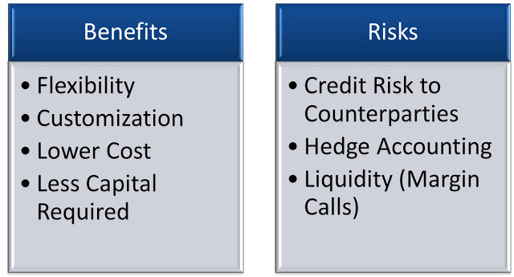

## Table of Contents

## What is a swap bank?

A swap bank is a financial institution that helps people and businesses manage their risks by using something called swaps. Swaps are like agreements where two parties exchange cash flows or other financial things over time. For example, one party might agree to pay a fixed interest rate, while the other pays a floating rate that changes with the market. The swap bank acts like a middleman, making sure these swaps happen smoothly and safely.

Swap banks are important because they help make the financial markets more stable. They do this by matching people who want to take certain risks with those who want to avoid them. This way, everyone can find a deal that suits their needs. Swap banks also make sure that all the rules and regulations are followed, which helps keep the financial system trustworthy and reliable.

## How does a swap bank function?

A swap bank works by helping people and businesses make deals called swaps. Imagine you have a loan with a changing interest rate, but you want it to stay the same. You can go to a swap bank and find someone who wants the opposite. The swap bank will set up an agreement where you pay them a fixed rate, and they pay you the changing rate. This way, you get the stable payments you want, and the other person gets the changing payments they want. The swap bank makes sure everything goes smoothly and that both sides keep their promises.

Swap banks also make the financial world safer and more stable. They do this by matching people who want to take risks with those who want to avoid them. This helps everyone find a good deal. Swap banks also follow all the rules and make sure everyone else does too. This keeps the financial system trustworthy. So, next time you hear about a swap bank, remember they're like matchmakers and rule-keepers in the world of money.

## What are the basic types of swaps facilitated by swap banks?

Swap banks help with different kinds of swaps, but the most common ones are interest rate swaps and currency swaps. An interest rate swap is when two people or businesses agree to exchange interest payments. One might pay a fixed rate, while the other pays a floating rate that changes with the market. This helps them manage their money better. For example, if you have a loan with a changing rate but you want it to be steady, you can do an interest rate swap.

Another common type is a currency swap. This is when two parties agree to exchange payments in different currencies. It's helpful if you do business in another country and want to avoid the risk of currency changes. You can swap your money in one currency for payments in another. This way, you know exactly how much money you'll get, no matter what happens with exchange rates. Swap banks make sure these deals happen smoothly and that everyone follows the rules.

## What are the primary roles of a swap bank in financial markets?

A swap bank plays a crucial role in financial markets by acting as an intermediary for people and businesses looking to manage their financial risks. When someone wants to exchange one type of cash flow for another, like switching from a variable interest rate to a fixed one, the swap bank helps find a counterparty willing to take the other side of the deal. This process helps both parties achieve their financial goals by matching those who want to take on certain risks with those who want to avoid them.

Additionally, swap banks contribute to the stability and efficiency of financial markets. By facilitating these swaps, they help reduce uncertainty and make it easier for businesses to plan their finances. Swap banks also ensure that all transactions follow the necessary rules and regulations, which helps maintain trust and reliability in the financial system. In essence, swap banks are like matchmakers and rule-keepers, making the world of finance smoother and safer for everyone involved.

## How do swap banks manage risk?

Swap banks manage risk by carefully balancing the deals they make. When they help two people swap payments, like switching from a changing interest rate to a steady one, they make sure they are not taking too much risk themselves. They do this by finding other deals that cancel out the risks they take on. For example, if they agree to pay a changing rate to one person, they will find another person who will pay them that same changing rate. This way, no matter what happens to interest rates, the swap bank stays safe.

Swap banks also use something called hedging to manage risk. Hedging is like buying insurance for their deals. If they think there might be a big change in interest rates or currency values that could hurt them, they can make other deals that will protect them. For example, they might buy a financial product that will pay them more if interest rates go up, which would help cover any losses from their swaps. By using these strategies, swap banks can keep the financial system stable and make sure they can keep helping people manage their risks.

## What are the advantages of using swap banks for businesses?

Using swap banks can help businesses a lot. One big advantage is that they can manage their money better. If a business has a loan with a changing interest rate, but they want it to stay the same, a swap bank can help them do that. This makes it easier for the business to plan their finances because they know exactly how much they will have to pay each month. It also helps them avoid big surprises if interest rates go up suddenly.

Another advantage is that swap banks can help businesses deal with money from other countries. If a business is selling things in another country, they might get paid in a different currency. But if that currency's value changes a lot, it can be risky. A swap bank can help the business swap that foreign money for their own country's money at a steady rate. This way, the business knows exactly how much money they will get, no matter what happens with exchange rates. So, swap banks make things safer and more predictable for businesses.

## How do swap banks contribute to liquidity in the financial markets?

Swap banks help make the financial markets more liquid by acting as middlemen for swaps. When businesses or people want to swap one type of payment for another, like switching from a changing interest rate to a steady one, the swap bank finds someone else who wants the opposite. This makes it easier and quicker for everyone to find a good deal. By matching people who want to take risks with those who want to avoid them, swap banks help keep the money flowing smoothly in the markets.

Because swap banks are always ready to help with these deals, they make it easier for businesses to manage their money. If a business needs to change its payments quickly, the swap bank can step in and find a solution fast. This means businesses can react to changes in the market without waiting a long time. So, swap banks help keep the financial markets active and full of opportunities for everyone.

## What are the regulatory requirements for swap banks?

Swap banks have to follow a lot of rules to make sure they are doing things the right way. These rules come from places like the government and financial watchdogs. The main goal is to keep the financial system safe and fair for everyone. For example, swap banks need to have enough money set aside to cover any risks they take on. This is called capital requirements. They also have to report everything they do clearly and honestly, so everyone knows what's going on. This is called transparency and reporting requirements.

Another important rule for swap banks is to make sure they are treating everyone fairly. This means they can't favor one person over another and must follow rules about how they handle conflicts of interest. They also have to make sure they are following rules about how they manage the money they are holding for their clients. This is called fiduciary duty. By following all these rules, swap banks help keep the financial markets stable and trustworthy.

## How do swap banks price their services?

Swap banks charge for their services based on a few things. One big thing is how risky the swap is. If the swap is very risky, the swap bank might charge more because they need to make sure they can cover any losses. They also look at how much work they have to do to find the right person for the swap. If it's a lot of work, they might charge more. Another thing they consider is the market conditions. If interest rates or currency values are changing a lot, they might charge more because it's harder to manage the risk.

Swap banks also use something called a bid-ask spread to make money. This means they will buy something at one price and sell it at a slightly higher price. The difference between these two prices is their profit. For example, if they are helping with an interest rate swap, they might charge a little more for the fixed rate than they pay for the floating rate. This way, they make money on every swap they help with. By using these methods, swap banks can offer their services while also making sure they can manage their risks and stay in business.

## What advanced strategies can businesses employ using swap banks?

Businesses can use swap banks to do some smart things with their money. One cool strategy is called basis swaps. This is when a business swaps one floating interest rate for another floating rate. It might sound weird, but it can help them if the two rates usually move differently. For example, if one rate goes up and the other goes down, the business can make money from the difference. This helps them manage their risks better and maybe even make a little extra money.

Another advanced strategy is using swap banks for cross-currency basis swaps. This is helpful if a business is working in different countries and dealing with different currencies. They can swap payments in one currency for payments in another, but with a twist. They can also swap the interest rates that come with those currencies. This can help them protect themselves from big changes in exchange rates and interest rates at the same time. By using these strategies, businesses can keep their money safe and steady, no matter what happens in the world of finance.

## How do swap banks interact with other financial institutions?

Swap banks work with other financial institutions like banks, investment firms, and insurance companies to help everyone manage their money better. They act like a bridge between these institutions, making sure that swaps happen smoothly. For example, if a bank wants to change a loan's interest rate from changing to steady, the swap bank will find an investment firm that wants the opposite. This way, the bank can plan its finances better, and the investment firm can take on the risk it wants. Swap banks also share information and work together to follow all the rules and keep the financial system safe.

Sometimes, swap banks also use other financial institutions to manage their own risks. They might work with insurance companies to buy protection against big changes in interest rates or currency values. This helps them stay safe while they help their clients. By working together, swap banks and other financial institutions make the financial world more stable and efficient. They help each other find good deals and manage risks, which is good for everyone involved.

## What future trends are expected to impact the operations of swap banks?

In the future, technology will play a big role in how swap banks work. More and more, swap banks will use computers and the internet to make their deals faster and easier. This means they can help more people and businesses manage their money without needing to meet in person. Also, new rules might come that make swap banks use even more technology to keep everything safe and fair. This could mean using special computer programs to watch over all the deals and make sure no one is cheating.

Another trend that might change things for swap banks is how the world's money systems are changing. More countries might start using different kinds of money, like digital currencies. Swap banks will need to learn how to work with these new types of money to help businesses that use them. Also, as the world gets more connected, swap banks might help more businesses from different countries work together. This could mean more swaps happening across borders, which can be tricky but also exciting for swap banks.

## What is the understanding of Financial Instruments and Derivatives?

Financial derivatives are sophisticated financial instruments whose value is derived from underlying assets such as stocks, bonds, commodities, interest rates, or currencies. These instruments serve multiple purposes, including hedging risks, speculating on future price movements, and providing efficient access to various markets or assets, thus allowing entities to manage their financial exposure and optimize their portfolios.

Swaps, one of the prevalent types of derivatives, entail the exchange of cash flows between two parties, typically to manage interest rate exposure. For instance, an interest rate swap involves one party exchanging a series of fixed interest rate payments for floating rate payments from another party. This can be particularly beneficial in stabilizing cash flows and aligning interest obligations with the desired risk profile. The formula for a simple interest rate swap can be represented as:

$$

\text{Cash Flow} = (\text{Principal} \times (\text{Fixed Rate} - \text{Floating Rate})) \times \frac{\text{Days}}{360}
$$

where "Principal" refers to the notional amount, "Fixed Rate" is the agreed fixed interest rate, "Floating Rate" is the market or benchmark interest rate, and "Days" is the period in question.

Swaptions, another category, are options on swaps that grant the holder the right but not the obligation to enter into a swap agreement at a future date. This feature equips financial institutions with increased flexibility and strategic avenues when managing [interest rate](/wiki/interest-rate-trading-strategies) risks, as they can lock in future interest rate agreements without immediate commitment. Swaptions are particularly valuable in volatile interest rate environments, offering hedging possibilities and speculative opportunities for future market conditions.

The pricing and valuation of swaptions often involve advanced mathematical models such as the Black-Scholes model or the more sophisticated Hull-White model, which incorporate factors like [volatility](/wiki/volatility-trading-strategies), time to expiration, and interest rates to determine the option's value. Incorporating formulas into these models, for example, the Black-Scholes formula for options pricing is:

$$

C = S_0 N(d_1) - X e^{-rT} N(d_2) 
$$

where
$$

d_1 = \frac{\ln(S_0 / X) + (r + \sigma^2 / 2)T}{\sigma \sqrt{T}}
$$

$$

d_2 = d_1 - \sigma \sqrt{T}
$$

In these equations, $S_0$ represents the current price of the underlying asset, $X$ is the strike price, $r$ is the risk-free interest rate, $\sigma$ is the volatility, $T$ is the time to maturity, and $N$ denotes the cumulative distribution function of the standard normal distribution.

In summary, swaps and swaptions are critical tools in the management of financial risks and capitalizing on market opportunities. By allowing firms to negotiate cash flows and future financial positions strategically, these derivatives contribute significantly to both risk mitigation and market strategy development.

## How can one integrate swaps, swaptions, and algo trading?

The integration of swaps and swaptions with algorithmic trading enables banks to achieve advanced risk management and strategic positioning. This harmonization is crucial for efficiently managing interest rate risks and quickly responding to market conditions. By automating the trading process, financial institutions can streamline operations, reduce manual intervention, and improve the precision of executing financial derivative contracts.

Algorithmic trading leverages sophisticated models such as the Black-Scholes and Hull-White models, which are essential for accurately pricing complex derivatives like swaptions. The Black-Scholes model, traditionally used for option pricing, is extended to accommodate the intricacies of swaptions by handling the stochastic nature of interest rates. The mathematical representation of the Black-Scholes model for options is:

$$
C(S, t) = SN(d_1) - Xe^{-rt}N(d_2)
$$

where:

\- $C$ is the call option price  
\- $S$ is the current price of the underlying asset  
\- $X$ is the strike price  
\- $t$ is the time to expiration  
\- $r$ is the risk-free interest rate  
\- $N$ is the cumulative distribution function of the standard normal distribution  
\- $d_1$ and $d_2$ are defined as:

$$
d_1 = \frac{\ln(\frac{S}{X}) + (r + \frac{\sigma^2}{2})t}{\sigma\sqrt{t}}
$$

$$
d_2 = d_1 - \sigma\sqrt{t}
$$

Incorporating the Hull-White model further refines the valuation by accounting for mean-reverting processes in interest rates. This model is expressed by the stochastic differential equation:

$$
dr(t) = [\theta(t) - a(t)r(t)]dt + \sigma(t)dW(t)
$$

where:

\- $r(t)$ is the short rate at time $t$  
\- $\theta(t)$ is a deterministic function  
\- $a(t)$ is the speed of mean reversion  
\- $\sigma(t)$ is the volatility  
\- $W(t)$ is a Wiener process  

By utilizing these models, algorithmic trading systems can optimize trade execution strategies effectively. Python scripts are frequently employed in this domain to implement these models and to simulate various scenarios, ensuring robust decision-making frameworks that enhance the bank's strategic positioning in volatile markets. This capability enables institutions to not only mitigate risks associated with interest rate fluctuations but also to identify and capture market opportunities with greater agility.

## References & Further Reading

[1]: ["Swaps and Other Derivatives"](https://www.investopedia.com/ask/answers/060215/what-difference-between-derivatives-and-swaps.asp) by J. W. Blake and Dallas Burkett

[2]: Hull, J. C. (2018). ["Options, Futures, and Other Derivatives"](https://www.semanticscholar.org/paper/Options%2C-Futures%2C-and-Other-Derivatives-Hull/89bdee500c8623864fc9eb7a471546aa713acc44) (9th Edition). Pearson.

[3]: ["The Black-Scholes Model"](https://www.investopedia.com/terms/b/blackscholes.asp) by Investopedia

[4]: ["Algorithmic Trading and DMA: An introduction to direct access trading strategies"](https://www.amazon.com/Algorithmic-Trading-DMA-introduction-strategies/dp/0956399207) by Barry Johnson

[5]: Rebonato, R. (1998). ["Interest Rate Option Models: Understanding, Analysing and Using Models for Exotic Interest Rate Options"](https://archive.org/details/interestrateopti0000rebo_a0n9) (2nd Edition). Wiley.