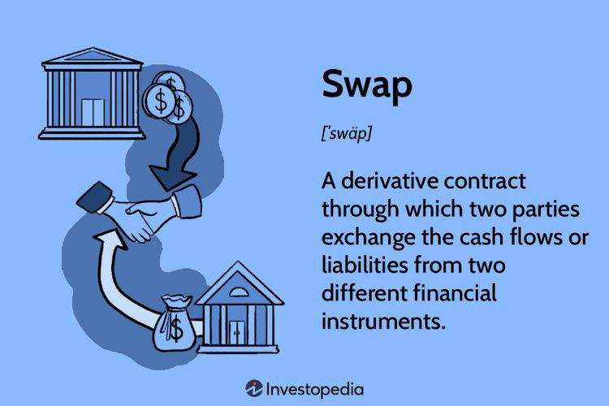

In the modern financial landscape, complex financial instruments have enabled more sophisticated trading strategies, opening avenues for financial gains through various derivative contracts. Among these, swap contracts have emerged as instrumental tools for risk management and speculation. A swap contract is essentially a derivative instrument where two parties agree to exchange financial liabilities or cash flows based on pre-determined criteria. These contracts are pivotal in the hedging of risks and provide opportunities for speculating on changes in underlying financial metrics like interest rates or currency exchange rates.

This article covers the intersection of financial gains derived from swap contracts, the methodology behind swap calculation, and the role of algorithmic trading in this financial niche. Swap contracts, including interest rate swaps and currency swaps, play a crucial role in today's financial markets. Interest rate swaps, the most common type, involve exchanging fixed interest rate payments for floating ones, enabling parties to manage exposure to fluctuations in interest rates effectively.



As financial markets evolve, the calculation of gains and losses from swap contracts becomes essential for financial management and optimization. These calculations consider net cash flow outcomes based on agreed swap terms under varying economic scenarios. For instance, shifts in benchmark rates such as LIBOR or SOFR can substantially impact the financial outcomes of interest rate swaps.

The advent of algorithmic trading has significantly influenced the way swaps are traded. By employing computer algorithms to automate trade execution, market participants can enhance efficiency, reduce transaction costs, and swiftly execute complex strategies. This enhances precision and aligns trading strategies with real-time market data, providing a competitive edge.

We aim to provide a comprehensive understanding of swap contracts, highlighting their significance in the financial markets while exploring how technology is revolutionizing their use. As part of this exploration, the article will also examine the broader context of derivative instruments, the dynamic nature of swap markets, and future prospects as fintech innovations continue to evolve.

## Table of Contents

## Understanding Swap Contracts

Swap contracts are a pivotal class of derivative instruments that facilitate the exchange of financial liabilities or cash flows between two parties based on predefined conditions. These contracts are customizable, allowing counterparties to structure agreements that serve their specific financial objectives. Two of the most prevalent types of swap contracts are interest rate swaps and currency swaps.

Interest rate swaps are widely used in financial markets, primarily to manage exposure to fluctuations in interest rates. In a typical [interest rate](/wiki/interest-rate-trading-strategies) swap, one party agrees to pay a fixed interest rate on a notional principal amount, while the other party pays a floating rate tied to a benchmark index such as the London Interbank Offered Rate (LIBOR) or the Secured Overnight Financing Rate (SOFR). The formula for calculating swap payments under an interest rate swap can be expressed as:

$$
\text{Payment} = \text{Notional Principal} \times \left( \text{Fixed Rate} - \text{Floating Rate} \right)
$$

These contracts are instrumental for hedging interest rate risks, allowing parties to stabilize cash flows and protect against unfavorable interest rate movements. For example, a company with outstanding debt at a floating interest rate may enter into an interest rate swap to effectively convert its debt to a fixed rate, thus mitigating the risk of rising interest rates.

Currency swaps, on the other hand, involve exchanging cash flows in different currencies. These swaps are vital for companies operating internationally, providing a mechanism to hedge against currency exchange rate [volatility](/wiki/volatility-trading-strategies). In a standard currency swap, principal amounts are exchanged at the inception and termination of the contract, with periodic interest payments occurring throughout the swap's duration based on the agreed interest rates in each currency.

Both interest rate and currency swaps offer a spectrum of applications beyond straightforward hedging. They can be utilized for speculative purposes, allowing market participants to capitalize on anticipated changes in interest rates or currency exchange rates. This flexibility enhances the strategic toolset available to financial managers and traders, enabling them to optimize financial positions in line with expected economic trends. 

By providing mechanisms to manage financial risks and exploit market opportunities, swap contracts are integral to modern financial strategy, aiding in the effort to achieve financial stability and gain.

## The Calculation of Swap Gains or Losses

Accurate calculation of gains and losses from swap contracts is crucial for effective financial management and optimization. Swap participants must understand how various factors, particularly interest rates and benchmark rate changes, can affect the financial outcomes of these contracts. This section explores the methodology behind such calculations and offers insights into how market fluctuations influence swaps.

Calculating the gains or losses for a swap typically involves evaluating the net present value (NPV) of the cash flows stipulated in the swap agreement. The NPV calculation considers both the fixed and floating legs of the swap. For interest rate swaps, the formula can be represented as:

$$
\text{NPV} = \sum_{i=1}^{n} \left( \frac{\text{Fixed Leg Cash Flow}_i - \text{Floating Leg Cash Flow}_i}{(1 + r)^i} \right)
$$

where $n$ is the total number of periods, $r$ is the discount rate, and $i$ denotes each cash flow period. The fixed-leg cash flows are determined by multiplying the notional principal by the fixed rate and the time period, while floating-leg cash flows vary depending on benchmark rates like LIBOR (London Interbank Offered Rate) or SOFR (Secured Overnight Financing Rate).

For example, consider an interest rate swap where one party pays a fixed interest rate of 3% and receives a floating rate tied to LIBOR. If LIBOR is currently at 2%, the party paying the fixed rate would be at a net loss, as they pay more than they receive. However, if LIBOR rises to 4%, the fixed-rate payer benefits since they receive more interest than they pay.

The real impact of benchmark rate changes on interest rate swaps can be significant. A shift from LIBOR to SOFR, which reflects more secure, overnight transactions, necessitates recalibration of swap contracts to ensure contractual terms are fulfilled while considering the new benchmark's characteristics.

For scenario analysis, parties engaged in swaps simulate projected rate environments. In a rising interest rate scenario, the floating-rate leg becomes more costly, potentially leading to losses for the party receiving the floating rate. Conversely, falling rates can lead to gainful outcomes. Mathematical models and simulations often assist in these evaluations, allowing firms to respond to changing economic conditions effectively.

Python code can aid in these calculations and simulations. Here’s a simple example of how one might compute the NPV of a swap using Python:

```python
def calculate_npv(fixed_leg_rate, notional, periods, floating_leg_cash_flows, discount_rate):
    npv = 0
    for i, floating_cash_flow in enumerate(floating_leg_cash_flows, start=1):
        fixed_cash_flow = notional * fixed_leg_rate * (1 / periods)
        npv += (fixed_cash_flow - floating_cash_flow) / ((1 + discount_rate) ** i)
    return npv

# Example usage:
notional = 1000000
fixed_leg_rate = 0.03  # 3%
periods = 4  # Quarterly payments
floating_leg_cash_flows = [20000, 22000, 19000, 25000]  # Hypothetical values
discount_rate = 0.02  # 2%

npv = calculate_npv(fixed_leg_rate, notional, periods, floating_leg_cash_flows, discount_rate)
print(f"Net Present Value of the Swap: {npv:.2f}")
```

Understanding how swaps respond to these factors helps participants manage risks and optimize financial outcomes. As interest rates and market volatility continue to influence swap agreements, a precise understanding of these calculations becomes indispensable for decision-makers in the financial industry.

## Algorithmic Trading in Swap Contracts

Algorithmic trading, a process where trading decisions and executions are managed by computer programs, has become increasingly integral in the domain of swap contracts. By automating these processes, [algorithmic trading](/wiki/algorithmic-trading) offers multiple benefits that are transforming how swap contracts are managed and executed.

One significant advantage of algorithmic trading is enhanced efficiency. Algorithms can process vast amounts of data far more quickly than human traders, enabling rapid execution of trades. This is particularly beneficial in swap contracts, where market conditions can change in milliseconds. The ability to swiftly respond to these changes can greatly improve the financial outcomes associated with swaps.

Reduced transaction costs are another benefit of algorithmic trading. Automated systems minimize manual interventions, thereby reducing errors and the associated costs. By ensuring that trades are executed at the optimal price, algorithms can enhance the profitability of swap deals.

Algorithmic trading also facilitates the implementation of complex trading strategies. Swap contracts often involve intricate calculations and require precise timing to maximize their potential. Algorithms can be programmed to execute these sophisticated strategies, analyzing various market parameters to determine the best [course](/wiki/best-algorithmic-trading-courses) of action.

Market participants use algorithm-driven models to synchronize swap strategies with real-time market data. For instance, if the data indicates an impending change in interest rates, an algorithm can automatically adjust a swap contract to reflect these new conditions. This real-time alignment ensures that trading strategies remain relevant and effective, responding dynamically to any market shifts.

Here's a basic example in Python to illustrate algorithmic trading in swaps. Consider a scenario where an algorithm must decide whether to execute a swap based on two interest rates:

```python
def execute_swap(threshold, rate1, rate2):
    if rate1 > threshold and rate2 < threshold:
        return "Execute Swap: Favorable Conditions"
    elif rate1 < threshold and rate2 > threshold:
        return "Execute Swap: Favorable Conditions"
    else:
        return "Do Not Execute Swap"

# Example Usage
threshold_rate = 2.5 # hypothetical threshold rate
current_rate1 = 3.0  # current interest rate for party A
current_rate2 = 2.0  # current interest rate for party B

decision = execute_swap(threshold_rate, current_rate1, current_rate2)
print(decision)
```

In conclusion, algorithmic trading in swap contracts optimizes both the timing and the strategic approach to trading these complex financial instruments, providing a toolset that helps traders maximize financial gains while efficiently managing risks. As technology continues to evolve, these systems are expected to become even more sophisticated, offering enhanced predictive capabilities and greater adaptability to market conditions.

## Derivative Instruments and Market Dynamics

Swaps are an integral part of the broader category of derivative instruments, which also includes futures, options, and forwards. These financial instruments play a critical role in enhancing market [liquidity](/wiki/liquidity-risk-premium) and providing robust hedging mechanisms. Derivatives allow market participants to manage risk by transferring it between parties, improving efficiency in financial markets.

Futures contracts obligate the buyer to purchase, and the seller to sell, a specific asset at a predetermined future date and price. This structure allows traders to hedge against price fluctuations in commodities, currencies, or other financial instruments. Options provide the right, but not the obligation, to buy or sell an asset at a specified price before an expiration date, offering a tailored risk management tool with limited downside and potentially unlimited upside. Forwards, like futures, involve an agreement between two parties to exchange an asset, but they are typically customized contracts traded over-the-counter, allowing for flexibility in terms and conditions.

The dynamics of swap markets are influenced by a variety of factors, including regulatory changes and economic indicators. Swaps, particularly interest rate swaps, are affected by changes in benchmark interest rates and regulatory frameworks. For instance, the transition from the London Interbank Offered Rate (LIBOR) to the Secured Overnight Financing Rate (SOFR) has significantly impacted swap agreements globally. This shift demands adaptability from market participants as they recalibrate their strategies and systems to align with the new benchmarks. LIBOR's shortcomings, such as manipulation risks and declining transaction [volume](/wiki/volume-trading-strategy), necessitated the establishment of more reliable benchmarks like SOFR, which is based on actual overnight transactions and provides a more accurate reflection of the funding market conditions.

Moreover, regulatory developments, such as those introduced following the 2008 financial crisis for greater transparency and reduced systemic risk, continue to shape the landscape of derivative trading. Legislations like the Dodd-Frank Act in the United States have imposed stringent requirements on reporting and clearing derivative transactions, including swaps, through centralized clearinghouses. These changes aim to mitigate counterparty risk and bring more transparency to the derivatives market.

Economic indicators such as interest rates, inflation, and economic growth forecasts also influence swap markets. Participants must remain vigilant to macroeconomic trends and policy decisions that could affect the valuation and utility of swap contracts. By understanding these dynamic forces, traders and financial institutions can implement strategies that optimize their positions and manage risks effectively.

In conclusion, the evolving nature of swap contracts and the broader derivatives market requires market participants to remain informed and adaptable. The shift from LIBOR to SOFR and other regulatory changes underscore the importance of staying responsive to new developments, ensuring that derivative instruments continue to serve as valuable tools for risk management and speculation in the global financial markets.

## Future Prospects of Swap Contracts

The continuous evolution of financial technology (fintech) holds transformative potential for enhancing the application and efficiency of swap contracts. One of the major advancements in this domain is the integration of [artificial intelligence](/wiki/ai-artificial-intelligence) (AI) into swap trading. AI brings forth the ability to leverage predictive analytics, allowing traders to anticipate market trends and execute transactions with a higher degree of accuracy. This progression towards automated decision-making processes ensures that swap deals are conducted with optimal timing and strategic alignment, reducing the latency and errors associated with human intervention.

Incorporating AI into swap trading platforms also facilitates the management of large datasets, enabling the identification of complex patterns and correlations within market data that might not be readily apparent through traditional analysis. Machine learning algorithms can be trained to recognize these patterns, equipping traders with insights that can be acted upon quickly. This can lead to more informed decisions in setting swap terms and executing trades, ultimately optimizing financial returns and managing risks more effectively.

The future landscape of swap contracts is also heavily influenced by ongoing regulatory developments. Regulatory bodies worldwide continue to adjust policies to enhance transparency and reduce systemic risk within the swap markets. One significant shift is the transition from the London Interbank Offered Rate (LIBOR) to the Secured Overnight Financing Rate (SOFR). This change necessitates adaptations in pricing models and valuation methodologies across many existing and new swap agreements. Market participants must stay informed on these regulatory changes to maintain compliance and capitalize on new opportunities resulting from these shifts.

Moreover, the global economic climate plays a critical role in shaping swap contract utilization. Economic indicators such as inflation rates, employment levels, and geopolitical stability directly affect interest rates and currency exchange rates, which are often the underlying factors in most swap agreements. As these economic variables continue to evolve, swap strategies must be continually reassessed and refined to align with the prevailing market conditions.

In summary, the future prospects of swap contracts are closely tied to the advances in fintech, particularly AI, and the ongoing shifts in regulatory and economic landscapes. As these factors converge, they promise to redefine how swap contracts are utilized, driving innovation in financial optimization strategies and ensuring that market participants are better equipped to manage risks and seize opportunities.

## Conclusion

Swap contracts remain a cornerstone of modern financial strategy, offering both risk management and speculative opportunities. In an era where financial markets are continuously evolving, these instruments provide the flexibility needed to navigate complex market dynamics. The ability to exchange cash flows or financial liabilities under predefined conditions makes swaps a versatile tool for managing risks associated with interest rates, currency fluctuations, and other financial variables.

As technology advances, the integration of algorithmic trading with financial instruments like swap contracts enhances market precision and strategic flexibility. Algorithmic trading allows for the automatic execution of trades based on specific criteria, reducing transaction costs and increasing the efficiency of trade execution. This technological advancement empowers traders to respond swiftly to market changes, ensuring that swap contracts are utilized to their fullest potential.

Understanding swap calculations and remaining informed about market developments is crucial for maximizing financial gains from these instruments. Swap calculations typically involve the comparison of net cash flows, which can be impacted by changes in benchmark rates such as LIBOR or SOFR. The precision of these calculations can significantly influence the profitability of swap agreements. Therefore, financial professionals must employ meticulous calculations and stay informed about regulatory changes and economic indicators that could affect swap markets.

In conclusion, the strategic use of swap contracts, bolstered by technological advancements like algorithmic trading, equips financial market participants with the tools necessary for effective risk management and opportunity exploitation. By comprehending the complexities involved in swap calculations and staying updated with market trends, traders and financial institutions can harness swaps to secure financial gains while mitigating risks.

## References & Further Reading

[1]: ["Swaps and Other Derivatives"](https://onlinelibrary.wiley.com/doi/book/10.1002/9781119206224) by Richard R. Flavell

[2]: ["The Swap Trading Practice and Principles"](https://www.investopedia.com/terms/s/swap.asp) by Mohammed, Iqbal

[3]: ["Interest Rate Swaps and Other Derivatives"](https://cup.columbia.edu/book/interest-rate-swaps-and-other-derivatives/9780231159647) by Howard Corb

[4]: Hull, John C. (2017). ["Options, Futures, and Other Derivatives"](https://books.google.com/books/about/Options_Futures_and_Other_Derivatives_eB.html?id=2iopDwAAQBAJ). Prentice Hall.

[5]: ["The Handbook of Fixed Income Securities"](https://www.amazon.com/Handbook-Fixed-Income-Securities-Ninth/dp/1260473899) by Frank J. Fabozzi

[6]: Duffie, Darrell, & Singleton, Kenneth J. (2003). ["Credit Risk: Pricing, Measurement, and Management"](https://press.princeton.edu/books/hardcover/9780691090467/credit-risk). Princeton University Press.