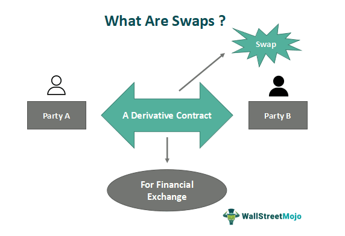

The financial markets are intricately structured systems where various participants engage to effectively manage financial risks and capture opportunities. Within this structure, swap dealers emerge as pivotal entities, facilitating the backbone of derivative transactions. By operating as market makers for swap contracts, these dealers provide essential liquidity and enhance risk management capabilities for their counterparties. 

The expansion in the use of derivatives and swaps, particularly after the regulatory overhaul that followed the 2007-2008 financial crisis, underscores their importance in modern financial markets. This surge can be attributed to heightened regulatory scrutiny and the drive for transparency and accountability. Swap dealers, therefore, have adapted to these shifts, solidifying their roles in risk mitigation and financial stability.

Concurrently, the rise of algorithmic trading has transformed the landscape of financial markets, including those involving derivatives and swaps. By leveraging sophisticated algorithms, market participants can execute trades with unprecedented speed and accuracy, optimizing both market efficiency and trade execution. Algorithmic trading's capabilities extend to processing vast datasets for strategic decision-making, a trend that is reshaping trading methodologies and risk management practices in the financial ecosystem.

This article endeavors to elucidate the roles and responsibilities of swap dealers within these evolving dynamics, examining the regulatory frameworks that govern their activities and exploring the profound effects of algorithmic trading on the derivatives market. Understanding these elements is crucial for both practitioners and observers aiming to navigate the complexities of today's financial markets.

## Table of Contents

## Understanding Swap Dealers and Their Role

Swap dealers are pivotal participants in the financial markets, primarily within the domain of derivatives trading. They operate as intermediaries that facilitate swaps, a type of derivative contract where two parties agree to exchange cash flows or other financial instruments, predominantly to manage risks associated with factors such as interest rate fluctuations and currency exchange variability.

**Functionality and Operations**

The primary function of swap dealers is to provide [liquidity](/wiki/liquidity-risk-premium) and instantiate market-making activities. By doing so, they enable more fluid trading environments where counterparties can efficiently exchange risks. Swap dealers facilitate the exchange of payment streams, often structured to hedge against financial uncertainties. For instance, a typical [interest rate](/wiki/interest-rate-trading-strategies) swap involves swapping fixed interest rate payments for floating rate ones, providing a mechanism for parties to manage their interest obligations efficiently. 

These deals are often customized, with terms tailored to the specific needs of the clients involved. Consequently, swap dealers deal with contracts that are not standardized or available on public exchanges like traditional stocks or commodities, allowing for a more bespoke approach to risk management. 

**Regulatory Environment**

Swap dealers are subject to extensive regulation, a framework primarily developed to ensure market stability and transparency. In the United States, the Dodd-Frank Wall Street Reform and Consumer Protection Act established significant oversight. It mandates that swap dealers register with the Commodity Futures Trading Commission (CFTC) and adhere to stringent compliance conditions. These include maintaining adequate capital reserves, satisfying reporting and record-keeping requirements, and adhering to business conduct standards that promote fair dealing practices. 

Moreover, these entities guide the structuring and pricing of swaps, which often involves significant expertise in both mathematical modeling and market dynamics. 

**Role in Risk Hedging and Liquidity Provision**

Through their operations, swap dealers effectively assist companies and financial institutions in hedging against risks which might otherwise lead to financial instability. This hedging can cover a range of financial exposures beyond interest rates, including but not limited to currency risks, credit risks, and commodity prices.

In summary, swap dealers play an integral role in global financial markets by operating as facilitators of complex financial transactions. They enable market participants to manage financial risks through customized derivative contracts while ensuring liquidity and offering price-making capabilities. Encompassed within a robust regulatory framework, their operations help maintain market integrity and stability.

## The Regulatory Landscape for Swap Dealers

Regulatory bodies such as the Commodity Futures Trading Commission (CFTC) and the Securities and Exchange Commission (SEC) play pivotal roles in supervising swap dealers to ensure the stability and integrity of financial markets. These institutions were empowered and mandated to oversee swap transactions mainly through the reforms introduced by the Dodd-Frank Wall Street Reform and Consumer Protection Act following the 2008 financial crisis. The Dodd-Frank Act fundamentally reshaped the regulatory landscape, targeting systemic risk reduction and market transparency improvements in swap dealing.

One of the crucial aspects of the Dodd-Frank Act is the requirement for swap dealers to register with the CFTC. Registration obligates entities to comply with various regulatory standards, including the maintenance of certain levels of margin and capital to safeguard against potential market disruptions. These stipulations are designed to mitigate the financial contagion risks that can emerge from swap market activities, where the default of a single large entity could have cascading adverse effects on the broader financial ecosystem.

The CFTC's regulatory framework also mandates a set of business conduct standards that swap dealers must adhere to, aimed at fostering responsible business practices and protecting counterparties participating in swap transactions. Additionally, swap data repositories have been established to provide essential data collection and dissemination for enhanced transparency.

Importantly, the regulatory framework considers the de minimis exception, which exempts certain smaller entities from being classified as swap dealers, thereby alleviating them from the full extent of the regulatory burden. This exception is particularly significant in balancing market entry barriers for smaller entities while maintaining robust oversight for larger market participants. The threshold for this exception is periodically reviewed to ensure it remains aligned with market dynamics and regulatory objectives.

Overall, these regulatory measures reflect a comprehensive approach to managing the systemic risks associated with swap dealings. By ensuring that swap dealers maintain sufficient financial buffers and transparency, regulators aim to foster a secure and efficient swap market landscape capable of sustaining financial stability through varying market conditions.

## Technical Aspects of Derivatives and Algo Trading

Algorithmic trading has dramatically transformed the derivatives markets by facilitating high-frequency trading ([HFT](/wiki/high-frequency-trading-strategies)) with minimal human intervention. The application of sophisticated algorithms enables market participants to execute complex trading strategies with greater speed and precision, particularly for swaps and other derivatives. This has led to numerous improvements in market efficiency, partly by optimizing order execution and reducing the time required to respond to market movements.

Algorithms used in trading are often designed to exploit various forms of market inefficiencies and patterns, which can be identified through techniques such as technical analysis and data analytics. Technical analysis involves the evaluation of securities by analyzing statistical trends gathered from trading activity, such as price movement and [volume](/wiki/volume-trading-strategy). By leveraging large datasets, advanced algorithms can identify patterns and predict future price movements with heightened accuracy.

Data analytics plays a crucial role in [algorithmic trading](/wiki/algorithmic-trading). With the rise of big data, traders can now analyze massive sets of historical market data to fine-tune their algorithms. This might involve utilizing [machine learning](/wiki/machine-learning) models to detect patterns or correlations that are not visible through conventional analysis. For instance, a common machine learning approach is the use of regression models to predict the future price of a derivative based on a set of indicators or past prices.

Algorithmic trading also significantly impacts liquidity provision and price discovery. By constantly interacting with the market through buying and selling, these algorithms help maintain tighter bid-ask spreads, which in turn promotes more efficient pricing. In a liquid market, prices reflect all available information, and participants can buy or sell large quantities of derivatives without causing significant price changes. Algorithms may employ strategies such as [market making](/wiki/market-making), where they continuously place buy and sell orders to provide liquidity and capitalize on bid-ask spreads.

Moreover, algorithms contribute to price discovery—the process by which the market determines the price of a derivative or asset. As algorithms rapidly analyze incoming data and news, they help translate this information into prices, making the markets more responsive and reflective of real-time events. This is crucial in derivatives markets where the underlying assets might be volatile, and the ability to quickly integrate new information can lead to more accurate pricing.

In summary, algorithmic trading has enabled the execution of more refined and sophisticated trading strategies in derivatives markets, driven by advances in technical analysis and data analytics. Its influence extends to crucial market functions such as liquidity provision and price discovery, contributing to a more efficient trading environment.

## Impact of Swap Dealers on Market Liquidity

Swap dealers play a vital role in enhancing market liquidity by acting as counterparties in various transactions. This function is crucial for ensuring the efficient and smooth operations of financial markets. By acting as intermediaries, swap dealers facilitate the exchange of financial instruments, thereby enabling counterparties to manage risk effectively.

One core aspect of swap dealers' contribution to market liquidity is their ability to reduce bid-ask spreads. The bid-ask spread is the difference between the highest price a buyer is willing to pay for an asset and the lowest price a seller is willing to accept. A narrower spread generally indicates a more liquid market. Swap dealers, by providing liquidity, help to tighten these spreads, which in turn promotes efficient pricing and enhances the overall efficiency of the marketplace. This liquidity provision function supports the seamless execution of trades, which is beneficial for all market participants, from institutional investors to individual traders.

However, the impact of swap dealers on market liquidity is not static and can vary significantly under different market conditions. During periods of financial stress or high [volatility](/wiki/volatility-trading-strategies), the activities of swap dealers can either stabilize or destabilize market liquidity. Their ability to manage this impact hinges on their responses to changing market conditions. If swap dealers are able to adapt swiftly and continue to provide liquidity even in tumultuous times, they can help stabilize the market. On the other hand, if they retract from the market due to increased risk or regulatory pressures, it could exacerbate liquidity shortages, widen bid-ask spreads, and potentially lead to increased market instability.

It is important to note that swap dealers are subject to various regulatory requirements aimed at maintaining market stability. These regulations influence their capacity to act during times of stress. For example, capital and margin requirements may limit the ability of swap dealers to operate under strained market conditions, affecting their liquidity provision role. Therefore, understanding the balance between regulation and market function is crucial for comprehending the full impact of swap dealers on market liquidity.

In conclusion, swap dealers are essential to supporting liquidity and promoting efficient market functioning. While they help mitigate risks during normal market conditions by narrowing bid-ask spreads, their potential to either stabilize or destabilize markets during financial stress underscores the intricacies involved in managing liquidity and risk.

## Challenges and Opportunities for Swap Dealers

Swap dealers operate in a highly dynamic environment where they must navigate a series of challenges while capitalizing on emerging opportunities. One of the foremost challenges is regulatory compliance. In many jurisdictions, swap dealers are subject to rigorous regulations aimed at enhancing market stability and transparency. For example, the Dodd-Frank Wall Street Reform and Consumer Protection Act, implemented in response to the 2008 financial crisis, imposes stringent rules on swap dealers, mandating registration, capital adequacy, and margin requirements. Compliance with these regulations necessitates investments in compliance systems and personnel, which can strain resources, particularly for smaller dealers.

Market volatility presents another significant challenge. Swap dealers must manage the risks associated with fluctuating interest rates, currency exchange rates, and commodity prices. Volatility can impact the valuation of swap contracts and lead to increased margin calls, requiring robust risk management frameworks to mitigate potential losses. The use of advanced analytical tools and models is crucial in navigating these volatile conditions, allowing dealers to assess and hedge risks more effectively.

Credit risk management is a persistent challenge for swap dealers, as they often engage in large-scale transactions with a variety of counterparties. Establishing reliable credit risk assessment protocols and maintaining sufficient collateral are vital to safeguarding against counterparty defaults. Dealers must continuously monitor credit exposures and adjust their strategies to maintain financial stability.

Despite these challenges, there are significant opportunities for swap dealers, particularly in the adoption of new technologies. Investments in technological infrastructure can streamline operations and enhance compliance efficiency. Advanced software solutions can automate compliance processes, reducing the time and resources required to meet regulatory demands.

Innovations in blockchain technology and [artificial intelligence](/wiki/ai-artificial-intelligence) (AI) offer promising opportunities to transform swap transactions. Blockchain's decentralized ledger technology can enhance transparency by providing an immutable record of trades, thus reducing the risk of fraud and error. This transparency can also improve counterparty trust and facilitate smoother settlement processes.

AI can play a crucial role in predictive analytics and risk management. Machine learning algorithms can analyze vast datasets to uncover patterns and predict market movements, enabling more informed decision-making. These algorithms can also enhance trading strategies by optimizing the execution of trades to achieve better pricing and reduce transaction costs.

In summary, while swap dealers contend with regulatory, market, and credit challenges, the strategic implementation of technology and innovation offers pathways to improved efficiency and enhanced service delivery in the swap market. By embracing these opportunities, swap dealers can better position themselves to navigate the complexities of the financial markets.

## Conclusion

Swap dealers serve as pivotal components within financial markets, facilitating risk management and enhancing liquidity. By ensuring the smooth exchange of swap contracts, they help various market participants hedge against risks such as interest rate fluctuations and currency exchange variability. This function is increasingly significant given the expanding complexity and interconnectedness of global financial systems.

Technological advancements continue to reshape the landscape in which swap dealers operate. Algorithmic trading, in particular, has revolutionized the execution and efficiency of trades, enabling rapid responses to market changes and facilitating high-frequency transactions with minimal human intervention. The integration of artificial intelligence and machine learning has further augmented these capabilities, allowing for the processing and analysis of vast amounts of financial data to inform trading strategies.

Regulatory frameworks, notably post-2008 reforms like the Dodd-Frank Act, impose stringent obligations on swap dealers. These regulations are designed to enhance transparency and reduce systemic risk, ensuring that swap transactions do not threaten overall market stability. Compliance with these requirements poses challenges, requiring significant investment in technology and infrastructure. However, it also presents opportunities to leverage innovations such as blockchain to streamline processes and enhance transaction transparency.

For practitioners and market participants, a deep understanding of swap dealing, derivatives, and algorithmic trading is crucial. Mastery of these components is essential not only for navigating the complexities of financial markets but also for capitalizing on the opportunities presented by technological and regulatory developments. As the market landscape evolves, staying informed about these changes will be key to both mitigating risks and leveraging new avenues for growth.

## References & Further Reading

[1]: ["The Dodd-Frank Act: Significant Impact on Swap Dealers and Participants"](https://www.bu.edu/rbfl/files/2013/09/RegulationSwapMarkets.pdf), Commodity Futures Trading Commission.

[2]: [Gomber, P., Arndt, B., Lutat, M., & Uhle, T. (2011). "High-Frequency Trading."](https://papers.ssrn.com/sol3/papers.cfm?abstract_id=1858626) SSRN Electronic Journal.

[3]: ["Algorithmic Trading and DMA: An Introduction to Direct Access Trading Strategies"](https://www.amazon.com/Algorithmic-Trading-DMA-introduction-strategies/dp/0956399207) by Barry Johnson.

[4]: Duffie, D., Scheicher, M., & Vuillemey, G. (2015). ["Central clearing and collateral demand."](https://www.nber.org/papers/w19890) European Central Bank Working Paper Series.

[5]: Pirrong, C. (2011). ["The Economics of Central Clearing: Theory and Practice."](https://www.eachccp.eu/wp-content/uploads/2015/12/ISDAdiscussion_CCP_Pirrong.pdf) International Swaps and Derivatives Association.

[6]: Narang, R. K. (2013). ["Inside the Black Box: A Simple Guide to Quantitative and High-Frequency Trading"](https://onlinelibrary.wiley.com/doi/book/10.1002/9781118662717). 

[7]: Wilmott, P. (2007). ["Paul Wilmott Introduces Quantitative Finance"](https://www.amazon.com/Paul-Wilmott-Introduces-Quantitative-Finance/dp/0470319585).