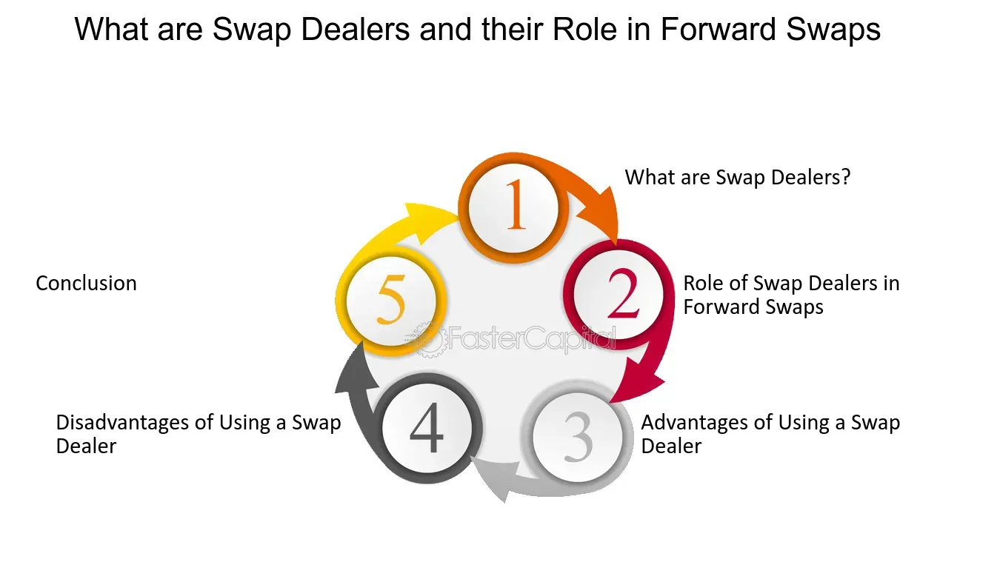

## Table of Contents

## What is a swap dealer?

A swap dealer is a person or company that helps other people or businesses trade swaps. Swaps are special financial agreements where two parties agree to exchange cash flows or other financial instruments. For example, one party might agree to pay a fixed interest rate, while the other agrees to pay a variable rate. Swap dealers make money by charging fees or taking a small part of the swap as profit.

Swap dealers are important because they help make the swap market work smoothly. They find people who want to make swaps and help them agree on the terms. They also make sure that the swaps are done correctly and safely. Because swap dealers know a lot about swaps, they can help their clients understand the risks and benefits of different swap deals.

## What types of swaps do swap dealers typically handle?

Swap dealers usually handle different kinds of swaps, like interest rate swaps and currency swaps. Interest rate swaps are when two parties agree to exchange interest payments. One might pay a fixed rate, while the other pays a variable rate that changes with the market. This helps businesses manage their interest rate risks. Currency swaps involve exchanging principal and interest payments in different currencies. This can help companies that do business in multiple countries manage their currency risks.

Another type of swap that swap dealers often deal with is commodity swaps. These swaps involve exchanging a fixed price for a commodity, like oil or wheat, for a variable price based on the market. This can help companies that use these commodities to manage their price risks. Swap dealers also handle credit default swaps, which are like insurance against a company not being able to pay its debts. If the company fails, the swap dealer pays the other party, helping to manage credit risk.

Overall, swap dealers help with many types of swaps, each designed to help businesses manage different kinds of financial risks. By working with swap dealers, companies can better predict their costs and protect themselves from unexpected changes in interest rates, currency values, commodity prices, or credit events.

## How do swap dealers make money?

Swap dealers make money mainly by charging fees for their services. When they help two parties make a swap, they take a small fee from the deal. This fee can be a fixed amount or a percentage of the swap's value. Swap dealers also make money by taking a small part of the swap as profit. This is called the "bid-ask spread." They buy the swap at a lower price and sell it at a higher price, keeping the difference as their profit.

Another way swap dealers make money is by managing risk. They often take on some of the risk of the swaps they help create. By doing this, they can earn money if things go well, but they also have to be careful because they could lose money if things go badly. Swap dealers use their knowledge of the market to manage these risks and make smart decisions about which swaps to get involved in. This helps them make more money over time.

## What are the basic requirements to become a swap dealer?

To become a swap dealer, you need to meet some basic requirements set by the government. First, you need to register with the Commodity Futures Trading Commission (CFTC) or the Securities and Exchange Commission (SEC), depending on the types of swaps you want to deal with. You also need to follow certain rules about how you do business, like keeping good records and making sure your clients understand the risks of swaps. It's important to have enough money to cover any losses you might have, so you need to show that you are financially stable.

Besides these official requirements, becoming a swap dealer also means you need to know a lot about swaps and the markets they are part of. You should be good at understanding and managing risk, because swaps can be complicated and risky. Many swap dealers work for big banks or financial firms, so having experience in finance or trading can help. Building a good reputation and trust with clients is also important, as they need to feel confident that you can help them make smart decisions about swaps.

## What is the role of a swap dealer in financial markets?

A swap dealer plays a big role in financial markets by helping people and businesses trade swaps. Swaps are special agreements where two parties exchange cash flows or other financial things. For example, one might pay a fixed [interest rate](/wiki/interest-rate-trading-strategies) while the other pays a variable rate. Swap dealers find people who want to make swaps and help them agree on the terms. They make sure the swaps are done correctly and safely. Because they know a lot about swaps, they can help their clients understand the risks and benefits of different swap deals.

Swap dealers also help keep the swap market running smoothly. They provide [liquidity](/wiki/liquidity-risk-premium), which means they make it easier for people to buy and sell swaps. This helps the market work better and makes it easier for businesses to manage their financial risks. By working with swap dealers, companies can better predict their costs and protect themselves from unexpected changes in interest rates, currency values, commodity prices, or credit events. Swap dealers make money by charging fees and taking a small part of the swap as profit, which helps them keep the market going strong.

## How do swap dealers manage risk?

Swap dealers manage risk by being very careful about the swaps they get involved in. They use their knowledge of the market to decide which swaps are safe and which ones might be too risky. They also keep a close eye on the market to see if anything changes that could affect the swaps they are dealing with. If they see a problem coming, they can take steps to protect themselves, like changing the terms of the swap or finding someone else to take on part of the risk.

Another way swap dealers manage risk is by having enough money to cover any losses they might have. They need to show that they are financially stable, which means they have enough money to pay for any problems that come up. They also use special tools and strategies to spread out their risk. For example, they might make other deals that balance out the risks of the swaps they are dealing with. By doing all these things, swap dealers can help keep the swap market safe and working well.

## What are the regulatory requirements for swap dealers?

Swap dealers have to follow rules set by the government to make sure they do their job the right way. They need to register with the Commodity Futures Trading Commission (CFTC) or the Securities and Exchange Commission (SEC), depending on the types of swaps they deal with. This means they have to fill out forms and give information about their business. They also need to follow rules about how they do business, like keeping good records of all their swaps and making sure their clients understand the risks involved. It's important for swap dealers to have enough money to cover any losses they might have, so they need to show that they are financially stable.

Besides these official rules, swap dealers also need to follow other regulations to keep the market safe and fair. They have to report their swap activities to a special place called a swap data repository, which helps the government keep track of what's happening in the market. Swap dealers also need to follow rules about how they handle money and other assets, making sure they keep them safe and separate from their own money. By following all these rules, swap dealers help make sure the swap market works well and that everyone involved is treated fairly.

## How do swap dealers interact with other financial institutions?

Swap dealers work closely with other financial institutions like banks, investment firms, and hedge funds. They help these institutions trade swaps, which are special agreements to exchange cash flows or other financial things. For example, a bank might want to swap a fixed interest rate for a variable one to manage its risks. The swap dealer finds another party that wants the opposite, helping both sides agree on the terms. This way, the swap dealer acts like a middleman, making it easier for financial institutions to do business with each other.

Swap dealers also work with other financial institutions to manage their own risks. They might make deals with banks or other dealers to balance out the risks of the swaps they are involved in. This helps them stay safe and keep the swap market running smoothly. By working together, swap dealers and other financial institutions help each other manage their money better and protect themselves from unexpected changes in the market.

## What are the common strategies used by swap dealers to optimize their operations?

Swap dealers use different strategies to make their work better and more efficient. One way they do this is by using technology. They use special computer programs to keep track of all their swaps and to find the best deals for their clients. These programs help them see what's happening in the market quickly and make smart decisions. Another strategy is to work closely with other financial institutions. By building good relationships with banks and other dealers, swap dealers can find more people to trade with and manage their risks better.

Another important strategy is to always learn and improve. Swap dealers keep up with what's happening in the market and learn about new types of swaps. This helps them offer better services to their clients and stay ahead of their competition. They also focus on managing their risks carefully. By using special tools and strategies, they can spread out their risks and make sure they have enough money to cover any losses. This helps them keep their business strong and keep the swap market working well.

## How has technology impacted the operations of swap dealers?

Technology has made a big difference in how swap dealers do their work. They use special computer programs to keep track of all their swaps and to find the best deals for their clients. These programs help them see what's happening in the market quickly and make smart decisions. For example, they can use technology to match buyers and sellers of swaps faster and more accurately. This makes the whole process smoother and helps swap dealers serve their clients better.

Another way technology helps is by making it easier to manage risks. Swap dealers use computer tools to analyze the market and see where risks might be. They can then use this information to make deals that balance out those risks. Technology also helps them keep good records and follow the rules set by the government. By using technology, swap dealers can work more efficiently and keep their business strong.

## What are the challenges faced by swap dealers in today's market?

Swap dealers face many challenges in today's market. One big challenge is keeping up with all the rules and regulations. Governments have strict rules about how swap dealers should do their business, like keeping good records and making sure clients understand the risks. It can be hard to follow all these rules while still trying to make money and serve clients well. Another challenge is managing risks. Swaps can be complicated and risky, so swap dealers need to be very careful. They have to watch the market closely and use smart strategies to protect themselves from losses.

Another challenge is competition. There are many swap dealers out there, and they all want to get the best deals and clients. This means swap dealers have to work hard to offer better services and find new ways to make money. Technology also brings challenges. While it helps swap dealers work more efficiently, it can also be hard to keep up with all the new tools and systems. Swap dealers need to learn how to use these technologies to stay ahead of their competition and serve their clients better.

## What future trends are expected to influence swap dealer operations?

In the future, technology will keep changing how swap dealers work. More and more, they will use computer programs to do their jobs faster and better. These programs will help them find the best deals and manage risks more easily. Also, new types of swaps might come out because of new technology. This means swap dealers will need to learn about these new swaps and how to use them to help their clients. Keeping up with technology will be important for swap dealers to stay ahead in the market.

Another big trend will be more rules from the government. Governments want to make sure the swap market is safe and fair, so they might make more rules for swap dealers to follow. This could make it harder for swap dealers to do their jobs, but it will also help keep the market strong. Swap dealers will need to be ready to follow these new rules and still find ways to make money and serve their clients well. By staying flexible and learning new things, swap dealers can handle these changes and keep doing well in the future.

## References & Further Reading

[1]: ["The Dodd-Frank Act: Significant Impact on Swap Dealers and Participants"](https://www.bu.edu/rbfl/files/2013/09/RegulationSwapMarkets.pdf), Commodity Futures Trading Commission.

[2]: [Gomber, P., Arndt, B., Lutat, M., & Uhle, T. (2011). "High-Frequency Trading."](https://papers.ssrn.com/sol3/papers.cfm?abstract_id=1858626) SSRN Electronic Journal.

[3]: ["Algorithmic Trading and DMA: An Introduction to Direct Access Trading Strategies"](https://www.amazon.com/Algorithmic-Trading-DMA-introduction-strategies/dp/0956399207) by Barry Johnson.

[4]: Duffie, D., Scheicher, M., & Vuillemey, G. (2015). ["Central clearing and collateral demand."](https://www.nber.org/papers/w19890) European Central Bank Working Paper Series.

[5]: Pirrong, C. (2011). ["The Economics of Central Clearing: Theory and Practice."](https://www.eachccp.eu/wp-content/uploads/2015/12/ISDAdiscussion_CCP_Pirrong.pdf) International Swaps and Derivatives Association.

[6]: Narang, R. K. (2013). ["Inside the Black Box: A Simple Guide to Quantitative and High-Frequency Trading"](https://onlinelibrary.wiley.com/doi/book/10.1002/9781118662717). 

[7]: Wilmott, P. (2007). ["Paul Wilmott Introduces Quantitative Finance"](https://www.amazon.com/Paul-Wilmott-Introduces-Quantitative-Finance/dp/0470319585).