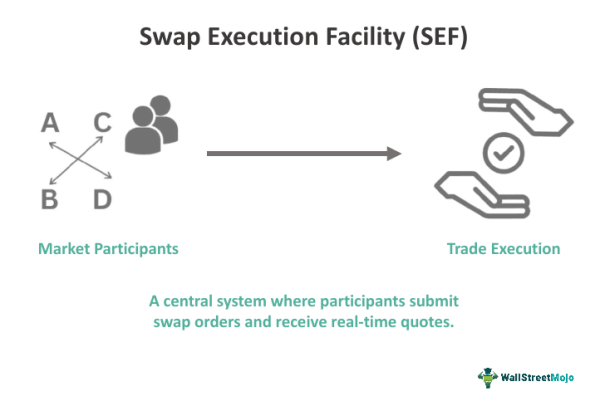

## Table of Contents

## What is a Swap Execution Facility (SEF)?

A Swap Execution Facility (SEF) is a platform where people can trade certain types of financial products called swaps. Swaps are agreements between two parties to exchange cash flows or other financial instruments. SEFs were created to make the trading of swaps more open and less risky. They help by making sure that trades are done in a fair and transparent way.

SEFs are regulated by the Commodity Futures Trading Commission (CFTC) in the United States. This means that they have to follow certain rules to protect traders and the market. By using a SEF, traders can see the prices and other details of the swaps they want to trade. This helps them make better decisions and reduces the chance of big problems in the financial system.

## Why were Swap Execution Facilities created?

Swap Execution Facilities were created to make the trading of swaps more open and safer. Before SEFs, many swaps were traded privately between two parties, which could lead to problems. If one party didn't know the true value of the swap or if they couldn't see what other similar swaps were trading for, it could cause big financial losses. By creating SEFs, regulators wanted to bring more transparency to the market, so everyone could see the prices and details of the swaps being traded.

SEFs also help reduce risk in the financial system. When swaps are traded on a SEF, the platform makes sure that the trades follow certain rules. This helps prevent fraud and other bad practices. By making the swap market more transparent and regulated, SEFs help protect traders and the overall economy from the kind of big financial problems that can happen when trading is done in secret.

## What types of swaps can be traded on a SEF?

SEFs allow trading of different kinds of swaps. The most common types are interest rate swaps and credit default swaps. Interest rate swaps let two parties exchange one set of interest payments for another, often to manage or change their exposure to interest rate changes. Credit default swaps are like insurance policies where one party pays another to protect against the risk of a borrower defaulting on a loan.

Besides these, SEFs can also handle other types of swaps like commodity swaps and foreign exchange swaps. Commodity swaps involve exchanging a fixed price for a commodity for a floating price, which can help manage the risk of price changes in things like oil or wheat. Foreign exchange swaps involve exchanging one currency for another at a set rate and then swapping them back at a later date, which can be useful for managing currency risk. By offering a platform for these swaps, SEFs help make trading more open and safer for everyone involved.

## How does a SEF differ from a traditional exchange?

A Swap Execution Facility (SEF) and a traditional exchange both help people trade financial products, but they work a bit differently. A traditional exchange, like a stock exchange, is a place where people can buy and sell stocks, bonds, and other securities. These exchanges have a central place where all the trading happens, and they set strict rules about how trading can be done. They also have a system to match buyers and sellers, and they make sure that all trades are done fairly and openly.

On the other hand, a SEF is focused on trading swaps, which are more complex financial agreements. SEFs can offer different ways to trade, like using a central limit order book, where people can see all the buy and sell orders, or through a request-for-quote system, where traders can ask for prices from other traders. SEFs are also more flexible in how they let people trade, but they still have to follow rules set by regulators to make sure trading is fair and transparent. So, while both SEFs and traditional exchanges aim to make trading safe and open, they handle different types of financial products and use different methods to do so.

## What are the regulatory requirements for operating a SEF?

Operating a Swap Execution Facility (SEF) comes with strict rules set by the Commodity Futures Trading Commission (CFTC) in the United States. To start a SEF, you need to apply for registration with the CFTC. This involves showing that you have enough money, good systems for trading, and plans to follow all the rules. You also need to have rules in place to make sure trading is fair and open, and you must keep good records of all trades. The CFTC checks these things to make sure the SEF will work well and protect traders.

Once a SEF is up and running, it has to keep following the CFTC's rules. This means making sure all trades are done in a clear and honest way, and that everyone can see the prices and details of the swaps being traded. The SEF also has to report all trades to a swap data repository, which is like a big database that keeps track of all swap trades. This helps regulators watch the market and make sure everything is going smoothly. If the SEF doesn't follow these rules, it could get in trouble with the CFTC, so it's important to keep everything in order.

## Who can participate in trading on a SEF?

Anyone who wants to trade swaps can join a SEF, but they need to meet some rules first. Usually, you have to be a professional trader or work for a company that deals with swaps. This means you might need to show that you know a lot about trading and have enough money to trade safely. Some SEFs might also ask you to become a member before you can start trading.

Once you're allowed to trade on a SEF, you can buy and sell different kinds of swaps, like interest rate swaps or credit default swaps. You can trade with other members of the SEF, and the platform makes sure that everything is done fairly and openly. This helps everyone see the prices and details of the swaps, so they can make good trading decisions.

## What are the benefits of using a SEF for trading swaps?

Using a Swap Execution Facility (SEF) to trade swaps has many benefits. One big benefit is that SEFs make trading more open and clear. When you trade on a SEF, you can see the prices and details of the swaps that others are trading. This helps you make better choices because you know what's happening in the market. It also means that everyone is playing by the same rules, which makes trading fairer.

Another benefit is that SEFs help keep the financial system safer. Because SEFs are watched by regulators like the Commodity Futures Trading Commission (CFTC), they have to follow strict rules. This means that the chances of big problems or fraud are lower. When you trade on a SEF, you know that your trades are being done in a safe and honest way. This can give you more confidence when you're trading swaps.

## How does the process of executing a swap on a SEF work?

When you want to trade a swap on a SEF, you first need to be a member or meet the SEF's rules for trading. Once you're ready, you can use the SEF's platform to find someone to trade with. There are different ways to do this. You might use a central limit order book, where you can see all the buy and sell orders and choose the one you want. Or, you might use a request-for-quote system, where you ask other traders for prices and then pick the best one.

After you find someone to trade with, you agree on the details of the swap, like the price and the terms. The SEF makes sure that everything is done fairly and openly. Once you both agree, the trade is done, and the SEF records it. The SEF also reports the trade to a swap data repository, which keeps track of all swap trades. This helps regulators watch the market and make sure everything is going smoothly.

## What are the reporting and recordkeeping obligations for SEFs?

SEFs have to keep good records of all the trades that happen on their platform. This means they need to write down all the details of each swap, like who traded it, what kind of swap it was, the price, and when it happened. They also need to keep these records safe and be able to show them to the regulators if they ask. This helps make sure that everything is done in a clear and honest way.

Besides keeping records, SEFs also have to report all trades to a swap data repository. This is like a big database that keeps track of all swap trades. By reporting to this database, SEFs help regulators watch the market and make sure that everything is going smoothly. If a SEF doesn't follow these rules, it could get in trouble with the regulators, so it's important for them to keep everything in order.

## How do SEFs impact market transparency and liquidity?

SEFs make the market more open by showing everyone the prices and details of the swaps being traded. Before SEFs, many swaps were traded in private, so it was hard to know what was happening. Now, with SEFs, traders can see all the buy and sell orders and make better choices. This openness helps everyone trust the market more because they know that the prices are fair and everyone is playing by the same rules.

SEFs also help make the market more liquid, which means it's easier to buy and sell swaps. When more people can see the prices and trade on a SEF, more people want to trade. This means there are more buyers and sellers, so it's easier to find someone to trade with. More trading also means the prices can change more smoothly, which makes the market work better for everyone.

## What are the challenges and criticisms faced by SEFs?

One big challenge for SEFs is that they can be hard to use. Some traders think the rules are too strict and make trading more complicated. They have to follow a lot of steps and report everything, which can take more time and effort. This can make some traders not want to use SEFs, especially if they are used to trading in a simpler way. Also, setting up and running a SEF costs a lot of money, so not many people want to start one.

Another criticism is that SEFs might not make the market as open as people hoped. Some traders still find ways to trade swaps outside of SEFs, which can keep parts of the market hidden. This can make it hard for everyone to see the true prices and details of all the swaps being traded. Also, some people worry that SEFs might not help the market as much as they could because not all swaps have to be traded on them. This means that the market might still have some problems that SEFs were supposed to fix.

## What future developments or trends are expected in the SEF market?

In the future, we might see more technology being used in SEFs. This could mean better systems for trading and more ways to see what's happening in the market. As technology gets better, SEFs might become easier to use and more people might want to trade on them. This could help make the market even more open and liquid. Also, regulators might keep changing the rules to make sure SEFs are working well and helping the market.

Another trend could be more types of swaps being traded on SEFs. Right now, not all swaps have to be traded on a SEF, but this might change. If more swaps are required to be traded on SEFs, it could make the market safer and more open. This would mean more people would need to use SEFs, which could help them grow and become more important in the market.

## References & Further Reading

[1]: Dodd-Frank Wall Street Reform and Consumer Protection Act, Pub.L. 111–203, H.R. 4173 (2010). [Text of the Dodd-Frank Act](https://www.congress.gov/111/plaws/publ203/PLAW-111publ203.pdf)

[2]: Waldman, M. (2014). ["The Impact of OTC Derivatives Regulatory Reforms."](https://www.bis.org/publ/othp20.htm) Bank of England.

[3]: Commodity Futures Trading Commission. ["CFTC Finalizes Rules for Swap Execution Facilities"](https://www.cftc.gov/PressRoom/PressReleases/8247-20) (2013).

[4]: Hendershott, T., & Riordan, R. (2013). ["Algorithmic Trading and the Market for Liquidity."](https://www.jstor.org/stable/43303831) Journal of Financial and Quantitative Analysis, 47(6), 2211-2244.

[5]: Lopez de Prado, M. (2018). ["Advances in Financial Machine Learning."](https://www.amazon.com/Advances-Financial-Machine-Learning-Marcos/dp/1119482089) Wiley.

[6]: Pirrong, C. (2011). ["The Economics of Central Clearing: Theory and Practice."](https://www.eachccp.eu/wp-content/uploads/2015/12/ISDAdiscussion_CCP_Pirrong.pdf) ISDA Discussion Papers.