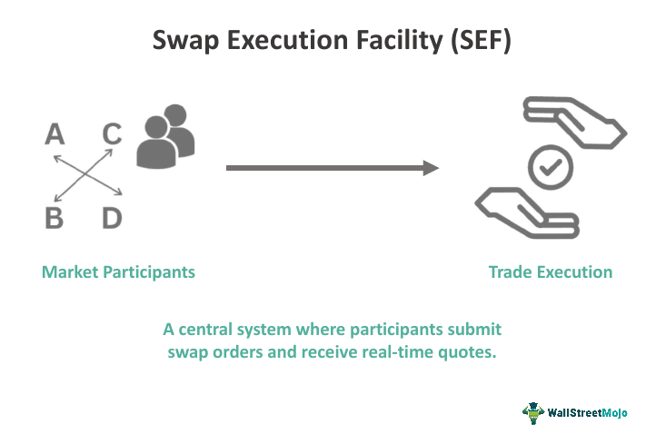

## Table of Contents

## What is a Swap Execution Facility (SEF)?

A Swap Execution Facility (SEF) is a platform where people can trade swaps, which are financial agreements to exchange cash flows or other financial instruments. SEFs were created to make the trading of swaps more open and less risky. Before SEFs, many swaps were traded privately, which could lead to problems if one party couldn't meet their obligations. By using a SEF, traders can see more prices and have more confidence in the market.

SEFs are regulated by the Commodity Futures Trading Commission (CFTC) in the United States. This means they have to follow certain rules to make sure trading is fair and transparent. For example, SEFs must provide easy access to all market participants and report all trades to a swap data repository. This helps regulators keep an eye on the market and prevent financial crises.

## What is the primary purpose of a SEF?

The main goal of a Swap Execution Facility (SEF) is to make the trading of swaps more open and safer. Swaps are agreements between two parties to exchange cash flows or other financial instruments. Before SEFs, many swaps were traded in private deals, which could be risky if one party couldn't pay up. By using a SEF, traders can see more prices and feel more secure about the market.

SEFs are watched over by the Commodity Futures Trading Commission (CFTC) in the United States. This means they have to follow rules to make sure trading is fair and clear. SEFs must let everyone trade easily and report all trades to a special place called a swap data repository. This helps the people in charge keep an eye on the market and stop big financial problems from happening.

## How does a SEF differ from traditional trading platforms?

A Swap Execution Facility (SEF) is different from traditional trading platforms because it focuses on trading swaps, which are agreements to exchange cash flows or other financial instruments. Traditional trading platforms usually deal with stocks, bonds, or commodities. SEFs were created to make swap trading more open and less risky. Before SEFs, many swaps were traded privately, which could lead to problems if one party couldn't meet their obligations. By using a SEF, traders can see more prices and have more confidence in the market.

SEFs are also regulated more strictly than traditional trading platforms. In the United States, the Commodity Futures Trading Commission (CFTC) oversees SEFs to make sure they follow rules that keep trading fair and transparent. For example, SEFs must provide easy access to all market participants and report all trades to a swap data repository. This helps regulators keep an eye on the market and prevent financial crises. Traditional trading platforms, while also regulated, do not have the same level of oversight specifically designed for swap trading.

## What types of swaps can be traded on a SEF?

On a Swap Execution Facility (SEF), you can trade different kinds of swaps. The most common type is interest rate swaps, where two parties agree to exchange interest payments, usually one fixed rate for a floating rate. Another type is credit default swaps, which act like insurance against a borrower defaulting on a loan. These swaps help investors manage the risk of someone not paying back their debt.

Commodity swaps are also traded on SEFs. These swaps involve exchanging a fixed price for a commodity, like oil or wheat, for a floating price based on the market. This helps companies that use these commodities to manage price risks. Lastly, there are foreign exchange swaps, where parties exchange different currencies at a set rate and then swap them back at a later date. This can help businesses that work in different countries manage currency risks.

## Who can participate in trading on a SEF?

Anyone who wants to trade swaps can join a Swap Execution Facility (SEF). This includes big banks, investment firms, and even smaller companies that need to manage their financial risks. As long as you meet the rules set by the SEF and the regulators, you can start trading.

SEFs are open to all kinds of traders, but they have to follow strict rules to make sure trading is fair and safe. The Commodity Futures Trading Commission (CFTC) in the United States watches over SEFs to make sure everyone plays by the rules. This means that whether you're a big bank or a smaller firm, you can trade on a SEF as long as you follow the guidelines.

## What are the regulatory requirements for operating a SEF?

Operating a Swap Execution Facility (SEF) comes with strict rules set by the Commodity Futures Trading Commission (CFTC) in the United States. To start, a SEF must register with the CFTC and follow their rules. This means they have to make sure trading is fair and open to everyone who wants to trade. They also need to keep good records of all trades and report them to a special place called a swap data repository. This helps the CFTC keep an eye on the market and stop any big problems from happening.

SEFs also have to make sure their systems are safe and work well. They need to have strong technology to handle all the trading without mistakes or delays. Plus, they must have rules to stop people from doing anything unfair, like trying to control prices or trading with secret information. All these rules help make sure that trading on a SEF is safe and fair for everyone involved.

## How does the pre-trade transparency work on a SEF?

Pre-trade transparency on a Swap Execution Facility (SEF) means that before a trade happens, everyone can see the prices and other important details about the swaps that are available to trade. This is different from how swaps were traded before SEFs, where deals were often made in private and only the people involved knew the details. By showing this information to everyone, SEFs help make the market more open and fair. Traders can see what prices are being offered and make better choices about their trades.

The rules for pre-trade transparency are set by the Commodity Futures Trading Commission (CFTC) in the United States. SEFs have to follow these rules to make sure that all traders have the same information. This includes showing the best prices available for different swaps and making sure this information is easy to find and understand. By doing this, SEFs help create a more honest and clear market where everyone can trade with confidence.

## What are the post-trade reporting obligations for SEFs?

After a trade happens on a Swap Execution Facility (SEF), they have to report it to a special place called a swap data repository. This is a rule set by the Commodity Futures Trading Commission (CFTC) in the United States. The report needs to have all the details about the trade, like who made the trade, what kind of swap it was, and at what price. This helps the CFTC keep an eye on the market and make sure everything is going smoothly.

SEFs also have to make sure the reports are sent quickly after the trade is done. This is important because it helps everyone know what's happening in the market in real-time. By doing this, SEFs help keep the market open and honest. It also makes sure that if something goes wrong, the people in charge can find out and fix it quickly.

## How do SEFs ensure fair and efficient trading?

SEFs make sure trading is fair and efficient by following strict rules set by the Commodity Futures Trading Commission (CFTC). They have to let everyone who wants to trade join in, so no one is left out. This means big banks and smaller companies can all trade on the same platform. SEFs also show prices and other important details before trades happen, which helps everyone see what's going on and make good choices. This is called pre-trade transparency, and it makes the market more open and honest.

After a trade happens, SEFs have to report it to a special place called a swap data repository. This helps the CFTC keep an eye on the market and make sure everything is going smoothly. By reporting trades quickly, SEFs help everyone know what's happening in real-time. This also means that if something goes wrong, the people in charge can find out and fix it quickly. All these rules help make sure that trading on a SEF is fair and efficient for everyone involved.

## What role do SEFs play in mitigating systemic risk in the derivatives market?

SEFs help make the derivatives market safer by making trading more open and easier to watch. Before SEFs, many swaps were traded in private deals, which could be risky if one party couldn't pay up. By using a SEF, traders can see more prices and feel more secure about the market. This openness helps stop big problems from happening because everyone can see what's going on.

SEFs are also watched over by the Commodity Futures Trading Commission (CFTC) in the United States. They have to follow rules to make sure trading is fair and clear. SEFs must report all trades to a special place called a swap data repository. This helps the CFTC keep an eye on the market and stop any big financial problems from happening. By doing all this, SEFs help make the market safer for everyone.

## How have SEFs impacted the liquidity and pricing of swaps?

SEFs have made a big difference in how easy it is to trade swaps and how much they cost. Before SEFs, swaps were often traded in private deals, which meant only a few people knew the prices. Now, with SEFs, everyone can see the prices before they trade. This makes the market more open and helps more people join in. When more people can trade, it's easier to find someone to trade with, which is called liquidity. More liquidity means it's easier to buy and sell swaps without big changes in price.

The prices of swaps have also become more clear and fair because of SEFs. Since everyone can see the prices, it's harder for one person to charge too much or too little. This helps keep prices steady and fair for everyone. Also, because SEFs report all trades to a special place, it's easier for everyone to know what's happening in the market. This helps traders make better choices and can lead to more stable prices overall.

## What are the future trends and potential developments for SEFs?

In the future, SEFs might see more technology used to make trading even easier and faster. This could include using things like artificial intelligence to help traders make better choices and find the best prices. Also, as more countries start to use SEFs, they might work together more to make rules that help everyone. This could make the market even more open and fair around the world.

Another trend could be more types of swaps being traded on SEFs. Right now, they mostly trade interest rate swaps and credit default swaps, but in the future, we might see more commodity swaps or even new kinds of swaps. This would give traders more choices and help them manage different kinds of risks. Overall, SEFs are likely to keep growing and changing to make the swap market safer and more efficient for everyone.

## References & Further Reading

[1]: Lazarus, D. (2013). ["Swap Execution Facilities: Implementing Dodd-Frank."](https://www.alston.com/-/media/files/insights/publications/2013/04/a-guide-to-doddfrank-for-users-of-swaps-ithe-revie/files/bruckner_rscr_41713-(3)/fileattachment/bruckner_rscr_41713-(3).pdf) Michigan Business & Entrepreneurial Law Review.

[2]: Tashjian, E., & Tse, Y. (1996). ["Trading Costs and Trading Patterns: Empirical Evidence from the Stock Exchanges of Hong Kong and Shanghai."](https://ptacts.uspto.gov/ptacts/public-informations/petitions/1484034/download-documents?artifactId=i4-uGrpvCGvsmsziRUSKFpR2idPZyrTIzppf9KA1HGmw1ETYFxmLS3U) International Journal of Finance & Economics.

[3]: Pirrong, C. (2013). ["The Economics of Central Clearing: Theory and Practice."](https://www.eachccp.eu/wp-content/uploads/2015/12/ISDAdiscussion_CCP_Pirrong.pdf) ISDA Discussion Paper Series.

[4]: Gomber, P., Arndt, B., Lutat, M., & Uhle, T. (2011). ["High-Frequency Trading."](https://papers.ssrn.com/sol3/papers.cfm?abstract_id=1858626) Goethe University Research Paper.

[5]: Duffie, D., & Zhu, H. (2011). ["Does a Central Clearing Counterparty Reduce Counterparty Risk?"](https://www.mit.edu/~zhuh/DuffieZhu_CCP.pdf) The Review of Economic Studies.

[6]: Hendershott, T., & Riordan, R. (2013). ["Algorithmic Trading and the Market for Liquidity."](https://www.jstor.org/stable/43303831) The Review of Financial Studies.

[7]: Harris, L. (2003). ["Trading and Exchanges: Market Microstructure for Practitioners."](https://www.amazon.com/Trading-Exchanges-Market-Microstructure-Practitioners/dp/0195144708) Oxford University Press.