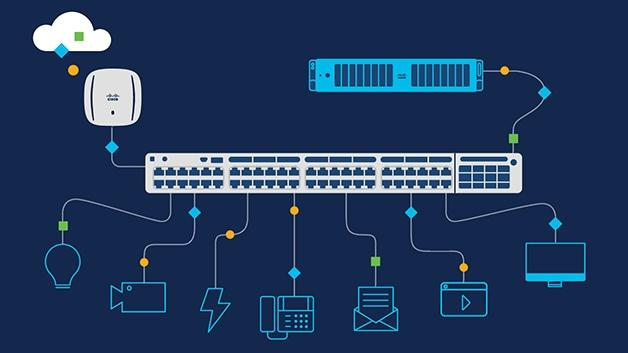

## Table of Contents

## What is Swap Network?

Swap Network is a platform that helps people trade different types of digital money, called cryptocurrencies. It's like a big marketplace where you can exchange one type of digital coin for another. The main goal of Swap Network is to make trading cryptocurrencies easy and safe for everyone. It uses special technology to make sure that trades happen quickly and without any problems.

The platform works by connecting people who want to trade their cryptocurrencies directly with each other, without needing a middleman. This means that you can trade your digital coins with someone else on the network without having to go through a big company or bank. Swap Network uses something called atomic swaps, which are special trades that make sure both people get what they want at the same time. This makes trading fair and secure for everyone involved.

## How does Swap Network facilitate cryptocurrency exchanges?

Swap Network makes it easy for people to trade different cryptocurrencies with each other. It's like a big online marketplace where you can swap one type of digital money for another. The cool thing about Swap Network is that it lets people trade directly with each other, without needing a big company or bank to help. This means you can trade your digital coins with someone else on the network quickly and safely.

The platform uses something called atomic swaps to make sure trades are fair and secure. An atomic swap is a special kind of trade where both people get what they want at the same time, or the trade doesn't happen at all. This way, no one has to worry about being tricked or losing their money. Swap Network's technology makes sure that everything happens smoothly, so people can trust the platform and feel good about trading their cryptocurrencies.

## What are the main features of Swap Network?

Swap Network is a special platform that helps people trade different kinds of digital money, called cryptocurrencies, with each other. It's like a big online marketplace where you can exchange one type of digital coin for another without needing a middleman like a bank or a big company. This means you can trade directly with other people on the network, which makes everything faster and easier. The main idea behind Swap Network is to make trading cryptocurrencies simple and safe for everyone.

One of the coolest things about Swap Network is that it uses something called atomic swaps. This is a special kind of trade where both people get what they want at the same time, or the trade doesn't happen at all. This makes sure that no one gets tricked or loses their money. Swap Network's technology works hard to make sure that all trades happen smoothly and quickly, so people can trust the platform and feel good about using it to trade their digital coins.

## Can you explain the basic process of swapping tokens on Swap Network?

When you want to swap tokens on Swap Network, you first need to find someone who wants to trade the type of [cryptocurrency](/wiki/cryptocurrency) you have for the type you want. You can do this by using the Swap Network platform, which connects you with other people who want to trade. Once you find a match, you both agree on the trade details, like how many tokens you will exchange.

After agreeing on the trade, Swap Network uses a special method called an atomic swap to make sure the trade is fair and safe. An atomic swap means that both you and the other person get your new tokens at the same time, or the trade doesn't happen at all. This way, no one has to worry about being tricked. The Swap Network's technology makes sure everything happens quickly and smoothly, so you can trust that your trade will go well.

## What types of cryptocurrencies can be swapped on Swap Network?

Swap Network lets you trade many different types of digital money, called cryptocurrencies. You can swap popular ones like Bitcoin and Ethereum, as well as other kinds like Litecoin and Bitcoin Cash. This means you can easily exchange the digital coins you have for the ones you want, all in one place.

The platform is designed to work with a wide range of cryptocurrencies, so you're not limited to just a few options. Whether you're looking to trade well-known coins or some of the less common ones, Swap Network makes it possible. This variety helps make sure that you can always find someone to trade with, no matter what type of digital money you're interested in.

## How does Swap Network ensure the security of transactions?

Swap Network makes sure that your trades are safe by using a special method called atomic swaps. An atomic swap means that both people in the trade get their new tokens at the same time, or the trade doesn't happen at all. This way, no one can trick the other person or take their money without giving anything in return. It's like a promise that keeps both sides of the trade honest and secure.

The platform also uses smart technology to make sure everything runs smoothly and safely. It checks and double-checks each step of the trade to make sure there are no mistakes or problems. This means you can trust that your digital money is in good hands when you're using Swap Network to swap your cryptocurrencies.

## What are the fees associated with using Swap Network?

When you use Swap Network to trade your cryptocurrencies, you might have to pay a small fee. This fee helps keep the platform running smoothly and covers the costs of making sure your trades are safe and quick. The exact amount you pay can change depending on things like how busy the network is and how much you're trading.

The fees on Swap Network are usually pretty low compared to other places where you can trade cryptocurrencies. They want to make sure that trading is easy and affordable for everyone. So, while there might be a small cost to use the platform, it's designed to be fair and not too expensive.

## How does Swap Network handle liquidity?

Swap Network makes sure there are enough people trading on the platform so that you can always find someone to swap your cryptocurrencies with. This is called [liquidity](/wiki/liquidity-risk-premium), and it's important because it means you can trade your digital money quickly and easily. The platform connects lots of users together, which helps keep the trading going smoothly. When there are many people using Swap Network, it's easier to find someone who wants to trade the exact type of cryptocurrency you have for the one you want.

The more people using Swap Network, the better the liquidity gets. This is because more users mean more chances to find a match for your trade. Swap Network works hard to attract lots of users by making trading simple and safe. By having a big community of traders, the platform can make sure that you won't have to wait long to swap your tokens. This helps keep everything moving fast and keeps everyone happy.

## What are the advantages of using Swap Network over traditional exchanges?

Swap Network lets you trade cryptocurrencies directly with other people, without needing a big company or bank in the middle. This means you can swap your digital money faster and easier. Traditional exchanges often take longer and might charge you more money because they have to handle everything themselves. With Swap Network, you don't have to wait for someone else to approve your trade, which makes the whole process quicker and more straightforward.

Another big advantage is that Swap Network uses atomic swaps to keep your trades safe. This means both people in the trade get their new tokens at the same time, or the trade doesn't happen at all. Traditional exchanges can sometimes be risky because you have to trust them to hold onto your money. With Swap Network, you don't have to worry about that because the platform makes sure everything is fair and secure. This makes trading your cryptocurrencies a lot less stressful and more trustworthy.

## Can you describe the technology behind Swap Network's decentralized exchange?

Swap Network uses a special kind of technology called atomic swaps to help people trade cryptocurrencies directly with each other. Atomic swaps are like a promise between two people that they will swap their digital money at the same time, or the trade won't happen at all. This makes sure that no one can trick the other person and that both sides get what they want safely. The technology behind atomic swaps uses smart contracts, which are like digital agreements that automatically do what they're supposed to do when certain conditions are met. This means that Swap Network can make trades happen quickly and without needing a middleman like a bank or a big company.

The decentralized nature of Swap Network means that it doesn't rely on one big central place to handle all the trades. Instead, it uses a network of computers all over the world to keep everything running smoothly. This makes the platform more secure because there's no single point that can be attacked or fail. It also means that people can trade their cryptocurrencies more freely because they're not tied to one specific exchange. By using this technology, Swap Network can offer a fast, safe, and easy way for people to swap their digital money without worrying about the risks that come with traditional exchanges.

## How does Swap Network integrate with other blockchain networks?

Swap Network works with different blockchain networks by using a special kind of trade called atomic swaps. This means that people can swap their cryptocurrencies even if they are on different blockchains. For example, someone with Bitcoin on one blockchain can trade it with someone who has Ethereum on another blockchain. Swap Network's technology makes sure that these trades happen smoothly and safely, without needing a middleman.

The platform uses smart contracts to help with these trades. Smart contracts are like digital agreements that automatically do what they're supposed to do when certain things happen. This helps Swap Network connect different blockchains together, making it easier for people to trade all kinds of cryptocurrencies. By working with many blockchains, Swap Network makes sure that there are lots of options for people to trade their digital money.

## What are the future development plans for Swap Network?

Swap Network is always working on new things to make trading cryptocurrencies easier and better for everyone. They want to add more types of digital money to the platform so people can trade even more kinds of cryptocurrencies. They also plan to make the platform work even faster and smoother, so trades happen quicker and with less waiting time. Another big goal is to make the platform easier to use, so even people who are new to trading can feel comfortable using it.

In the future, Swap Network wants to connect with even more blockchain networks. This means that people will be able to trade their digital money with others on different blockchains more easily. They also want to keep improving the security of the platform, so everyone can feel safe when they're trading. By doing all these things, Swap Network hopes to make trading cryptocurrencies a simple, fast, and secure experience for everyone.

## What are the types and applications of financial swaps?

Financial swaps are derivative contracts facilitating the exchange of cash flows between parties based on predefined financial parameters. These instruments typically involve two parties agreeing to exchange future financial obligations, making swaps versatile tools for risk management and speculative purposes. 

Interest rate swaps are one of the most prevalent types and involve exchanging fixed-rate interest payments for floating-rate payments. This mechanism is instrumental in managing [interest rate](/wiki/interest-rate-trading-strategies) exposure, allowing companies to stabilize cash flows and predict future financial obligations. For example, a company with a fixed-rate loan may enter an interest rate swap to benefit from potentially lower floating rates, thereby reducing its overall interest expense.

Mathematically, an interest rate swap can be represented by two cash flow streams: one fixed and one floating. The present value of the fixed cash flows can be denoted as $PV_{\text{fixed}}$ and the present value of the floating cash flows as $PV_{\text{floating}}$. The net swap payment at evaluation can be expressed as:

$$
\text{Net Payment} = PV_{\text{floating}} - PV_{\text{fixed}}
$$

Currency swaps are another significant class of swaps, designed to address foreign exchange risk. These swaps involve the exchange of principal and interest payments in one currency for principal and interest payments in another. Unlike interest rate swaps, currency swaps involve exchanges of notional amounts at the start and maturity of the contract, offering a complete hedge against foreign currency fluctuation. This is particularly beneficial for multinational corporations with obligations in multiple currencies, as it allows them to manage exposure efficiently and ensure predictable cash flows across different currencies.

Equity swaps involve the exchange of returns on a stock or stock index for a different type of cash flow, typically a fixed or floating rate of interest. This enables investors to gain exposure to equity markets without owning the underlying stocks, facilitating strategic positioning in the market without direct investment.

Credit default swaps (CDS) represent a type of swap that acts as a form of insurance against the default of a borrower. In a CDS contract, the buyer pays periodic premiums to the seller, and in exchange, the seller agrees to compensate the buyer if the underlying financial instrument defaults. This financial innovation allows for the management of credit risk, providing protection against potential loss due to borrower defaults.

Each type of swap serves distinct financial objectives, such as hedging against fluctuations in interest rates, currency exchange rates, equity returns, or credit risk, enabling entities to fortify their financial strategies and attain their risk management goals effectively. These instruments also offer opportunities for speculation by allowing market participants to take positions based on expected movements in interest rates, currency exchange rates, or default probabilities, thus playing a pivotal role in the global financial markets.

## References & Further Reading

[1]: ["Currency Swaps and Emerging Markets: Economic and Systemic Benefits"](https://www.jstor.org/stable/26753060) - Bank of England Working Paper

[2]: ["Algorithmic Trading: Winning Strategies and Their Rationale"](https://www.wiley.com/en-us/Algorithmic+Trading%3A+Winning+Strategies+and+Their+Rationale-p-9781118746912) by Ernie Chan

[3]: ["Interest Rate Swaps and Other Derivatives"](https://cupola.columbia.edu/3c8e3f.pdf) by Howard Corb

[4]: ["The Handbook of Trading: Strategies for Navigating and Profiting from Currency, Bond, and Stock Markets"](https://www.amazon.com/Handbook-Trading-Strategies-Navigating-McGraw-Hill/dp/0071743537) by Greg N. Gregoriou

[5]: ["Principles of Financial Engineering"](https://www.sciencedirect.com/book/9780123735744/principles-of-financial-engineering) by Robert L. Kosowski and Salih N. Neftci